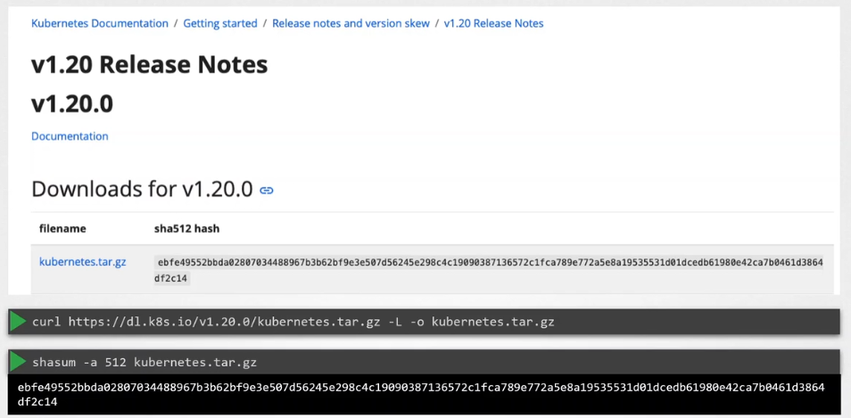
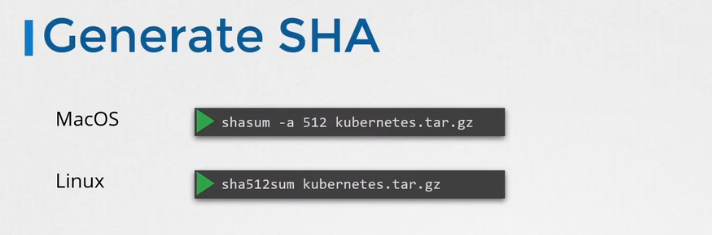

# 🔐 Verify Platform Binaries Before Deploying

_Why + How using SHA512 checksum!_

This is a **core Kubernetes security requirement**, especially when installing Kubernetes components manually (kubelet, kubeadm, kubectl, control-plane binaries, CNI binaries…).

---

## ✅ **What Does “Verify Platform Binaries” Mean?**

Whenever you download Kubernetes binaries (e.g., `kubernetes.tar.gz`, `kubectl`, `kubelet`), you must **verify that the file wasn’t tampered with** during download.

You do this by checking the **SHA-512 checksum**.

- ✔ Prevents installing a corrupted binary
- ✔ Detects MITM attacks
- ✔ Verifies authenticity of downloaded binaries
- ✔ Ensures supply-chain safety (very important in Kubernetes security)

---

<div align="center" style="background-color:#EBEBEB; border-radius: 10px; border: 2px solid">
  
</div>

---

<div align="center" style="background-color:#EBEBEB; border-radius: 10px; border: 2px solid">
  
</div>

---

## ⚠️ **Why SHA-512?**

Kubernetes recommends **SHA-512**, not SHA-1 or SHA-256, because:

- SHA-512 is **collision-resistant**
- SHA-512 is the modern standard for verifying security-sensitive software
- Kubernetes publishes SHA-512 checksums for every binary release

---

## 📥 **Example Scenario**

You downloaded this file from Kubernetes releases:

```ini
kubernetes.tar.gz
```

You want to confirm it's identical to the official version.

---

## 🧪 **Step-by-Step SHA Verification**

The video screenshots show:

### **🖥 macOS:**

```bash
shasum -a 512 kubernetes.tar.gz
```

### **🐧 Linux:**

```bash
sha512sum kubernetes.tar.gz
```

Both commands produce a **long hexadecimal string** (the checksum).

Example output:

```ini
ebfe49552bbda02807034488967b3b62bf9e3e507d56245e298c41c9900387136572c1fca789e772a5e8a1935535310d1dcedb61980e42ca7b0461d3864df2c14
```

---

## 📊 **Compare With Kubernetes Release Page**

You visit the official release page:

```ini
https://dl.k8s.io/v1.20.0/
```

You will always find a checksum file, for example:

```ini
kubernetes.tar.gz.sha512
```

Its contents must **match exactly** the checksum you generated locally.

### ✔ If the two values match

- File is safe and authentic.

### ❌ If the two values differ

- Delete the file immediately — it might be corrupted or malicious.

---

## 🎯 **Why This Really Matters (Real-World Context)**

Modern Kubernetes deployments rely heavily on:

- kubelet binary
- kubectl
- control-plane components (kube-apiserver, etcd, scheduler…)
- CNI plugins
- CRI runtimes

If an attacker replaces any of these binaries during download:

- they can execute arbitrary code
- steal cluster secrets
- escalate privileges
- compromise all workloads

This is why **verifying platform binaries is mandatory** in CIS Kubernetes benchmarks.

---

## 🛡️ **Best Practices (2025)**

### ✔ Always verify SHA for:

- Kubernetes tarballs
- kubectl standalone binary
- kubelet binary
- containerd / CRI-O binary
- CNI binaries (Calico, Cilium…)
- kubeadm releases

### ✔ Prefer HTTPS download + checksum verification

### ✔ Use GPG signature verification where available

---

## 📚 **Full Example (from the screenshot)**

### **Download binary**

```bash
curl -LO https://dl.k8s.io/v1.20.0/kubernetes.tar.gz
```

### **Download official SHA file**

```bash
curl -LO https://dl.k8s.io/v1.20.0/kubernetes.tar.gz.sha512
```

### **Generate SHA512 locally**

```bash
shasum -a 512 kubernetes.tar.gz     # macOS
# OR
sha512sum kubernetes.tar.gz        # Linux
```

### **Compare manually or automatically**

```bash
sha512sum -c kubernetes.tar.gz.sha512
```

Output:

```ini
kubernetes.tar.gz: OK
```

Perfect ✔

---

## 🏁 **Summary**

| Step | Action                          | Purpose                         |
| ---- | ------------------------------- | ------------------------------- |
| 1    | Download Kubernetes binary      | Install Kubernetes              |
| 2    | Download its `.sha512` checksum | Get official hash               |
| 3    | Generate local SHA-512          | Verify file                     |
| 4    | Compare hashes                  | Ensure authenticity & integrity |

If the SHA **matches** → use the file  
If it **does not match** → never use the file
