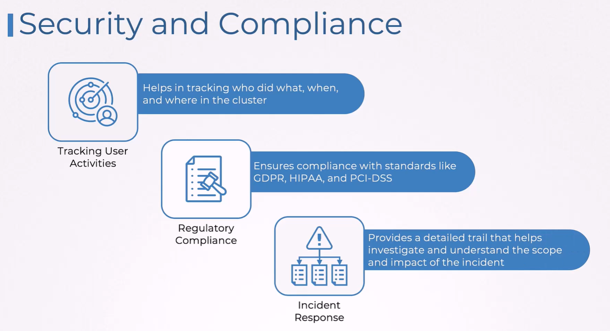
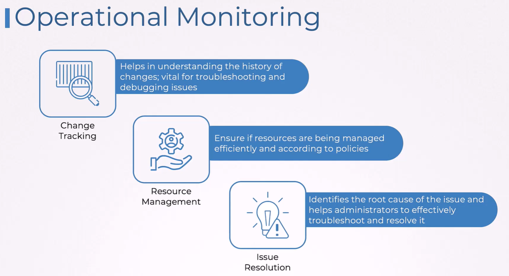
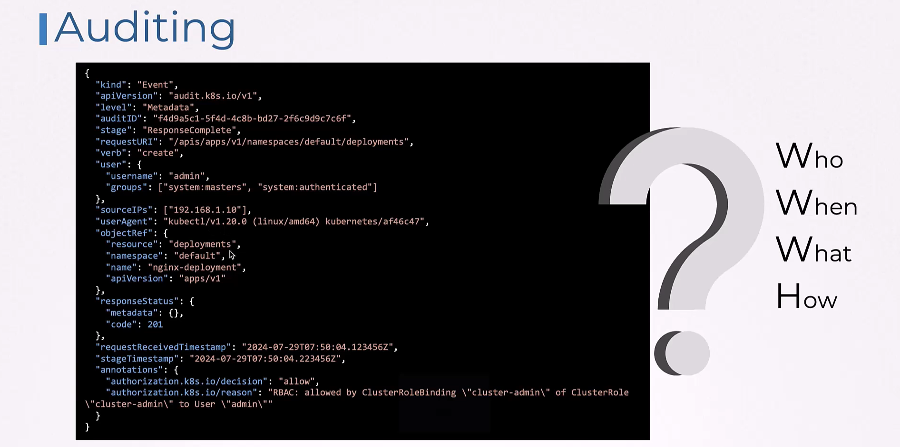
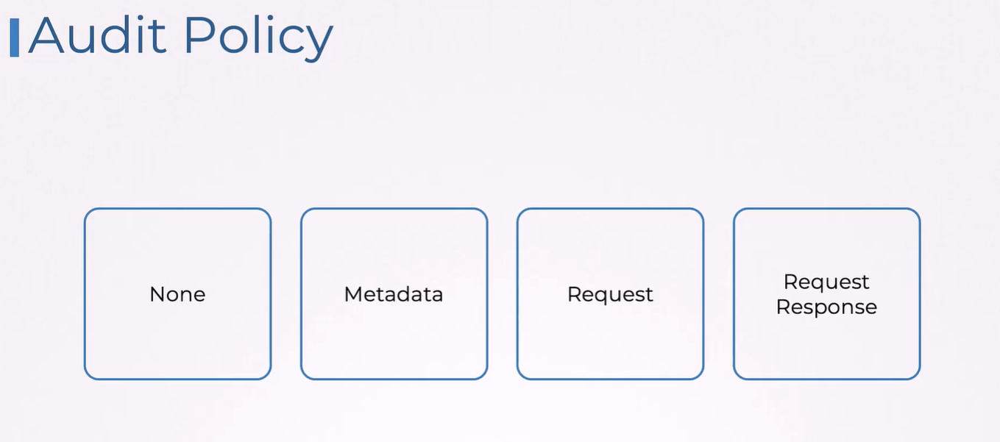

# 🔍 Kubernetes Auditing

**Kubernetes Auditing** lets you track:

- Who did what?
- From where?
- To which resource?
- Was the request allowed or denied?
- What object changed?

It is **one of the core security topics** in CKS because auditing is used for:

- ✔️ Incident investigation
- ✔️ Forensics
- ✔️ Detecting malicious API calls
- ✔️ Compliance (PCI-DSS, SOC2, etc.)

---

<div align="center" style="background-color:#F1F1F1; border-radius: 10px; border: 2px solid">
  
</div>

---

<div align="center" style="background-color:#F1F1F1; border-radius: 10px; border: 2px solid">
  
</div>

---

## 🧠 **How Auditing Works**

The **API server** generates audit events.

Each event goes through:

1. **Audit Policy**
   Defines which events to record and at what level.

2. **Audit Backend**
   Defines where to store logs (file, webhook, log collector).

You must configure BOTH.

---

<div align="center" style="background-color:#F1F1F1; border-radius: 10px; border: 2px solid">
  
</div>

---

## 📁 **Audit Policy (audit-policy.yaml)**

This file tells the API server:

- What to log
- What to ignore
- What level of detail to include

Audit **levels** (must know for CKS):

---

<div align="center" style="background-color:#F1F1F1; border-radius: 10px; border: 2px solid">
  
</div>

---

<div align="center" style="background-color: #141a19ff;color: #a8a5a5ff; border-radius: 10px; border: 2px solid">

| Level             | Meaning                                      |
| ----------------- | -------------------------------------------- |
| `None`            | Do not log this request                      |
| `Metadata`        | Log only metadata (user, verb, resource)     |
| `Request`         | Metadata + request body                      |
| `RequestResponse` | Metadata + request + response (largest logs) |

</div>

---

KodeKloud exam-style **minimal policy**:

```yaml
apiVersion: audit.k8s.io/v1
kind: Policy
rules:
  - level: Metadata
```

More focused example (only log pod changes):

```yaml
apiVersion: audit.k8s.io/v1
kind: Policy
rules:
  - level: RequestResponse
    resources:
      - group: ""
        resources: ["pods"]
```

---

## 📦 **Enable Auditing in kube-apiserver**

In **CKS exam**, the kube-apiserver is usually configured via:

- **static manifest** at
  `/etc/kubernetes/manifests/kube-apiserver.yaml`

Add two flags:

```yaml
- --audit-policy-file=/etc/kubernetes/audit-policy.yaml
- --audit-log-path=/var/log/kubernetes/audit.log
```

Optionally:

```yaml
- --audit-log-maxage=30
- --audit-log-maxbackup=10
- --audit-log-maxsize=100
```

Then:

1. Copy your policy file into:
   `/etc/kubernetes/audit-policy.yaml`

2. The API server pod will auto-restart because it’s a static pod.

3. Logs begin writing to below file:
   `/var/log/kubernetes/audit.log`

---

## 📝 **What Audit Logs Look Like**

Each event is JSON.

Example:

```json
{
  "kind": "Event",
  "apiVersion": "audit.k8s.io/v1",
  "level": "Metadata",
  "user": {
    "username": "system:serviceaccount:dev:tester"
  },
  "verb": "create",
  "objectRef": {
    "resource": "pods",
    "namespace": "dev",
    "name": "nginx"
  },
  "sourceIPs": ["10.244.1.12"]
}
```

This shows:

- Which user → `tester`
- What they did → created a pod
- Where → namespace dev
- From which IP
- Timestamp

---

## 🧪 4. Quick Verification (CKS Lab Test)

### 🔹 Step 1 — View API server pod:

```bash
kubectl get pods -n kube-system | grep apiserver
```

### 🔹 Step 2 — Check logs exist:

```bash
ls /var/log/kubernetes/
audit.log
```

### 🔹 Step 3 — Tail logs:

```bash
sudo tail -f /var/log/kubernetes/audit.log
```

### 🔹 Step 4 — Trigger an event:

```bash
kubectl get pods --namespace default
```

You’ll see a new log entry appear.

---

## 🛡️ **Most Important Exam Points**

- ✔️ **Auditing is configured only on the API server**
- ✔️ Requires two things → audit-policy file AND audit-log path
- ✔️ Edit `/etc/kubernetes/manifests/kube-apiserver.yaml`
- ✔️ Know audit levels: None, Metadata, Request, RequestResponse
- ✔️ Logs stored in `/var/log/kubernetes/audit.log` (CKS default)
- ✔️ Policy must be valid YAML and correct apiVersion
- ✔️ Webhook backend exists but rarely used in exam (skip unless asked)

---

## 🧰 **Webhook Backend**

API server sends audit logs to remote service:

```yaml
- --audit-webhook-config-file=/etc/kubernetes/audit-webhook.yaml
```

Example webhook config:

```yaml
apiVersion: v1
kind: Config
clusters:
  - name: audit
    cluster:
      server: https://audit.example.com
contexts:
  - name: context
    context:
      cluster: audit
current-context: context
```

**This is never required in exam unless question explicitly asks.**

---

## 🧠 Memory Trick

> **Audit = Policy + Backend**  
> Policy defines _what to log_  
> Backend defines _where to send logs_

If you remember this, you will answer all auditing questions correctly.
