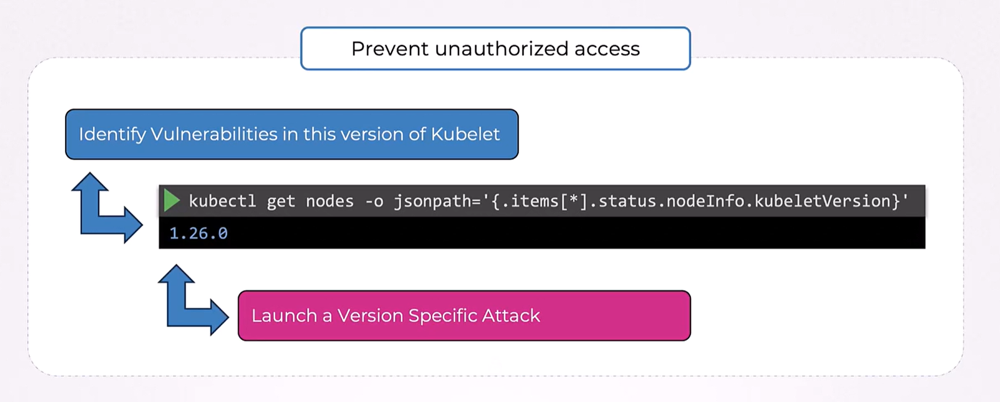
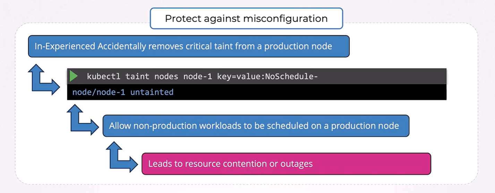
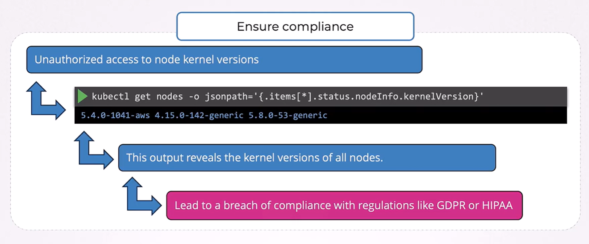

# 🔐 **Secure Node Metadata**

Securing “node metadata” means **preventing Pods from reading sensitive cloud metadata** that belongs to the node, not the workload.

This is one of the **most important cluster-hardening topics** in the CKS exam.

---

## 📖 **What is “Node Metadata”?**

If your cluster is running on a cloud provider, the node (VM) usually exposes a **metadata service** on a link-local address:

<div align="center" style="background-color: #141a19ff;color: #a8a5a5ff; border-radius: 10px; border: 2px solid">

| Cloud | Metadata Endpoint                            |
| ----- | -------------------------------------------- |
| AWS   | `http://169.254.169.254/latest/meta-data/`   |
| GCP   | `http://169.254.169.254/computeMetadata/v1/` |
| Azure | `http://169.254.169.254/metadata/instance`   |

</div>

This service exposes **highly sensitive information**, such as:

- Instance details
- Node IAM role credentials
- Cloud access tokens (!!)
- Project IDs
- Service account metadata
- SSH keys

If a **Pod escapes** or is misconfigured, it can request these credentials and **gain cloud-level privileges** (not just Kubernetes privileges).

This is a **critical, exam-tested attack**.

---

## 🚨 **Example Attack**

A malicious Pod can simply:

```bash
curl http://169.254.169.254/latest/meta-data/iam/security-credentials/
```

And it will get the **Node IAM Role**, which may have:

- S3 access
- DynamoDB access
- IAM permissions
- CloudAdmin perms (!!)

This is **cluster → cloud privilege escalation**.

---

## 🎯 **CKS Exam Goal**

You must secure your cluster so that:

1. ✔ Pods **cannot** reach the cloud metadata endpoint
1. ✔ Except those that legitimately need it (very rare)

---

## ⁉️ **Reasons to Secure Node Metadata**

### 📌 **1. Prevent Unauthorized Access**

_In this example the attacker knows the node information and can Launch Version Specific Attack!_

<div align="center" style="background-color:#F1F1F1; border-radius: 10px; border: 2px solid">
  
</div>

### 📌 **2. Protect Against Misconfigurations**

<div align="center" style="background-color:#F1F1F1; border-radius: 10px; border: 2px solid">
  
</div>

### 📌 **3. Maintain Privacy**

_Attacker now knows the ip address of the nodes, so he can apply DDOS attacks!_

<div align="center" style="background-color:#F1F1F1; border-radius: 10px; border: 2px solid">
  
</div>

### 📌 **4. Ensure Compliance**

<div align="center" style="background-color:#F1F1F1; border-radius: 10px; border: 2px solid">
  
</div>

---

## 🧨 **How to Secure Node Metadata (All Exam Methods)**

The CKS exam expects you to know **four major mitigation methods**:

---

### ✅ Method 1 — Use **Network Policies** (Most Common)

Block access from Pods to the metadata IP (`169.254.169.254`).

#### Example NetworkPolicy (Deny Metadata Access)

```yaml
apiVersion: networking.k8s.io/v1
kind: NetworkPolicy
metadata:
  name: deny-metadata
  namespace: default
spec:
  podSelector: {} # apply to all pods
  policyTypes:
    - Egress
  egress:
    - to:
        - ipBlock:
            cidr: 169.254.169.254/32
      ports:
        - port: 80
          protocol: TCP
```

Effects:

- All pods in the namespace **cannot reach** metadata service
- **You must be using a CNI that supports NetworkPolicies**
  (Calico, Cilium, WeaveNet, Kube-OVN, etc.)

**This is the most common fix in the exam.**

---

### ✅ Method 2 — Use **CNI Plugin Features** (Calico, Cilium)

Some CNIs allow cluster-wide egress deny rules.

#### Calico example

```bash
calicoctl apply -f - <<EOF
apiVersion: projectcalico.org/v3
kind: GlobalNetworkPolicy
metadata:
  name: block-metadata
spec:
  selector: all()
  types:
  - Egress
  egress:
  - action: Deny
    destination:
      nets:
      - 169.254.169.254/32
EOF
```

This protects **all namespaces** at once.

---

### ✅ Method 3 — Use **Kubelet Credential Isolation** (GKE / EKS / AKS)

In managed Kubernetes, cloud providers offer **special metadata protection**:

#### GKE

- Workload Identity
- Metadata Concealment (deprecated, replaced by Node Agent Isolation)

#### EKS

- AWS IMDSv2 (requires session tokens — not exploitable by just `curl`)
- IRSA (IAM Roles for Service Accounts)
- Restricting metadata hop limits

#### AKS

- Managed Identity
- Restricting metadata access by default

These disable or restrict Pod access to metadata.

---

### ✅ Method 4 — Run **Agents That Strip Metadata** (rare in exam)

Tools like:

- **kube2iam**
- **kiam**

They **proxy AWS metadata**, ensuring only specific Pods can get credentials.

These are older solutions — unlikely to be required on the exam.

---

## 📌 **BEST Exam Answer**

**Apply a NetworkPolicy that blocks access to 169.254.169.254.**

This is the fastest and most expected CKS solution.

---

## 🛡️ **How You Test If It Works**

### Before blocking:

```bash
kubectl run test --image=busybox --restart=Never -it -- sh
wget -qO- http://169.254.169.254/latest/meta-data/iam/
```

You get metadata.

### After blocking:

You should get timeout:

```ini
wget: bad address '169.254.169.254'
```

or:

```ini
connection refused
```

---

## 📝 **Important: NetworkPolicy Requires a Compatible CNI**

CKS clusters usually use:

- **Calico**
- **Cilium**

So network policies **work**.

If the exam cluster uses a CNI that does NOT support NetworkPolicies, applying them will do nothing — but in CKS exam they **do** support them.

---

## 🧠 **When Would a Pod Need Metadata?**

Very rare.

Examples:

- Nodes that run cloud SDKs
- Pods configured as cloud-level controllers
- kube-controller-manager on cloud providers

Even then, you restrict metadata only for those pods, not the entire cluster.

---

## 🏁 **Final Summary**

<div align="center" style="background-color: #141a19ff;color: #a8a5a5ff; border-radius: 10px; border: 2px solid">

| Concept              | Explanation                                              |
| -------------------- | -------------------------------------------------------- |
| Node Metadata        | Cloud metadata exposed at `169.254.169.254`              |
| Risk                 | Pods can steal cloud credentials and escalate privileges |
| Most expected fix    | **NetworkPolicy** blocking access                        |
| Namespace or Global? | Both acceptable in exam                                  |
| Alternative          | Cloud identity isolation (IRSA, GKE WI)                  |
| Test                 | Use busybox to curl metadata before/after fix            |

</div>
