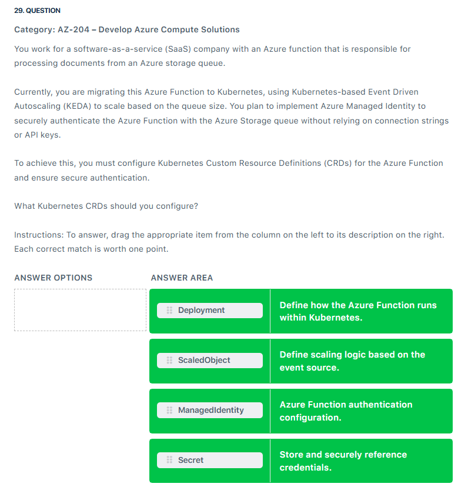
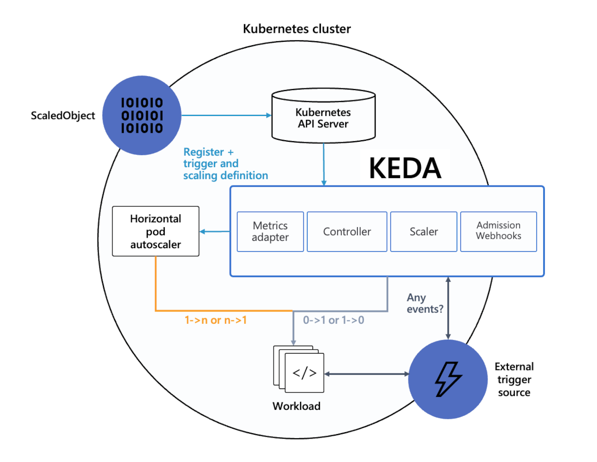

# CRD

  

---

## intro

- Azure Managed Identity is a powerful feature designed to streamline the authentication process for applications running in Azure. It allows services, like an Azure Function running in a Kubernetes environment, to access other Azure resources securely and without the need for manual credential management. Managed Identity provides a system-assigned or user-assigned identity, which is linked to the Azure resources, and it can be granted appropriate access permissions via Azure Role-Based Access Control (RBAC). This eliminates the risk of exposing sensitive information such as connection strings or API keys in your Kubernetes configuration, improving security and simplifying the management of access to resources. Managed Identity ensures that only authorized applications can access specific Azure services based on the assigned roles and policies.

- The ScaledObject CRD (Custom Resource Definition) is an essential Kubernetes-based Event-Driven Autoscaling (KEDA) component. It is used to define the scaling logic of applications in response to external event triggers, such as queue length, message count, or other metrics that signify the need for scaling. With ScaledObject, Kubernetes clusters can scale applications, like Azure Functions, up or down based on the load generated by events. For example, if a threshold is reached on an Azure Storage queue, KEDA can automatically scale up the number of Azure Function instances to process those messages. This type of autoscaling is not only efficient but also cost-effective because it ensures that resources are utilized only when needed, based on the real-time demand from the event source, ensuring that applications scale dynamically in response to the workload.

- The Deployment CRD in Kubernetes is crucial for defining how an application runs within the cluster. It dictates the configuration, number of replicas, resource allocation, container images, and other essential settings that ensure the application functions properly within Kubernetes. Once the deployment is configured, Kubernetes will automatically maintain the desired state, ensuring the correct number of application replicas are running, and will restart pods when necessary for reliability. For Azure Functions running in Kubernetes, the Deployment ensures the service remains available and can handle varying levels of traffic, while integrating seamlessly with scaling tools like KEDA. Combined with Managed Identity for secure authentication and KEDA for automated scaling, Kubernetes offers a robust platform for deploying, scaling, and managing serverless workloads in a cloud-native environment.

  

## References:

- <https://learn.microsoft.com/en-us/entra/identity/managed-identities-azure-resources/overview>
- <https://learn.microsoft.com/en-us/azure/aks/keda-about>
- <https://learn.microsoft.com/en-us/azure/app-service/overview-managed-identity?tabs=portal%2Chttp>
- <https://learn.microsoft.com/en-us/azure/aks/concepts-scale>
