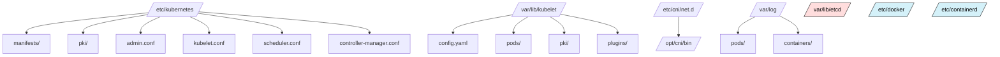
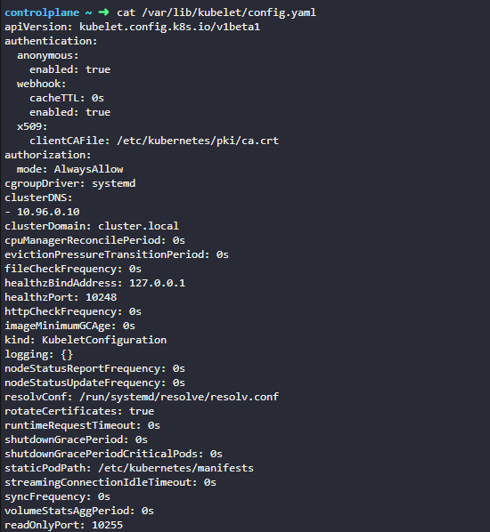

# 🗂️ **Important Paths in a Kubernetes Cluster**

with every key directory and configuration file you’ll ever inspect, edit, or troubleshoot — in your **preferred enhanced style** (clear structure, detailed, visual, easy to memorize, and fully navigable via anchors).

---

## 🧩 **Group 1 — Kubelet & Node Configuration**

| Path                                                    | Purpose                                    | Notes                                       |
| ------------------------------------------------------- | ------------------------------------------ | ------------------------------------------- |
| `/var/lib/kubelet/config.yaml`                          | Main kubelet configuration file            | Defines DNS, domains, cgroupDriver, etc.    |
| `/var/lib/kubelet/pki/`                                 | Node certificates for kubelet auth         | Auto-rotated by kubeadm.                    |
| `/var/lib/kubelet/pods/`                                | Mounts, volumes, and symlinks for Pod data | Inspect Pod volume layouts.                 |
| `/var/lib/kubelet/plugins/`                             | CSI socket endpoints                       | Used by storage plugins.                    |
| `/etc/kubernetes/kubelet.conf`                          | Kubeconfig for kubelet to reach API server | Contains `system:node:<nodename>` identity. |
| `/etc/default/kubelet`                                  | Service environment overrides (Ubuntu)     | Used to set `--node-ip` or extra args.      |
| `/etc/systemd/system/kubelet.service.d/10-kubeadm.conf` | Systemd drop-in for kubelet                | Defines startup parameters & config path.   |

🧠 **Mnemonic:**

> “All kubelet roads start at `/var/lib/kubelet`.”
> → Config, Pods, Plugins, PKI = under one roof.

---

## 🧠 **Group 2 — Control Plane (Static Pods & Certs)**

| Path                                      | Component                                   | Function                            |
| ----------------------------------------- | ------------------------------------------- | ----------------------------------- |
| `/etc/kubernetes/manifests/`              | kube-apiserver, etcd, controller, scheduler | Auto-managed static Pods.           |
| `/etc/kubernetes/pki/`                    | PKI store for cluster certs                 | CA, server certs, SA keys.          |
| `/etc/kubernetes/admin.conf`              | Cluster-admin kubeconfig                    | Used by `kubectl` on control-plane. |
| `/etc/kubernetes/controller-manager.conf` | Kubeconfig for controller-manager           | For internal API access.            |
| `/etc/kubernetes/scheduler.conf`          | Kubeconfig for scheduler                    | For internal API access.            |
| `/var/lib/etcd/`                          | etcd data directory                         | Contains the entire cluster state.  |

🧠 **Mnemonic:**

> “Control plane lives in `/etc/kubernetes/` and remembers everything in `/var/lib/etcd/`.”

---

## 🌐 **Group 3 — Networking (CNI & Proxy)**

| Path                              | Purpose                     | Notes                                     |
| --------------------------------- | --------------------------- | ----------------------------------------- |
| `/etc/cni/net.d/`                 | Network plugin config files | e.g., Calico, Flannel, Cilium `.conflist` |
| `/opt/cni/bin/`                   | Actual CNI binaries         | `bridge`, `loopback`, etc.                |
| `/etc/kubernetes/kube-proxy.conf` | Proxy config + kubeconfig   | Mode (`iptables`/`ipvs`).                 |
| `/var/lib/kube-proxy/`            | Local proxy runtime data    | Tracks cluster networking state.          |

🧠 **Mnemonic:**

> “Networking = `/etc/cni` + `/opt/cni` for setup, `/var/lib/kube-proxy` for runtime.”

---

## 🔐 **Group 4 — Authentication & Certificates**

| Path                                              | Purpose                       |
| ------------------------------------------------- | ----------------------------- |
| `/etc/kubernetes/pki/ca.crt`                      | Cluster CA                    |
| `/etc/kubernetes/pki/sa.key`                      | ServiceAccount signing key    |
| `/var/lib/kubelet/pki/kubelet-client-current.pem` | Node identity cert            |
| `/etc/kubernetes/admin.conf`                      | Admin kubeconfig              |
| `/etc/kubernetes/cloud-config`                    | Cloud credentials (Azure/GCP) |

🧠 **Mnemonic:**

> “If it holds a `.crt` or `.key`, it lives in `/etc/kubernetes/pki`.”

---

## ⚙️ **Group 5 — Runtime & Container Engine**

| Path                          | Purpose                  | Notes                            |
| ----------------------------- | ------------------------ | -------------------------------- |
| `/etc/docker/daemon.json`     | Docker daemon config     | Deprecated but still seen.       |
| `/etc/containerd/config.toml` | Containerd configuration | Cgroup driver, registry mirrors. |

🧠 **Mnemonic:**

> “Docker & Containerd configs live in `/etc/`, runtime heart.”

---

## 📊 **Group 6 — Logs & Diagnostics**

| Path                          | Component               | Description               |
| ----------------------------- | ----------------------- | ------------------------- |
| `/var/log/kubelet.log`        | Kubelet logs            | Node-side events.         |
| `/var/log/kube-apiserver.log` | API server logs         | Control-plane requests.   |
| `/var/log/pods/`              | Per-pod log directories | Volumes & container logs. |
| `/var/log/containers/`        | Symlinks to actual logs | Easier tailing.           |

🧠 **Mnemonic:**

> “All runtime logs flow under `/var/log/` — pods and containers are just links.”

---

## 🪣 **Group 7 — Add-ons & Extras**

| Path                                | Description                                |
| ----------------------------------- | ------------------------------------------ |
| `/etc/kubernetes/addons/`           | Manual add-ons (Dashboard, Metrics Server) |
| `/var/lib/kube-scheduler/`          | Scheduler state                            |
| `/var/lib/kube-controller-manager/` | Controller manager state                   |

🧠 **Mnemonic:**

> “Add-ons live in `/etc/kubernetes/addons`, while brains (scheduler/controller) keep local state under `/var/lib`.”

---

## 🧭 **Hierarchical Visualization**



---

## 🧩 **Quick Recall Formula (Mnemonic Chain)**

> **“Etc and Var rule the cluster.”**

- `/etc/kubernetes/` → **Control Plane, Certs, Kubeconfigs**
- `/var/lib/kubelet/` → **Node runtime and Pods**
- `/var/lib/etcd/` → **Cluster brain (state)**
- `/etc/cni/` + `/opt/cni/` → **Networking**
- `/var/log/` → **Observability**
- `/etc/containerd/` → **Runtime config**

---

## 🧠 **Pro Tip for Real-World Memory**

| Situation            | Files to Check                                             |
| -------------------- | ---------------------------------------------------------- |
| Pod fails to start   | `/var/lib/kubelet/config.yaml`, `/var/log/kubelet.log`     |
| Node not Ready       | `/etc/kubernetes/kubelet.conf`, `/var/lib/kubelet/pki`     |
| Control plane broken | `/etc/kubernetes/manifests/`, `/etc/kubernetes/pki/`       |
| Network issues       | `/etc/cni/net.d/`, `/opt/cni/bin/`, `/var/lib/kube-proxy/` |
| Auth issues          | `/etc/kubernetes/pki/`, `/etc/kubernetes/admin.conf`       |
| Logs missing         | `/var/log/pods/`, `/var/log/containers/`                   |

---

## ✅ **Final Summary Table**

| Category           | Root Path                                                 | Key Files/Subdirs                          |
| ------------------ | --------------------------------------------------------- | ------------------------------------------ |
| **Kubelet & Node** | `/var/lib/kubelet/`                                       | `config.yaml`, `pods/`, `plugins/`, `pki/` |
| **Control Plane**  | `/etc/kubernetes/`                                        | `manifests/`, `pki/`, `admin.conf`         |
| **Networking**     | `/etc/cni/net.d/`, `/opt/cni/bin/`                        | `.conflist`, plugins                       |
| **Runtime**        | `/etc/containerd/`, `/etc/docker/`                        | `config.toml`, `daemon.json`               |
| **Logs**           | `/var/log/`                                               | `containers/`, `pods/`, component logs     |
| **Storage/State**  | `/var/lib/etcd/`                                          | etcd DB                                    |
| **Cloud/Extras**   | `/etc/kubernetes/cloud-config`, `/etc/kubernetes/addons/` | Provider config, addons                    |

---

## 📘 Table of Contents

1. [📌 `/var/lib/kubelet/config.yaml`](#1)
2. [⚙️ `/etc/kubernetes/kubelet.conf`](#2)
3. [🧠 `/etc/kubernetes/manifests/`](#3)
4. [🔐 `/etc/kubernetes/pki/`](#4)
5. [📄 `/etc/kubernetes/admin.conf`](#5)
6. [🧩 `/var/lib/kubelet/`](#6)
7. [📦 `/var/lib/etcd/`](#7)
8. [🌐 `/etc/cni/net.d/`](#8)
9. [🪣 `/opt/cni/bin/`](#9)
10. [📜 `/etc/systemd/system/kubelet.service.d/`](#10)
11. [🗝️ `/etc/kubernetes/scheduler.conf` and `/etc/kubernetes/controller-manager.conf`](#11)
12. [💾 `/var/log/containers/` & `/var/log/pods/`](#12)
13. [📦 `/etc/docker/daemon.json` or `/etc/containerd/config.toml`](#13)
14. [📍 `/etc/default/kubelet` (Ubuntu-based nodes)](#14)
15. [📂 `/etc/kubernetes/cloud-config` (Cloud Provider Configs)](#15)
16. [🧱 `/var/lib/kube-proxy/`](#16)
17. [📡 `/etc/kubernetes/kube-proxy.conf`](#17)
18. [🧾 `/var/lib/kube-scheduler/` and `/var/lib/kube-controller-manager/`](#18)
19. [🧰 `/etc/kubernetes/addons/`](#19)
20. [🪵 `/var/log/kubelet.log` and `/var/log/kube-apiserver.log`](#20)

---

<a id="1"></a>

## 📌 `/var/lib/kubelet/config.yaml`

> The **primary kubelet configuration file** that defines node-level behavior.
> Managed by **kubeadm**, **AKS/EKS**, or manually on custom setups.



### 🔍 Typical content

```yaml
kind: KubeletConfiguration
apiVersion: kubelet.config.k8s.io/v1beta1
authentication:
  anonymous:
    enabled: false
  webhook:
    enabled: true
authorization:
  mode: Webhook
cgroupDriver: systemd
clusterDNS:
  - 10.96.0.10
clusterDomain: cluster.local
failSwapOn: true
podCIDR: 10.244.0.0/16
rotateCertificates: true
staticPodPath: /etc/kubernetes/manifests
```

### 🧠 Key fields explained

| Field                            | Description                                                    |
| -------------------------------- | -------------------------------------------------------------- |
| `authentication.webhook.enabled` | Enables kubelet auth using API server webhook.                 |
| `authorization.mode`             | Controls authorization for kubelet APIs (Webhook recommended). |
| `cgroupDriver`                   | Must match container runtime (e.g., `systemd` for containerd). |
| `clusterDNS`                     | IPs of cluster DNS servers (CoreDNS).                          |
| `clusterDomain`                  | Domain suffix for service names.                               |
| `failSwapOn`                     | Whether kubelet refuses to start if swap is on.                |
| `rotateCertificates`             | Auto-renew kubelet client cert.                                |
| `staticPodPath`                  | Directory for static pod manifests.                            |

### 🧰 Admin commands

```bash
# View kubelet config
sudo cat /var/lib/kubelet/config.yaml

# Validate it (dry-run)
sudo kubelet --config /var/lib/kubelet/config.yaml --help

# Reload after changes
sudo systemctl daemon-reload
sudo systemctl restart kubelet
```

### 🧩 Tips

- Managed nodes (AKS/EKS) may not expose this path directly.
- Change `cgroupDriver` carefully; mismatch with runtime = node not ready.
- Used by the **kubelet.service** unit to boot the node.

---

<a id="2"></a>

## ⚙️ `/etc/kubernetes/kubelet.conf`

> The **kubeconfig** for kubelet — tells it **how to talk to the API server**.

### 📄 Sample content

```yaml
apiVersion: v1
clusters:
  - cluster:
      certificate-authority-data: LS0tLS1CRUdJTiBDRV...
      server: https://controlplane:6443
    name: kubernetes
contexts:
  - context:
      cluster: kubernetes
      user: system:node:worker1
    name: system:node:worker1@kubernetes
current-context: system:node:worker1@kubernetes
users:
  - name: system:node:worker1
    user:
      client-certificate: /var/lib/kubelet/pki/kubelet-client-current.pem
      client-key: /var/lib/kubelet/pki/kubelet-client-current.pem
```

### 🔐 Purpose

- Authentication between **kubelet ⇢ API Server**
- Managed by kubeadm → auto-rotated client certs.

---

<a id="3"></a>

## 🧠 `/etc/kubernetes/manifests/`

> Folder for **static Pod manifests** — auto-launched by the kubelet on control-plane nodes.

### 🧩 Files usually found here

| File                           | Component                |
| ------------------------------ | ------------------------ |
| `kube-apiserver.yaml`          | Control plane API server |
| `kube-controller-manager.yaml` | Cluster controllers      |
| `kube-scheduler.yaml`          | Scheduler                |
| `etcd.yaml`                    | Embedded etcd instance   |

### 🔄 How it works

- kubelet watches this directory.
- Any YAML dropped here → static Pod created automatically.
- Deleting the file deletes the Pod.

---

<a id="4"></a>

## 🔐 `/etc/kubernetes/pki/`

> The **PKI vault** for Kubernetes certificates.

### Common files

| File                             | Purpose                              |
| -------------------------------- | ------------------------------------ |
| `ca.crt`, `ca.key`               | Root CA for cluster                  |
| `apiserver.crt`, `apiserver.key` | TLS for API server                   |
| `apiserver-kubelet-client.crt`   | Client cert for API → Kubelet        |
| `front-proxy-ca.crt`             | For aggregated API auth              |
| `etcd/ca.crt`                    | Separate CA for etcd                 |
| `sa.key`, `sa.pub`               | ServiceAccount token signing keypair |

### 🔧 Tips

- Managed by kubeadm; avoid manual edits.
- To renew:

  ```bash
  sudo kubeadm certs renew all
  ```

- Check expiry:

  ```bash
  kubeadm certs check-expiration
  ```

---

<a id="5"></a>

## 📄 `/etc/kubernetes/admin.conf`

> Admin kubeconfig file for `kubectl` CLI on control-plane nodes.

### ✅ Use it

```bash
export KUBECONFIG=/etc/kubernetes/admin.conf
kubectl get nodes
```

Store copies securely (this grants **cluster-admin**).

---

<a id="6"></a>

## 🧩 `/var/lib/kubelet/`

> Kubelet’s **state directory** for volumes, pods, and configuration.

### Important subpaths

| Path                               | Description                    |
| ---------------------------------- | ------------------------------ |
| `/var/lib/kubelet/config.yaml`     | Node config                    |
| `/var/lib/kubelet/pods/`           | Mount points & volumes per Pod |
| `/var/lib/kubelet/plugins/`        | CSI driver sockets             |
| `/var/lib/kubelet/pki/`            | Node certificates              |
| `/var/lib/kubelet/device-plugins/` | GPU & device plugin sockets    |

---

<a id="7"></a>

## 📦 `/var/lib/etcd/`

> Stores **etcd data** — the cluster’s entire control-plane state.

- Controlled by the static `etcd.yaml` manifest.
- Backup strategy:

  ```bash
  ETCDCTL_API=3 etcdctl snapshot save /backup/etcd-snapshot.db \
    --endpoints=https://127.0.0.1:2379 \
    --cacert=/etc/kubernetes/pki/etcd/ca.crt \
    --cert=/etc/kubernetes/pki/etcd/server.crt \
    --key=/etc/kubernetes/pki/etcd/server.key
  ```

---

<a id="8"></a>

## 🌐 `/etc/cni/net.d/`

> Network plugin configuration for **CNI (Container Network Interface)**.

### Examples

- **Flannel:** `10-flannel.conflist`
- **Calico:** `10-calico.conflist`

Each defines the bridge, IPAM, and plugin binaries in `/opt/cni/bin`.

---

<a id="9"></a>

## 🪣 `/opt/cni/bin/`

> Actual CNI binaries executed by kubelet:

- `bridge`, `loopback`, `flannel`, `calico`, `host-local`, `portmap` …

Without them, pods fail with:

```ini
Failed to find CNI plugin
```

---

<a id="10"></a>

## 📜 `/etc/systemd/system/kubelet.service.d/`

> Systemd drop-ins for **kubelet.service** customization.

### Example: `/etc/systemd/system/kubelet.service.d/10-kubeadm.conf`

```ini
[Service]
Environment="KUBELET_CONFIG_ARGS=--config=/var/lib/kubelet/config.yaml"
Environment="KUBELET_KUBEADM_ARGS=--cgroup-driver=systemd"
ExecStart=
ExecStart=/usr/bin/kubelet $KUBELET_CONFIG_ARGS $KUBELET_KUBEADM_ARGS
```

---

<a id="11"></a>

## 🗝️ `/etc/kubernetes/scheduler.conf` & `/etc/kubernetes/controller-manager.conf`

> Kubeconfigs for their respective control-plane components.

They define API server endpoint + credentials for system users:

- `system:kube-scheduler`
- `system:kube-controller-manager`

---

<a id="12"></a>

## 💾 `/var/log/containers/` & `/var/log/pods/`

> Symbolic links to container runtime logs.

- `/var/log/pods/<namespace>_<pod>_<uid>/` → real log files
- `/var/log/containers/*.log` → symlinks for easy tailing.

```bash
tail -f /var/log/containers/nginx-*.log
```

---

<a id="13"></a>

## 📦 `/etc/docker/daemon.json` or `/etc/containerd/config.toml`

> Runtime configuration.

### Docker example:

```json
{
  "exec-opts": ["native.cgroupdriver=systemd"],
  "log-driver": "json-file",
  "storage-driver": "overlay2"
}
```

### Containerd example:

```toml
[plugins."io.containerd.grpc.v1.cri".containerd.runtimes.runc.options]
  SystemdCgroup = true
```

---

<a id="14"></a>

## 📍 `/etc/default/kubelet` (Ubuntu)

> Environment overrides for kubelet service.

```bash
KUBELET_EXTRA_ARGS="--node-ip=192.168.1.10"
```

---

<a id="15"></a>

## 📂 `/etc/kubernetes/cloud-config`

> Contains credentials/config for external cloud providers (Azure, GCP).

Example:

```ini
[Global]
subscription-id=xxxx
tenant-id=xxxx
aad-client-id=xxxx
aad-client-secret=xxxx
```

---

<a id="16"></a>

## 🧱 `/var/lib/kube-proxy/`

> Stores iptables/ipvs state for **kube-proxy**.

Useful for diagnosing stale rules:

```bash
sudo iptables-save | grep KUBE
```

---

<a id="17"></a>

## 📡 `/etc/kubernetes/kube-proxy.conf`

> Kubeconfig + proxy config (clusterCIDR, mode=iptables/ipvs).

---

<a id="18"></a>

## 🧾 `/var/lib/kube-scheduler/` & `/var/lib/kube-controller-manager/`

> Local state directories (leadership leases, etc).

---

<a id="19"></a>

## 🧰 `/etc/kubernetes/addons/`

> Place for addon manifests like DNS, metrics-server, dashboard.

Usually empty unless you manage addons manually.

---

<a id="20"></a>

## 🪵 `/var/log/kubelet.log` and `/var/log/kube-apiserver.log`

> Component logs — check here before diving into journalctl.

```bash
journalctl -u kubelet -f
journalctl -u kube-apiserver -f
```

---

## 🧩 **Summary Diagram**

```mermaid
graph TD
A[/etc/kubernetes/] -->|PKI| B[/etc/kubernetes/pki/]
A --> C[/etc/kubernetes/manifests/]
A --> D[/etc/kubernetes/admin.conf]
A --> E[/etc/kubernetes/kubelet.conf]
A --> F[/etc/kubernetes/controller-manager.conf]
A --> G[/etc/kubernetes/scheduler.conf]
H[/var/lib/kubelet/] -->|Config| I[/var/lib/kubelet/config.yaml]
H --> J[/var/lib/kubelet/pods/]
H --> K[/var/lib/kubelet/plugins/]
H --> L[/var/lib/kubelet/pki/]
M[/var/lib/etcd/] --> N[(etcd database)]
O[/etc/cni/net.d/] --> P[/opt/cni/bin/]
```

---

## 🧠 **Key Takeaways**

- ✅ `/var/lib/kubelet/config.yaml` → node config
- ✅ `/etc/kubernetes/manifests` → static control-plane pods
- ✅ `/etc/kubernetes/pki` → certs
- ✅ `/var/lib/etcd` → cluster state
- ✅ `/etc/cni/net.d` + `/opt/cni/bin` → networking
- ✅ `/etc/systemd/system/kubelet.service.d` → kubelet startup params
- ✅ `/var/log/*` → logs for debugging

---

Would you like me to continue this series with a **“Control Plane Deep Dive”** version (detailing each static Pod manifest + their arguments and ports)? It’s the natural next step after this one.
