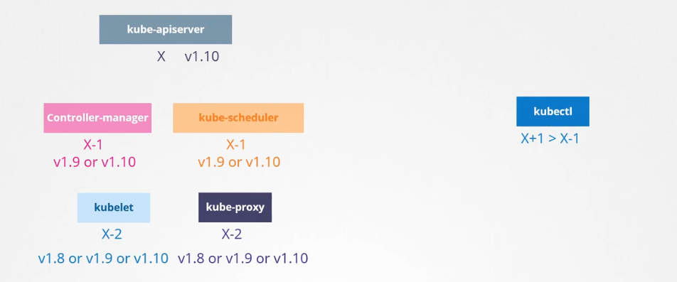
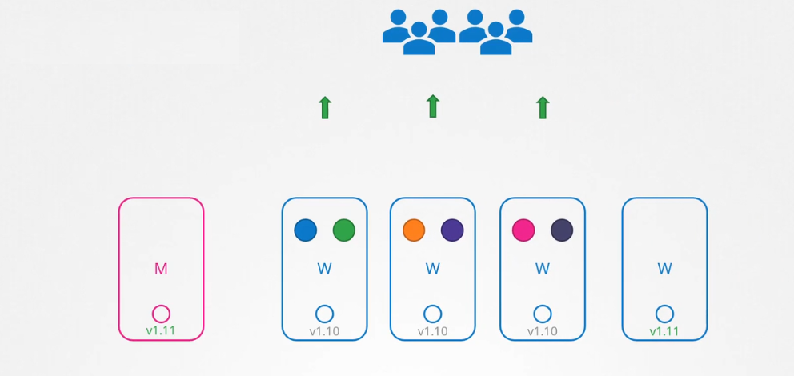
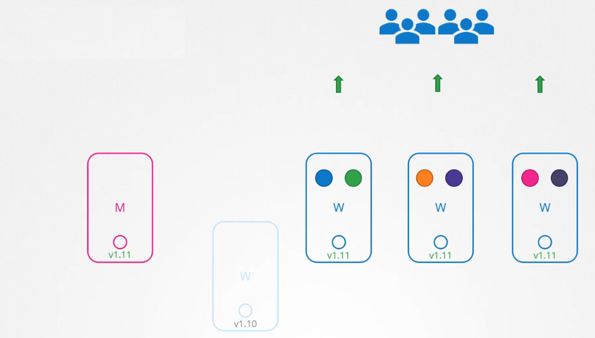
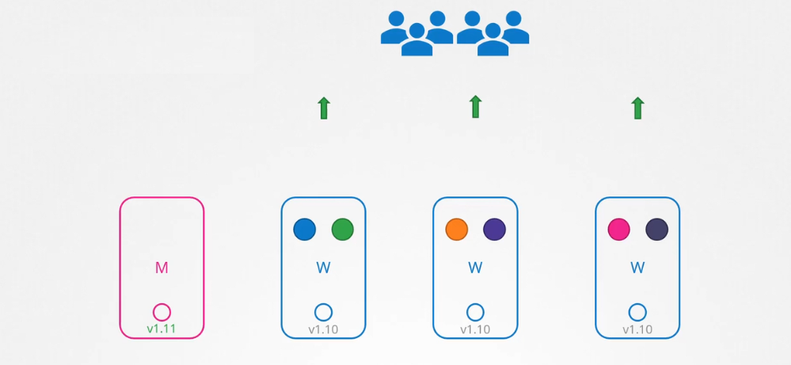
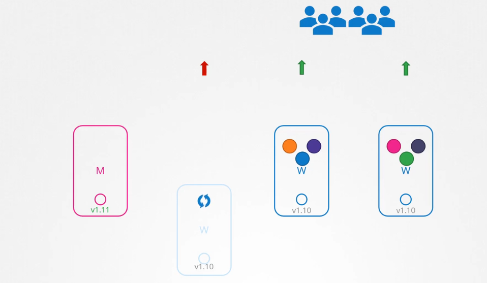
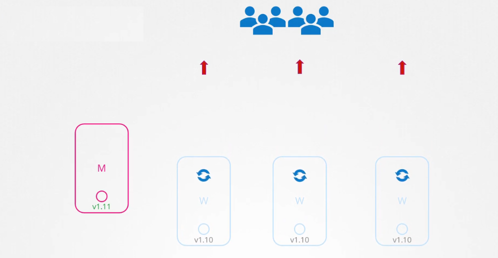

# 🚀 **Upgrading a Kubernetes Cluster Using kubeadm**

## 📑 **Table of Contents**

1. [🔍 Overview of Cluster Upgrades](#1)
2. [🛠️ Pre-Upgrade Preparation](#2)
   - [1. Backup Your Cluster](#2.1)
     - [1.1 Backup `etcd`](#2.1.1)
     - [1.2 Backup Backup Kubernetes Configurations](#2.1.2)
   - [2. Change the Package Repository](#2.2)
   - [3. Determine which version to upgrade](#2.3)
3. [🏗️ Upgrade Control Plane (Master Nodes)](#3)
   - [1. Drain the Node](#3.1)
   - [2. Upgrade `kubeadm`](#3.2)
   - [3. kubeadm upgrade master node](#3.3)
   - [4. Upgrade `kubelet` and `kubectl`](#3.4)
   - [5. Uncordon the Node](#3.5)
   - [6. Verify Control Plane Components](#3.6)
4. [🔧 Upgrade Worker Nodes](#4)
   - [1. Drain the Node](#4.1)
   - [2. Upgrade `kubeadm`](#4.2)
   - [3. kubeadm upgrade worker node](#4.3)
   - [4. Upgrade `kubelet`, and `kubectl`](#4.4)
   - [5. Uncordon the Node](#4.5)
   - [6. Verify Worker node Components](#4.6)
5. [✅ Post-Upgrade Tasks](#5)
   - [1. Verify Cluster Health](#5.1)
   - [2. Update Helm Repository and Upgrade Charts](#5.2)
   - [3. Ensure Applications are Functioning Correctly](#5.3)
   - [4. Review Deprecated APIs](#5.4)
   - [5. Update Deprecated API Versions in Your Manifests](#5.5)
6. [🔄 Rolling Back (If Needed)](#6)
   - [1. Restore `etcd` Backup](#6.1)
   - [2. Reinstall Previous Kubernetes Version](#6.2)
7. [⭐ Additional Best Practices](#7)
8. [📝 Notes](#8)
9. [📌 References](#9)

---

<a id="1"></a>

## 📖 **Overview of Cluster Upgrades**

### 🎯 **Purpose of Upgrading**

- **🔒 Improve Security:** Patch vulnerabilities and enhance security features.
- **⚡ Boost Performance:** Optimize cluster performance and resource management.
- **🛠️ Access New Features:** Utilize the latest Kubernetes features and enhancements.
- **🐛 Fix Bugs:** Resolve known issues to improve cluster stability.
- **🔄 Ensure Compatibility:** Maintain compatibility with other tools and dependencies.

### 🎭 **Types of Upgrades**

- 1️⃣ **Control Plane Upgrade:** Involves upgrading the Kubernetes master components, including the API server, scheduler, and controller manager.
- 2️⃣ **Worker Node Upgrade:** Involves upgrading the nodes that run your application workloads.

### 📜 **Upgrade Rules**

- All k8s components must be the same or lower (**X-1**) than `kube-apiserver` version

   <div align="left" >
   
   </div>

- It is recommended to upgrade one minor version at a time

  - ✅ e.g., `1.29` → `1.30`, `1.30` → `1.31`, etc.
  - ❌ e.g., `1.29` → `1.31`

- Start upgrade master nodes first then worker nodes

  - Drain master nodes for upgrade will not affect worker nodes and your running workloads at all.
  - You will only temporarily lose access to the control plane while the upgrade is in progress and can't do some tasks such as:
    - use kubectl
    - add new workloads
    - scale workloads
    - all other stuff related to control plane tasks..etc

---

## 🆕 **Worker Nodes Upgrade Strategies**

### 🥇 **1. Replace One Node at a Time (Rolling Replace)** — ✅ **Best Practice**

This is the **safest and most cloud-native** approach.

<div align="center" style="background-color:#F0F0F0; border-radius: 10px; border: 2px solid">
  
</div>

---

<div align="center" style="background-color:#F0F0F0; border-radius: 10px; border: 2px solid">
  
</div>

---

**🔹 Why it’s best:**

- Zero downtime: workloads are rescheduled gracefully.
- Aligns with managed services (EKS, GKE, AKS).
- Supports PodDisruptionBudgets and readiness probes.
- Easy to automate with tools like `eksctl`, `gcloud`, `terraform`, or `kubeadm`.

**🔧 How it works:**

1. Add a new node with the upgraded version.
2. Cordon + drain one old node.
3. Delete the old node.
4. Repeat until all nodes are replaced.

---

### 🥈 **2. In-Place Upgrade (One Node at a Time)**

Still safe, but more manual and risk-prone than replacing nodes.

<div align="center" style="background-color:#F0F0F0; border-radius: 10px; border: 2px solid">
  
</div>

---

<div align="center" style="background-color:#F0F0F0; border-radius: 10px; border: 2px solid">
  
</div>

---

**🔹 Why it’s second:**

- No new infrastructure needed.
- Slower and more error-prone than replacement.
- Leaves room for config drift or leftover state.

**🔧 How it works:**

1. Cordon + drain a node.
2. SSH in and upgrade `kubelet`, `kubeadm`, `kubectl`.
3. Restart services and uncordon.
4. Repeat.

---

### 🥉 **3. Replace All Nodes at Once (Bulk Replace)**

Fast but risky — only suitable for **non-critical or test clusters**.

<div align="center" style="background-color:#F0F0F0; border-radius: 10px; border: 2px solid">
  
</div>

**🔹 Why it’s last:**

- High risk of downtime if new nodes fail to register or schedule Pods.
- Requires overprovisioning or careful capacity planning.
- Not ideal for production unless you have strong automation and rollback.

**🔧 How it works:**

1. Launch a new node group with upgraded version.
2. Migrate workloads (manually or via autoscaler).
3. Delete the old node group.

---

### 🧠 Summary

<div align="center" style="background-color:#F0F0F0; border-radius: 10px; border: 2px solid">

| Rank | Strategy                      | Best For                           | Downtime Risk | Cloud-Native |
| ---- | ----------------------------- | ---------------------------------- | ------------- | ------------ |
| 🥇 1 | Replace One Node at a Time    | Production, cloud-managed clusters | Very Low      | ✅ Yes       |
| 🥈 2 | In-Place Upgrade (One-by-One) | Bare-metal, small clusters         | Low–Medium    | ⚠️ Partial   |
| 🥉 3 | Replace All at Once           | Dev/test, fast CI/CD environments  | High          | ✅ Yes       |

</div>

---

<a id="2"></a>

## 🛠️ **Pre-Upgrade Preparation**

<a id="2.1"></a>

### 💾 **Backup Your Cluster**

<a id="2.1.1"></a>

#### **a. Backup `etcd`**

`etcd` is the primary data store for Kubernetes. Backing it up is crucial.

```bash
ETCDCTL_API=3 etcdctl snapshot save /path/to/backup.db \
  --endpoints=https://127.0.0.1:2379 \
  --cacert=/etc/kubernetes/pki/etcd/ca.crt \
  --cert=/etc/kubernetes/pki/etcd/server.crt \
  --key=/etc/kubernetes/pki/etcd/server.key
```

> **Note:** Adjust the paths if your `etcd` certificates are located elsewhere.

<a id="2.1.2"></a>

#### **b. Backup Kubernetes Configurations**

Backup manifests, Helm charts, and configurations.

```bash
kubectl get --all-namespaces -o yaml > all-cluster-resources.yaml
kubectl get configmaps --all-namespaces -o yaml > all-configmaps.yaml
kubectl get secrets --all-namespaces -o yaml > all-secrets.yaml
# ...etc
```

<a id="2.2"></a>

### 🔄 **Changing the Package Repository**

**Important:** Starting from September 13, 2023, the legacy package repositories (`apt.kubernetes.io` and `yum.kubernetes.io`) have been deprecated and frozen. It's essential to switch to the new community-owned package repositories (`pkgs.k8s.io`) to install Kubernetes versions released after this date.

#### **1. Enable the New Package Repository**

**For Debian/Ubuntu:**

```bash
# Create the directory for the Kubernetes apt keyring if it doesn't exist
sudo mkdir -p /etc/apt/keyrings

# Add the new Kubernetes GPG key
curl -fsSL https://pkgs.k8s.io/core:/stable:/v1.30/deb/Release.key | sudo gpg --dearmor -o /etc/apt/keyrings/kubernetes-apt-keyring.gpg

# Add the new Kubernetes repository
echo "deb [signed-by=/etc/apt/keyrings/kubernetes-apt-keyring.gpg] https://pkgs.k8s.io/core:/stable:/v1.30/deb/ /" | sudo tee /etc/apt/sources.list.d/kubernetes.list
```

> **📌 Note:** Replace `v1.30` in the URLs with the specific Kubernetes version you intend to upgrade to (e.g., `v1.31`).
>
> **📌 Reference:** [Changing the Kubernetes Package Repository](https://v1-29.docs.kubernetes.io/blog/2023/08/15/pkgs-k8s-io-introduction/)

#### **2. Update Package Lists**

```bash
sudo apt-get update
```

> **⚠️ Warning:** Ensure that the package manager recognizes the new repository before proceeding with the upgrade.

<a id="2.3"></a>

### 🔢 **Determine which version to upgrade**

```bash
# Find the latest 1.29 version in the list.
# It should look like 1.29.x-*, where x is the latest patch.
sudo apt update
sudo apt-cache madison kubeadm

# or
kubeadm upgrade plan
```

---

<a id="3"></a>

## 🏗️ **Upgrade Control Plane (Master Nodes)**

**Note:** Always upgrade the control plane nodes one at a time to maintain cluster availability.

<a id="3.1"></a>

### 🔹 1. Drain the Node (if it not taints)

Prepare the master node for maintenance by draining it. This will safely evict all pods from the node and mark it as unschedulables

```bash
kubectl drain <node-name> --ignore-daemonsets --delete-emptydir-data
```

<a id="3.2"></a>

### 🔹 2. Upgrade `kubeadm`

Begin by upgrading `kubeadm` on the control plane node.

```bash
# Unhold kubeadm to allow version changes
sudo apt-mark unhold kubeadm

# Update package lists and install the desired kubeadm version
sudo apt-get update && sudo apt-get install -y kubeadm=1.30.0-00

# Hold kubeadm at the current version to prevent automatic upgrades
sudo apt-mark hold kubeadm
```

> **📌 Note:** Replace `1.30.0-00` with the specific version you intend to upgrade to (e.g., `1.30.5-00`).

<a id="3.3"></a>

### 🔹 3. kubeadm upgrade master node

Use `kubeadm` to check the available upgrade versions and review any potential issues.

```bash
kubeadm upgrade plan
```

> **📌 Reference:** [kubeadm upgrade plan](https://v1-29.docs.kubernetes.io/docs/tasks/administer-cluster/kubeadm/kubeadm-upgrade/)

Proceed to upgrade the Kubernetes control plane to the desired version.

```bash
# for first master node
sudo kubeadm upgrade apply v1.30.0

# for other master nodes
sudo kubeadm upgrade node
```

> **📌 Note:** Replace `v1.30.0` with your target Kubernetes version (e.g., `v1.30.5`).

<a id="3.4"></a>

### 🔹 4. Upgrade `kubelet` and `kubectl`

After upgrading the control plane, update `kubelet` and `kubectl` to match the control plane version.

```bash
# Unhold kubelet and kubectl to allow version changes
sudo apt-mark unhold kubelet kubectl

# Update package lists and install the desired versions
sudo apt-get update && sudo apt-get install -y kubelet=1.30.0-00 kubectl=1.30.0-00

# Hold kubelet and kubectl at the current versions
sudo apt-mark hold kubelet kubectl

# Restart kubelet to apply changes
sudo systemctl restart kubelet

# Verify kubelet version
kubectl version --short
```

> **📌 Reference:** [Upgrading kubeadm, kubelet, and kubectl](https://v1-29.docs.kubernetes.io/docs/tasks/administer-cluster/kubeadm/kubeadm-upgrade/)
>
> **ℹ️ Tip:** Repeat these steps for each Master Node in the Cluster **one by one** to ensure high availability.

<a id="3.5"></a>

### 🔹 5. Uncordon the Node (if it not taints)

After the upgrade, make the node schedulable again.

```bash
kubectl uncordon <node-name>
```

<a id="3.6"></a>

### 🔹 6. Verify Control Plane Components

Ensure that all control plane components are functioning correctly.

```bash
kubectl get nodes
kubectl get pods -n kube-system -o wide
kubectl version --short
```

> **📌 Reference:** [Checking Cluster Status](https://v1-29.docs.kubernetes.io/docs/tasks/administer-cluster/kubeadm/kubeadm-upgrade/)

---

<a id="4"></a>

## 🔧 **Upgrade Worker Nodes**

**Note:** Always upgrade worker nodes one at a time to maintain cluster stability.

<a id="4.1"></a>

### 🔹 1. Drain the Node (if it not taints)

Prepare the worker node for maintenance by draining it. This will safely evict all pods from the node and mark it as unschedulables

```bash
kubectl drain <node-name> --ignore-daemonsets --delete-emptydir-data
```

<a id="4.2"></a>

### 🔹 2. Upgrade `kubeadm`

Begin by upgrading `kubeadm` on the control plane node.

```bash
# Unhold kubeadm to allow version changes
sudo apt-mark unhold kubeadm

# Update package lists and install the desired kubeadm version
sudo apt-get update && sudo apt-get install -y kubeadm=1.30.0-00

# Hold kubeadm at the current version to prevent automatic upgrades
sudo apt-mark hold kubeadm
```

> **📌 Note:** Replace `1.30.0-00` with the specific version you intend to upgrade to (e.g., `1.30.5-00`).

<a id="4.3"></a>

### 🔹 3. kubeadm upgrade worker node

```bash
sudo kubeadm upgrade node
```

<a id="4.4"></a>

### 🔹 4. Upgrade `kubelet`, and `kubectl`

Upgrade the Kubernetes components on the worker node.

```bash
# Unhold kubeadm, kubelet, and kubectl to allow version changes
sudo apt-mark unhold kubeadm kubelet kubectl

# Update package lists and install the desired versions
sudo apt-get update && sudo apt-get install -y kubelet=1.30.0-00 kubectl=1.30.0-00

# Hold kubeadm, kubelet, and kubectl at the current versions
sudo apt-mark hold kubelet kubectl

# Restart kubelet to apply changes
sudo systemctl restart kubelet

# Verify kubelet version
kubectl version --short
```

> **📌 Reference:** [Upgrading Linux Nodes](https://v1-29.docs.kubernetes.io/docs/tasks/administer-cluster/kubeadm/upgrading-linux-nodes/)  
> **📌 Note:** Replace `1.30.0-00` with the specific version you intend to upgrade to (e.g., `1.30.5-00`).

<a id="4.5"></a>

### 🔹 5. Uncordon the Node

After the upgrade, make the node schedulable again.

```bash
kubectl uncordon <node-name>
```

> **📝 Tip:** Replace `<node-name>` with the actual name of your worker node.  
> **📝 Tip:** Repeat these steps for each Worker Node in the Cluster **one by one** to maintain cluster stability.

<a id="4.6"></a>

### 🔹 6. Verify Worker node Components

Ensure that all worker node components are functioning correctly.

```bash
kubectl get nodes
kubectl get pods -n kube-system -o wide
kubectl version --short
```

---

<a id="5"></a>

## ✅ **Post-Upgrade Tasks**

<a id="5.1"></a>

### 🔹 1. Verify Cluster Health

Ensure that all nodes are in a `Ready` state and that all pods are running as expected.

```bash
kubectl get nodes
kubectl get pods --all-namespaces
```

<a id="5.2"></a>

### 🔹 2. Update Helm Repository and Upgrade Charts

Update your Helm repositories and upgrade any Helm-managed applications to ensure compatibility with the new Kubernetes version.

```bash
# Update Helm repositories
helm repo update

# Upgrade Helm releases
helm upgrade <release-name> <chart> --version <new-version>
```

> **📝 Tip:** Replace `<release-name>`, `<chart>`, and `<new-version>` with your specific Helm release details.

<a id="5.3"></a>

### 🔹 3. Ensure Applications are Functioning Correctly

- **🔍 Action:** Check application logs for any issues.
- **📈 Action:** Monitor application performance and stability.

<a id="5.4"></a>

### 🔹 4. Review Deprecated APIs

Identify and address any deprecated APIs that may affect your workloads.

```bash
kubectl deprecations
```

> **📌 Reference:** [Deprecations and Removals](https://v1-29.docs.kubernetes.io/docs/reference/using-api/deprecation-policy/)

<a id="5.5"></a>

### 🔹 5. Update Deprecated API Versions in Your Manifests

Modify your Kubernetes manifests to use supported API versions to prevent future issues.

- **🔄 Action:** Update your YAML manifests to replace deprecated API versions with their current alternatives.

---

<a id="6"></a>

## 🔄 **Rolling Back (If Needed)**

> **⚠️ Disclaimer:** Rolling back a Kubernetes upgrade is **not officially supported** and can lead to cluster instability, data loss, or other critical issues. Proceed with caution and ensure you have comprehensive backups.

<a id="6.1"></a>

### 🔹 1. Restore `etcd` Backup

If you encounter critical issues, restore the `etcd` snapshot taken during pre-upgrade preparation.

```bash
ETCDCTL_API=3 etcdctl snapshot restore /path/to/backup.db \
  --data-dir=/var/lib/etcd
```

> **📌 Note:** Ensure that the `etcd` service is stopped before restoring.

<a id="6.2"></a>

### 🔹 2. Reinstall Previous Kubernetes Version

Revert to the previous Kubernetes version by reinstalling `kubeadm`, `kubelet`, and `kubectl`.

```bash
# Update package lists
sudo apt-get update

# Install previous versions of kubeadm, kubelet, and kubectl
sudo apt-get install -y \
  kubeadm=1.29.0-00 \
  kubelet=1.29.0-00 \
  kubectl=1.29.0-00

# Hold the packages to prevent automatic upgrades
sudo apt-mark hold kubeadm kubelet kubectl

# Restart kubelet to apply changes
sudo systemctl restart kubelet
```

> **📝 Tip:** Replace `1.29.0-00` with the specific version number you wish to revert to.

---

<a id="7"></a>

## ⭐ **Additional Best Practices**

1. **📈 Monitor Cluster Logs:**

   - Use tools like **Prometheus** and **Grafana** to monitor the health and performance of the cluster during and after the upgrade.

2. **🤖 Automate Upgrades:**

   - Consider using automation scripts or third-party tools to streamline the upgrade process.

3. **📝 Document the Upgrade Process:**

   - Keep detailed records of each upgrade step, including any issues encountered and their resolutions.

4. **🛡️ Implement Version Control for Configurations:**
   - Manage cluster configurations using version control systems like Git to track changes and facilitate rollbacks.

---

<a id="8"></a>

## 📒 **Notes**

### 📌 **Drain vs Cordon**

**Cordon** and **Drain** are Kubernetes commands used to prepare nodes for maintenance, but they serve different purposes:

- **🚫 Cordon:**

  - **Action:** Marks a node as unschedulable.
  - **Effect:** Prevents new pods from being scheduled on the node.
  - **Use Case:** When you want to stop new workloads from being placed on a node without affecting existing pods.

  ```bash
  kubectl cordon <node-name>
  ```

- **🚿 Drain:**

  - **Action:** Marks the node as unschedulable and evicts all running pods.
  - **Effect:** Moves existing pods to other nodes, ensuring the node is free for maintenance.
  - **Use Case:** When you need to perform maintenance that requires the node to be completely free of workloads.

  ```bash
  kubectl drain <node-name> --ignore-daemonsets --delete-emptydir-data
  ```

### 📌 **Drain Works Only with Pods Managed by a ReplicaSet**

- **📦 Managed Pods:**

  - **Definition:** Pods that are controlled by a ReplicaSet, Deployment, StatefulSet, etc.
  - **Behavior:** These pods will be automatically rescheduled on other nodes when drained.

- **🖐️ Unmanaged Pods:**

  - **Definition:** Pods not controlled by any higher-level controller (e.g., standalone pods).
  - **Behavior:** The `drain` command will not evict these pods. You must manually delete or handle them.

  > **📝 Tip:** Ensure that all critical pods are managed by appropriate controllers to facilitate smooth draining and maintenance.

### 📌 **Upgrade Path Considerations**

- **🔄 Supported Upgrade Paths:**

  - Kubernetes typically supports upgrades from one minor version to the next (e.g., 1.29 → 1.30).
  - Upgrading across multiple minor versions may require sequential upgrades.

- **📌 Reference:** [Kubernetes Version Skew Policy](https://v1-29.docs.kubernetes.io/docs/setup/release/version-skew-policy/)

---

<a id="9"></a>

## 📚 **References**

### 1️⃣ **Upgrade Controlplane**

- [Upgrading kubeadm clusters](https://v1-33.docs.kubernetes.io/docs/tasks/administer-cluster/kubeadm/kubeadm-upgrade/)

```bash
# Upgrade Controlplane
# --------------------------------------------------------------------------------
ssh controlplane
# --------------------------------------------------------------------------------
vim /etc/apt/sources.list.d/kubernetes.list

sudo apt update
sudo apt-cache madison kubeadm

## 👉🏻 1.34.0-1.1
# -----------------------------------------------------------------------------------------------------------
# replace x in 1.33.x-* with the latest patch version
sudo apt-mark unhold kubeadm && \
sudo apt-get update && sudo apt-get install -y kubeadm='1.34.0-1.1' && \
sudo apt-mark hold kubeadm

kubeadm version
# ----------------------------------------------------------------------------------
sudo kubeadm upgrade plan
kubeadm upgrade apply v1.34.0
# ----------------------------------------------------------------------------------
kubectl drain controlplane --ignore-daemonsets --delete-emptydir-data
# ----------------------------------------------------------------------------------
# replace x in 1.33.x-* with the latest patch version
sudo apt-mark unhold kubelet kubectl && \
sudo apt-get update && sudo apt-get install -y kubelet='1.34.0-1.1' kubectl='1.34.0-1.1' && \
sudo apt-mark hold kubelet kubectl
# ----------------------------------------------------------------------------------
sudo systemctl daemon-reload
sudo systemctl restart kubelet
# ----------------------------------------------------------------------------------
kubectl uncordon controlplane
# ----------------------------------------------------------------------------------
```

### 2️⃣ **Upgrade Worker Nodes**

- [Upgrading Linux nodes](https://v1-33.docs.kubernetes.io/docs/tasks/administer-cluster/kubeadm/upgrading-linux-nodes/)

```bash
Upgrade Worker Nodes
# --------------------------------------------------------------------------------
ssh node01
# --------------------------------------------------------------------------------
## Edit current version to target version in that file (eg.1.33 -> 1.34)
vim /etc/apt/sources.list.d/kubernetes.list

sudo apt update
sudo apt-cache madison kubeadm

## 👉🏻 1.34.0-1.1
# -----------------------------------------------------------------------------------------------------------
# replace x in 1.33.x-* with the latest patch version
sudo apt-mark unhold kubeadm && \
sudo apt-get update && sudo apt-get install -y kubeadm='1.34.0-1.1' && \
sudo apt-mark hold kubeadm

kubeadm version
# ----------------------------------------------------------------------------------
sudo kubeadm upgrade node
kubeadm upgrade apply v1.34.0
# ----------------------------------------------------------------------------------
## from your kubectl client
kubectl drain node01 --ignore-daemonsets --delete-emptydir-data
# ----------------------------------------------------------------------------------
sudo apt-mark unhold kubelet && \
sudo apt-get update && sudo apt-get install -y kubelet='1.34.0-1.1' && \
sudo apt-mark hold kubelet
# ----------------------------------------------------------------------------------
sudo systemctl daemon-reload
sudo systemctl restart kubelet
# ----------------------------------------------------------------------------------
## from your kubectl client
kubectl uncordon node01
# ----------------------------------------------------------------------------------
```

## 📢 **Conclusion**

Upgrading a Kubernetes cluster is a critical maintenance task that enhances security, performance, and access to new features. By following a structured and well-documented upgrade process using `kubeadm`, you can minimize risks and ensure a smooth transition. Always prioritize backups and thorough testing in staging environments before applying upgrades to production clusters. Additionally, leveraging automation and monitoring tools can greatly aid in maintaining cluster health and simplifying future upgrades.

> **⚠️ Disclaimer:** Always refer to the official [Kubernetes Documentation](https://v1-29.docs.kubernetes.io/docs/tasks/administer-cluster/kubeadm/kubeadm-upgrade/) for the most accurate and up-to-date information regarding cluster upgrades. Ensure that you fully understand each step and its implications before proceeding.
