# ➰ **K8s Operators**

## 📖 What is an Operator?

- An Operator is essentially a controller (a piece of software running in the cluster) that uses Custom Resource Definitions (CRDs) to extend Kubernetes.
- It encodes operational knowledge: instead of humans running scripts to manage complex apps (like databases, monitoring stacks, or networking systems), the Operator automates those tasks.

---

## 🚨 **How Operators Actually Run**

- **Operators are not a distinct Kubernetes resource type.**
  - There is no `kind: Operator` in Kubernetes.
- Instead, an Operator is usually packaged and deployed as a **controller application**.
  - That controller runs inside the cluster as a **Deployment** (sometimes StatefulSet).
  - The pods of that Deployment contain the Operator logic.

---

## ⚙️ What Makes It an Operator

- The Operator watches **Custom Resource Definitions (CRDs)** that extend Kubernetes with new resource kinds.
- Example:
  - You install the **Prometheus Operator**.
  - It creates CRDs like `Prometheus`, `Alertmanager`, `ServiceMonitor`.
  - The Operator’s controller (running as pods in a Deployment) reconciles those CRDs into actual running workloads.

---

## 📌 So in Practice

- **Operator = controller logic + CRDs.**
- The controller runs as a **Deployment in the cluster**.
- The CRDs define the new resource types that the Operator manages.
- Together, they make Kubernetes “know” how to manage complex apps (databases, monitoring stacks, networking systems).

---

## 🧠 Kubernetes Operators — The _Superpower_ of Automation

Think of Kubernetes Operators as a **robot DevOps engineer living inside your cluster**.
This robot watches your applications 24/7 and ensures they behave exactly as you want — installing, upgrading, fixing drift, healing issues, and maintaining state… **automatically**.

Operators are the _brain_ that sits on top of Kubernetes API and teaches Kubernetes **how to manage custom applications the same way it manages built-in ones like Deployments, Pods, Services, etc.**

---

## 📌 Why Operators Exist? (The Problem They Solve)

Kubernetes is GREAT at managing stateless apps.
For example:

- Deploying Nginx → Easy
- Scaling it → Easy
- Restarting → Easy

But what about **stateful, complex systems** like:

- Databases (PostgreSQL, MongoDB, Cassandra)
- Distributed caches
- Message brokers (Kafka, RabbitMQ)
- Custom in-house microservices with custom business rules

These systems need:

- Backup & restore
- High availability logic
- Custom upgrades
- Sharding logic
- User provisioning
- Schema migrations

- 🧊 Kubernetes **cannot** do all that by itself.
- 🔥 But a Kubernetes **Operator can**.

---

## 🧩 Understanding the Core Concepts

An Operator is built on two Kubernetes concepts:

---

### 1️⃣ **Custom Resource Definition (CRD)**

A CRD extends Kubernetes' brain.
It lets you define _new types of resources_, like:

- `KafkaCluster`
- `PostgresDatabase`
- `RedisCache`
- `MyCustomApp`

For example:

```yaml
apiVersion: "databases.example.com/v1"
kind: PostgresCluster
metadata:
  name: my-postgres
spec:
  replicas: 3
  storage: 20Gi
  version: "16"
```

After applying CRD, Kubernetes understands:
👉 “Oh, now I know what a **PostgresCluster** is!”

---

### 2️⃣ **Controller**

A controller is a loop running inside Kubernetes.
It constantly watches the cluster and tries to match:

**Actual State → Desired State:**

This is Kubernetes' core philosophy.

Operators extend this by:

- ⭐ Custom Logic
- ⭐ Custom Automation
- ⭐ Custom Intelligence

Example of logic inside an operator:

- If a replica fails → recreate it
- If PVC size is too small → expand it
- If backup day = today → run backup
- If version updated → run rolling upgrade safely

Basically:
👉 “Tell me the state you want, I’ll make it happen.”

---

## ⚙️ How Operators Actually Work

```mermaid
graph TD
    A([👤 Human / CI Pipeline])
    B@{ shape: hex, label: "📜 kubectl apply -f my-db-crd.yaml" }
    C@{ shape: hex, label: "📝 Custom Resource (PostgresCluster)" }
    D@{ shape: processes, label: "⚙️ Operator Controller\n(Reconciliation Loop)" }
    E@{ shape: hex, label: "📦 Creates Pods, PVCs,\nServices, Backups…" }

    %% Flow
    A e1@--> B
    B e2@--> C
    C e3@--> D
    D e4@--> E

    %% Animated edges
    classDef animate stroke-dasharray: 9,5,stroke-dashoffset: 900,animation: dash 20s linear infinite;
    class e1,e2,e3,e4 animate
```

<div align="center" style="background-color: #2b3436ff; border-radius: 10px; border: 2px solid">



</div>

> The operator reads the CR, then performs actions to achieve the desired state.

---

## 🧠 Different Mindsets: Controller vs Operator

| Feature   | Controller                 | Operator                         |
| --------- | -------------------------- | -------------------------------- |
| Purpose   | Maintain cluster internals | Manage complex apps              |
| Built-in? | Yes                        | Custom                           |
| Logic     | Basic (restart, scale)     | Smart (backup, upgrade, restore) |
| Knowledge | Kubernetes only            | App + Kubernetes                 |

---

## ✍🏻 Example: Building a Simple Operator for a Custom App

Let’s say you have a microservice **EmailSender**.

You want Kubernetes to:

- Automatically create 3 replicas
- Restart if config changes
- Generate config files dynamically
- Auto-scale on queue depth

### 1️⃣ Create a CRD

```yaml
apiVersion: apps.example.com/v1
kind: EmailSender
metadata:
  name: email-service
spec:
  replicas: 3
  queueName: "processing-queue"
```

### 2️⃣ Write the Operator Logic (simplified Python example)

Using **Kopf** (Python Operator framework):

```python
import kopf
import kubernetes

@kopf.on.create('apps.example.com', 'v1', 'emailsenders')
def create_email_sender(spec, **kwargs):
    replicas = spec.get('replicas', 1)

    deployment = {
        "apiVersion": "apps/v1",
        "kind": "Deployment",
        "metadata": {"name": "email-sender"},
        "spec": {
            "replicas": replicas,
            "selector": {"matchLabels": {"app": "email-sender"}},
            "template": {
                "metadata": {"labels": {"app": "email-sender"}},
                "spec": {
                    "containers": [{
                        "name": "email",
                        "image": "email-sender:latest"
                    }]
                }
            }
        }
    }

    api = kubernetes.client.AppsV1Api()
    api.create_namespaced_deployment(namespace="default", body=deployment)
```

### 3️⃣ Apply the CR

```bash
kubectl apply -f emailSender.yaml
```

### Result

🎉 Kubernetes automatically deploys your microservice using the operator logic.

---

## ✍🏻 Real-World Operator Examples (Very Important)

### 🐘 1. Postgres Operator

Automates:

- Backup
- Restore
- Failover
- Upgrades
- Monitoring

### 🐅 2. Strimzi Kafka Operator

Automates:

- Kafka brokers scaling
- Zookeeper clusters
- Topic creation
- User ACLs

### 🐳 3. Prometheus Operator

Automates:

- Alertmanager setup
- Scrape jobs
- Prometheus clusters

### 🧱 4. ElasticSearch Operator

Automates:

- Sharding
- Rolling upgrades
- Snapshot scheduling

These Operators replace **entire DevOps teams** for specific apps.

---

## 🧨 A More Complete Example (Production-Level CR)

Here is a **PostgreSQLCluster CR** used in a real cluster:

```yaml
apiVersion: postgres-operator.crunchydata.com/v1beta1
kind: PostgresCluster
metadata:
  name: hippo
spec:
  instances:
    - name: primary
      replicas: 3
  backups:
    pgbackrest:
      repos:
        - name: repo1
          volume:
            size: 100Gi
  users:
    - name: myuser
      databases: ["appdb"]
  patroni:
    dynamicConfiguration:
      postgresql:
        parameters:
          max_connections: "200"
```

The operator then:

- Creates StatefulSets
- Builds PVCs
- Configures Patroni
- Sets HA
- Configures backups
- Creates users

All from this YAML 🤯

---

## 📚 When Should YOU Use an Operator?

Use Operators when your application needs:

| Need                         | Operator?  |
| ---------------------------- | ---------- |
| Automated backup             | ✔️         |
| Auto-failover                | ✔️         |
| Complex deployment logic     | ✔️         |
| Domain-specific intelligence | ✔️         |
| Simple stateless API         | ❌ No need |
| CRDs feel overkill           | ❌         |

If you're deploying:

- Kafka
- PostgreSQL
- Cassandra
- MongoDB
- Redis Cluster
- ElasticSearch

→ Use Operators.

---

## 👨‍🏫 Summary (Easy to Memorize)

Operators =
**CRD + Controller + Business Logic**

They:

- ✔ Extend Kubernetes with new resource types
- ✔ Automate complex lifecycle tasks
- ✔ Continuously reconcile desired vs actual state
- ✔ Enable self-healing for complex apps
- ✔ Are the foundation for “smart clusters”
