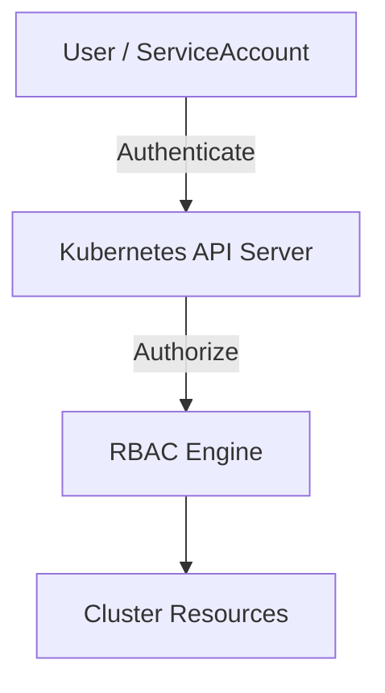
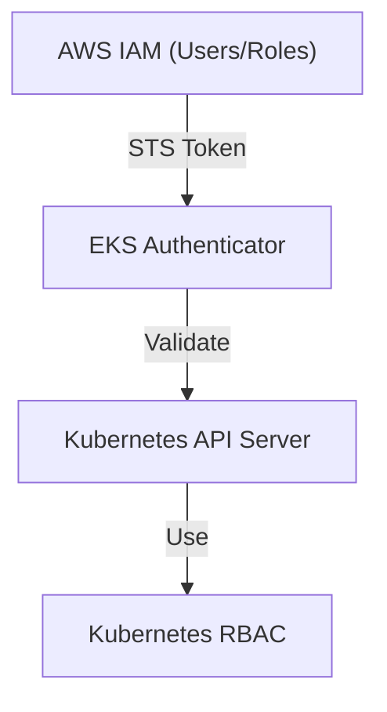
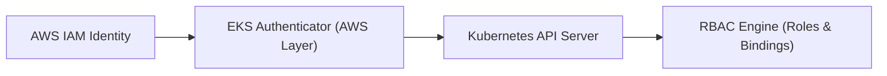
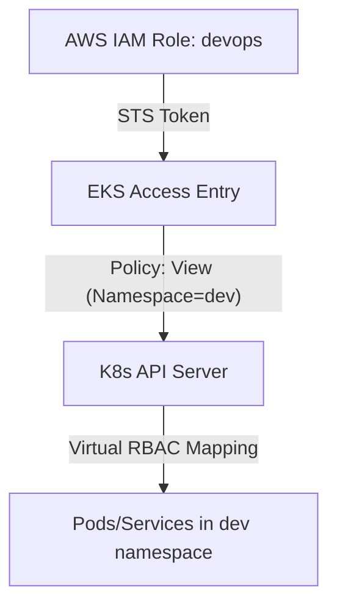
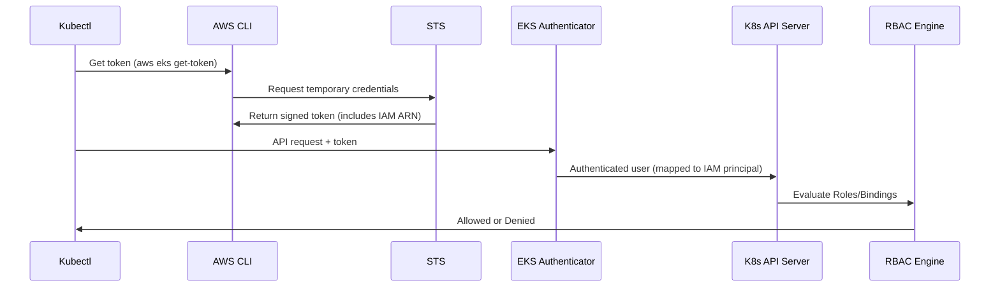
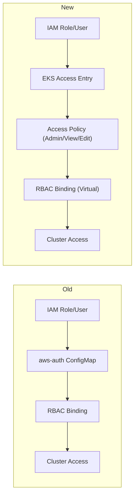
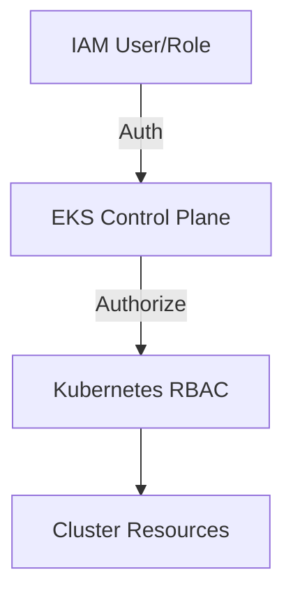

# ☸️ Understanding **Amazon EKS Cluster Access**

_(For Kubernetes Admins Who Don’t Speak “AWS” Yet)!_

---

## 🔙 **First — The World You Already Know (Plain Kubernetes)**

In a normal self-managed Kubernetes cluster (like `kubeadm` or `minikube`), access control works like this:

<div align="center" style="background-color: #141a19ff;color: #a8a5a5ff; border-radius: 10px; border: 2px solid">



</div>

You have:

- **Users** — via certificates or OIDC tokens
- **Service Accounts** — for workloads
- **Roles / ClusterRoles** — define _what actions_ are allowed
- **RoleBindings / ClusterRoleBindings** — _who gets what_
- **kubeconfig** — stores credentials

✅ Everything happens inside Kubernetes  
❌ No external identity system unless _you configure one_

---

## 🆕 **Now Enter Amazon EKS**

Amazon EKS gives you a **managed Kubernetes control plane**.
But here’s the twist:
You _don’t have direct access_ to that control plane — AWS sits between you and Kubernetes.

So the flow looks like this:

<div align="center" style="background-color: #2b3436ff; border-radius: 10px; border: 2px solid">



</div>

AWS **wraps** your Kubernetes API with an authentication layer using **IAM (Identity and Access Management)**.

So before you even touch Kubernetes RBAC, AWS decides:

> “Is this IAM identity even allowed to reach this cluster?”

---

## 🎭 **The Dual-Layer Access Model**

When you access an EKS cluster, there are **two access control layers**:

<div align="center" style="background-color: #141a19ff;color: #a8a5a5ff; border-radius: 10px; border: 2px solid">

| Layer              | Managed By      | Purpose                   | Equivalent in Native K8s    |
| ------------------ | --------------- | ------------------------- | --------------------------- |
| **Authentication** | AWS IAM         | Verifies _who you are_    | Certificate / OIDC provider |
| **Authorization**  | Kubernetes RBAC | Decides _what you can do_ | Same RBAC engine            |

</div>

Let’s visualize:

<div align="center" style="background-color: #2b3436ff; border-radius: 10px; border: 2px solid">



</div>

> 💬 In simple words:  
> AWS handles the **doorway** 🚪 (who gets in),  
> Kubernetes handles the **permissions inside** 🏠 (what they can touch).

---

## 🤔 How AWS IAM “Becomes” a Kubernetes User

AWS doesn’t have Kubernetes “users”.  
Instead, it maps **IAM principals (users or roles)** → **Kubernetes identities (usernames & groups)**.

When you access EKS:

- You never log in with a Kubernetes username/password.
- You use your **AWS IAM role or user**, which is authenticated through **STS tokens**.

Then AWS **translates** that IAM identity into a Kubernetes user/group so RBAC can apply.

---

## 🎯 **The 3 Access Models in EKS**

Now let’s explore **the three ways** EKS allows you to manage cluster access.
Each has pros, cons, and use cases.

---

### 🔹 **Option 1: The Legacy Way — `aws-auth` ConfigMap**

This is the _original_ mechanism before AWS added modern access policies.

#### 🧱 What it does:

It’s a Kubernetes ConfigMap inside the `kube-system` namespace that defines mappings between IAM entities and Kubernetes users/groups.

Example:

```yaml
mapRoles:
  - rolearn: arn:aws:iam::1234567890:role/EKSAdminRole
    username: admin
    groups:
      - system:masters
mapUsers:
  - userarn: arn:aws:iam::1234567890:user/dev
    username: dev
    groups:
      - developers
```

This means:

- IAM role `EKSAdminRole` = Kubernetes user `admin` = part of `system:masters` (full control)
- IAM user `dev` = Kubernetes user `dev` = part of `developers` group

So when a request comes in from AWS IAM, the `aws-iam-authenticator` (built into EKS) reads this ConfigMap to find which K8s group that identity maps to.

---

#### 🧩 Pros:

✅ Simple — just YAML  
✅ Works with any IAM user or role  
✅ Supports multiple mappings

#### ❌ Cons:

- Manual editing using `kubectl`
- Easy to misconfigure → lockout
- No namespace-level control
- No CloudTrail auditing
- Only cluster-admin can change it (chicken-and-egg issue 🐔🥚)

---

### 🔹 **Option 2: The Modern Way — EKS Access Entries & Access Policies**

Introduced in 2024 — the AWS-native, safer, and fully managed replacement for `aws-auth`.

#### 🧠 Concept:

AWS moved identity mapping _out of the cluster_ and into the **EKS control plane**.

Instead of editing a ConfigMap, you create a managed **Access Entry**:

```bash
aws eks create-access-entry \
  --cluster-name my-eks \
  --principal-arn arn:aws:iam::1234567890:role/devops
```

Then attach an **Access Policy**:

```bash
aws eks associate-access-policy \
  --cluster-name my-eks \
  --principal-arn arn:aws:iam::1234567890:role/devops \
  --policy-arn arn:aws:eks::aws:access-policy/AmazonEKSViewPolicy \
  --access-scope type=namespace,namespaces=dev
```

---

#### 🧩 What Happens:

AWS now manages:

- The IAM-to-Kubernetes mapping
- The equivalent RBAC roles behind the scenes
- Namespace-level scoping
- CloudTrail logging

✅ No `kubectl` editing  
✅ Immediate changes  
✅ Safer for multi-user teams  
✅ Centralized IAM governance

---

#### 🧱 Example Visual:

<div align="center" style="background-color: #2b3436ff; border-radius: 10px; border: 2px solid">



</div>

---

#### 🧩 Pros:

✅ IAM-native & secure  
✅ Namespace-aware  
✅ CloudTrail-auditable  
✅ No cluster lockouts  
✅ Managed via Terraform or AWS Console

#### ❌ Cons:

- Still relatively new (some advanced cases need ConfigMap fallback)
- AWS-managed policies may not yet cover _every_ fine-grained need

---

### 🔹 **Option 3: Direct API Access with IAM Authenticator**

For automation tools (like Jenkins, ArgoCD, or CI/CD runners), you can directly use:

- **IAM Roles for Service Accounts (IRSA)** or
- **Assumed Roles** via `aws sts assume-role`

These identities access the cluster **using temporary credentials**, authenticated by IAM.

Example:

```bash
aws eks update-kubeconfig \
  --region us-east-1 \
  --name my-cluster \
  --role-arn arn:aws:iam::1234567890:role/ci-deploy-role
```

✅ Perfect for non-human automation  
✅ Uses temporary tokens (no static secrets)  
✅ Audited in CloudTrail

---

## ⚙️ **Authentication Deep Dive — What Happens When You Run `kubectl`**

Let’s see what happens internally every time you type a command like:

```bash
kubectl get pods
```

<div align="center" style="background-color: #2b3436ff; border-radius: 10px; border: 2px solid">



</div>

---

## 🧑🏻‍💻 **How the First Admin Gets Access?**

When you create the EKS cluster:

- The **IAM identity** (user or role) that created it automatically gets **system:masters** access.
- This identity is recorded internally as the initial admin.
- From there, you can grant access to others via:

  - `aws-auth` ConfigMap
  - or Access Entries

So the **cluster creator** is your Kubernetes `root` user.

---

## 🧬 Combining IAM & RBAC (Best Practice)

The correct modern design is:

> IAM for Authentication + RBAC for Authorization.

<div align="center" style="background-color: #141a19ff;color: #a8a5a5ff; border-radius: 10px; border: 2px solid">

| Layer            | AWS Feature                 | Purpose                          | Notes                                        |
| ---------------- | --------------------------- | -------------------------------- | -------------------------------------------- |
| Authentication   | IAM Roles/Users             | Verify who is calling            | AWS-native security, OIDC or federated users |
| Authorization    | EKS Access Policies or RBAC | What they can do                 | Define scopes, namespaces, verbs             |
| Auditing         | CloudTrail                  | Who accessed EKS & what they did | Monitored at AWS layer                       |
| Granular Control | Kubernetes RBAC             | Limit resources & verbs          | Still fully valid under Access Entries       |

</div>

---

## 🪜 **Typical Real-World Setup**

<div align="center" style="background-color: #141a19ff;color: #a8a5a5ff; border-radius: 10px; border: 2px solid">

| Actor           | IAM Role           | Access Policy          | Namespace Scope | Purpose                          |
| --------------- | ------------------ | ---------------------- | --------------- | -------------------------------- |
| DevOps Engineer | `eks-admin-role`   | `AmazonEKSAdminPolicy` | Cluster         | Full cluster admin               |
| Developer       | `app-dev-role`     | `AmazonEKSViewPolicy`  | `dev`           | View only in `dev`               |
| CI/CD Pipeline  | `cicd-deploy-role` | `AmazonEKSEditPolicy`  | `prod`          | Deploy/update resources          |
| QA Team         | `qa-role`          | `AmazonEKSViewPolicy`  | `qa`            | Read-only access to QA workloads |

</div>

---

## 💡 **Recommendation — Which Option to Use**

<div align="center" style="background-color: #141a19ff;color: #a8a5a5ff; border-radius: 10px; border: 2px solid">

| Situation                                 | Recommended Option                     |
| ----------------------------------------- | -------------------------------------- |
| **Single admin cluster**                  | `aws-auth` is fine (simple & legacy)   |
| **Multiple teams or environments**        | Use **Access Entries**                 |
| **Enterprises & compliance environments** | Access Entries + CloudTrail monitoring |
| **Automation / CI/CD pipelines**          | IAM Roles with Access Entries or IRSA  |
| **Existing setup using aws-auth**         | Gradually migrate to Access Entries    |

</div>

---

## 🧭 **Visual Comparison Summary**

<div align="center" style="background-color: #141a19ff;color: #a8a5a5ff; border-radius: 10px; border: 2px solid">



</div>

> ✅ Both paths lead to RBAC  
> 💡 But the **new path** is safer, visible, and IAM-native

---

## ⚡ **TL;DR Summary**

<div align="center" style="background-color: #141a19ff;color: #a8a5a5ff; border-radius: 10px; border: 2px solid">

| Concept                           | Description                                                |
| --------------------------------- | ---------------------------------------------------------- |
| **EKS Access Control = 2 Layers** | IAM (authentication) + RBAC (authorization)                |
| **Old Method**                    | `aws-auth` ConfigMap manually maps IAM to K8s users/groups |
| **New Method**                    | Access Entries + Policies (AWS-managed, auditable, safe)   |
| **IAM Role / User**               | Becomes your Kubernetes “user”                             |
| **RBAC**                          | Still applies inside cluster to limit actions              |
| **Best Practice**                 | IAM handles who gets in → RBAC handles what they can do    |
| **Automation**                    | Use IAM roles or IRSA for pods/pipelines                   |

</div>

---

## 🧭 **The Mental Model to Keep Forever**

> “Every kubectl command in EKS goes through **IAM authentication first**,  
> then **Kubernetes RBAC authorization** — both must approve the request.”

In short:

<div align="center" style="background-color: #2b3436ff; border-radius: 10px; border: 2px solid">



</div>

- IAM = gatekeeper
- EKS = translator
- RBAC = rule enforcer

---

Would you like me to extend this series with a **hands-on guide next** — showing exactly _how to set up each method (aws-auth, Access Entry, and IRSA)_ using Terraform and `kubectl` so you can compare them side-by-side in action?
