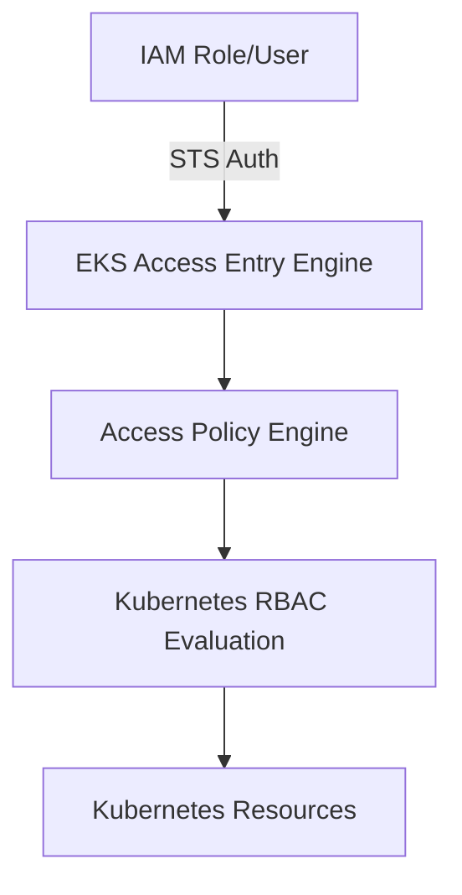
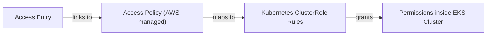
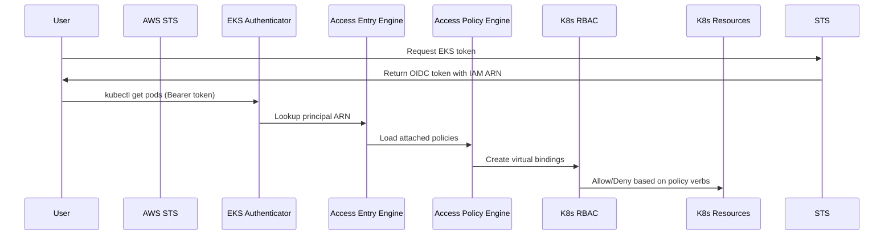

# ⚙️ **EKS Access Entry Internals**

> 🧠 _How AWS connects IAM → Access Entry → Access Policy → Kubernetes RBAC behind the scenes._

---

## 🧩 Internal Architecture Overview

An **Access Entry** lives **outside your Kubernetes cluster**, inside the **EKS control plane**, and connects directly to AWS IAM.

Think of it like a **middleware layer** between AWS IAM and Kubernetes RBAC:

<div align="center" style="background-color: #2b3436ff; border-radius: 10px; border: 2px solid">



</div>

- 🟢 **IAM** authenticates your identity (who you are)
- 🟣 **Access Entry Engine** looks up your access mappings
- 🟦 **Access Policy Engine** determines what you’re allowed to do
- 🟧 **Kubernetes RBAC** enforces the final decision

---

## 🧭 How EKS Stores Access Entries

When you create an Access Entry (via Console, CLI, or Terraform), AWS stores it in the **EKS control plane configuration database** — not as a Kubernetes object.

- It’s part of EKS cluster metadata, similar to how nodegroups or addons are stored.
- It’s versioned and audited in **CloudTrail**.
- It’s globally available across AWS APIs — meaning AWS CLI, Console, and SDKs all see the same Access Entry state.

Example stored metadata (conceptually):

```json
{
  "clusterName": "orchida-tax-eks",
  "principalArn": "arn:aws:iam::065656773845:role/orchida-tax-eks-admin",
  "kubernetesGroups": ["my-admin"],
  "accessPolicies": [
    {
      "policyName": "AmazonEKSAdminPolicy",
      "accessScope": { "type": "cluster" }
    }
  ],
  "creationTimestamp": "2025-10-26T21:43:00Z",
  "createdBy": "arn:aws:iam::065656773845:user/owner"
}
```

---

## 🧠 Access Entry Components (Internal Breakdown)

Each Access Entry object is composed of several fields that AWS uses internally:

<div align="center" style="background-color: #141a19ff;color: #a8a5a5ff; border-radius: 10px; border: 2px solid">

| Field              | Description                                    | Example                                          |
| ------------------ | ---------------------------------------------- | ------------------------------------------------ |
| `clusterName`      | Target EKS cluster                             | `orchida-tax-eks`                                |
| `principalArn`     | IAM identity associated                        | `arn:aws:iam::1234567890:role/devops`            |
| `type`             | Access type (Standard, Node, ServiceAccount)   | `Standard`                                       |
| `kubernetesGroups` | Groups that the user maps to in Kubernetes     | `system:masters`, `my-admin`                     |
| `accessPolicies`   | One or more AWS-managed access policies        | `AmazonEKSAdminPolicy`                           |
| `accessScope`      | Where the policy applies (cluster / namespace) | `{ "type": "namespace", "namespaces": ["dev"] }` |
| `status`           | Synced/NotSynced state                         | `ACTIVE`                                         |

</div>

---

## ⚙️ Access Policy Association (How It Links)

Each Access Entry can attach one or more **Access Policies** that AWS manages globally.

<div align="center" style="background-color: #2b3436ff; border-radius: 10px; border: 2px solid">



</div>

### Internally:

- The Access Entry stores only the **policy name/ARN**.
- The policy logic (verbs/resources) lives inside the **EKS Access Policy Engine** managed by AWS.
- When an IAM principal authenticates, the EKS control plane **pulls** the latest definition of that policy and applies it virtually.

That means:
If AWS updates `AmazonEKSAdminPolicy` (adds a new API resource), it applies to all clusters automatically. ✅

---

## 🧮 Runtime Evaluation Process

Let’s trace what happens **inside EKS** when someone uses `kubectl`.

### 🪪 Step 1 — Token Authentication

You call:

```bash
aws eks get-token --cluster-name orchida-tax-eks
```

AWS STS issues a **temporary OIDC-based token** containing your IAM principal ARN.
This token is then sent as the `Authorization: Bearer` header in your kubectl command.

---

### 🧰 Step 2 — EKS API Authenticator Validates the Token

The EKS control plane has an **IAM Authenticator module** (formerly `aws-iam-authenticator`) that:

- Verifies the token signature using AWS public keys.
- Extracts your `principalArn`.
- Confirms the cluster name matches the one in the token.

Once validated, it passes your identity to the **Access Entry Engine**.

---

### 🧩 Step 3 — Access Entry Lookup

EKS then queries its internal config database for entries where:

```sql
principalArn = <your IAM ARN>
clusterName = <current cluster>
```

If a match is found, EKS loads:

- All associated Access Policies
- All kubernetes_groups
- The scope (namespace or cluster)

If no Access Entry exists → ❌ authentication denied.

---

### 🧠 Step 4 — Access Policy Translation

EKS now pulls each associated **Access Policy** and converts it to internal RBAC rules.
This translation happens _in memory_, not by creating new Kubernetes objects.

Example:

```json
{
  "policyName": "AmazonEKSAdminPolicy",
  "verbs": ["*"],
  "resources": ["pods", "deployments", "services", "configmaps", ...],
  "scope": "cluster"
}
```

It’s like AWS dynamically builds this YAML behind the scenes:

```yaml
kind: ClusterRole
rules:
  - apiGroups: [""]
    resources: ["*"]
    verbs: ["*"]
```

---

### 🧮 Step 5 — Virtual RBAC Binding

Next, AWS virtually creates a binding:

```yaml
kind: ClusterRoleBinding
subjects:
  - kind: User
    name: arn:aws:iam::065656773845:role/orchida-tax-eks-admin
roleRef:
  kind: ClusterRole
  name: AmazonEKSAdminPolicy
```

⚙️ This happens only in memory, not as a persistent object.

So if you run `kubectl get clusterrolebinding`, you won’t see it —
but Kubernetes’ **SubjectAccessReview (SAR)** API will consider it when authorizing requests.

---

### 🔍 Step 6 — Kubernetes RBAC Decision

Now, when you run something like:

```bash
kubectl get nodes
```

The K8s API Server sends your request to its RBAC evaluator:

- It sees your user as the IAM principal ARN.
- It queries all ClusterRoles (including the virtual ones generated by AWS).
- It checks if your role includes `get` verb for `nodes` resource.
- If yes ✅ allowed, else ❌ denied.

---

## 📦 Access Entry Caching and Syncing

Internally, EKS maintains:

- A **cache of Access Entries** per cluster in the control plane.
- This is synced automatically whenever you create/update/delete an Access Entry.
- There’s no delay — changes are immediate across the EKS API.

---

## 🔐 Security and Isolation Model

<div align="center" style="background-color: #141a19ff;color: #a8a5a5ff; border-radius: 10px; border: 2px solid">

| Layer             | Who Controls It       | Purpose                      |
| ----------------- | --------------------- | ---------------------------- |
| **IAM**           | AWS IAM               | Authentication (who are you) |
| **Access Entry**  | AWS EKS Control Plane | Identity mapping and scope   |
| **Access Policy** | AWS EKS Backend       | Permission definition        |
| **RBAC Engine**   | Kubernetes API Server | Final allow/deny decision    |

</div>

✅ IAM never touches your Kubernetes cluster directly.  
✅ Kubernetes RBAC never needs to know about AWS IAM.  
🔄 EKS Access Entry is the “glue” layer that makes both talk seamlessly.

---

## 🧭 Visual Internal Flow

<div align="center" style="background-color: #2b3436ff; border-radius: 10px; border: 2px solid">



</div>

---

## 🧠 How Access Entry Syncs with IAM Changes

If your IAM role is deleted or renamed:

- EKS keeps the Access Entry but marks it as **inactive**.
- The next time someone tries to use that role → authentication fails.
- You can view this status in AWS Console → EKS → Access tab.

So EKS ensures stale IAM mappings don’t silently persist.

---

## ⚡ TL;DR — The Internal Magic

<div align="center" style="background-color: #141a19ff;color: #a8a5a5ff; border-radius: 10px; border: 2px solid">

| Step | Component            | Purpose                            |
| ---- | -------------------- | ---------------------------------- |
| 1    | IAM                  | Authenticates user                 |
| 2    | STS                  | Issues short-lived token           |
| 3    | EKS Authenticator    | Validates token                    |
| 4    | Access Entry Engine  | Looks up identity and access scope |
| 5    | Access Policy Engine | Converts to RBAC rules             |
| 6    | Kubernetes RBAC      | Evaluates action at runtime        |
| 7    | CloudTrail           | Audits everything                  |

</div>

🧩 Result →  
A secure, scalable, AWS-native way to manage Kubernetes access **without touching ConfigMaps or YAML**.
