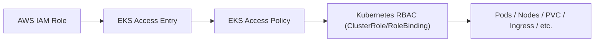
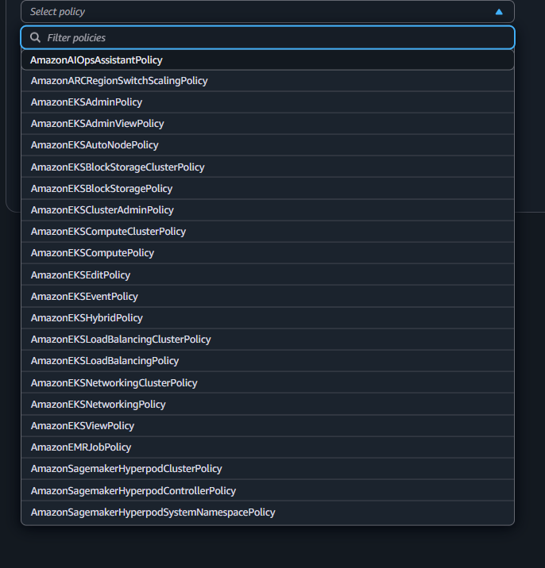
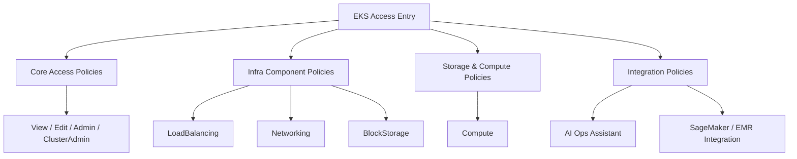

# ☸️ **EKS Access Policies ↔ Kubernetes RBAC Mapping**

> 🧠 AWS didn’t replace RBAC — they **wrapped** it.  
> Each Access Policy maps internally to one or more Kubernetes ClusterRoles or RoleBindings with specific verbs.

---

## 🧩 **Core Access Policies**

<div align="center" style="background-color: #141a19ff;color: #a8a5a5ff; border-radius: 10px; border: 2px solid">

| **Access Policy**             | **Kubernetes Scope** | **RBAC Verbs**                                                        | **Kubernetes Resources**                                         | **Equivalent K8s Role**  |
| ----------------------------- | -------------------- | --------------------------------------------------------------------- | ---------------------------------------------------------------- | ------------------------ |
| `AmazonEKSViewPolicy`         | Namespaced           | `get`, `list`, `watch`                                                | Pods, Services, ConfigMaps, Secrets, Deployments, Events         | `view`                   |
| `AmazonEKSEditPolicy`         | Namespaced           | `get`, `list`, `watch`, `create`, `update`, `patch`, `delete`         | Same as `view` + Deployments, ReplicaSets, Jobs                  | `edit`                   |
| `AmazonEKSAdminPolicy`        | Cluster + Namespace  | All verbs on namespaced resources; limited cluster-scope (no `nodes`) | All core resources except node/system ones                       | Custom admin clusterrole |
| `AmazonEKSClusterAdminPolicy` | Cluster-wide         | `*` (all verbs)                                                       | All API resources, including Nodes, CRDs, cluster-scoped objects | `cluster-admin`          |

</div>

---

## ⚙️ **Networking & Load Balancing Policies**

<div align="center" style="background-color: #141a19ff;color: #a8a5a5ff; border-radius: 10px; border: 2px solid">

| **Access Policy**                     | **Scope**  | **RBAC Verbs**                                       | **Resources**                               | **Purpose**               |
| ------------------------------------- | ---------- | ---------------------------------------------------- | ------------------------------------------- | ------------------------- |
| `AmazonEKSNetworkingPolicy`           | Namespaced | `get`, `list`, `watch`, `create`, `update`, `delete` | Services, Endpoints, NetworkPolicies        | App-level networking      |
| `AmazonEKSNetworkingClusterPolicy`    | Cluster    | `*`                                                  | Services, Endpoints, IngressClasses, CNI    | Full cluster networking   |
| `AmazonEKSLoadBalancingPolicy`        | Namespaced | `get`, `list`, `watch`, `create`, `update`, `delete` | Services (LoadBalancer), Ingress            | Manage app load balancers |
| `AmazonEKSLoadBalancingClusterPolicy` | Cluster    | `*`                                                  | IngressControllers, LBs, shared controllers | Cluster-wide ingress mgmt |

</div>

---

## 💾 **Storage Policies**

<div align="center" style="background-color: #141a19ff;color: #a8a5a5ff; border-radius: 10px; border: 2px solid">

| **Access Policy**                    | **Scope**  | **RBAC Verbs**                             | **Resources**             | **Purpose**           |
| ------------------------------------ | ---------- | ------------------------------------------ | ------------------------- | --------------------- |
| `AmazonEKSBlockStoragePolicy`        | Namespaced | `get`, `list`, `watch`, `create`, `delete` | PersistentVolumeClaims    | App storage mgmt      |
| `AmazonEKSBlockStorageClusterPolicy` | Cluster    | `*`                                        | PVs, PVCs, StorageClasses | Storage admin control |

</div>

---

## 🧮 **Compute Policies**

<div align="center" style="background-color: #141a19ff;color: #a8a5a5ff; border-radius: 10px; border: 2px solid">

| **Access Policy**               | **Scope**  | **RBAC Verbs**             | **Resources**                        | **Purpose**                   |
| ------------------------------- | ---------- | -------------------------- | ------------------------------------ | ----------------------------- |
| `AmazonEKSComputePolicy`        | Namespaced | `*` except cluster objects | Pods, Deployments, Jobs, ReplicaSets | App workload management       |
| `AmazonEKSComputeClusterPolicy` | Cluster    | `*`                        | Same as above + DaemonSets, CRDs     | Platform workload management  |
| `AmazonEKSAutoNodePolicy`       | Cluster    | `get`, `patch`             | Nodes                                | Node lifecycle (cordon/drain) |

</div>

---

## 🧠 **Observability & Hybrid**

<div align="center" style="background-color: #141a19ff;color: #a8a5a5ff; border-radius: 10px; border: 2px solid">

| **Access Policy**       | **Scope** | **RBAC Verbs**         | **Resources**                   | **Purpose**             |
| ----------------------- | --------- | ---------------------- | ------------------------------- | ----------------------- |
| `AmazonEKSEventPolicy`  | Cluster   | `get`, `list`, `watch` | Events                          | Observability tools     |
| `AmazonEKSHybridPolicy` | Cluster   | `*`                    | Hybrid (EKS Anywhere) resources | On-prem cluster control |

</div>

---

## 🧰 **Integration & Data Policies**

<div align="center" style="background-color: #141a19ff;color: #a8a5a5ff; border-radius: 10px; border: 2px solid">

| **Access Policy**                              | **Scope** | **RBAC Verbs**          | **Resources**                       | **Purpose**                |
| ---------------------------------------------- | --------- | ----------------------- | ----------------------------------- | -------------------------- |
| `AmazonMRJobPolicy`                            | Namespace | `*`                     | EMR-on-EKS Jobs                     | Data processing workloads  |
| `AmazonSagemakerHyperpodClusterPolicy`         | Cluster   | `*`                     | SageMaker CRDs                      | Cluster mgmt for HyperPod  |
| `AmazonSagemakerHyperpodControllerPolicy`      | Cluster   | `get`, `list`, `update` | SageMaker CRDs                      | Controller sync jobs       |
| `AmazonSagemakerHyperpodSystemNamespacePolicy` | Namespace | Restricted              | `amazon-sagemaker-system` resources | SageMaker internal control |
| `AmazonAIOpsAssistantPolicy`                   | Cluster   | `*`                     | AIOps custom resources              | AI Ops automation          |

</div>

---

## 🧭 **Visual Overview**

<div align="center" style="background-color: #2b3436ff; border-radius: 10px; border: 2px solid">



</div>

🟢 AWS IAM authenticates  
🔵 EKS Access Policy decides scope and verbs  
🟣 RBAC enforces detailed resource-level permissions

---

## 🏁 **Summary of Hierarchy**

<div align="center" style="background-color: #141a19ff;color: #a8a5a5ff; border-radius: 10px; border: 2px solid">

| Layer             | Managed By        | Example                     | Purpose                    |
| ----------------- | ----------------- | --------------------------- | -------------------------- |
| **IAM**           | AWS IAM           | `arn:aws:iam::...:role/...` | Authentication             |
| **Access Entry**  | AWS EKS           | Role-to-policy mapping      | Bridge IAM → RBAC          |
| **Access Policy** | AWS EKS (Managed) | `AmazonEKSAdminPolicy`      | Simplified permission sets |
| **RBAC**          | Kubernetes        | ClusterRoles, RoleBindings  | Fine-grained enforcement   |

</div>

---

## ⚡ **TL;DR**

> AWS Access Policies are **managed, opinionated RBAC bundles** that AWS maps internally to Kubernetes roles and verbs.  
> Kubernetes RBAC still applies — AWS just automated the bridge between IAM and the RBAC model to reduce friction, risk, and YAML editing.

---

## 🎉 **Amazon EKS Access Policies — Complete 2025 Edition**

> 📚 These are **EKS-native Access Policies**, attached via the **EKS Access Entry** system (not IAM).  
> Each policy grants specific Kubernetes API actions that map to typical AWS/EKS use cases.

---

<div align="center" style="background-color:#131920; border-radius: 10px; border: 2px solid">
    
</div>

---

### 1️⃣ Core EKS Management Policies

<div align="center" style="background-color: #141a19ff;color: #a8a5a5ff; border-radius: 10px; border: 2px solid">

| Policy                            | Description                                                                                   | Typical Use                    |
| --------------------------------- | --------------------------------------------------------------------------------------------- | ------------------------------ |
| **`AmazonEKSViewPolicy`**         | Read-only access to cluster resources (list/get/watch). No write/delete actions.              | Auditors, QA, monitoring tools |
| **`AmazonEKSEditPolicy`**         | Allows create/update/delete for most namespaced resources (Pods, Deployments, Services, etc.) | Developers or CI/CD pipelines  |
| **`AmazonEKSAdminPolicy`**        | Broad admin rights across the cluster but not node-level or system components                 | Platform/DevOps engineers      |
| **`AmazonEKSClusterAdminPolicy`** | Full `cluster-admin` access (includes node viewing and cluster-scoped resources)              | SREs, cluster owners           |

</div>

---

### 2️⃣ EKS Infrastructure Component Policies

<div align="center" style="background-color: #141a19ff;color: #a8a5a5ff; border-radius: 10px; border: 2px solid">

| Policy                                    | Description                                                                                | Typical Use                                           |
| ----------------------------------------- | ------------------------------------------------------------------------------------------ | ----------------------------------------------------- |
| **`AmazonEKSComputePolicy`**              | Grants permissions to manage compute workloads (Pods, ReplicaSets, StatefulSets).          | For teams operating app workloads directly.           |
| **`AmazonEKSComputeClusterPolicy`**       | Extends `ComputePolicy` cluster-wide, including cluster-scoped objects related to compute. | Cluster-wide workload administrators.                 |
| **`AmazonEKSLoadBalancingPolicy`**        | Manages Kubernetes Services of type `LoadBalancer`, Ingress, and related annotations.      | Teams deploying internet-facing services.             |
| **`AmazonEKSLoadBalancingClusterPolicy`** | Cluster-wide load balancer management, including shared ingress controllers.               | Network/ingress teams.                                |
| **`AmazonEKSNetworkingPolicy`**           | Manages network resources like Services, Endpoints, and NetworkPolicies in a namespace.    | App developers managing networking for their apps.    |
| **`AmazonEKSNetworkingClusterPolicy`**    | Cluster-wide networking administration (includes CNI, policies, ingress).                  | Network administrators or cluster networking teams.   |
| **`AmazonEKSBlockStoragePolicy`**         | Manage PersistentVolumeClaims (PVCs) in namespaces.                                        | App teams attaching block storage to pods.            |
| **`AmazonEKSBlockStorageClusterPolicy`**  | Cluster-wide block storage operations (PVCs and PVs).                                      | Storage or platform team managing volumes.            |
| **`AmazonEKSAutoNodePolicy`**             | Grants permissions to manage EKS-managed node operations (cordon/drain).                   | Node automation and lifecycle management controllers. |
| **`AmazonEKSComputeClusterPolicy`**       | Full compute management across namespaces including DaemonSets, Jobs, CronJobs.            | Platform team managing workloads across cluster.      |
| **`AmazonEKSLoadBalancingClusterPolicy`** | Cluster-wide management of ingress controllers and LB services.                            | Network/SRE teams ensuring service exposure.          |
| **`AmazonEKSNetworkingClusterPolicy`**    | Full networking management (IngressClass, ServiceAccount networking, CNI configs).         | Network administrators.                               |

</div>

---

### 3️⃣ Specialized EKS Functionality Policies

<div align="center" style="background-color: #141a19ff;color: #a8a5a5ff; border-radius: 10px; border: 2px solid">

| Policy                          | Description                                                                   | Typical Use                                 |
| ------------------------------- | ----------------------------------------------------------------------------- | ------------------------------------------- |
| **`AmazonEKSEventPolicy`**      | Allows reading cluster `Events` for monitoring and troubleshooting.           | Observability tools, Prometheus, Datadog.   |
| **`AmazonEKSHybridPolicy`**     | Grants access for managing hybrid (on-prem + EKS Anywhere) cluster resources. | EKS Anywhere / hybrid cloud management.     |
| **`AmazonEKSNetworkingPolicy`** | Namespace-scoped network management (NetworkPolicy, Services).                | Dev teams managing app-level network rules. |

</div>

---

### 4️⃣ Storage & Node Policies

<div align="center" style="background-color: #141a19ff;color: #a8a5a5ff; border-radius: 10px; border: 2px solid">

| Policy                                   | Description                                     | Typical Use                     |
| ---------------------------------------- | ----------------------------------------------- | ------------------------------- |
| **`AmazonEKSBlockStoragePolicy`**        | Manage namespace-scoped PersistentVolumeClaims. | Stateful app owners (DB, etc.). |
| **`AmazonEKSBlockStorageClusterPolicy`** | Manage PersistentVolumes across cluster.        | Storage or platform engineers.  |
| **`AmazonEKSComputePolicy`**             | Manage Pods, Deployments, StatefulSets, Jobs.   | App developers.                 |
| **`AmazonEKSComputeClusterPolicy`**      | Manage compute workloads cluster-wide.          | Platform engineers.             |

</div>

---

### 5️⃣ Integration & Supporting Policies

<div align="center" style="background-color: #141a19ff;color: #a8a5a5ff; border-radius: 10px; border: 2px solid">

| Policy                                             | Description                                                                   | Typical Use                                 |
| -------------------------------------------------- | ----------------------------------------------------------------------------- | ------------------------------------------- |
| **`AmazonAIOptsAssistantPolicy`**                  | Access policy for AI Ops Assistant integration.                               | AI Ops automation within EKS clusters.      |
| **`AmazonARCRegionSwitchScalingPolicy`**           | Allows auto-scaling and region-switch operations (for ARC-enabled workloads). | Multi-region EKS ARC scaling.               |
| **`AmazonEKSHybridPolicy`**                        | Used for hybrid EKS Anywhere clusters.                                        | On-prem extension management.               |
| **`AmazonMRJobPolicy`**                            | Access for managing EMR-on-EKS Jobs.                                          | Data engineering workloads with EMR-on-EKS. |
| **`AmazonSagemakerHyperpodClusterPolicy`**         | Controls cluster-level management of SageMaker HyperPod.                      | SageMaker distributed training infra.       |
| **`AmazonSagemakerHyperpodControllerPolicy`**      | Allows SageMaker controllers to manage HyperPod jobs.                         | SageMaker infrastructure automation.        |
| **`AmazonSagemakerHyperpodSystemNamespacePolicy`** | Restricts access to the `amazon-sagemaker-system` namespace.                  | SageMaker internal controller components.   |

</div>

---

### 📊 Diagram: Policy Category Breakdown

<div align="center" style="background-color: #2b3436ff; border-radius: 10px; border: 2px solid">



</div>

---

### 📃 **Quick Summary Table by Category**

| Category              | Example Policies                                          | Key Permissions                         | Typical Users      |
| --------------------- | --------------------------------------------------------- | --------------------------------------- | ------------------ |
| **Core Access**       | `View`, `Edit`, `Admin`, `ClusterAdmin`                   | Basic RBAC across cluster               | Devs, Admins, SREs |
| **Compute**           | `ComputePolicy`, `ComputeClusterPolicy`                   | Manage workloads                        | DevOps, Platform   |
| **Networking**        | `NetworkingPolicy`, `NetworkingClusterPolicy`             | Manage Services, Ingress, NetworkPolicy | Network Teams      |
| **Load Balancing**    | `LoadBalancingPolicy`, `LoadBalancingClusterPolicy`       | Manage Ingress/LB                       | Platform Team      |
| **Storage**           | `BlockStoragePolicy`, `BlockStorageClusterPolicy`         | Manage PVC/PV                           | Storage Admins     |
| **Observability**     | `EventPolicy`                                             | Read events                             | Monitoring tools   |
| **Hybrid & Advanced** | `HybridPolicy`, `AutoNodePolicy`, `AIOptsAssistantPolicy` | Hybrid ops, AI integration              | Cluster automation |
| **External Services** | `SagemakerHyperpod*`, `MRJobPolicy`                       | EKS-integrated services                 | ML/Big Data teams  |

---

### ⁉️ Why Your `kubectl get nodes` Fails for AmazonEKSAdminPolicy

Your access entry has:

```ini
AmazonEKSAdminPolicy
```

👉 That policy **does not include node-level (cluster-scoped) permissions**.  
Only these policies can view/manage nodes:

- `AmazonEKSClusterAdminPolicy`
- `AmazonEKSComputeClusterPolicy`
- Possibly `AmazonEKSAutoNodePolicy` (for node lifecycle).

So, to fix your issue:

```bash
aws eks associate-access-policy \
  --cluster-name your-cluster \
  --principal-arn arn:aws:sts::account:role/orchida-tax-eks-admin \
  --policy-arn arn:aws:eks::aws:cluster-access-policy/AmazonEKSClusterAdminPolicy \
  --access-scope type=cluster
```
