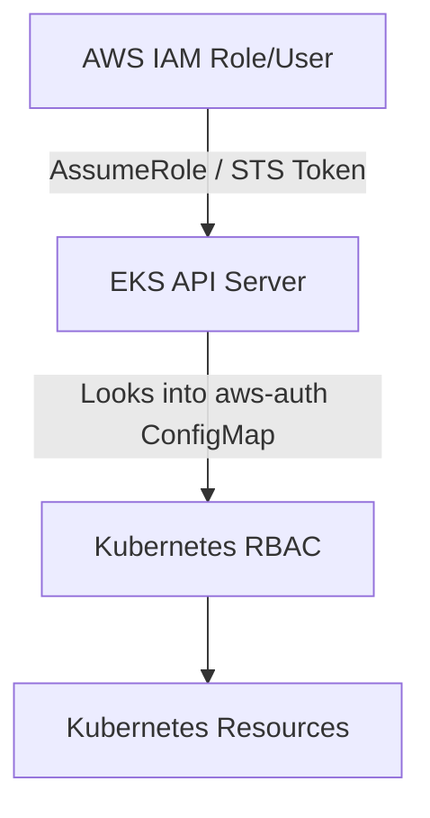
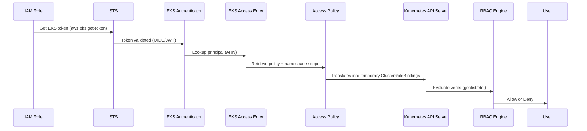
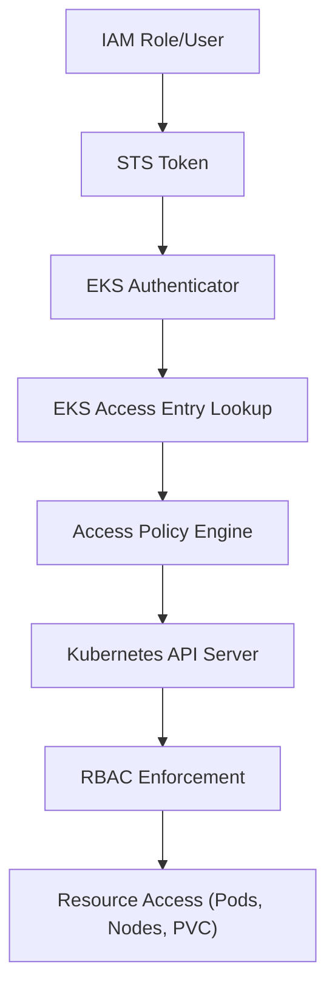

# ⚙️ **How EKS Access Policies Work Internally**

> _“Under the hood of AWS’s new identity bridge between IAM and Kubernetes RBAC”_

---

## 🔴 **The Core Problem AWS Solved**

Before EKS Access Policies, this was the chain:

<div align="center" style="background-color: #2b3436ff; border-radius: 10px; border: 2px solid">



</div>

The issue:

- `aws-auth` ConfigMap manually mapped IAM → K8s usernames/groups.
- Updating it required `kubectl` admin access (chicken-egg problem).
- No visibility in IAM console or CloudTrail.
- No way to limit scope (namespace-level access).

AWS wanted to bring **IAM-native control** to EKS **without breaking Kubernetes authorization logic**.

---

## 🖇️ **Modern Chain with Access Entries**

Here’s what happens **now** when you run `kubectl get pods` with Access Policy configured:

<div align="center" style="background-color: #2b3436ff; border-radius: 10px; border: 2px solid">



</div>

---

## 🪜 **Step-by-Step Internal Flow**

Let’s go step by step.

### 🪪 Step 1: Authentication (IAM → STS → Token)

When you run:

```bash
aws eks update-kubeconfig --role-arn arn:aws:iam::123:role/my-eks-role
```

Then `kubectl` uses:

```bash
aws eks get-token --cluster-name my-cluster
```

✅ AWS CLI asks **STS** to issue a **temporary token** tied to your IAM role.
That token includes:

- The `assumed-role` ARN
- The `sessionName`
- A short-lived JWT signed by AWS

That token is sent as a Bearer token to the EKS API Server.

---

### 🧰 Step 2: EKS Authenticator Validates the Token

The **EKS API server** uses an **authentication webhook** called `aws-iam-authenticator` (now built-in to EKS).

It checks:

- Signature (via AWS public key)
- Expiry time (STS token validity)
- ARN of the caller (principal)

✅ Once verified, EKS knows _who_ you are — e.g.
`arn:aws:sts::065656773845:assumed-role/orchida-tax-eks-admin/EKSGetTokenAuth`

---

### 🧩 Step 3: EKS Access Entry Lookup

EKS checks your cluster’s **Access Entry Table** — this is stored in EKS control plane (not inside Kubernetes).

It finds an entry like this:

```json
{
  "principalArn": "arn:aws:iam::065656773845:role/orchida-tax-eks-admin",
  "accessPolicies": [
    {
      "policyName": "AmazonEKSAdminPolicy",
      "scope": { "type": "cluster" }
    }
  ],
  "groups": ["my-admin"]
}
```

This acts as the **IAM → Kubernetes translation record**.

---

### 🧠 Step 4: Apply Access Policy Template

Each **Access Policy** (like `AmazonEKSAdminPolicy`) is a **predefined RBAC template** managed by AWS.
It defines what verbs/resources you can use, such as:

```yaml
rules:
  - apiGroups: [""]
    resources: ["pods", "services", "configmaps"]
    verbs: ["get", "list", "watch", "create", "update", "delete"]
  - apiGroups: ["apps"]
    resources: ["deployments"]
    verbs: ["get", "list", "create", "update"]
```

AWS applies these **dynamically** — it doesn’t actually create YAML files in your cluster; instead, it **injects temporary RBAC bindings** at runtime.

That’s why you don’t see any new ClusterRoles when listing with `kubectl get clusterrole`.

---

### 🧩 Step 5: Scope Enforcement (Namespace or Cluster)

If your Access Policy is scoped like:

```bash
type=namespace, namespaces=["dev", "qa"]
```

Then AWS wraps that policy in a **RoleBinding** limited to those namespaces.

If it’s `type=cluster`, it acts as a **ClusterRoleBinding**.

So internally:

- EKS checks which namespaces match your scope.
- Dynamically creates the equivalent bindings in memory (not as stored objects).
- Passes them to the Kubernetes API server’s **SubjectAccessReview** mechanism.

---

### 🧮 Step 6: RBAC Decision via SubjectAccessReview

Finally, the **Kubernetes RBAC Engine** does what it always does —  
checks whether your effective identity (group/role) can perform the requested action on the resource.

✅ If allowed → response returned  
❌ If not →

```ini
Error from server (Forbidden): pods is forbidden: User "<arn>" cannot list resource "pods"
```

---

## 👀 **What Actually Exists vs. What’s Virtual**

<div align="center" style="background-color: #141a19ff;color: #a8a5a5ff; border-radius: 10px; border: 2px solid">

| Layer                                   | Physically Exists         | Description                                   |
| --------------------------------------- | ------------------------- | --------------------------------------------- |
| IAM Role                                | ✅                        | Real AWS identity with permissions            |
| EKS Access Entry                        | ✅                        | Stored in EKS control plane (AWS API managed) |
| Access Policy                           | ✅ (AWS-managed template) | JSON-defined template in AWS backend          |
| ClusterRoleBinding (from Access Policy) | ❌ (virtual)              | Generated at request time, not persisted      |
| Kubernetes RBAC                         | ✅                        | Still used for all enforcement                |

</div>

AWS uses **ephemeral bindings** — that’s why even after removing an Access Policy, you’re instantly locked out.

---

## 🔐 **Key Internal Components**

<div align="center" style="background-color: #141a19ff;color: #a8a5a5ff; border-radius: 10px; border: 2px solid">

| Component                | Description                                               | Managed By |
| ------------------------ | --------------------------------------------------------- | ---------- |
| **AccessEntry API**      | Stores which IAM roles/users are linked to which clusters | AWS        |
| **AccessPolicy Engine**  | Maps high-level policies (Admin, View) to RBAC templates  | AWS        |
| **EKS Authenticator**    | Validates AWS tokens                                      | AWS        |
| **RBAC Engine (in K8s)** | Enforces allow/deny on requests                           | Kubernetes |

</div>

---

## 🧭 **End-to-End Example**

Let’s walk through `kubectl get nodes` for your case.

<div align="center" style="background-color: #141a19ff;color: #a8a5a5ff; border-radius: 10px; border: 2px solid">

| Step | What Happens                                           | Where             |
| ---- | ------------------------------------------------------ | ----------------- |
| 1    | You run `kubectl get nodes`                            | Your terminal     |
| 2    | `aws eks get-token` generates STS JWT                  | AWS STS           |
| 3    | API server validates token via AWS OIDC                | EKS control plane |
| 4    | EKS looks up Access Entry                              | EKS control plane |
| 5    | Finds `AmazonEKSAdminPolicy`                           | AWS backend       |
| 6    | Translates to “namespaced admin” (no node permissions) | AWS backend       |
| 7    | Kubernetes RBAC denies node list request               | K8s API           |
| ❌   | You get Forbidden                                      | Output            |

</div>

When you add `AmazonEKSClusterAdminPolicy`,  
Step 6 now grants `list/get` for `nodes`, so the API returns successfully.

---

## ⚖️ **Comparison: Old vs. New Model**

<div align="center" style="background-color: #141a19ff;color: #a8a5a5ff; border-radius: 10px; border: 2px solid">

| Aspect               | Old (aws-auth ConfigMap)       | New (Access Entry + Policy) |
| -------------------- | ------------------------------ | --------------------------- |
| Mapping location     | Inside cluster ConfigMap       | EKS control plane           |
| Management           | kubectl edit                   | AWS Console / CLI           |
| Namespace control    | No                             | Yes                         |
| Audit visibility     | None                           | CloudTrail integrated       |
| Misconfig risk       | High (lockout possible)        | Low                         |
| Real-time revocation | Slow (until ConfigMap reloads) | Immediate                   |

</div>

---

## 🏁 **Visual Summary**

<div align="center" style="background-color: #2b3436ff; border-radius: 10px; border: 2px solid">



</div>

✅ IAM authenticates  
🟢 EKS translates Access Policy → virtual RBAC  
🟣 Kubernetes enforces rules

---

## ⚡ **TL;DR**

> AWS’s Access Policy system is an **IAM-aware RBAC translator**.
> It authenticates using STS → maps via Access Entry → translates policy to ephemeral RBAC bindings → and lets Kubernetes still make the final authorization call.
