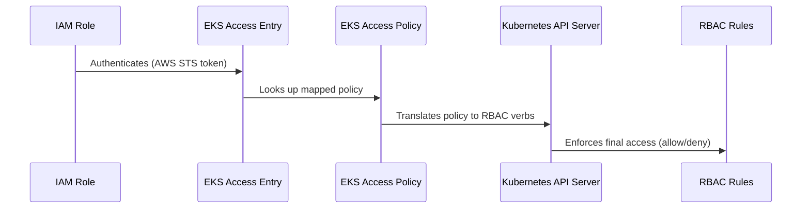
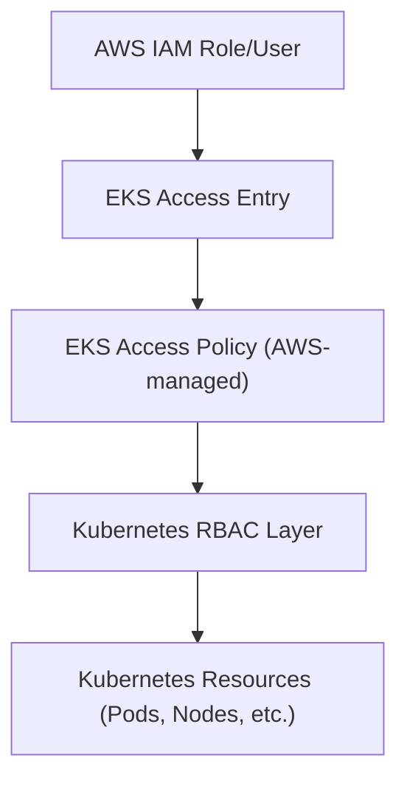

# ☸️ **Why AWS Introduced EKS Access Policies**

> _A tale of two worlds: IAM (AWS) 🆚 RBAC (Kubernetes)_

---

## 🕰️ **Background — The Pain Before Access Entries**

Traditionally, **Kubernetes RBAC** controls “who can do what” inside the cluster.
But… when you run EKS, you face **two distinct identity worlds**:

<div align="center" style="background-color: #141a19ff;color: #a8a5a5ff; border-radius: 10px; border: 2px solid">

| Layer              | System          | Identity Type                          | Problem                                                 |
| ------------------ | --------------- | -------------------------------------- | ------------------------------------------------------- |
| **Authentication** | AWS IAM         | IAM users, roles, federated identities | AWS knows who you are                                   |
| **Authorization**  | Kubernetes RBAC | ServiceAccounts, Users, Groups         | K8s doesn’t know who you are unless you manually map it |

</div>

Before Access Policies existed, you had to manually edit a ConfigMap called `aws-auth`:

```yaml
mapRoles:
  - rolearn: arn:aws:iam::1234567890:role/Admin
    username: admin
    groups:
      - system:masters
```

That mapping was **manual, brittle, and dangerous**:

- Editing the `aws-auth` ConfigMap incorrectly could **lock everyone out** 😱
- You had no central audit or IAM integration.
- No namespace-level granularity (you had to manage RBAC by hand).

So AWS asked:

> “What if we could bring Kubernetes authorization closer to AWS IAM principles — without replacing RBAC entirely?”

That’s where **Access Entries** and **Access Policies** came in.

---

## 🔐 **EKS Access Policies** — The AWS-Layer RBAC Bridge

Think of **EKS Access Policies** as _prebuilt, AWS-managed RBAC bundles_ that live on the **authentication side** of EKS, not _inside_ Kubernetes directly.

Here’s the flow:

<div align="center" style="background-color: #2b3436ff; border-radius: 10px; border: 2px solid">



</div>

➡️ The Access Policy **translates AWS policy → Kubernetes verbs (get/list/create/etc.)**  
➡️ Then Kubernetes still **enforces** those verbs with its internal RBAC engine.

---

## 🧬 **Relationship Between IAM, EKS Access Policy, and K8s RBAC**

<div align="center" style="background-color: #141a19ff;color: #a8a5a5ff; border-radius: 10px; border: 2px solid">

| Layer                 | Who It Belongs To | Controls                       | Managed By    | Example                  |
| --------------------- | ----------------- | ------------------------------ | ------------- | ------------------------ |
| **IAM**               | AWS               | Auth (who are you)             | AWS IAM       | AssumeRole / STS         |
| **EKS Access Policy** | AWS               | Simplified K8s permission sets | AWS-managed   | AmazonEKSAdminPolicy     |
| **K8s RBAC**          | Kubernetes        | Fine-grained resource actions  | Cluster Admin | ClusterRole, RoleBinding |

</div>

So EKS Access Policies are **an optional, managed layer** between IAM and RBAC — you can still use pure RBAC if you prefer.

---

## 🤔 **Why AWS Did This?**

### 🧠 Motivation Summary

<div align="center" style="background-color: #141a19ff;color: #a8a5a5ff; border-radius: 10px; border: 2px solid">

| Reason                              | Explanation                                                                                                                            |
| ----------------------------------- | -------------------------------------------------------------------------------------------------------------------------------------- |
| **🧩 Simplify onboarding**          | Instead of editing `aws-auth` ConfigMap or manually binding ClusterRoles, you attach a predefined access policy in the console or CLI. |
| **🛡️ Improve security**             | AWS owns and audits these policies — they’re tested and restricted by default (e.g., `Admin` doesn’t equal full `cluster-admin`).      |
| **⚙️ Centralized management**       | Access entries appear in AWS Console, CloudTrail, and can be versioned/audited like IAM resources.                                     |
| **🚀 Namespace granularity**        | You can assign policies scoped to certain namespaces directly, no YAML needed.                                                         |
| **📜 Declarative IAM-like control** | Everything (AccessEntry + Policy) can be managed via IaC tools (Terraform, CloudFormation, etc.)                                       |

</div>

---

## ⚖️ **Coexistence Model — Both Still Matter**

You can think of it like **two layers of a firewall**:

<div align="center" style="background-color: #141a19ff;color: #a8a5a5ff; border-radius: 10px; border: 2px solid">

| Layer                       | Role                                                               |
| --------------------------- | ------------------------------------------------------------------ |
| **AWS Access Policy Layer** | Who is allowed to _enter_ and which broad actions they can perform |
| **K8s RBAC Layer**          | What the authenticated identity can do _once inside the cluster_   |

</div>

Example:

- You attach `AmazonEKSEditPolicy` to an IAM Role.
- That maps to RBAC verbs like `create/update/delete` on Deployments and Services.
- Inside Kubernetes, RBAC still enforces namespaces, RoleBindings, and group rules.

You can **stack both** for precision control.

---

## ⁉️ **So… Should We Still Use RBAC?**

✅ **Yes, absolutely.**  
EKS Access Policies are great for:

- Centralized access management
- Quick role assignment (e.g., “Give Dev team view-only access”)
- Namespace-level boundaries

But for:

- Custom CRDs (Custom Resources)
- Fine-grained role separation (e.g., “can patch ConfigMaps but not delete”)
- ServiceAccount permissions inside the cluster

👉 You **still need native RBAC**.

---

## 🏁 **Summary: Why AWS Created Access Policies**

<div align="center" style="background-color: #141a19ff;color: #a8a5a5ff; border-radius: 10px; border: 2px solid">

| Problem                             | Traditional EKS                  | Solution (Access Policy)         |
| ----------------------------------- | -------------------------------- | -------------------------------- |
| Hard to manage `aws-auth` ConfigMap | Manual YAML edits                | Automatic Access Entry API       |
| No visibility in IAM                | Cluster-local only               | IAM + CloudTrail integration     |
| No namespace scoping                | All-or-nothing RBAC              | Policy scopes (`type=namespace`) |
| No standardized roles               | You had to define your own Roles | AWS provides managed policies    |
| Risk of misconfig                   | Misbinding RBAC can lock you out | Pretested safe defaults          |

</div>

---

## 🧭 **Visual Summary**

<div align="center" style="background-color: #2b3436ff; border-radius: 10px; border: 2px solid">



</div>

🟢 **IAM** → Authenticates  
🔵 **EKS Access Policy** → Broad authorization mapping  
🟣 **RBAC** → Enforces detailed permissions

---

### ⚡ **TL;DR**

> AWS didn’t _replace_ Kubernetes RBAC — they **wrapped it with an IAM-native control layer** for simplicity, auditability, and enterprise management.  
> You can still use RBAC directly, but AWS’s layer saves you from touching that fragile `aws-auth` ConfigMap ever again.
