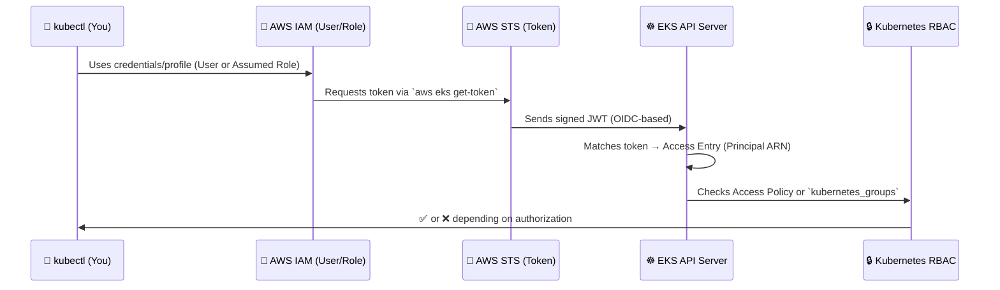

# ☸️ **Amazon EKS Authentication & Authorization**

**(User vs Role in `~/.kube/config`, Internals, Console/CLI/Terraform Implementation)**

---

## ⁉️ **What Happens When You Run `kubectl`**

Before you even choose between **User** or **Role**, you need to understand the full chain of authentication & authorization inside an EKS cluster.

Let’s visualize it 👇

<div align="center" style="background-color: #2b3436ff; border-radius: 10px; border: 2px solid">



</div>

> 💬 So every time you type `kubectl get pods`, EKS runs a full IAM → STS → EKS → RBAC chain.

---

## ⚙️ **How `~/.kube/config` Works in EKS**

When you run:

```bash
aws eks update-kubeconfig --name my-cluster --region eu-west-1 [--role-arn <role>]
```

AWS CLI writes your kubeconfig with three key parts:

```yaml
apiVersion: v1
clusters:
  - cluster:
      server: https://ABCD.gr7.eu-west-1.eks.amazonaws.com
      certificate-authority-data: LS0tLS1...
    name: arn:aws:eks:eu-west-1:123456789012:cluster/my-cluster
users:
  - name: arn:aws:iam::123456789012:role/eks-admin
    user:
      exec:
        apiVersion: client.authentication.k8s.io/v1beta1
        command: aws
        args:
          - eks
          - get-token
          - --cluster-name
          - my-cluster
          - --role-arn
          - arn:aws:iam::123456789012:role/eks-admin
contexts:
  - name: my-cluster@eks-admin
    context:
      cluster: arn:aws:eks:eu-west-1:123456789012:cluster/my-cluster
      user: arn:aws:iam::123456789012:role/eks-admin
current-context: my-cluster@eks-admin
```

🎯 So kubeconfig doesn’t hold static credentials — it **calls `aws eks get-token`** every time you run `kubectl`.

That’s why you’ll see “`the server has asked for the client to provide credentials`” if STS can’t mint a token.

---

## 🧩 **Authentication Choices**

<div align="center" style="background-color: #141a19ff;color: #a8a5a5ff; border-radius: 10px; border: 2px solid">

| Category                 | **IAM User**              | **IAM Role (Recommended)**                 |
| ------------------------ | ------------------------- | ------------------------------------------ |
| 🕐 Credential lifetime   | Long-lived access keys    | Short-lived STS session tokens             |
| 👥 Multiple users        | One Access Entry per user | One Role shared among users via AssumeRole |
| 🔒 Security              | Static keys, risky        | Rotating tokens, MFA, least privilege      |
| 🧑‍🤝‍🧑 Offboarding           | Delete user               | Remove user from IAM group or SSO          |
| 🏗️ Scale across accounts | Hard                      | Designed for cross-account                 |
| 🧾 Audit trail           | Limited                   | Full AssumeRole events in CloudTrail       |
| ✅ Best use case         | Labs, single-user test    | Production, SSO, teams, automation         |

</div>

> 🟢 Always prefer **Roles** — scalable, secure, and compatible with SSO or CI/CD.

---

## 🎭 **Two Layers of Authorization in EKS**

After authentication, EKS decides **what you can do** using one of two models:

<div align="center" style="background-color: #141a19ff;color: #a8a5a5ff; border-radius: 10px; border: 2px solid">

| Model                         | Where Defined  | Use Case                                             |
| ----------------------------- | -------------- | ---------------------------------------------------- |
| 🧩 **EKS Access Policies**    | AWS-level      | Simple, AWS-managed access control (Admin/Edit/View) |
| 🔗 **Custom Kubernetes RBAC** | Inside cluster | Fine-grained control for custom verbs or CRDs        |

</div>

### 1. **Access Policy (AWS-managed)**

Example policies:

- `AmazonEKSViewPolicy` → read-only
- `AmazonEKSEditPolicy` → CRUD in namespace
- `AmazonEKSAdminPolicy` → cluster resource admin
- `AmazonEKSClusterAdminPolicy` → full cluster control

Example AWS CLI:

```bash
aws eks associate-access-policy \
  --cluster-name my-eks \
  --principal-arn arn:aws:iam::123:role/eks-admin \
  --policy-arn arn:aws:eks::aws:cluster-access-policy/AmazonEKSClusterAdminPolicy \
  --access-scope type=cluster
```

### 2. **Custom RBAC via `kubernetes_groups`**

```hcl
resource "aws_eks_access_entry" "dev_team" {
  cluster_name      = aws_eks_cluster.eks.name
  principal_arn     = aws_iam_role.dev.arn
  kubernetes_groups = ["dev-team"]
}
```

Then in Kubernetes:

```yaml
apiVersion: rbac.authorization.k8s.io/v1
kind: RoleBinding
metadata:
  name: dev-team-edit
  namespace: dev
subjects:
  - kind: Group
    name: dev-team
roleRef:
  kind: Role
  name: edit
  apiGroup: rbac.authorization.k8s.io
```

---

## 🅰️ **Option A** — Authenticate with **IAM Role** (Best Practice)

### 💡 When to use

✅ For humans via SSO  
✅ For CI/CD (Jenkins, GitHub Actions)  
✅ For cross-account access

### 🧱 Architecture

<div align="center" style="background-color: #2b3436ff; border-radius: 10px; border: 2px solid">

```mermaid
graph TD
A[User via AWS SSO] --> B[Assume Role eks-admin]
B --> C[STS Token]
C --> D[EKS Access Entry (eks-admin)]
D --> E[Access Policy / Kubernetes Groups]
E --> F[Kubernetes RBAC]
```

</div>

### 💻 CLI Example

```bash
aws eks create-access-entry \
  --cluster-name my-eks \
  --principal-arn arn:aws:iam::123456789012:role/eks-admin

aws eks associate-access-policy \
  --cluster-name my-eks \
  --principal-arn arn:aws:iam::123456789012:role/eks-admin \
  --policy-arn arn:aws:eks::aws:cluster-access-policy/AmazonEKSClusterAdminPolicy \
  --access-scope type=cluster

aws eks update-kubeconfig \
  --name my-eks --region eu-west-1 \
  --role-arn arn:aws:iam::123456789012:role/eks-admin \
  --alias my-eks-admin
```

### 🧩 Terraform Example

```hcl
resource "aws_iam_role" "eks_admin" {
  name = "eks-admin"
  assume_role_policy = data.aws_iam_policy_document.trust.json
}

resource "aws_eks_access_entry" "eks_admin" {
  cluster_name  = aws_eks_cluster.main.name
  principal_arn = aws_iam_role.eks_admin.arn
}

resource "aws_eks_access_policy_association" "eks_admin_policy" {
  cluster_name  = aws_eks_cluster.main.name
  principal_arn = aws_iam_role.eks_admin.arn
  policy_arn    = "arn:aws:eks::aws:cluster-access-policy/AmazonEKSClusterAdminPolicy"
  access_scope  = jsonencode({ type = "cluster" })
}
```

---

## 🅱️ **Option B** — Authenticate with **IAM User**

### 💡 When to use

- Only for **sandbox or single-user clusters**
- **Not** suitable for shared or production clusters

### 💻 CLI Example

```bash
aws eks create-access-entry \
  --cluster-name my-eks \
  --principal-arn arn:aws:iam::123:user/alice

aws eks associate-access-policy \
  --cluster-name my-eks \
  --principal-arn arn:aws:iam::123:user/alice \
  --policy-arn arn:aws:eks::aws:cluster-access-policy/AmazonEKSEditPolicy \
  --access-scope type=namespace,namespaces=dev

aws eks update-kubeconfig --name my-eks --region eu-west-1 --alias alice-context
```

### ⚠️ Why not recommended

- Static credentials stored in profiles
- No rotation or MFA by default
- Harder to offboard

---

## 🧰 **Inside the kubeconfig (STS Token Flow)**

When `kubectl` runs:

1. AWS CLI plugin calls `aws eks get-token`
2. Token is a **signed OIDC JWT** with:

   - Cluster ARN
   - IAM principal ARN
   - Expiry (~15 min)

3. EKS API server verifies signature
4. Maps the ARN → Access Entry
5. Access Policy or Group decides final permissions

So, **`aws eks get-token` = short-lived identity proof** 🪪

---

## 🔍 **Troubleshooting Access Issues**

<div align="center" style="background-color: #141a19ff;color: #a8a5a5ff; border-radius: 10px; border: 2px solid">

| Error                                                | Meaning                      | Fix                                        |
| ---------------------------------------------------- | ---------------------------- | ------------------------------------------ |
| `the server has asked for credentials`               | No valid token in kubeconfig | Use `--role-arn` or login via SSO          |
| `forbidden: nodes`                                   | You don’t have cluster-admin | Attach `AmazonEKSClusterAdminPolicy`       |
| `kubectl get nodes` works but not `kubectl get pods` | Namespace mismatch           | Scope policy correctly or add RBAC binding |
| `aws eks describe-access-entry` shows none           | You didn’t create one        | Add access entry for your role/user        |

</div>

---

## 🧭 **Recommended Authentication Strategy** (Production)

<div align="center" style="background-color: #141a19ff;color: #a8a5a5ff; border-radius: 10px; border: 2px solid">

| Persona            | How to Authenticate         | How to Authorize                         | Example Policy        |
| ------------------ | --------------------------- | ---------------------------------------- | --------------------- |
| 👨‍💻 Platform Admins | Assume IAM Role `eks-admin` | `AmazonEKSClusterAdminPolicy`            | Cluster-scoped        |
| 👩‍💻 Developers      | Assume IAM Role `eks-dev`   | `AmazonEKSEditPolicy` (namespace-scoped) | Dev namespace         |
| 🤖 CI/CD Pipelines | IAM Role `eks-deployer`     | `AmazonEKSEditPolicy`                    | Deployment namespaces |

</div>

---

## 🎉 **Bonus — Multi-context Kubeconfig**

You can have multiple access levels in one file:

```bash
aws eks update-kubeconfig --name my-eks --role-arn arn:aws:iam::123:role/eks-admin --alias admin
aws eks update-kubeconfig --name my-eks --role-arn arn:aws:iam::123:role/eks-dev --alias dev
kubectl config use-context dev
```

---

## ✅ **Best Practices**

- 🔒 Always use **IAM Roles**, not Users
- 🕐 Prefer **STS short-lived sessions** via `aws eks get-token`
- 🧾 Use **AWS SSO (IAM Identity Center)** for human access
- 🧩 Use **Access Policies** for 90% of use cases
- ⚙️ Use **Custom RBAC** only when you need very fine-grained control
- 🧱 For in-cluster AWS API access → use **IRSA**, not the same IAM Role as your admin
- 🧹 Keep kubeconfig minimal — remove unused contexts

---

## 🧾 **Summary Table**

<div align="center" style="background-color: #141a19ff;color: #a8a5a5ff; border-radius: 10px; border: 2px solid">

| Layer                   | AWS Component       | Kubernetes Component | Description                              |
| ----------------------- | ------------------- | -------------------- | ---------------------------------------- |
| **Authentication**      | IAM User / IAM Role | `aws eks get-token`  | Verifies who you are                     |
| **Authorization (AWS)** | EKS Access Policy   | —                    | Grants managed access via policy         |
| **Authorization (K8s)** | —                   | RBAC (`RoleBinding`) | Grants granular resource permissions     |
| **Connection**          | EKS Endpoint        | `~/.kube/config`     | Holds cluster API endpoint & exec plugin |
| **Execution**           | AWS CLI (STS token) | EKS API Server       | Executes requests securely               |

</div>
