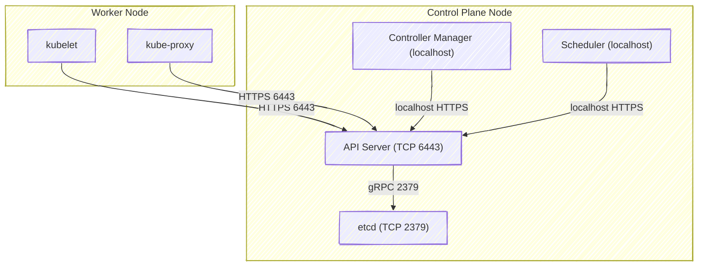
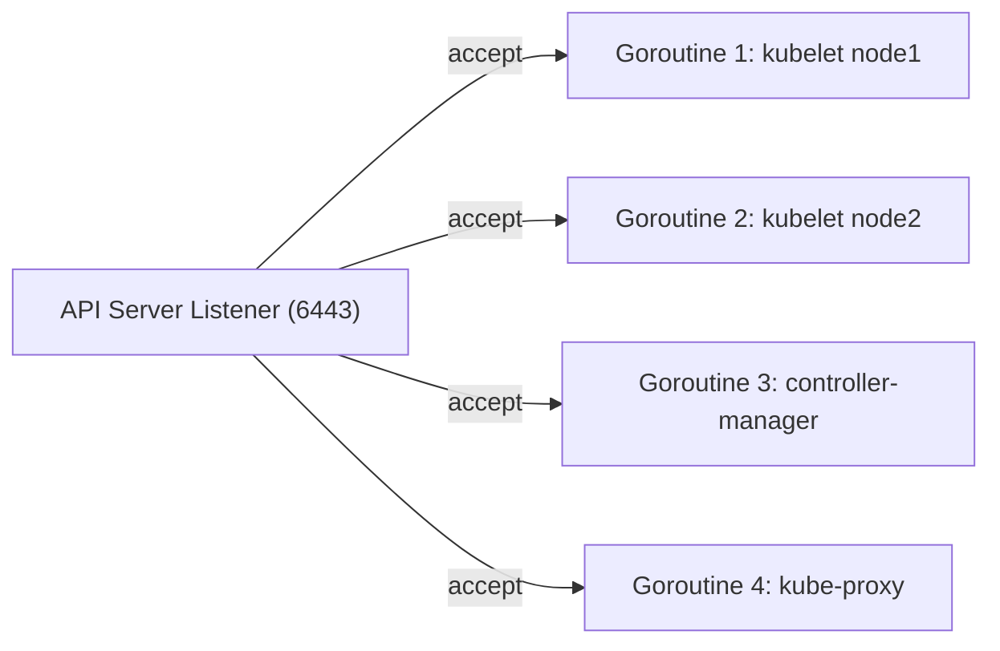

# 🌐 **Network-Level Flow of Watch Connections (mTLS + Ports + API Server Channels)**

_how the traffic moves securely between all these components?_

“Network-level flow of Watch connections (ports, certificates, and mTLS setup between kubelet/controller and API server)”

---

## 🎡 **The Big Picture** — Who Talks to Whom

Every Kubernetes component that needs real-time cluster updates (kubelet, kube-proxy, controller-manager, scheduler, etc.) communicates **only with the API Server**.

They never talk directly to etcd or to each other.

Here’s the control plane topology 👇

<div align="center" style="background-color: #255560ff; border-radius: 10px; border: 2px solid">



</div>

---

> ✅ Everything flows **through the API server**.  
> ✅ All communication is **TLS encrypted**.  
> ✅ All clients are **authenticated and authorized**.

---

## 🔌 **The Core Ports**

| Port                   | Direction                                                   | Purpose                                         |
| ---------------------- | ----------------------------------------------------------- | ----------------------------------------------- |
| **6443**               | Inbound to API Server                                       | Main Kubernetes API (HTTPS + Watch connections) |
| **2379-2380**          | API Server → etcd                                           | etcd storage and watch                          |
| **10250**              | API Server → kubelet                                        | Exec, logs, metrics                             |
| **10255 (deprecated)** | API Server → kubelet (read-only, disabled by default)       | Old metrics endpoint                            |
| **10257 / 10259**      | API Server → Controller-manager / Scheduler HTTPS endpoints | Internal control plane                          |
| **10256**              | API Server → kube-proxy healthz                             | Node-local health probe                         |

So when kubelet watches Pods, the connection is:

```plaintext
kubelet (worker) → API Server (6443, HTTPS)
```

When API server watches etcd, the connection is:

```plaintext
API Server → etcd (2379, gRPC + TLS)
```

---

## 🔐 **Mutual Authentication (mTLS)**

Every component talking to the API server must **prove its identity** via a certificate.

Let’s break this down by component 👇

| Component              | Authentication Method     | Cert / Token Source                                   | File Path                                 |
| ---------------------- | ------------------------- | ----------------------------------------------------- | ----------------------------------------- |
| **kubelet**            | x509 client cert          | Generated by kubeadm or issued via CSR                | `/var/lib/kubelet/pki/kubelet-client.crt` |
| **controller-manager** | x509 client cert          | kubeconfig file                                       | `/etc/kubernetes/controller-manager.conf` |
| **scheduler**          | x509 client cert          | kubeconfig file                                       | `/etc/kubernetes/scheduler.conf`          |
| **kubectl (user)**     | x509 cert or Bearer token | `$HOME/.kube/config`                                  | user-dependent                            |
| **kube-proxy**         | Service account token     | `/var/run/secrets/kubernetes.io/serviceaccount/token` |                                           |

✅ API server also presents its own **server certificate**, signed by the cluster CA (`/etc/kubernetes/pki/apiserver.crt`).

---

## 🤝 **The TLS Handshake**

Let’s visualize what happens when `kubelet` starts watching Pods.

```mermaid
sequenceDiagram
    participant Kubelet
    participant API as API Server
    participant CA as Cluster CA

    Kubelet->>API: TLS ClientHello (client cert: kubelet-client.crt)
    API-->>CA: Validate cert signature
    CA-->>API: Cert valid ✅
    API->>Kubelet: TLS ServerHello (apiserver.crt)
    Kubelet-->>CA: Validate server cert
    Kubelet->>API: HTTP GET /api/v1/pods?watch=true
    API-->>Kubelet: 200 OK (chunked JSON stream)
```

<div align="center" style="background-color: #255560ff; border-radius: 10px; border: 2px solid">



</div>

Once authenticated, the **HTTPS connection stays open indefinitely** for the Watch stream.

---

## 🧑🏻‍💻 **Example Watch Request on the Wire**

Let’s capture it using `tcpdump`:

```bash
sudo tcpdump -i eth0 port 6443 -A | grep "GET /api/v1/pods"
```

You’ll see something like:

```ini
GET /api/v1/pods?fieldSelector=spec.nodeName=node1&watch=true HTTP/1.1
Host: kubernetes.default.svc
Authorization: Bearer eyJhbGciOi...
Accept: application/json, */*
```

The response is a **chunked transfer stream**, looking like this:

```ini
HTTP/1.1 200 OK
Transfer-Encoding: chunked
Content-Type: application/json
```

Then followed by multiple JSON fragments:

```ini
{"type":"ADDED","object":{...}}
{"type":"MODIFIED","object":{...}}
```

---

## 😱 **How API Server Handles Thousands of Watch Connections**

Each Watch connection is:

- A persistent **HTTP/1.1 keep-alive** or **HTTP/2** stream
- Multiplexed via **goroutines** inside the API server
- Associated with an **auth context** (user/role/namespace)

Internal data flow:

<div align="center" style="background-color: #255560ff; border-radius: 10px; border: 2px solid">



</div>

---

> 👉 Each connection independently receives events via the **Watch Fan-Out** system.

---

## 📃 **Inside the kubeconfig Files**

Each control-plane component authenticates using a kubeconfig file.

Example: `/etc/kubernetes/kubelet.conf`

```yaml
apiVersion: v1
clusters:
  - cluster:
      certificate-authority: /etc/kubernetes/pki/ca.crt
      server: https://10.0.0.1:6443
    name: kubernetes
contexts:
  - context:
      cluster: kubernetes
      user: system:node:worker1
    name: system:node:worker1@kubernetes
users:
  - name: system:node:worker1
    user:
      client-certificate: /var/lib/kubelet/pki/kubelet-client.crt
      client-key: /var/lib/kubelet/pki/kubelet-client.key
current-context: system:node:worker1@kubernetes
```

---

> 👉 When the kubelet runs, it loads this config → initiates HTTPS → verifies the API server’s CA → starts the Watch stream securely.

---

## 🥸 **How the API Server Verifies Client Identity**

Each client certificate’s **Common Name (CN)** or **Organization (O)** field defines its Kubernetes identity.

<div align="center" style="background-color: #141a19ff;color: #a8a5a5ff; border-radius: 10px; border: 2px solid">

| Component          | CN                               | Organization     |
| ------------------ | -------------------------------- | ---------------- |
| kubelet            | `system:node:<node-name>`        | `system:nodes`   |
| controller-manager | `system:kube-controller-manager` | `system:masters` |
| scheduler          | `system:kube-scheduler`          | `system:masters` |
| kubectl user       | user-defined                     | varies           |

</div>

---

> 👉 The API server uses this to map to **RBAC roles**.

---

**📝 Example RBAC rule for kubelets:**

```yaml
apiVersion: rbac.authorization.k8s.io/v1
kind: ClusterRoleBinding
metadata:
  name: system:node
roleRef:
  kind: ClusterRole
  name: system:node
subjects:
  - kind: Group
    name: system:nodes
```

✅ That’s what allows the kubelet to **watch only its own Pods** securely.

---

## 🕑 **Watch Connection Lifecycle** in Practice

<div align="center" style="background-color: #141a19ff;color: #a8a5a5ff; border-radius: 10px; border: 2px solid">

| Phase                        | Description                                |
| ---------------------------- | ------------------------------------------ |
| **1. TLS Handshake**         | Client and server authenticate             |
| **2. HTTP GET /watch**       | Client initiates stream                    |
| **3. Persistent Connection** | API server streams JSON                    |
| **4. Network Idle Timeout**  | If idle too long, keepalive/heartbeat sent |
| **5. Connection Drop**       | Client retries with last `resourceVersion` |

</div>

---

## 🧑🏻‍💻 **Example Network Monitoring Commands**

### Check all Watch connections to API server:

```bash
sudo ss -tanp | grep 6443
```

### Check TLS sessions:

```bash
sudo openssl s_client -connect <apiserver-ip>:6443
```

### Inspect kubelet’s certificate:

```bash
openssl x509 -in /var/lib/kubelet/pki/kubelet-client.crt -text | grep Subject
```

Output:

```ini
Subject: O = system:nodes, CN = system:node:worker1
```

---

## 🎡 **Full Watch Communication Path**

```mermaid
---
config:
  look: handDrawn
---
sequenceDiagram
    participant Kubelet
    participant API as API Server (6443)
    participant ETCD

    Note over Kubelet,API: 🔐 Mutual TLS Handshake
    Kubelet->>API: GET /api/v1/pods?watch=true
    API->>ETCD: gRPC watch /registry/pods
    ETCD-->>API: ADDED nginx
    API-->>Kubelet: JSON {"type":"ADDED","object":{"name":"nginx"}}
    Kubelet->>API: ACK /status (Pod Running)
    API->>ETCD: Update /registry/pods/nginx/status
```

<div align="center" style="background-color: #255560ff; border-radius: 10px; border: 2px solid">



</div>

---

> 👉 Everything — from handshake to event delivery — is **TLS-encrypted**, **authenticated**, and **stateful**.

---

## 🔍 **Real Verification** (Try in Your Cluster)

Run:

```bash
kubectl get --raw /api/v1/pods?watch=true | head
```

You’ll see the actual JSON stream, e.g.:

```json
{"type":"ADDED","object":{"metadata":{"name":"coredns"}}}
{"type":"MODIFIED","object":{"metadata":{"name":"kube-proxy"}}}
```

That’s the raw Watch API in action, through port 6443 over HTTPS.

---

## 🏁 Summary

| Aspect             | Mechanism                                 |
| ------------------ | ----------------------------------------- |
| **Transport**      | HTTPS (TLS 1.2+ or HTTP/2)                |
| **Port**           | 6443                                      |
| **Authentication** | x509 mTLS or Bearer Token                 |
| **Authorization**  | RBAC / ABAC                               |
| **Persistence**    | HTTP chunked encoding / SPDY              |
| **Security**       | Full TLS chain (CA → API Server → Client) |
| **Visibility**     | `ss -tanp`, `tcpdump`, `/metrics`         |

---

## ⚡ Final Takeaways

- All Watch streams are **stateful HTTPS connections**.
- Communication is fully encrypted and identity-verified.
- **No plaintext** or unauthenticated connections ever reach the API server.
- The same architecture applies whether you have 5 nodes or 5,000.
- Each Watch stream rides over port **6443** and fans out internally via the **Watch Cache**.
