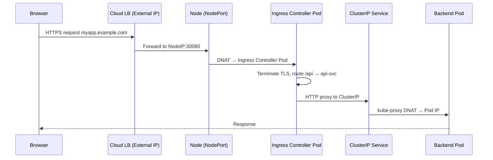

🔥 Perfect — we’ve reached the **final and most powerful piece** of Kubernetes networking — the **Ingress layer** 🌐💥

Everything until now (CNI, kube-proxy, DNS, Service routing) covered **east-west traffic** (Pod ↔ Pod inside the cluster).
Now we’ll enter the **north-south traffic world** — where **external users** reach your apps through **Ingress controllers** like NGINX, HAProxy, or Traefik.

---

# 🌉 Deep Dive: Kubernetes Ingress & Ingress Controllers

### *How external HTTP/HTTPS traffic reaches your cluster services*

---

## 🧠 1️⃣ What Is Ingress?

A **Service** exposes your app at an IP and port — but that’s not user-friendly.
You can’t tell clients:

> “Go to 35.201.12.5:30080” 😅

Ingress lets you expose your **HTTP(S)** apps using real hostnames and paths.

👉 **Ingress = Kubernetes-level reverse proxy + router + TLS terminator**

It sits at the cluster edge, routing external traffic based on rules like hostnames and paths.

---

### 🧩 Example Ingress YAML

```yaml
apiVersion: networking.k8s.io/v1
kind: Ingress
metadata:
  name: web-ingress
  annotations:
    nginx.ingress.kubernetes.io/rewrite-target: /
spec:
  ingressClassName: nginx
  rules:
  - host: myapp.example.com
    http:
      paths:
      - path: /api
        pathType: Prefix
        backend:
          service:
            name: api-svc
            port:
              number: 80
      - path: /
        pathType: Prefix
        backend:
          service:
            name: web-svc
            port:
              number: 80
```

💡 This configuration routes:

* `myapp.example.com/api` → `api-svc`
* `myapp.example.com/` → `web-svc`

---

## ⚙️ 2️⃣ The Ingress Ecosystem Components

| Component                | Purpose                                       |
| ------------------------ | --------------------------------------------- |
| **Ingress Resource**     | Defines routing rules (YAML)                  |
| **Ingress Controller**   | Implements those rules (e.g., NGINX, Traefik) |
| **Service**              | The target backend (like ClusterIP)           |
| **LoadBalancer Service** | Exposes the Ingress Controller externally     |

---

## 🧩 3️⃣ Visual Architecture

```mermaid
graph TD
  Client[🌍 User (Browser)] --> LB[☁️ Cloud LoadBalancer (External IP)]
  LB --> NodePort[NodePort Service (Ingress Controller)]
  NodePort --> IngressPod[🧩 NGINX Ingress Pod]
  IngressPod --> SVC1[api-svc]
  IngressPod --> SVC2[web-svc]
  SVC1 --> PodA[Pod A (10.244.1.10)]
  SVC2 --> PodB[Pod B (10.244.2.20)]
```

✅ Client hits external IP
✅ Cloud LB → NodePort → Ingress Controller Pod
✅ Ingress routes based on hostname/path
✅ Traffic reaches backend Pods

---

## 🧠 4️⃣ Step-by-Step Request Flow

1️⃣ **User** opens `https://myapp.example.com/api`
2️⃣ DNS resolves `myapp.example.com` → Cloud LoadBalancer IP
3️⃣ Request hits **LoadBalancer Service** (type: LoadBalancer)
4️⃣ Cloud LB forwards to **NodePort** on one of the cluster nodes
5️⃣ The NodePort routes to **Ingress Controller Pod** (e.g., NGINX)
6️⃣ **Ingress Controller** inspects headers:

* `Host: myapp.example.com`
* Path `/api`
  7️⃣ Routes to correct Service:
* `/api` → `api-svc` (ClusterIP)
* `/` → `web-svc` (ClusterIP)
  8️⃣ **kube-proxy** load-balances to backend Pod IP
  9️⃣ Response follows the reverse path

---

## 🧱 5️⃣ What Is the Ingress Controller, Exactly?

An Ingress Controller is a **Pod (or set of Pods)** running in the cluster, usually in `kube-system` or `ingress-nginx` namespace.

It:

* Watches the API Server for Ingress resources
* Configures itself dynamically
* Acts as a reverse proxy + load balancer

Popular ones:

| Controller                     | Engine                 | Notes                   |
| ------------------------------ | ---------------------- | ----------------------- |
| **NGINX**                      | Nginx reverse proxy    | Most common, flexible   |
| **Traefik**                    | Go-based reverse proxy | Great for microservices |
| **HAProxy**                    | TCP/HTTP router        | High performance        |
| **Contour**                    | Envoy-based            | Modern architecture     |
| **AWS ALB Ingress Controller** | AWS native             | Uses ALB directly       |
| **Istio Ingress Gateway**      | Envoy proxy            | Part of service mesh    |

---

## ⚙️ 6️⃣ How It Watches the API Server

Just like `kube-proxy` and `CoreDNS`, the Ingress controller opens **Watch connections** to the API Server:

| Watched Resource | Why              |
| ---------------- | ---------------- |
| `Ingress`        | Routing rules    |
| `Service`        | Target endpoints |
| `EndpointSlice`  | Pod IPs          |
| `Secret`         | TLS certificates |

Whenever any change occurs — a new Ingress rule, new Pod, new cert — the controller regenerates its routing configuration on the fly.

---

### Example: NGINX Controller Live Reload

When you apply a new Ingress:

```
kubectl apply -f web-ingress.yaml
```

NGINX controller logs:

```
[notice] Reloading NGINX due to Ingress change
```

It rebuilds the nginx.conf dynamically — no downtime, no manual reload 🔁

---

## 🧠 7️⃣ How NGINX Ingress Controller Is Exposed

Under the hood, it uses a **Service** of type LoadBalancer:

```yaml
apiVersion: v1
kind: Service
metadata:
  name: ingress-nginx-controller
  namespace: ingress-nginx
spec:
  type: LoadBalancer
  ports:
  - name: http
    port: 80
    targetPort: 80
  - name: https
    port: 443
    targetPort: 443
  selector:
    app.kubernetes.io/name: ingress-nginx
```

This creates:

```
EXTERNAL-IP: 35.201.12.5
```

Users access the cluster through this IP 🌍

---

## 🔐 8️⃣ TLS Termination with Ingress

Ingress supports HTTPS via Kubernetes Secrets.

```yaml
spec:
  tls:
  - hosts:
    - myapp.example.com
    secretName: myapp-tls
```

And the Secret:

```bash
kubectl create secret tls myapp-tls \
  --cert=myapp.crt --key=myapp.key
```

🔹 The Ingress Controller reads the Secret
🔹 Configures NGINX (or Envoy) to terminate TLS
🔹 Forwards decrypted traffic to backend Pods over HTTP

---

## 🧩 9️⃣ Request Routing Example (NGINX Controller)

### Request:

```
GET /api/v1/users HTTP/1.1
Host: myapp.example.com
```

### nginx.conf (generated inside Ingress Pod):

```nginx
server {
    server_name myapp.example.com;

    location /api {
        proxy_pass http://api-svc.default.svc.cluster.local;
    }

    location / {
        proxy_pass http://web-svc.default.svc.cluster.local;
    }
}
```

---

### 🧠 Path-Based Routing

* `/api` → API backend
* `/` → Web frontend
* `/admin` → Admin backend

Path rules are matched in order.
Each `location` block maps to a Kubernetes **Service**.

---

### 🧠 Host-Based Routing

You can also use **multiple hostnames** in one Ingress:

```yaml
spec:
  rules:
  - host: shop.example.com
    http:
      paths:
      - path: /
        backend:
          service:
            name: shop-svc
            port:
              number: 80
  - host: blog.example.com
    http:
      paths:
      - path: /
        backend:
          service:
            name: blog-svc
            port:
              number: 80
```

✅ One NGINX Pod handles both sites!

---

## ⚙️ 1️⃣0️⃣ End-to-End Data Flow



✅ Full round trip: internet → LB → Ingress → Service → Pod → back

---

## 🔍 1️⃣1️⃣ Inspect Ingress Internals

### Check Ingress Controller Pods

```bash
kubectl get pods -n ingress-nginx
```

### View live config

```bash
kubectl exec -n ingress-nginx <pod> -- cat /etc/nginx/nginx.conf
```

### Check Ingress resources

```bash
kubectl get ingress
kubectl describe ingress web-ingress
```

### Debug routing

```bash
kubectl logs -n ingress-nginx <pod> | grep "GET /"
```

---

## ⚡ 1️⃣2️⃣ Comparison: Service vs Ingress

| Feature           | Service (NodePort/LB)  | Ingress                 |
| ----------------- | ---------------------- | ----------------------- |
| Protocols         | Any (TCP/UDP)          | HTTP/HTTPS              |
| Host/Path Routing | ❌ No                   | ✅ Yes                   |
| TLS Termination   | ❌ No                   | ✅ Yes                   |
| Load Balancing    | kube-proxy (L4)        | Controller (L7)         |
| External Exposure | Limited                | Cloud LB + DNS friendly |
| Use Case          | Internal microservices | Public web APIs/sites   |

---

## 🧠 1️⃣3️⃣ Advanced Topics

| Feature                    | Description                                                             |
| -------------------------- | ----------------------------------------------------------------------- |
| **IngressClass**           | Associates Ingress with a specific controller                           |
| **Canary Ingress**         | Gradual rollout based on weights or headers                             |
| **Rate limiting & auth**   | Supported via annotations (e.g., nginx.ingress.kubernetes.io/limit-req) |
| **Rewrite/Redirect**       | Flexible URL rewrites                                                   |
| **gRPC/WebSocket support** | Native in most controllers                                              |
| **Multi-Tenant routing**   | Hostname isolation for multiple apps                                    |

---

## 🧱 1️⃣4️⃣ Example End-to-End Deployment

```bash
# Deploy app
kubectl create deployment web --image=nginx
kubectl expose deployment web --port=80 --name=web-svc

# Deploy Ingress
kubectl apply -f web-ingress.yaml

# Get external IP
kubectl get svc -n ingress-nginx
```

Now visit:
🌍 `http://<EXTERNAL-IP>/`

---

## 🧠 1️⃣5️⃣ Key Takeaways

✅ Ingress = **HTTP(S) gateway** for Kubernetes apps
✅ Ingress Controller = **reverse proxy** that watches Ingress objects
✅ Supports **hostname and path-based routing**
✅ Can handle **TLS termination**, **auth**, and **rewrites**
✅ Routes external → NodePort → Ingress Pod → Service → Pod
✅ Fully **event-driven**, just like kube-proxy and CoreDNS

---

Would you like me to continue to the **next ultimate deep-dive lab** —
👉 *“Service Mesh networking with Istio — how sidecars, Envoy proxies, and mTLS routing integrate beyond Ingress for traffic observability and zero-trust networking”?*
