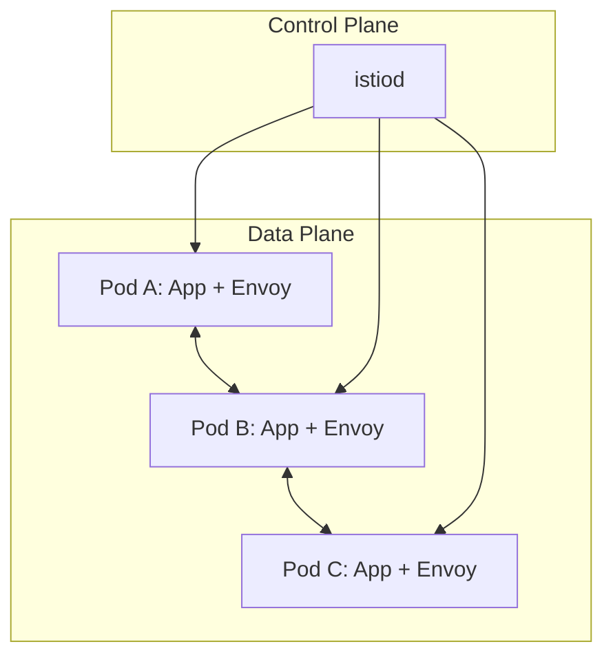
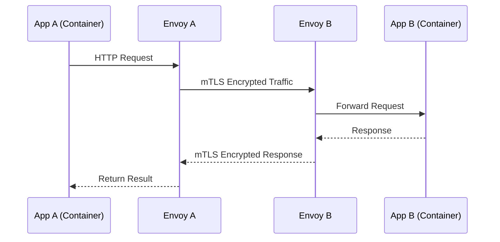
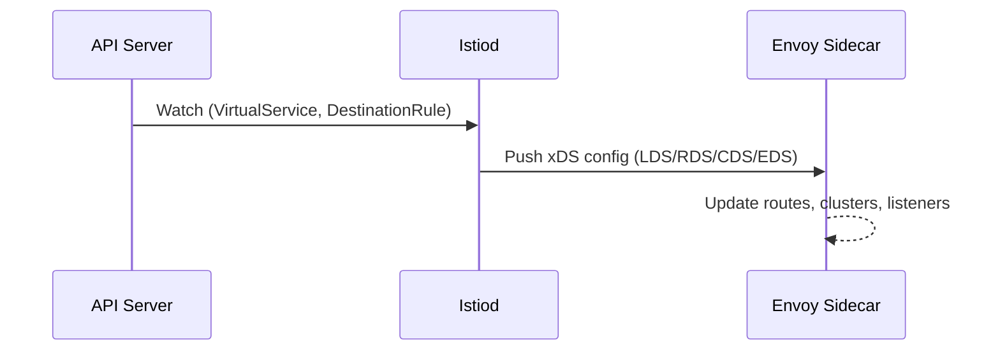
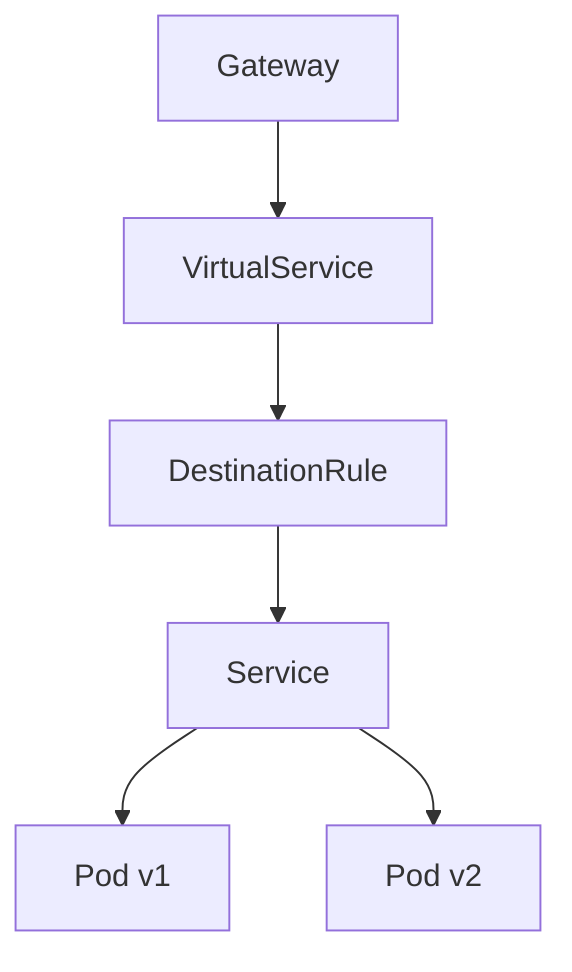
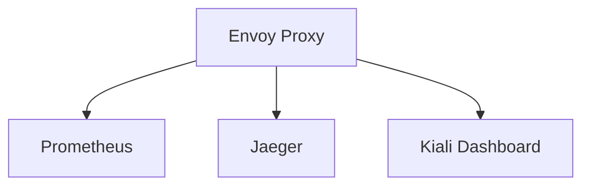
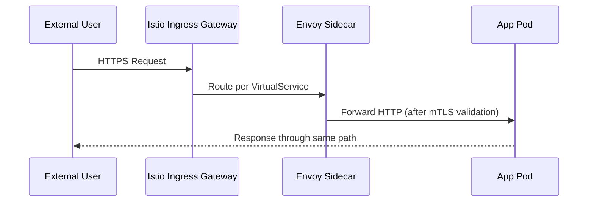

🔥 Epic — now we’re officially stepping into **Level 100 networking mastery**:
Welcome to the **Service Mesh Realm** 🕸️

This is where Kubernetes networking goes **beyond basic L3/L4/L7 routing**, and enters the world of **zero-trust, observability, retries, circuit breaking, and mTLS — all without touching your app code**.

We’ll explore **Istio**, the most popular service mesh, and understand:

* How sidecar proxies (Envoy) work
* How control and data planes interact
* How traffic routing, security, and telemetry happen transparently

---

# 🧩 Deep Dive: Kubernetes Service Mesh with Istio

### *The Secret Layer Behind Modern Cloud-Native Networking*

---

## 🧠 1️⃣ What Is a Service Mesh?

Think of a service mesh as a **dedicated network layer** that manages all communication between microservices — securely, intelligently, and observably.

Instead of embedding retry, auth, and logging logic into your code, Istio handles it **outside** your application.

### 💡 Analogy:

> In Kubernetes, a **Service** is like a postal address.
> In Istio, a **Service Mesh** is the **postal service infrastructure** that delivers your mail securely, traces it, retries failed deliveries, and logs everything — automatically.

---

## ⚙️ 2️⃣ Core Components of Istio

| Plane             | Component                            | Role                                              |
| ----------------- | ------------------------------------ | ------------------------------------------------- |
| **Data Plane**    | **Envoy Proxy (sidecar)**            | Handles actual traffic for each Pod               |
| **Control Plane** | **istiod**                           | Manages configuration, certificates, and policies |
| **Telemetry**     | **Prometheus, Grafana, Kiali**       | Observability, dashboards                         |
| **Security**      | **Citadel (integrated into istiod)** | mTLS certificates and identity management         |

---

### 🧱 Visual Architecture



✅ Each Pod has a **sidecar Envoy proxy** injected
✅ All communication between Pods passes **through Envoy**
✅ `istiod` configures Envoy proxies via xDS APIs (LDS, RDS, CDS, EDS)

---

## 🧠 3️⃣ How Istio Intercepts Traffic

When you deploy an app in a mesh-enabled namespace, **Istio injects an Envoy container** automatically:

```bash
kubectl label namespace default istio-injection=enabled
kubectl apply -f myapp.yaml
```

This modifies your Pod:

```yaml
spec:
  containers:
  - name: app
    image: myapp:v1
  - name: istio-proxy
    image: envoyproxy/envoy:v1.29
```

---

### 🧩 How Traffic Flows



✅ Every request is automatically intercepted via `iptables` redirection rules
✅ Communication is **mutually authenticated (mTLS)**
✅ Traffic policies (retries, timeout, failover) apply transparently

---

## 🧠 4️⃣ Mutual TLS (mTLS) — Zero-Trust by Default

When mTLS is enabled:

* Each service has its own X.509 certificate issued by **istiod**
* Each sidecar (Envoy) verifies the peer’s certificate
* Traffic is encrypted end-to-end **inside the cluster**

### 🔐 Certificate Structure:

```
Subject: spiffe://cluster.local/ns/default/sa/web-sa
Issuer:  istio-ca
```

### 🔄 Certificate Rotation:

* Automatic renewal every 24h (configurable)
* No downtime
* Managed fully by Istio control plane

---

## 🧱 5️⃣ Control Plane (istiod) Responsibilities

| Function      | Description                                                      |
| ------------- | ---------------------------------------------------------------- |
| **Pilot**     | Sends config updates (routing, listeners, clusters) via xDS APIs |
| **Citadel**   | Issues and rotates certificates                                  |
| **Galley**    | (deprecated) previously validated configuration                  |
| **Telemetry** | Sends metrics/logs to Prometheus & Grafana                       |

All of this happens **dynamically** through Kubernetes Watches — just like kube-proxy and ingress controllers.

---

### ⚙️ Configuration Flow



✅ Real-time, event-driven config propagation
✅ No restarts or reloads required

---

## 🧩 6️⃣ Traffic Management Objects

| Object              | Purpose                                 | Example                               |
| ------------------- | --------------------------------------- | ------------------------------------- |
| **VirtualService**  | Routing rules (paths, headers, weights) | `/v1` → v1 Pod, `/v2` → v2 Pod        |
| **DestinationRule** | Policies for a target service           | mTLS, load balancing, connection pool |
| **Gateway**         | Entry/exit point (Ingress/Egress)       | External exposure for Ingress         |
| **ServiceEntry**    | Register external APIs                  | Connect to `api.github.com`           |
| **Sidecar**         | Restrict outbound access                | Limit to internal namespaces          |

---

### 🧱 Visual Example



✅ `Gateway` receives external traffic
✅ `VirtualService` routes based on headers/paths
✅ `DestinationRule` defines policies
✅ `Service` maps to Pods

---

## 🧠 7️⃣ Example: Canary Deployment

```yaml
apiVersion: networking.istio.io/v1beta1
kind: VirtualService
metadata:
  name: reviews
spec:
  hosts:
  - reviews
  http:
  - route:
    - destination:
        host: reviews
        subset: v1
      weight: 80
    - destination:
        host: reviews
        subset: v2
      weight: 20
```

➡ 80% of traffic → `v1` Pods
➡ 20% → `v2` Pods

Perfect for safe rollouts 🚀

---

## 🧠 8️⃣ Retry, Timeout, Circuit Breaking

```yaml
apiVersion: networking.istio.io/v1beta1
kind: DestinationRule
metadata:
  name: reviews
spec:
  host: reviews
  trafficPolicy:
    connectionPool:
      tcp:
        maxConnections: 100
      http:
        http1MaxPendingRequests: 10
        maxRequestsPerConnection: 10
    outlierDetection:
      consecutive5xxErrors: 5
      interval: 5s
      baseEjectionTime: 30s
      maxEjectionPercent: 50
```

✅ Handles automatic retries
✅ Circuit breaking on errors
✅ No code changes required

---

## 🔐 9️⃣ Security & Authorization

Istio applies **zero-trust policies** using:

* **PeerAuthentication** (mTLS enforcement)
* **AuthorizationPolicy** (RBAC for services)

Example:

```yaml
apiVersion: security.istio.io/v1beta1
kind: AuthorizationPolicy
metadata:
  name: web-policy
spec:
  selector:
    matchLabels:
      app: web
  action: ALLOW
  rules:
  - from:
    - source:
        principals: ["cluster.local/ns/default/sa/frontend"]
```

✅ Only traffic from `frontend` ServiceAccount allowed to reach `web`

---

## 📈 1️⃣0️⃣ Observability Stack

Istio automatically exports:

* **Metrics** → Prometheus
* **Traces** → Jaeger
* **Service Graphs** → Kiali
* **Logs** → Fluentd/Elasticsearch



✅ Every request is traced with latency and error metrics
✅ No instrumentation needed in app code

---

## ⚡ 1️⃣1️⃣ Egress Gateway Example

Control outbound Internet access:

```yaml
apiVersion: networking.istio.io/v1beta1
kind: ServiceEntry
metadata:
  name: external-github
spec:
  hosts:
  - api.github.com
  ports:
  - number: 443
    name: https
    protocol: HTTPS
  resolution: DNS
  location: MESH_EXTERNAL
```

✅ Only registered external hosts allowed
✅ Blocks all unknown outbound traffic

---

## 🧠 1️⃣2️⃣ Data Flow: External Request to Pod (with Istio Gateway)



✅ End-to-end encrypted
✅ Policy-enforced
✅ Traced and monitored

---

## 🧱 1️⃣3️⃣ Comparing Ingress vs Istio Gateway

| Feature           | Ingress         | Istio Gateway           |
| ----------------- | --------------- | ----------------------- |
| Protocol          | HTTP/HTTPS      | Any (L4-L7)             |
| Controller        | NGINX / Traefik | Envoy                   |
| mTLS              | ❌ No            | ✅ Yes                   |
| Routing           | Host + Path     | Header + Weight + Regex |
| Observability     | Limited         | Full tracing, metrics   |
| Canary / A/B      | Manual          | Built-in                |
| External exposure | Yes             | Yes                     |

---

## 🧠 1️⃣4️⃣ Key Takeaways

✅ **Istio = Zero-Trust Networking + Smart Routing + Observability**
✅ Uses **sidecar proxies (Envoy)** for traffic interception
✅ Control Plane (`istiod`) pushes dynamic config via **xDS APIs**
✅ Provides **mTLS**, **RBAC**, **retries**, **failovers**, and **telemetry**
✅ Operates entirely at the **infrastructure layer**, not app code

---

Would you like me to continue with the **next advanced lab** —
👉 *“How Istio mTLS Handshake Works Internally — step-by-step mutual authentication between Envoy sidecars with cert chains, SPIFFE IDs, and istiod CA flow (with sequence diagram)”* — to see **exactly how secure communication happens inside the mesh**?
