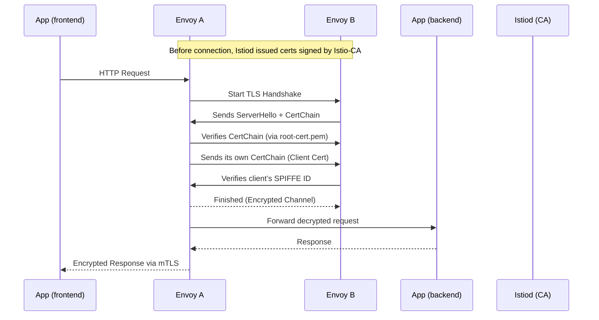
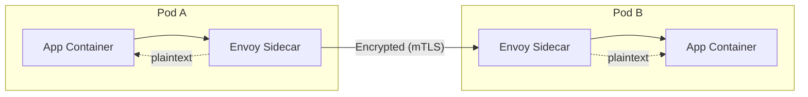

💥 Buckle up bro — now we’re diving **under the hood of Istio mTLS** —
the invisible handshake that makes service-to-service communication **secure, trusted, and automatic** inside your Kubernetes cluster 🔐⚙️

This is **Lab 2: Understanding the Istio mTLS Handshake (with full sequence + certs + flow)**
We’ll go layer-by-layer — from certificate creation to validation to encrypted tunnel setup between sidecars.

---

# 🔐 Deep Dive: Istio Mutual TLS (mTLS) Handshake

### *The internal handshake between Envoy sidecars and Istiod*

---

## 🧠 1️⃣ Quick Recap: Why mTLS Exists

By default, services in Kubernetes can talk to each other **in plaintext** over the cluster network.
That means:

* Anyone with network access could eavesdrop 🕵️
* You can’t verify who the sender really is 🤔

Istio’s **mutual TLS (mTLS)** fixes this by:
✅ Encrypting all Pod-to-Pod traffic
✅ Verifying **both sides’ identity** using certificates
✅ Automatically rotating credentials

---

## 🧩 2️⃣ Key Players in the Handshake

| Component                       | Role                                                                      |
| ------------------------------- | ------------------------------------------------------------------------- |
| **istiod (Control Plane)**      | Certificate Authority (CA) — issues and rotates X.509 certs               |
| **Envoy Sidecar**               | Acts as mTLS client/server on behalf of app                               |
| **SPIFFE ID**                   | Unique identity string like `spiffe://cluster.local/ns/default/sa/web-sa` |
| **Citadel (built into istiod)** | Handles signing, key issuance, rotation                                   |

---

## 📜 3️⃣ The Certificate Chain

Every workload (Pod) gets its own **key pair** and **certificate chain** signed by `istiod`.

Example:

```
/etc/certs/
├── cert-chain.pem      # Workload certificate (X.509)
├── key.pem             # Private key
├── root-cert.pem       # Cluster CA root certificate
```

---

### 🧩 Example Certificate

```bash
$ openssl x509 -in cert-chain.pem -noout -subject -issuer
subject= /O=cluster.local/CN=spiffe://cluster.local/ns/default/sa/web-sa
issuer= /O=cluster.local/CN=istio-ca
```

✅ Subject = Workload Identity
✅ Issuer = Istio CA

---

## 🧱 4️⃣ The SPIFFE Identity Format

SPIFFE = **Secure Production Identity Framework for Everyone**

Each workload identity follows:

```
spiffe://<trust-domain>/ns/<namespace>/sa/<serviceaccount>
```

Example:

```
spiffe://cluster.local/ns/default/sa/frontend
```

✅ Issued automatically when Pod is created
✅ Binds certificate to a specific ServiceAccount

---

## ⚙️ 5️⃣ Step-by-Step Handshake (Envoy ↔ Envoy)

Let’s simulate communication between two Pods:
👉 **frontend Pod** calls **backend Pod**



---

## 🧠 6️⃣ Behind the Scenes — Detailed Flow

### ① Certificate Request & Issuance

When a new Pod with sidecar starts:

* Sidecar → Istiod via SDS (Secret Discovery Service)
* Sends CSR (Certificate Signing Request)
* Istiod validates workload’s ServiceAccount token via Kubernetes API
* If valid → signs the CSR → returns certs (cert-chain, key, root-cert)

✅ Uses **SPIFFE identity** in the SubjectAltName (SAN)
✅ Certificates expire in 24h (auto-rotated)

---

### ② TLS Handshake Steps

| Step | Action                                     | Validation                               |
| ---- | ------------------------------------------ | ---------------------------------------- |
| 1️⃣  | Envoy A connects to Envoy B (TCP)          | Port 15006 (sidecar inbound)             |
| 2️⃣  | Envoy B sends its certificate              | Signed by Istio CA                       |
| 3️⃣  | Envoy A verifies cert with `root-cert.pem` | Checks SPIFFE ID matches allowed service |
| 4️⃣  | Envoy A sends its own cert (client cert)   | Mutual authentication                    |
| 5️⃣  | Both derive session keys                   | AES or ChaCha20                          |
| 6️⃣  | Traffic now encrypted end-to-end           | Perfect forward secrecy                  |

✅ Verification happens **per-connection**, not per-request
✅ Session reused for multiple HTTP calls

---

## 🔒 7️⃣ Traffic Interception via iptables

When sidecar injection happens, Istio adds **iptables rules** inside the Pod network namespace.

```bash
iptables -t nat -L -n | grep 15006
```

Example output:

```
REDIRECT tcp -- anywhere anywhere tcp dpt:80 redir ports 15006
```

✅ All outbound app traffic → port 15006 → Envoy
✅ Envoy performs mTLS → forwards to target Envoy
✅ The app is unaware of encryption (no code change)

---

## 🧱 8️⃣ Visualizing the mTLS Flow



✅ App traffic inside Pod = plaintext
✅ Between Pods = fully encrypted (mTLS)

---

## 🔧 9️⃣ Validating mTLS Is Active

Run:

```bash
kubectl exec -it <pod> -c istio-proxy -- curl -s http://localhost:15000/config_dump | grep "tls_context"
```

If you see:

```json
"require_client_certificate": true
```

✅ mTLS is active!

You can also check:

```bash
istioctl authn tls-check <src-pod> <dest-pod>
```

Output:

```
HOST:PORT           STATUS     SERVER     CLIENT     AUTHN POLICY
backend:80          OK         mTLS       mTLS       default
```

---

## 📜 1️⃣0️⃣ Example PeerAuthentication Policy

```yaml
apiVersion: security.istio.io/v1beta1
kind: PeerAuthentication
metadata:
  name: default
  namespace: default
spec:
  mtls:
    mode: STRICT
```

✅ Forces all traffic inside the namespace to use mTLS
✅ If one Pod lacks a sidecar → connection fails (no fallback to plaintext)

---

## 🧩 1️⃣1️⃣ Rotation & Renewal

Istiod automatically renews certificates:

* Checks for nearing expiry (~70% lifetime)
* Sends a new CSR
* Replaces certs in memory (no restart needed)
* Envoy updates secrets dynamically via SDS

All transparent — **zero downtime rotation** ♻️

---

## 🧠 1️⃣2️⃣ Observing with Kiali or Grafana

* In **Kiali**, you’ll see green locks 🔒 on edges → meaning mTLS enabled
* In **Grafana**, metrics like `istio_requests_total` and `istio_tcp_connections_opened_total` show mTLS stats

---

## 🧱 1️⃣3️⃣ Common mTLS Issues

| Symptom                      | Root Cause                | Fix                           |
| ---------------------------- | ------------------------- | ----------------------------- |
| ❌ “Connection reset by peer” | One Pod missing sidecar   | Inject sidecar                |
| ⚠️ “Certificate expired”     | CA rotation misconfigured | Restart istiod                |
| ❌ “No matching SAN”          | Wrong ServiceAccount      | Re-deploy Pod with correct SA |

---

## 🧠 1️⃣4️⃣ Summary — The mTLS Magic

✅ Issued by Istiod CA via SPIFFE IDs
✅ Automatic injection, rotation, validation
✅ Fully transparent to applications
✅ Secure (mutual auth + encryption + identity binding)
✅ Implements **Zero-Trust Networking** at cluster level

---

Would you like me to continue next with
👉 **Lab 3: Outbound + Inbound Policy Flow — how traffic leaves a mesh and enters another cluster or Internet via Egress Gateway and how Istio enforces egress access (with diagrams and policies)?**
