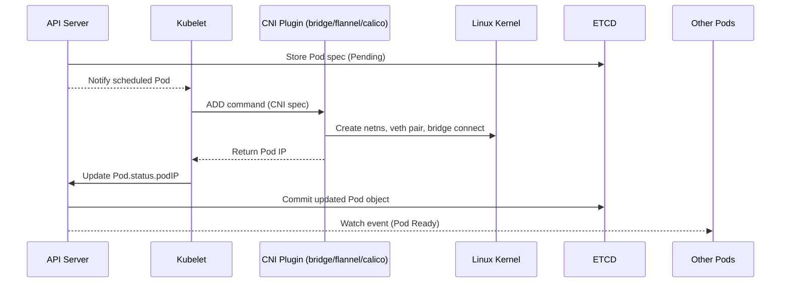
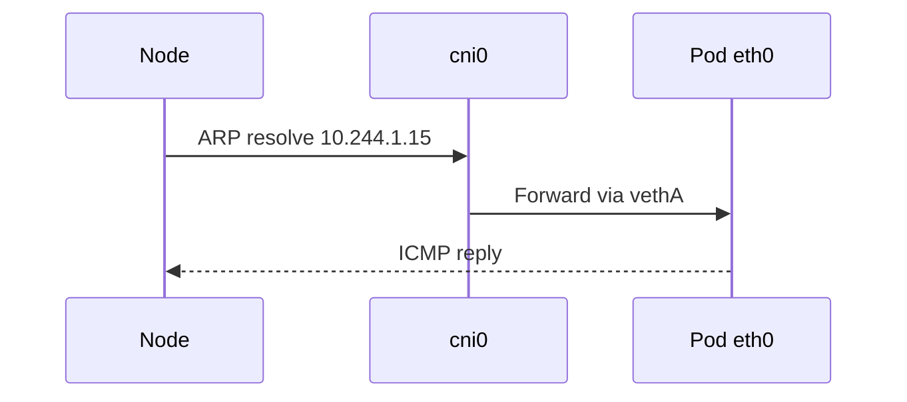
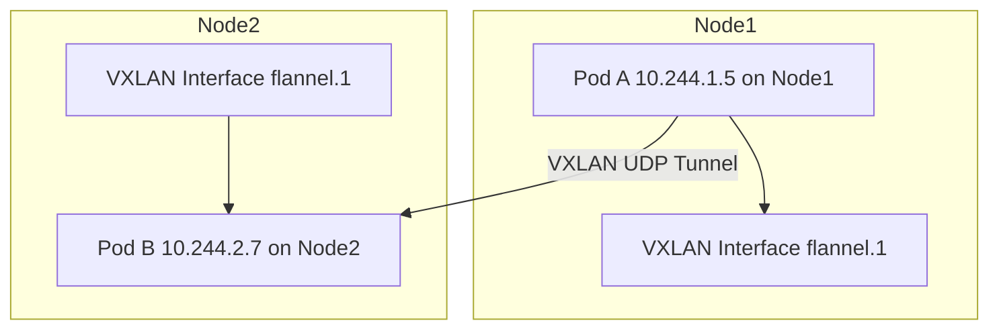
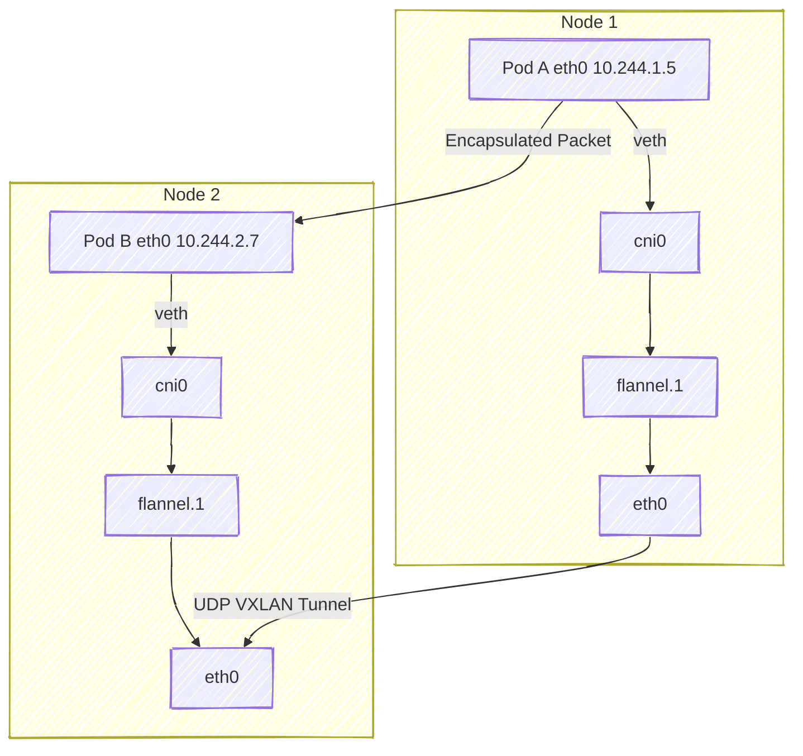

# 🧩 Deep Dive: How kubelet + CNI Plugins Create Pod Networking

_Behind the Scenes of Pod-to-Pod Connectivity_

👉 _“How kubelet, CNI plugins (like bridge, flannel, calico), and Linux network namespaces integrate together to attach Pods to the cluster network — including how API Server events trigger CNI calls under the hood”?_

---

## 🧠 1️⃣ The Big Picture — Who Does What

When a Pod is scheduled to a Node:

| Component                                      | Role                                               |
| ---------------------------------------------- | -------------------------------------------------- |
| **kubelet**                                    | Manages Pod lifecycle and triggers CNI plugins     |
| **CNI Plugin**                                 | Creates Pod’s network namespace, veth pair, and IP |
| **CNI Network Plugin (e.g., flannel, calico)** | Connects Node’s bridge to cluster overlay          |
| **API Server**                                 | Keeps track of Pod’s IP and status                 |
| **etcd**                                       | Stores the authoritative cluster state             |

Everything is orchestrated via **kubelet → CNI plugin** calls.

---

## ⚙️ 2️⃣ The Lifecycle of Pod Networking

Here’s the full sequence of what happens when a Pod is created 👇



✅ Every Pod network is born this way — in real-time, per-node.

---

## 🧩 3️⃣ Step-by-Step Breakdown (Example Pod Creation)

### 🪄 Step 1: Scheduler assigns the Pod

```yaml
apiVersion: v1
kind: Pod
metadata:
  name: nginx
spec:
  containers:
    - name: web
      image: nginx
```

Once created, it’s **Pending** until the **scheduler** picks a Node:

```json
"spec": { "nodeName": "worker-node-1" }
```

---

### 🪄 Step 2: kubelet receives Pod spec

On `worker-node-1`, kubelet’s **watch loop** gets:

```json
{ "type": "ADDED", "object": { "kind": "Pod", "metadata": { "name": "nginx" } } }
```

Kubelet now must create:

- A container runtime sandbox (Docker, containerd, CRI-O)
- A network namespace (netns)
- Network interfaces (via CNI plugin)

---

### 🪄 Step 3: kubelet triggers CNI `ADD`

Kubelet executes a **CNI binary** (e.g., `/opt/cni/bin/flannel` or `bridge`)
with a JSON payload via stdin:

```json
{
  "cniVersion": "0.4.0",
  "name": "k8s-pod-network",
  "type": "bridge",
  "containerId": "abcd1234",
  "netns": "/proc/1234/ns/net",
  "ifName": "eth0",
  "args": "K8S_POD_NAMESPACE=default;K8S_POD_NAME=nginx",
  "prevResult": {}
}
```

This is the **CNI specification** — every plugin must follow it.

---

## ⚙️ 4️⃣ CNI Plugin Creates the Pod Network

The plugin performs these actions inside the node’s Linux kernel 👇

| Step | Operation                                      | Linux Object                  |
| ---- | ---------------------------------------------- | ----------------------------- |
| 1    | Create **network namespace** for the container | `/proc/[pid]/ns/net`          |
| 2    | Create **veth pair**                           | `vethA` (host) ↔ `eth0` (pod) |
| 3    | Attach host-side `vethA` to Linux bridge       | `cni0`                        |
| 4    | Assign IP to Pod                               | `10.244.1.15`                 |
| 5    | Configure default route via bridge             |                               |
| 6    | Return IP info to kubelet                      |                               |

---

### 🧱 Visual — Pod Network Creation

```mermaid
graph TD
  subgraph "Worker Node"
    subgraph "Pod netns"
      E[eth0 (10.244.1.15)]
    end
    H[vethA] -- bridge --> B[cni0 (Bridge)]
    B -- route --> N[eth0 (Node interface)]
  end
  CNI[CNI Plugin] --> E
  Kubelet --> CNI
```

✅ Now the Pod has its own isolated network namespace, connected to the Node bridge.

---

## 🌉 5️⃣ Node-to-Pod Connectivity

When you `ping` the Pod IP from the Node:

```bash
ping 10.244.1.15
```

The packet travels like this:



All local Pod-to-Pod traffic on the same node goes through the `cni0` bridge.

---

## 🌐 6️⃣ Cross-Node Pod Communication (Overlay Network)

Now what if the Pod is on a **different node**?

That’s where **CNI network plugins** like **Flannel**, **Calico**, or **Cilium** come in.

They extend the connectivity **across nodes** using one of these mechanisms:

| CNI Type    | Overlay Tech  | Data Plane             |
| ----------- | ------------- | ---------------------- |
| **Flannel** | VXLAN         | UDP encapsulation      |
| **Calico**  | BGP routing   | Native Layer 3         |
| **Weave**   | Fast UDP mesh | Peer overlay           |
| **Cilium**  | eBPF          | Kernel bypass datapath |

---

### Example: Flannel VXLAN Encapsulation



🧠 Flannel maintains a mapping of:

```
10.244.1.0/24 → Node1
10.244.2.0/24 → Node2
```

So traffic between Pods is encapsulated and routed automatically.

---

## ⚙️ 7️⃣ kubelet Updates API Server

Once the Pod’s IP is assigned:

```json
"status": {
  "podIP": "10.244.1.15",
  "phase": "Running"
}
```

kubelet PATCHes it to the API server:

```bash
PATCH /api/v1/namespaces/default/pods/nginx/status
```

Then CoreDNS and kube-proxy receive the Watch events we studied earlier —
updating DNS and routing in real time.

---

## 🧠 8️⃣ Inside the CNI Plugin Directory

Every node has:

```
/etc/cni/net.d/
├── 10-flannel.conflist
/opt/cni/bin/
├── bridge
├── flannel
├── loopback
```

Example config:

```json
{
  "cniVersion": "0.4.0",
  "name": "flannel",
  "type": "flannel",
  "delegate": {
    "type": "bridge",
    "bridge": "cni0",
    "isGateway": true
  }
}
```

---

## 🧩 9️⃣ CNI Commands

| Command   | Purpose                                |
| --------- | -------------------------------------- |
| `ADD`     | Create network interface and assign IP |
| `DEL`     | Remove interface and release IP        |
| `CHECK`   | Verify connectivity                    |
| `VERSION` | Return plugin’s version                |

All CNI plugins must implement these in Go or C.

---

## 🧠 10️⃣ Behind-the-Scenes: Containerd & kubelet Integration

When using **containerd**:

- kubelet calls containerd via **CRI (Container Runtime Interface)**
- containerd launches a sandbox container (pause container)
- Then calls CNI plugin to attach the pause container network namespace

The “pause” container keeps the Pod network namespace alive even when app containers restart.

---

### Example Debug

```bash
crictl inspectp <POD_ID> | jq .info.runtimeSpec.linux.namespaces
```

Shows:

```json
[{ "type": "network", "path": "/proc/1234/ns/net" }]
```

---

## 🔍 11️⃣ Hands-On Verification

### View Pod network namespaces:

```bash
sudo lsns -t net
```

### See veth pairs:

```bash
ip link | grep veth
```

### Check CNI bridge:

```bash
ip addr show cni0
```

### Show routing:

```bash
ip route | grep 10.244
```

### Capture overlay traffic:

```bash
tcpdump -i flannel.1 udp port 8472
```

---

## 🧩 12️⃣ Visual: Full Multi-Node Flow



✅ Pod-to-Pod communication flows over the overlay network (VXLAN encapsulation).
✅ IPs remain unique across cluster (`10.244.x.x`).

---

## 🧠 13️⃣ Summary Table

| Component            | Responsibility                  | Protocol/Mechanism |
| -------------------- | ------------------------------- | ------------------ |
| **kubelet**          | Calls CNI plugin                | Local exec         |
| **CNI plugin**       | Creates interfaces & assigns IP | netlink syscalls   |
| **Flannel / Calico** | Inter-node routing              | VXLAN / BGP        |
| **API Server**       | Stores Pod IP and emits events  | HTTPS/Watch        |
| **CoreDNS**          | Updates DNS records             | Watch              |
| **kube-proxy**       | Updates routing rules           | iptables/IPVS      |

---

## ⚡ 14️⃣ Key Takeaways

- kubelet **triggers** CNI plugin on Pod creation via `ADD` command
- CNI plugin **creates the Pod network namespace** and connects it to node bridge
- Flannel/Calico **extend connectivity across nodes** using overlay or routing
- API Server broadcasts the Pod’s IP via Watch events to all components
- The “pause” container maintains Pod network lifetime
- All traffic is **mTLS secured** and **event-driven**, not static or polled

---

Would you like to continue with the **next advanced lab** —
👉 _“How Kubernetes Service routing works internally — ClusterIP, NodePort, LoadBalancer, and how kube-proxy translates service traffic to Pod endpoints (with iptables and IPVS examples)”_ — to complete the full network path from client to Pod?
