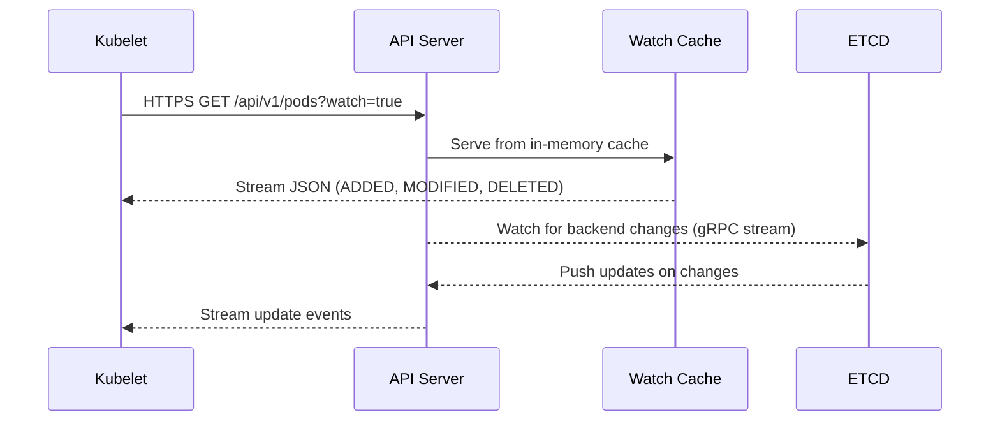
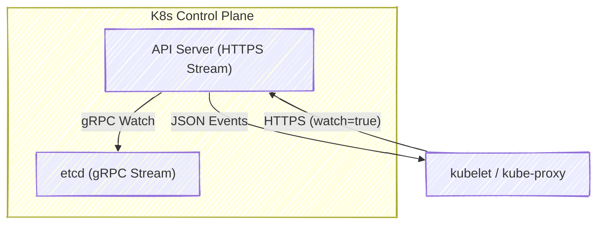

# 🧩 How Components Stay in Sync — **The K8s Watch Mechanism**

_(a.k.a. how kubelet, scheduler, and controller-manager keep up-to-date with API Server state in real time)!_

---

## 🔴 **The Problem**

If every internal component (like kubelet or controller-manager) had to **poll** the API server constantly for updates :  
“Any new Pods yet?” → “How about now?” → “Now?”  
…it would overload the API server 💀.

So Kubernetes implements something elegant and efficient: the **Watch API**.

---

## 🟢 **The Watch Mechanism — Overview**

Instead of polling repeatedly, a component makes a **long-running HTTP request** to the API server and says:

> “Keep me updated whenever something changes for this resource.”

- The API server **streams** events as JSON objects.
- The connection stays **open**.
- The client stays in sync **in real-time**.

---

## ⚙️ **Under the Hood**

| Layer       | Protocol                                                       | Description                                |
| ----------- | -------------------------------------------------------------- | ------------------------------------------ |
| Application | **Kubernetes REST API (Watch endpoint)**                       | `/api/v1/pods?watch=true`                  |
| Transport   | **HTTP/1.1 (chunked transfer encoding)** or **SPDY/WebSocket** | Keeps connection alive                     |
| Security    | **TLS (mutual or token-based)**                                | Same as normal API calls                   |
| Format      | **JSON event stream**                                          | Type + Object (ADDED / MODIFIED / DELETED) |

---

## 📝 **Example**: kubelet Watching for Pod Assignments

### 1️⃣ Request Sent by kubelet

```bash
GET /api/v1/pods?fieldSelector=spec.nodeName=node1&watch=true
```

👉 This means:

> “Dear API Server, please stream me _only_ Pods scheduled on `node1`.”

---

### 2️⃣ API Server Response (Streaming JSON)

The API server keeps the HTTP connection **open** and sends a JSON object **whenever** something changes:

```json
{
  "type": "ADDED",
  "object": {
    "metadata": {"name": "nginx-pod"},
    "spec": {"containers": [{"name": "nginx"}]},
    "status": {"phase": "Pending"}
  }
}
{
  "type": "MODIFIED",
  "object": {
    "metadata": {"name": "nginx-pod"},
    "status": {"phase": "Running"}
  }
}
{
  "type": "DELETED",
  "object": {"metadata": {"name": "nginx-pod"}}
}
```

Each object is streamed separately — no need for kubelet to poll again!

---

## 📝 **Example in Action**

Let’s simulate a controller watching for Pods using `kubectl`:

```bash
kubectl get pods --watch
```

As you create or delete pods, it’ll print changes **live** — that’s literally the Watch API in action.

---

## ⁉️ **What Happens Behind the Scenes**

Let’s trace one Watch connection (like kubelet’s) through the control plane:

<div align="center" style="background-color: #255560ff; border-radius: 10px; border: 2px solid">



</div>

💡 Both kubelet and API server use **watch** streams —
the API server watches etcd via gRPC,
and kubelet watches the API server via HTTPS.  
So the whole chain is reactive, not polling.

---

## 🧰 **Event Types in Watch API**

<div align="center" style="background-color: #119684ff;color:#000; border-radius: 10px; border: 2px solid">

| Event Type   | Meaning                                             |
| ------------ | --------------------------------------------------- |
| **ADDED**    | A new resource was created                          |
| **MODIFIED** | Existing resource was changed                       |
| **DELETED**  | Resource was removed                                |
| **BOOKMARK** | A keepalive marker (v1.15+) to save resourceVersion |
| **ERROR**    | Watch expired or failed                             |

</div>

---

## ⚡ **ResourceVersion** — The Time Machine

Every object in Kubernetes has a **resourceVersion** field.  
Think of it like a “change index” in etcd.

When a component reconnects after a disconnection, it tells the API server:

```bash
GET /api/v1/pods?watch=true&resourceVersion=123456
```

That means:

> “I already saw everything up to version 123456 — only send me what’s changed since then.”

This makes Watches **resumable**, so even temporary network drops don’t cause full resyncs.

---

## 🧩 **Protocol Evolution**

<div align="center" style="background-color: #119684ff;color:#000; border-radius: 10px; border: 2px solid">

| Kubernetes Version | Protocol Used                  | Notes                       |
| ------------------ | ------------------------------ | --------------------------- |
| v1.0 – v1.8        | SPDY                           | Early streaming protocol    |
| v1.9+              | HTTP/1.1 with chunked encoding | Simpler, standardized       |
| v1.20+             | HTTP/2 with WebSocket support  | More efficient multiplexing |

</div>

---

> All are **TLS-secured**, **bidirectional**, and **authenticated**.

---

## 🔐 **Security**

Each Watch request:

- Is authenticated using a **service account token** or **client certificate**
- Is **authorized** via RBAC (`verbs: ["watch"]`)
- Respects namespace scoping and field selectors

Example RBAC rule:

```yaml
rules:
  - apiGroups: [""]
    resources: ["pods"]
    verbs: ["get", "list", "watch"]
```

---

## 📝 **Real Example**: kube-proxy Watch

`kube-proxy` uses this to watch Services and Endpoints:

```bash
GET /api/v1/endpoints?watch=true
GET /api/v1/services?watch=true
```

Whenever a new Pod joins or leaves a Service, kube-proxy immediately receives an event and updates its iptables rules 🔥.

---

## 🖼️ **Diagram** — Watch Flow

<div align="center" style="background-color: #255560ff; border-radius: 10px; border: 2px solid">



</div>

---

## 📝 **Example Using REST Directly**

You can use `curl` to test this directly:

```bash
curl -H "Authorization: Bearer $(kubectl get secret $(kubectl get sa default -o jsonpath='{.secrets[0].name}') -o jsonpath='{.data.token}' | base64 -d)" \
  --cacert /etc/kubernetes/pki/ca.crt \
  https://<api-server>:6443/api/v1/pods?watch=true
```

You’ll see continuous JSON streaming output of Pod events 👀.

---

## 🏁 **Summary**

| Feature         | Description                                       |
| --------------- | ------------------------------------------------- |
| **Watch API**   | Persistent connection that streams object updates |
| **Transport**   | HTTPS (chunked HTTP/1.1, SPDY, or HTTP/2)         |
| **Data format** | JSON events: ADDED / MODIFIED / DELETED           |
| **Efficiency**  | No polling, minimal API load                      |
| **Security**    | TLS, token or cert-based auth                     |
| **Reliability** | ResourceVersion enables resume from last event    |
