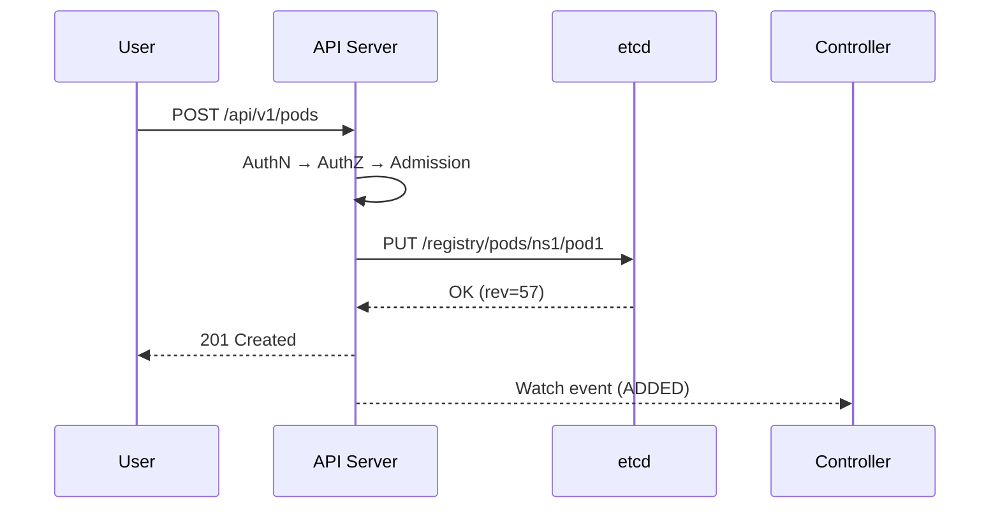
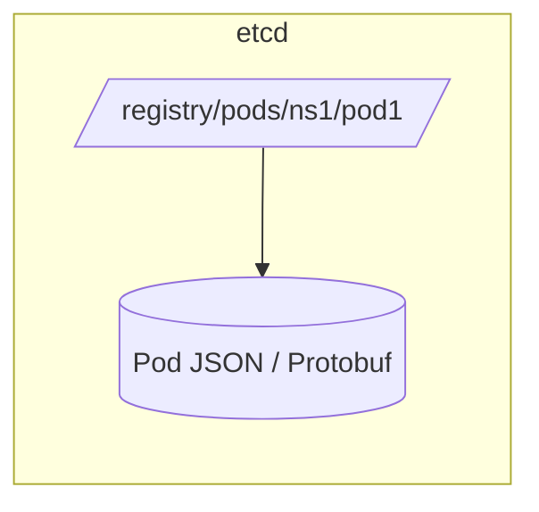
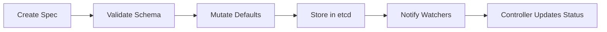
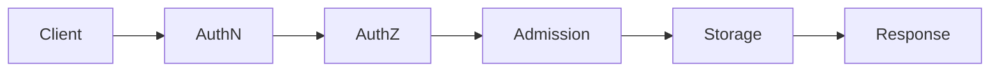
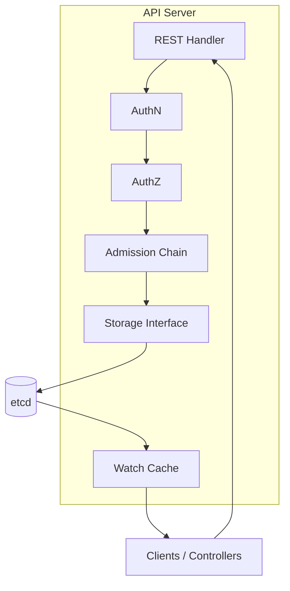

# 🧠 **Kubernetes API Server — The Brain & Gatekeeper of the Cluster**

## 💡 **One-liner**

> **API Server = Gatekeeper + Router + Validator + Persistence Layer.**  
> Everything in Kubernetes passes through it → it **authenticates**, **authorizes**, **admits**, **stores to etcd**, and **notifies controllers** instantly.

---

## 🛣️ **Life of a Request (Happy Path)**

**kubectl → API Server → AAA → Storage → Notify!**

1. 🪪 **AuthN** — “Who are you?” (Certs, Tokens, OIDC, Webhook)
2. 🔐 **AuthZ** — “Are you allowed?” (RBAC, ABAC, Node, Webhook)
3. 🧩 **Admission** — Validate / mutate / deny (via controllers or webhooks)
4. 💾 **Storage** — Encoded in Protobuf → sent via gRPC → saved to **etcd**
5. 🔔 **Notify** — Controllers & clients get watch events instantly

🧠 **Mnemonic:** **A-A-A → S → N** → _Authenticate → Authorize → Admit → Store → Notify_

---

## 🧩 **Core Building Blocks**

| Component                     | Description                                      |
| ----------------------------- | ------------------------------------------------ |
| **REST Handler & API Router** | Maps `/api` & `/apis` paths to resource handlers |
| **Authentication**            | Verifies identity (certs, tokens, OIDC)          |
| **Authorization**             | Checks permissions via **RBAC**, ABAC, etc.      |
| **Admission Chain**           | Mutating → Validating controllers/webhooks       |
| **Storage Interface**         | Encodes Protobuf, writes to etcd via `clientv3`  |
| **Watch Cache**               | Keeps hot data in RAM for fast list/watch        |

---

## ⚙️ **Request Flow Diagram**

> 🧩 Every Pod/Deployment is **stored first**, then **controllers act** using **watch events**.

---

## 🗺️ **Read vs Write Paths**

| Operation                   | Path                                              | Data Source      |
| --------------------------- | ------------------------------------------------- | ---------------- |
| **Writes (POST/PUT/PATCH)** | Client → API → AAA → etcd                         | Always hits etcd |
| **Reads (GET/List)**        | Client → API → **Watch Cache** → fallback to etcd | Usually cache    |

---

> ⚡ **Most reads** served from cache → minimal etcd load.  
> 💾 **Writes** always hit etcd for consistency.

---

## 🧱 **How Data Lives in etcd**

---

> 🧩 Stored under `/registry/<resource>/<namespace>/<name>` with **linearizable consistency**.

---

## 🧬 **Object Lifecycle**

---

> **Spec** → Desired state (user input)  
> **Status** → Observed state (updated by controllers)

---

## 🔐 **Security Pipeline**

---

> ❌ Drop anywhere in the chain = request denied  
> ✅ Pass all → safely persisted in etcd

---

## 🧰 **Extensibility**

- **CRDs (Custom Resource Definitions)** → add new resource types dynamically
- **API Aggregation** → plug external APIs (e.g. `metrics.k8s.io`)

> 🧩 Extend without touching core binaries.

---

## 📈 **Performance Memory Map**

| ⚙️ Optimization          | 💡 Why it matters                       |
| ------------------------ | --------------------------------------- |
| **Watch Cache**          | Serves hot reads, reduces etcd pressure |
| **Protobuf encoding**    | Faster than JSON                        |
| **Chunked lists**        | Paginated large object lists            |
| **Throttling & timeout** | Protects API Server stability           |

---

## 🩺 **Observability Essentials**

- **Metrics** → `/metrics`

  - `apiserver_request_duration_seconds`
  - `apiserver_request_total`
  - `etcd_request_duration_seconds`

- **Health checks** → `/livez`, `/readyz`
- **Debug tools** → `/debug/pprof`

---

## 💥 **Common Failure Behaviors**

| Scenario               | Behavior                                       |
| ---------------------- | ---------------------------------------------- |
| 🧱 **Etcd Down**       | Writes fail (503), cached reads may still work |
| ⏳ **Webhook Timeout** | Request rejected                               |
| ⚡ **API Overload**    | Throttling / backoff engaged                   |

---

## 🧠 **10-Second Recall**

> 🏗️ The **API Server** is the **single truth source** of Kubernetes.
> It **authenticates**, **authorizes**, **admits**, and **persists** all requests to **etcd**,
> while **streaming live events** to controllers via **watch cache**.
> Extensible (CRDs, aggregation), secure (TLS, AuthN/Z), and observable (metrics, health endpoints).

---

## 🖼️ **Visual Mind Map**

---

> 🧩 **All requests** → **A-A-A → S → N** →  
> Checked, stored, and streamed back to the cluster’s brains.
