# 🧠 KUBERNETES API SERVER INTERNALS — THE COMPLETE MONOLITH DEEP DIVE

## 📖 **What Is the API Server?**

The **Kubernetes API Server (`kube-apiserver`)** is the _central nervous system_ of Kubernetes.

> Every single command, pod creation, watch, or controller loop — passes through it.

It’s a RESTful front-end that:

- Validates and processes all cluster requests.
- Persists state to etcd.
- Notifies watchers (like controllers, schedulers).
- Enforces authentication, authorization, and admission control.

---

## 🏛️ **High-Level Architecture Overview**

<div align="center" style="background-color: #255560ff; border-radius: 10px; border: 2px solid">

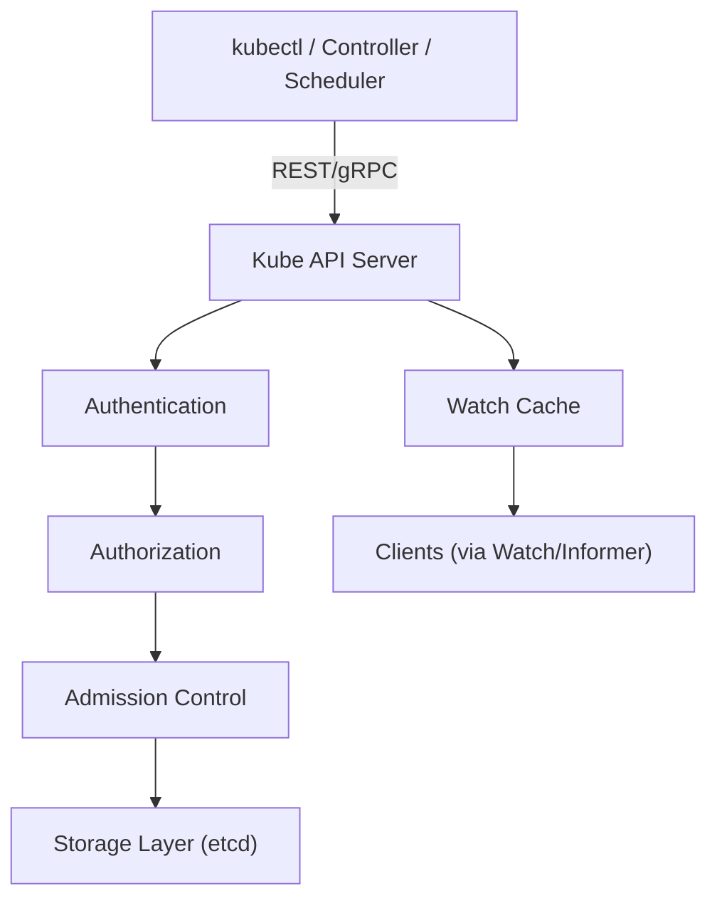

</div>

---

<div align="center" style="background-color: #141a19ff;color: #a8a5a5ff; border-radius: 10px; border: 2px solid">

| Layer              | Purpose                                                     |
| ------------------ | ----------------------------------------------------------- |
| **Authentication** | Identify who’s calling (User/ServiceAccount)                |
| **Authorization**  | Decide if they can perform the action (RBAC, ABAC, Webhook) |
| **Admission**      | Validate, mutate, or deny the object                        |
| **Storage Layer**  | Persist to etcd and serve future reads                      |
| **Watch Cache**    | Push live changes to clients via watch                      |

</div>

---

## 🧬 **The Internal Flow — The Life of a Request**

Let’s trace a **real example**:

> You run `kubectl create -f pod.yaml`

<div align="center" style="background-color: #255560ff; border-radius: 10px; border: 2px solid">

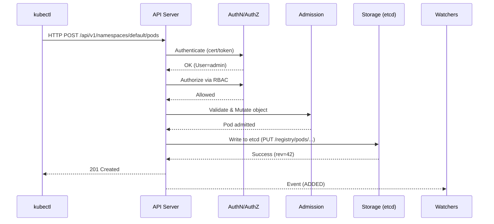

</div>

---

## 🧩 **Core Internal Components**

<div align="center" style="background-color: #141a19ff;color: #a8a5a5ff; border-radius: 10px; border: 2px solid">

| Component                        | Description                               |
| -------------------------------- | ----------------------------------------- |
| **HTTP/REST Handler**            | Entry point for all API requests          |
| **API Aggregator**               | Combines built-in and extension APIs      |
| **Storage Interface**            | Converts API objects ↔ etcd data          |
| **Watch Cache**                  | Stores recent watchable objects in memory |
| **Admission Chain**              | Pipeline for validation/mutation webhooks |
| **Authentication/Authorization** | Gatekeepers for cluster access            |

</div>

---

## 🎯 **HTTP → Storage Path**

Let’s break down the entire journey step-by-step:

---

### 🛠️ Step 1 — REST Handler & API Group Routing

Each Kubernetes API (core/v1, apps/v1, custom resources) is registered under a specific **API group**.

<div align="center" style="background-color: #255560ff; border-radius: 10px; border: 2px solid">

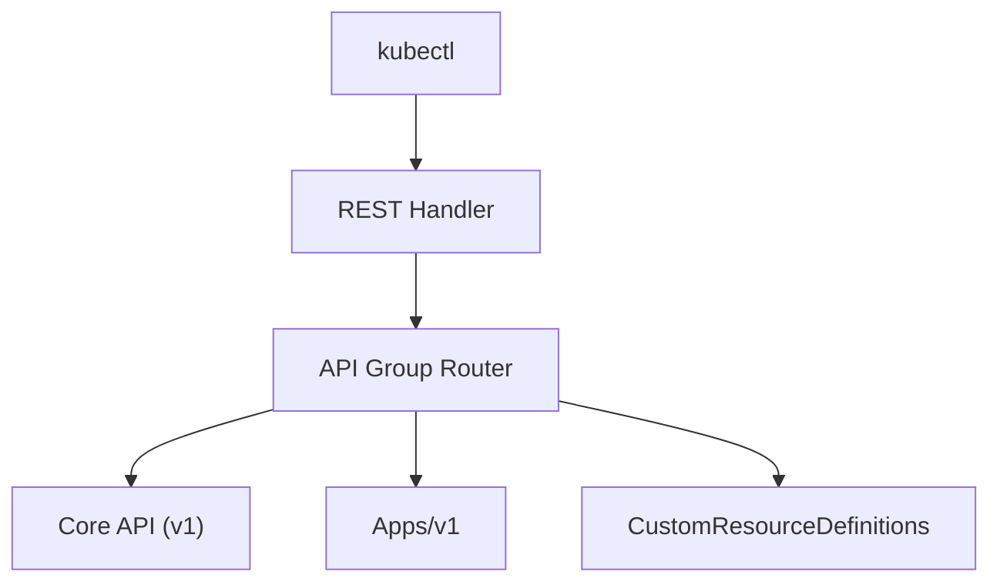

</div>

For example:

- `/api/v1/pods` → Core API group
- `/apis/apps/v1/deployments` → Apps API group

The handler maps each route to a corresponding **Go struct called a REST Storage**.

---

### 🧱 Step 2 — Authentication (AuthN)

API Server supports multiple mechanisms:

- Client certs (X.509)
- Bearer tokens (ServiceAccount)
- OpenID Connect (OIDC)
- Webhooks

Example cert flow:

<div align="center" style="background-color: #255560ff; border-radius: 10px; border: 2px solid">

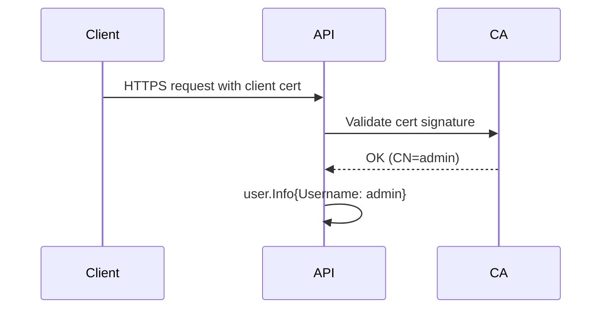

</div>

> ✅ Result: `user.Info` context attached to request.  
> From here, **every plugin sees who you are**.

---

### 🧰 Step 3 — Authorization (AuthZ)

Now the API server checks **can this user perform this action?**

Common modes:

- **RBAC** (most common)
- **ABAC**
- **Webhook**
- **Node Authorizer**

Example RBAC check:

```yaml
Role:
  apiGroups: [""]
  resources: ["pods"]
  verbs: ["create", "get", "list"]
```

If user `admin` has a RoleBinding for `pods.create` → ✅ request proceeds.

Otherwise → ❌ HTTP 403 Forbidden.

---

### 🧩 Step 4 — Admission Control

Admission controllers run _after_ AuthN/AuthZ but _before_ writing to etcd.

They can:

- **Mutate** (add labels, defaults, annotations)
- **Validate** (reject invalid pods)
- **Deny** (e.g., limit ranges, quota, policy violations)

Pipeline:

<div align="center" style="background-color: #141a19ff;color: #a8a5a5ff; border-radius: 10px; border: 2px solid">

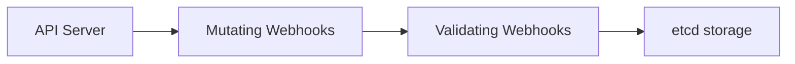

</div>

Example controllers:

- NamespaceLifecycle
- ResourceQuota
- LimitRanger
- MutatingAdmissionWebhook
- ValidatingAdmissionWebhook

---

### 💾 Step 5 — Storage Layer & Object Encoding

Once admitted, the object is serialized and stored via the **Storage Interface**.

The flow looks like this:

<div align="center" style="background-color: #255560ff; border-radius: 10px; border: 2px solid">

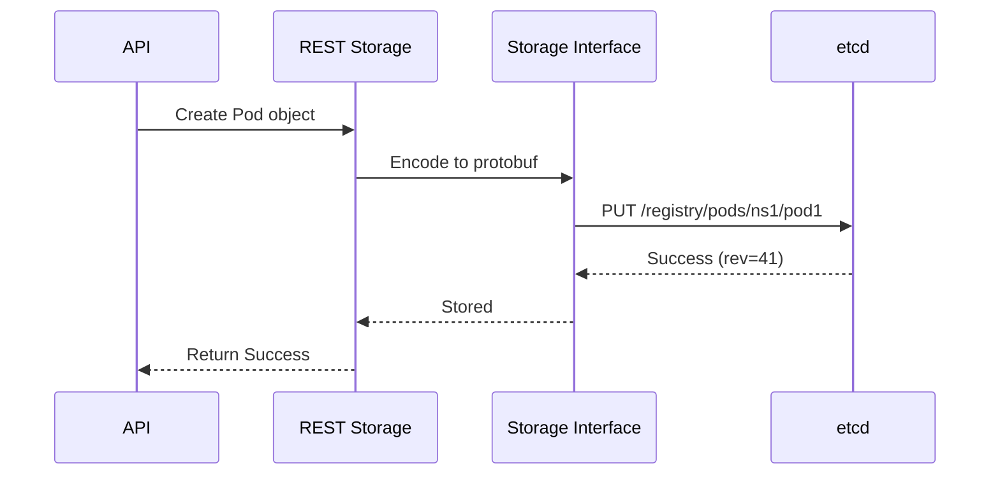

</div>

---

> 💡 Etcd stores everything under `/registry/<resource>/<namespace>/<name>`.

---

## 🥸 **Watchers & Informers** (Reactive Architecture)

This is how **controllers** and **kubectl get -w** get real-time updates.

---

### 🔄 **1. Watch Cache**

API Server keeps an in-memory **watch cache** to reduce load on etcd.

Flow:

<div align="center" style="background-color: #255560ff; border-radius: 10px; border: 2px solid">

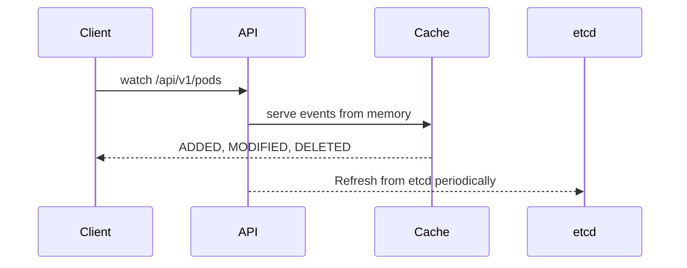

</div>

- Serves ~10x faster than raw etcd
- Maintains a local copy of objects for quick filtering

---

### 🔔 **2. Informer Pattern** (Client Side)

Controllers (like Deployment Controller) use **SharedInformers** to watch and cache data.

<div align="center" style="background-color: #255560ff; border-radius: 10px; border: 2px solid">

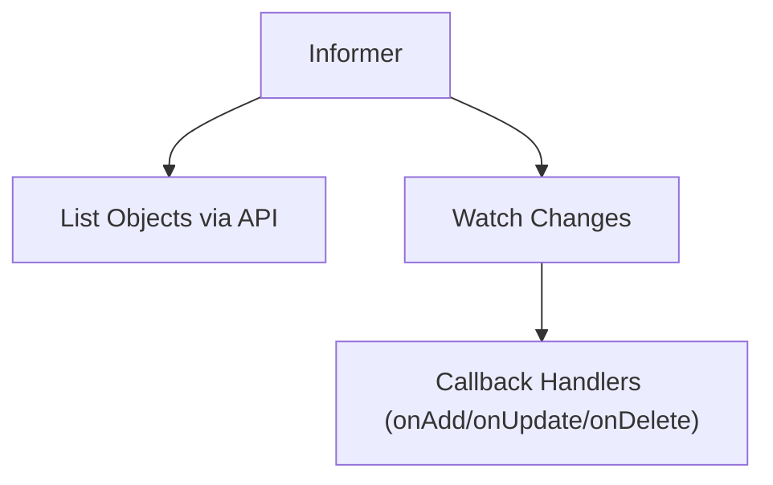

</div>

---

> ✅ Keeps controllers efficient  
> ✅ Avoids constant API queries  
> ✅ Handles reconnections gracefully

---

## ⚙️ **Read Paths — How “kubectl get” Works**

<div align="center" style="background-color: #255560ff; border-radius: 10px; border: 2px solid">

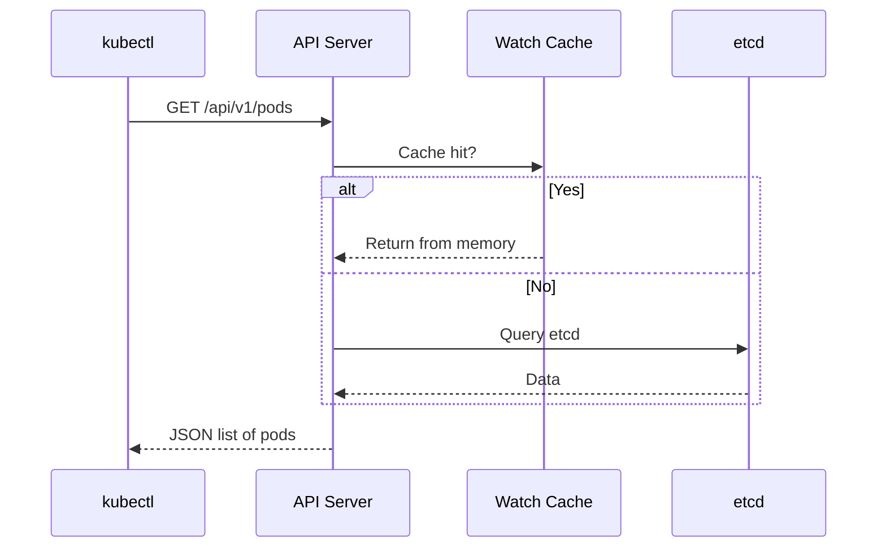

</div>

### Read optimization tiers:

1. Watch Cache (most frequent)
2. Etcd directly (fallback)
3. Aggregated APIs for CRDs

---

## 🕑 **Kubernetes Object Lifecycle Inside API Server**

Every object (e.g., Pod) goes through a defined flow.

<div align="center" style="background-color: #141a19ff;color: #a8a5a5ff; border-radius: 10px; border: 2px solid">

| Stage             | Example                            |
| ----------------- | ---------------------------------- |
| **Create**        | `kubectl apply -f pod.yaml` → POST |
| **Validate**      | Schema checked via OpenAPI spec    |
| **Mutate**        | Add defaults (e.g., restartPolicy) |
| **Persist**       | Stored in etcd                     |
| **Watch Notify**  | Controllers get event              |
| **Status Update** | Controller writes back Pod.Status  |

</div>

---

💡 **Spec** and **Status** are separated intentionally:

- _Spec = desired state (user input)_
- _Status = observed state (controller output)_

---

## 🎁 **Aggregated APIs & CRDs**

The API Server isn’t monolithic — it’s extensible.

- **Aggregated API Server** → register new endpoints (like metrics.k8s.io)
- **Custom Resource Definitions (CRDs)** → define new resource types dynamically

Example:

```bash
POST /apis/mycompany.io/v1/customwidgets
```

Under the hood:

- CRD registered with API Aggregator
- Stored as etcd entries
- Served via a dynamically generated REST handler

---

## 🔒 **Security Pipeline Recap**

<div align="center" style="background-color: #141a19ff;color: #a8a5a5ff; border-radius: 10px; border: 2px solid">

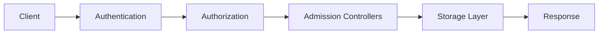

</div>

---

> Each stage can _reject_ the request.  
> The pipeline guarantees no unauthorized or malformed object reaches etcd.

---

## ⚙️ **Internal Code Components (Go)**

| Package                           | Role                                 |
| --------------------------------- | ------------------------------------ |
| `apiserver/pkg/server`            | Main server runtime                  |
| `apiserver/pkg/storage`           | Etcd and in-memory storage backend   |
| `apiserver/pkg/endpoints`         | REST routes & serialization          |
| `apiserver/pkg/admission`         | Admission controller pipeline        |
| `client-go/tools/cache`           | Informer implementation              |
| `staging/src/k8s.io/apimachinery` | Object schemas, meta, runtime codecs |

---

## 📝 **Example Lab** — Tracing a Pod Creation (Behind-the-Scenes)

Let’s visualize what happens when you do:

```bash
kubectl apply -f pod.yaml
```

### 🔬 Flow:

<div align="center" style="background-color: #255560ff; border-radius: 10px; border: 2px solid">

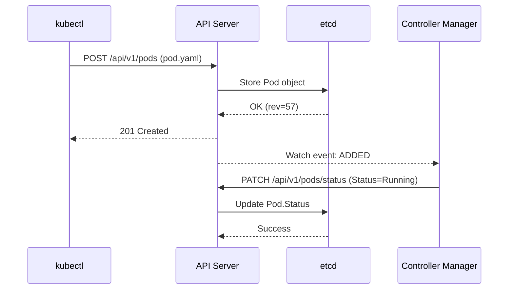

</div>

---

> ✅ The **Pod object** exists before any container runs.  
> ✅ The **controller** updates the `status` field later.

---

## ⚡ **Performance & Scalability**

<div align="center" style="background-color: #141a19ff;color: #a8a5a5ff; border-radius: 10px; border: 2px solid">

| Optimization                     | Description                          |
| -------------------------------- | ------------------------------------ |
| **Watch Cache**                  | Reduces etcd load                    |
| **Aggregated Watch**             | Shared watchers for multiple clients |
| **Protobuf serialization**       | Faster than JSON                     |
| **Chunked list**                 | Paginated GET responses              |
| **Request timeout & throttling** | Protects API server                  |

</div>

---

## 📡 **API Server → etcd Communication**

- Uses **gRPC over TLS**
- Encodes objects as **protobuf**
- Manages retries, compaction revisions, and heartbeats

✅ This ensures **linearizable reads** and **atomic writes**.  
✅ All communication uses `clientv3` library (from etcd).

---

## 🧮 **Observability & Debugging**

### Metrics (Prometheus)

- `/metrics` endpoint

  - `apiserver_request_duration_seconds`
  - `apiserver_request_total`
  - `etcd_request_duration_seconds`

### Debug Endpoints

- `/debug/pprof` → CPU/memory profiling
- `/livez` and `/readyz` → health endpoints

---

## 💥 **Failure Scenarios**

<div align="center" style="background-color: #141a19ff;color: #a8a5a5ff; border-radius: 10px; border: 2px solid">

| Failure                       | Behavior                                     |
| ----------------------------- | -------------------------------------------- |
| **Etcd unreachable**          | API writes fail (503)                        |
| **Admission webhook timeout** | Request rejected                             |
| **Auth webhook fails**        | Request denied                               |
| **API overload**              | Throttling / queueing                        |
| **Network partition**         | Node API servers can still serve cache reads |

</div>

---

## 🤔 **Why the API Server Is So Powerful**

- ✅ It’s the **single source of truth** for cluster state.
- ✅ Implements strong consistency with etcd.
- ✅ Enables declarative, event-driven control via watchers.
- ✅ Fully extensible with webhooks, CRDs, and aggregators.
- ✅ Secure, auditable, observable, and scalable.

---

## 🏁 **Summary**

| Function       | Role                               |
| -------------- | ---------------------------------- |
| **Frontend**   | REST/HTTP handler for all requests |
| **Middle**     | AuthN → AuthZ → Admission          |
| **Backend**    | Storage (etcd) + Watch Cache       |
| **Notifier**   | Sends live events to watchers      |
| **Extensible** | Supports CRDs and Aggregated APIs  |

---

### 🖼️ Visual Summary

<div align="center" style="background-color: #255560ff; border-radius: 10px; border: 2px solid">

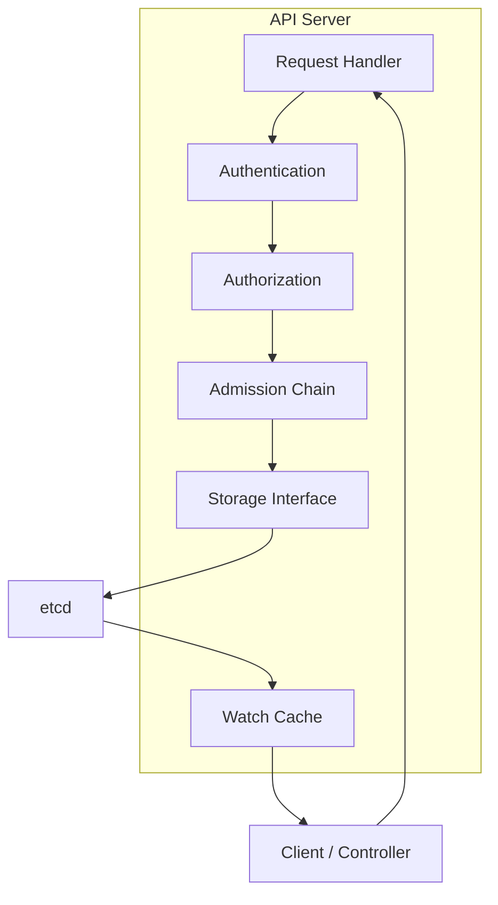

</div>

---

## 🔬 20. Next Step Suggestion

We can now go even **deeper** with:

- ✅ **“API Server → etcd write path (protobuf + gRPC trace)”**
- ✅ **“Admission Webhook internals (Mutating vs Validating)”**
- ✅ **“Watch Cache and Reflector internals in client-go”**
