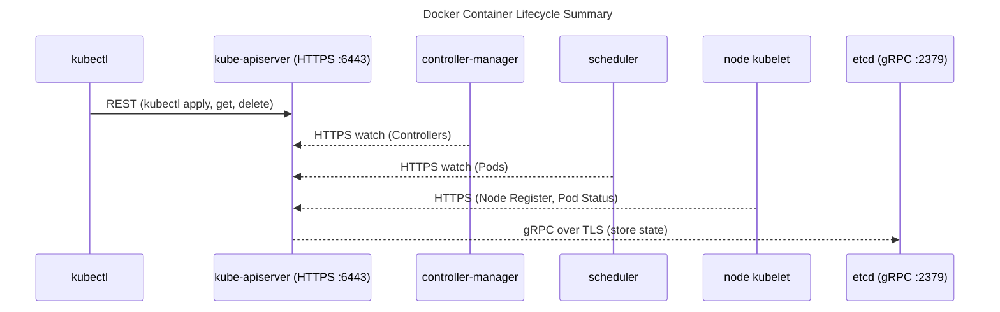

# ⚙️ **K8s Components Communications with the API Server**

## 💭 **Core Idea**

Every internal Kubernetes component — whether it’s the **kubelet**, **kube-proxy**, **controller-manager**, or **scheduler** — communicates with the **kube-apiserver** using **HTTP over TLS (HTTPS)** and **JSON** payloads following the **Kubernetes REST API** specification.

👉 In short:

| Layer     | Protocol                       | Data Format | Auth                                                       |
| --------- | ------------------------------ | ----------- | ---------------------------------------------------------- |
| Transport | **HTTPS (HTTP/1.1 or HTTP/2)** | JSON (REST) | X.509 client certificates or service accounts (JWT tokens) |

---

## 🔐 **Protocol Stack**

```text
Application Layer    → REST API (JSON)
Transport Layer      → HTTP/1.1 or HTTP/2
Security Layer       → TLS (Mutual Authentication)
Network Layer        → TCP (port 6443)
```

So yes, all communication is:

> **TLS-encrypted HTTPS requests over TCP port 6443**

---

## 📝 **Example Components** and Their Protocols

### 1️⃣ kubelet → kube-apiserver

- Purpose: Register node, send pod status, get Pod specs.
- Protocol: **HTTPS (REST API)**.
- Auth: **X.509 client certificate** signed by the cluster’s CA.
- Endpoint:
  `https://<api-server>:6443/api/v1/nodes/<nodeName>`

📜 Example REST call:

```bash
curl --cert /var/lib/kubelet/kubelet.crt \
     --key /var/lib/kubelet/kubelet.key \
     --cacert /etc/kubernetes/pki/ca.crt \
     https://10.0.0.1:6443/api/v1/nodes
```

✅ Response: JSON list of node objects.

---

### 2️⃣ kube-proxy → kube-apiserver

- Purpose: Watch Services and Endpoints to update iptables rules.
- Protocol: **HTTPS Watch API (websockets or chunked HTTP)**.
- Auth: **Service Account Token** (JWT).
- Endpoint:
  `https://<api-server>:6443/api/v1/services?watch=true`

📜 Example request:

```bash
curl -H "Authorization: Bearer $(cat /var/run/secrets/kubernetes.io/serviceaccount/token)" \
     --cacert /var/run/secrets/kubernetes.io/serviceaccount/ca.crt \
     https://10.0.0.1:6443/api/v1/services?watch=true
```

✅ Response: Continuous stream of JSON objects like:

```json
{
  "type": "ADDED",
  "object": { "metadata": {"name": "nginx-service"}, "spec": {...} }
}
```

---

### 3️⃣ Controller Manager & Scheduler → kube-apiserver

- Purpose: Read and write cluster state.
- Protocol: **HTTPS (REST + Watch)**.
- Auth: **Kubeconfig with client certificates**.
- Communication type:

  - Poll or watch objects (Pods, Deployments, ReplicaSets).
  - POST or PATCH updates (e.g., when scheduling a Pod).

📜 Example:

```bash
GET /api/v1/pods?watch=true  (watch)
PATCH /api/v1/namespaces/default/pods/mypod/status  (update)
```

---

### 4️⃣ etcd ← kube-apiserver

- The **only** component that doesn’t use REST directly is etcd.
- kube-apiserver uses **gRPC over HTTPS (TLS)** to talk to etcd.
- Protocol: **gRPC + HTTP/2**
- Port: `2379`

📜 Internal flow:

```text
API request → REST (JSON) → kube-apiserver → gRPC → etcd
```

✅ Example internal call (conceptual):

```ini
GET /api/v1/pods → etcd.Get("/registry/pods/default/nginx")
```

---

## 🎭 **Behind the Scenes** — Full Cluster Communication Diagram

<div align="center" style="background-color: #255560ff; border-radius: 10px; border: 2px solid">



</div>

---

## 🧪 **Example** Traffic in Real Cluster

Check current connections:

```bash
sudo netstat -tunp | grep kube
```

You’ll see:

```ini
tcp  0  0 10.0.0.10:51234  10.0.0.1:6443  ESTABLISHED  kubelet
tcp  0  0 10.0.0.11:38902  10.0.0.1:6443  ESTABLISHED  kube-proxy
tcp  0  0 127.0.0.1:39100  127.0.0.1:2379 ESTABLISHED  kube-apiserver
```

---

## 🧠 **TL;DR**

| Component          | Destination    | Protocol             | Auth        | Port |
| ------------------ | -------------- | -------------------- | ----------- | ---- |
| kubelet            | kube-apiserver | HTTPS (REST)         | Client cert | 6443 |
| kube-proxy         | kube-apiserver | HTTPS (Watch API)    | SA Token    | 6443 |
| controller-manager | kube-apiserver | HTTPS (REST + Watch) | Client cert | 6443 |
| scheduler          | kube-apiserver | HTTPS (REST + Watch) | Client cert | 6443 |
| kube-apiserver     | etcd           | gRPC over HTTPS      | Client cert | 2379 |

---

## 💡 **Fun Fact**

Kubernetes **does not use gRPC for internal control-plane communication** except for **etcd**.  
All other communications are **HTTP/REST-based JSON APIs over TLS** — the same ones used by `kubectl`.

That’s why you can do:

```bash
kubectl proxy
```

and literally interact with the same endpoints internal components use.
