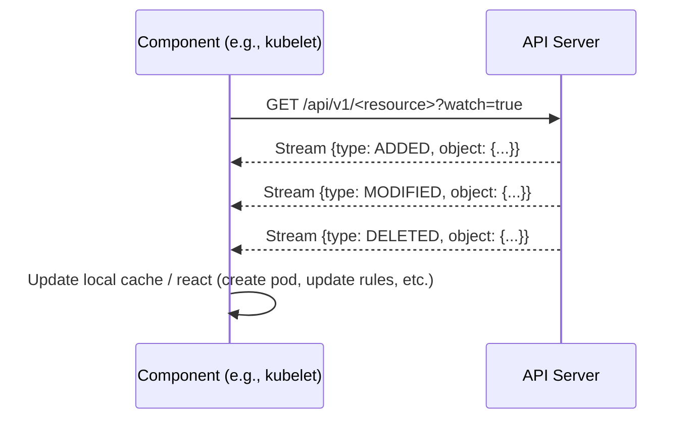
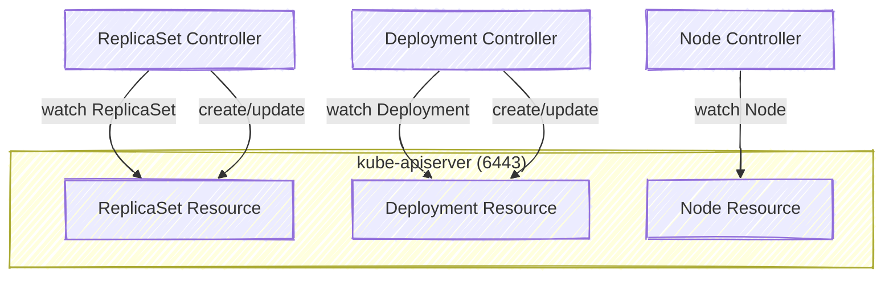
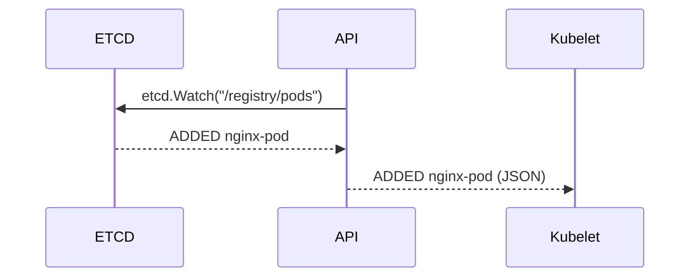

# ✍🏻 **How K8s Components Use the Watch API Differently**

## 📌 **Quick Recap**: The “Watch Loop” Pattern

All internal components (kubelet, controller-manager, scheduler, kube-proxy, etc.) follow this same _design pattern_:

<div align="center" style="background-color: #255560ff; border-radius: 10px; border: 2px solid">



</div>

> So each component establishes a **persistent HTTPS Watch connection**, and whenever the API server streams an event, it reacts immediately.

---

## 1️⃣ **kubelet** — Node Agent Watching Its Assigned Pods

### 🧩 Purpose:

To learn _which Pods are scheduled_ on its node and maintain their state (start containers, restart, report status).

### 🧠 Watch API Used:

```bash
GET /api/v1/pods?fieldSelector=spec.nodeName=<node-name>&watch=true
```

### 💬 Meaning:

> “Dear API server, stream me every Pod that belongs to this node.”

### 🔄 Behavior:

<div align="center" style="background-color: #119684ff;color:#000; border-radius: 10px; border: 2px solid">

| Event Type   | kubelet Reaction                                     |
| ------------ | ---------------------------------------------------- |
| **ADDED**    | Pull the image, create Pod sandbox, start containers |
| **MODIFIED** | Update container states, restart if crashed          |
| **DELETED**  | Stop containers and clean up Pod                     |

</div>

### 🧩 Real Example:

```bash
kubectl get pods --field-selector spec.nodeName=node1 --watch
```

✅ You’re seeing _exactly_ what kubelet sees.

---

## 2️⃣ **kube-proxy** — Networking Watchdog

### 🧩 Purpose:

To maintain **network routing** for Services and Endpoints across the node.

### 🧠 Watch APIs:

```bash
GET /api/v1/services?watch=true
GET /api/v1/endpoints?watch=true
```

### 🔄 Behavior:

<div align="center" style="background-color: #119684ff;color:#000; border-radius: 10px; border: 2px solid">

| Event                 | Reaction                            |
| --------------------- | ----------------------------------- |
| **ADDED Service**     | Create iptables rules for ClusterIP |
| **ADDED Endpoint**    | Add Pod IP to forwarding list       |
| **MODIFIED Endpoint** | Update service backend list         |
| **DELETED Service**   | Remove iptables entries             |

</div>

### 🧩 Example in action:

If you create a Service:

```bash
kubectl expose pod nginx --port=80
```

kube-proxy immediately sees an **ADDED** event and updates iptables on every node — no polling needed.

---

## 3️⃣ **controller-manager** — The Brain of the Cluster 🧠

This one is **controller-heavy** — DeploymentController, ReplicaSetController, NodeController, etc.

### 🧠 Purpose:

To ensure “desired state” matches “actual state” for all Kubernetes objects.

Each controller runs an _infinite reconciliation loop_:

```bash
while true:
    desired = get_desired_state()
    actual = get_actual_state()
    diff = desired - actual
    act_to_fix(diff)
```

### 🧩 Watch APIs (Examples):

- ReplicaSet Controller:

  ```bash
  GET /api/v1/pods?watch=true
  GET /apis/apps/v1/replicasets?watch=true
  ```

- Node Controller:

  ```bash
  GET /api/v1/nodes?watch=true
  ```

### 🔄 Example:

If a node disappears → `NodeController` receives a **DELETED** event → marks node as `NotReady` → triggers rescheduling via `Scheduler`.

---

## 4️⃣ **scheduler** — The Pod Matchmaker 💘

### 🧩 Purpose:

To assign Pods to Nodes (set `spec.nodeName`).

### 🧠 Watch API Used:

```bash
GET /api/v1/pods?fieldSelector=spec.nodeName=""
```

### 💬 Meaning:

> “Give me all Pods that haven’t been assigned to any node yet.”

### 🔄 Behavior:

1. Watch for unassigned Pods.
2. On “ADDED”, evaluate node candidates based on:

   - CPU/Memory requests
   - Labels, Taints/Tolerations
   - Node affinity

3. Picks a node → sends a **PATCH**:

   ```bash
   PATCH /api/v1/namespaces/default/pods/<pod-name>
   {
     "spec": {"nodeName": "node1"}
   }
   ```

✅ That single `PATCH` triggers kubelet’s Watch stream — and the Pod starts running.

---

## 5️⃣ **kube-controller-manager** Subcontrollers

Let’s visualize how multiple controllers Watch simultaneously:

<div align="center" style="background-color: #255560ff; border-radius: 10px; border: 2px solid">



</div>

Each controller maintains its **own watch stream** on specific resources and coordinates through the API server — not directly between controllers.

---

## 6️⃣ **etcd** Watch (Internal)

Even the API server itself uses **watch** — but at a lower level.

- API server → etcd via **gRPC streaming**
- etcd notifies the API server on key changes
- API server pushes those as **Watch events** to components

<div align="center" style="background-color: #255560ff; border-radius: 10px; border: 2px solid">



</div>

So _every Watch is powered by another Watch_ underneath — recursive design! 🌀

---

## 🔐 **All Watch Connections Are Secure**

<div align="center" style="background-color: #163b50ff;color:#000; border-radius: 10px; border: 2px solid">

| Component          | Auth Method           | Certificate Source                        |
| ------------------ | --------------------- | ----------------------------------------- |
| kubelet            | Client cert           | `/var/lib/kubelet/kubelet.crt`            |
| controller-manager | Client cert           | `/etc/kubernetes/controller-manager.conf` |
| scheduler          | Client cert           | `/etc/kubernetes/scheduler.conf`          |
| kube-proxy         | Service account token | `/var/run/secrets/.../token`              |

</div>

All use **HTTPS + TLS mutual auth** → no plain text anywhere.

---

## 📝 **Example** Network Snapshot

Run this to see all live watch connections:

```bash
sudo ss -tanp | grep 6443
```

Expected:

```ini
ESTAB  0  0 10.0.0.5:53142  10.0.0.1:6443  users:(("kubelet",pid=1024,fd=8))
ESTAB  0  0 10.0.0.6:45310  10.0.0.1:6443  users:(("kube-proxy",pid=1102,fd=9))
ESTAB  0  0 127.0.0.1:42123 127.0.0.1:6443 users:(("controller-manager",pid=1002,fd=7))
ESTAB  0  0 127.0.0.1:42124 127.0.0.1:6443 users:(("scheduler",pid=1003,fd=7))
```

Each of these is an active Watch stream.

---

## 🏁 **Summary** — Who Watches What

<div align="center" style="background-color: #163b50ff;color:#000; border-radius: 10px; border: 2px solid">

| Component              | Watches                  | Reacts to                  | Example Action              |
| ---------------------- | ------------------------ | -------------------------- | --------------------------- |
| **kubelet**            | Pods on its node         | Pod ADDED/MODIFIED/DELETED | Start or stop containers    |
| **kube-proxy**         | Services, Endpoints      | New Service or Pod IP      | Update iptables             |
| **controller-manager** | Pods, Deployments, Nodes | Resource changes           | Reconcile desired vs actual |
| **scheduler**          | Unassigned Pods          | New unscheduled Pod        | Assign to best node         |
| **API server**         | etcd                     | Key changes                | Notify controllers          |
| **kubectl**            | Anything (user client)   | Manual watch               | Live updates in CLI         |

</div>

---

## 📌 **Key Takeaways**

- Everything in Kubernetes is event-driven — **no component polls** the API server.
- Each component uses **Watch API** via HTTPS to get real-time state changes.
- The API server watches **etcd** over gRPC → then relays events downstream.
- All communication uses **TLS encryption + RBAC authorization**.
- The entire control plane is like a **pub-sub system** built on REST and Watch streams.
