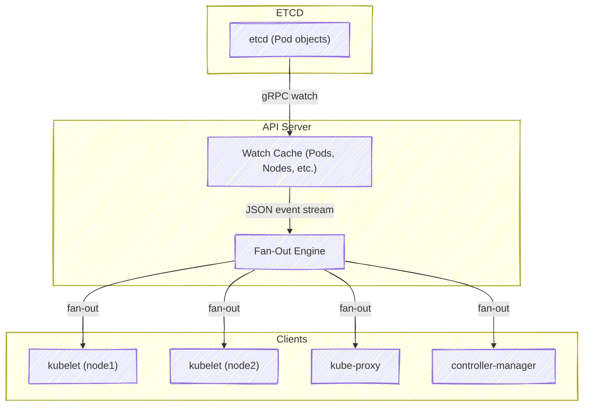
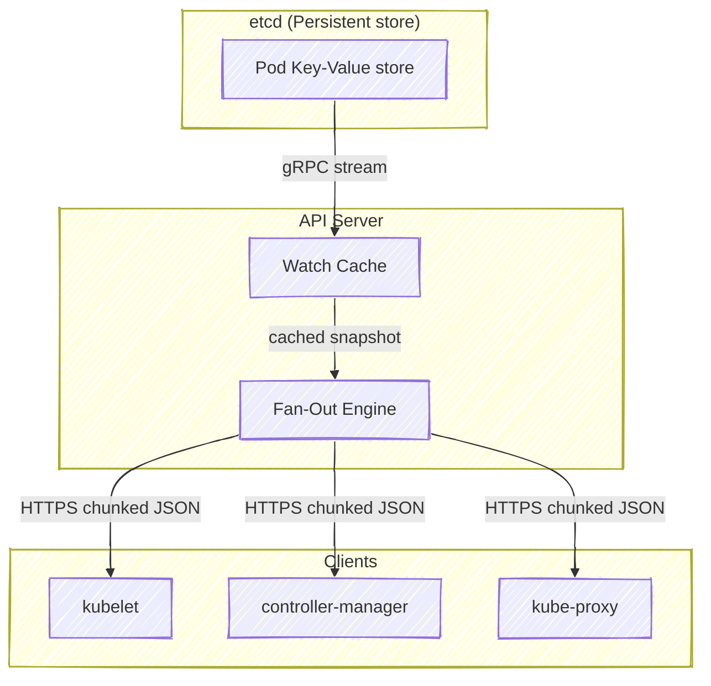

# ⚙️ **API Server Watch Architecture**

_(“How One Pod Creation Event Reaches Thousands of Clients Efficiently”)!_

---

## 🔴 **The Problem** — Scaling the Watch API

Imagine 5,000 kubelets, each doing:

```bash
GET /api/v1/pods?fieldSelector=spec.nodeName=<node>&watch=true
```

When a single Pod is created, the API server must **notify every watcher** that cares about it — without querying etcd for each.

If it fetched from etcd 5,000 times per event, etcd would die instantly 💀.

---

## 🟢 **The Solution** — Watch Cache + Fan-Out System

Kubernetes solves this using two magic layers inside the API Server:

<div align="center" style="background-color: #119684ff;color:#000; border-radius: 10px; border: 2px solid">

| Layer             | Role                                                   |
| ----------------- | ------------------------------------------------------ |
| **Watch Cache**   | Local in-memory copy of recent objects for fast access |
| **Watch Fan-Out** | One etcd stream → many client streams                  |

</div>

Let’s visualize it 👇

<div align="center" style="background-color: #255560ff; border-radius: 10px; border: 2px solid">



</div>

---

> ✅ Result: etcd is hit **once**, and thousands of watchers receive the update in milliseconds.

---

## 🪜 **The “List + Watch” Pattern**

Every Kubernetes Watch session begins with a **list**, then continues as a **watch**.

### 🧩 Step 1 — List

The client gets the _current snapshot_:

```bash
GET /api/v1/pods
```

Response:

```json
{
  "items": [...],
  "metadata": {
    "resourceVersion": "25692"
  }
}
```

### 🧩 Step 2 — Watch

Then it asks:

```bash
GET /api/v1/pods?watch=true&resourceVersion=25692
```

This means:

> “Start sending me changes _after_ resourceVersion 25692.”

If network drops, it reconnects using the **latest version** it saw.

---

## ⚙️ **The Watch Cache**

Each API server stores a **sliding window of recent changes** per resource type.

<div align="center" style="background-color: #119684ff;color:#000; border-radius: 10px; border: 2px solid">

| Resource | Cache Size | Stored Data                    |
| -------- | ---------- | ------------------------------ |
| Pods     | 1000       | Object snapshots + event types |
| Nodes    | 500        | Status and metadata            |
| Services | 500        | Spec + clusterIP               |

</div>

When you list Pods, the API server serves it **directly from the cache**, not etcd — drastically reducing etcd load.

📁 Internal code path:

```ini
pkg/storage/cacher.go
pkg/apiserver/watchcache.go
```

---

## 🪭 **The Fan-Out System**

Once an event (like Pod creation) arrives from etcd →
API server’s WatchCache → Fan-Out engine checks all active watchers.

Each watcher has:

- Resource filter (namespace, fieldSelector, labelSelector)
- Last seen `resourceVersion`

The Fan-Out engine:

- Sends event only if it matches
- Updates watcher’s `resourceVersion`
- Uses **non-blocking queues** per watcher to avoid backpressure

👉 So even if one slow watcher lags, others still get updates in real-time.

---

## 📝 **Real Flow Example** — Pod Created

Let’s trace it step-by-step visually:

<div align="center" style="background-color: #255560ff; border-radius: 10px; border: 2px solid">


</div>

✅ One etcd write → hundreds of clients updated instantly.

---

## 🔄 **Handling Missed Events** — ResourceVersion Logic

When a client reconnects (due to timeout or network issue):

- It provides its **last known `resourceVersion`**
- API server sends only **new events**
- If the requested version is too old (expired), client does a **re-list**

Example:

```bash
GET /api/v1/pods?watch=true&resourceVersion=102394
```

If cache doesn’t have older events →
Response:

```json
{ "type": "ERROR", "object": { "code": 410, "reason": "Gone" } }
```

That means:

> “Too old! Do a full list again.”

---

## 🔧 **Performance Features**

<div align="center" style="background-color: #119684ff;color:#000; border-radius: 10px; border: 2px solid">

| Optimization               | Description                                        |
| -------------------------- | -------------------------------------------------- |
| **Bookmark events**        | Lightweight heartbeat messages (no object payload) |
| **Chunked list responses** | Large lists split into pages                       |
| **Server-Side filtering**  | Label/field selectors reduce event size            |
| **Compression**            | gzip/deflate supported for Watch streams           |
| **WatchBookmarks=true**    | Reduces memory and keeps clients synced            |

</div>

---

## 📝 **Example**: API Server Config Flags

You can tune cache and watch behavior in `kube-apiserver`:

```bash
--watch-cache=true
--watch-cache-sizes=pods#1000,nodes#500
--max-mutating-requests-inflight=200
--max-requests-inflight=400
```

---

## ⚡ **Efficiency Recap**

| Step                | Data Source            | Description                          |
| ------------------- | ---------------------- | ------------------------------------ |
| 1️⃣ Client List      | Watch Cache            | Gets full snapshot (fast, in-memory) |
| 2️⃣ Client Watch     | Fan-Out Engine         | Streams future changes               |
| 3️⃣ API Server       | etcd Watch             | Receives low-level key changes       |
| 4️⃣ Cache Sync       | Event replay           | Keeps memory state in sync           |
| 5️⃣ Client Reconnect | ResourceVersion resume | Efficient delta sync                 |

---

## 📝 **Example Metrics** (via `/metrics`)

You can inspect the cache behavior:

```bash
curl -k https://<apiserver>:6443/metrics | grep watch
```

Example output:

```ini
apiserver_watch_events_total{resource="pods"} 13240
apiserver_watch_cache_list_duration_seconds_count{resource="pods"} 54
apiserver_watch_fanout_total{resource="pods"} 2300
```

---

## 🖼️ **Full End-to-End Watch Data Flow**

<div align="center" style="background-color: #255560ff; border-radius: 10px; border: 2px solid">



</div>

---

## 🏁 **Key Takeaways**

- The **Watch Cache** prevents API server from hammering etcd.
- The **Fan-Out Engine** efficiently sends updates to many clients.
- Every Watch starts as a **List + Watch** pattern.
- **ResourceVersion** ensures continuity between sessions.
- API server → etcd communication uses **gRPC Watch streams**.
- Kubernetes can scale to **thousands of watchers** with minimal latency.
