# 🧠 Kubernetes Controller Manager — Real Internal Mechanics (Full Practical View)

## 📖 **What Exactly Is It?**

The **Kubernetes Controller Manager** is a **separate process** — not part of the API Server.

- Binary name: `kube-controller-manager`
- Usually runs as a **static Pod** on the control plane node (like API server, scheduler, etcd)
- It connects to the **API Server over HTTPS (REST + Watch APIs)**
- It’s **stateless** — no local database; all state lives in etcd (via API Server)

📍 Location on a typical cluster:

```ini
/etc/kubernetes/manifests/kube-controller-manager.yaml
```

It uses flags like:

```ini
--kubeconfig=/etc/kubernetes/controller-manager.conf
--leader-elect=true
```

✅ So yes — it’s a **standalone application**, not embedded in the API Server.

---

## 🔁 **Lifecycle Overview** (How It Starts and Works)

Here’s the **real controller-manager lifecycle**, simplified step by step:

<div align="center" style="background-color: #255560ff; border-radius: 10px; border: 2px solid">

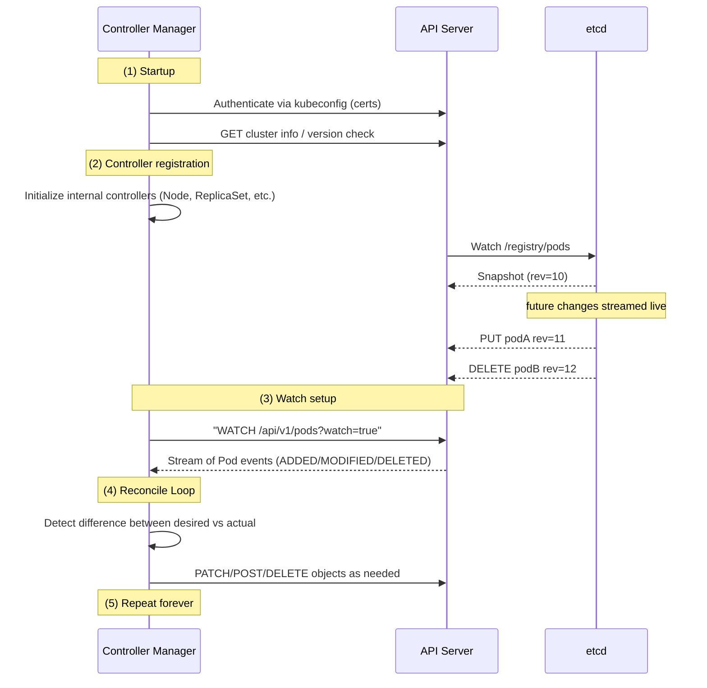

</div>

### 🧩 Communication Protocol:

- Uses **HTTPS (REST + watch)** over port `6443`
- **Watch API** uses **HTTP long-lived streaming** — the API Server pushes events continuously
- The controller manager keeps an open connection and listens for changes

✅ So, it doesn’t poll; it **subscribes** to events.

---

## ⚙️ **Watch Mechanism** (Event Streaming)

Controllers subscribe to specific object kinds.
Example — Deployment Controller watches:

- `Deployments`
- `ReplicaSets`
- `Pods`

So internally:

```INI
GET /apis/apps/v1/deployments?watch=true
GET /apis/apps/v1/replicasets?watch=true
GET /api/v1/pods?watch=true
```

Then, the API Server streams JSON events like:

```json
{
  "type": "ADDED",
  "object": { "metadata": { "name": "nginx" }, "spec": {...} }
}
```

Controller Manager processes each event → puts into its work queue → runs reconciliation logic.

---

## 🧠 **Controller Manager Main Loop**

<div align="center" style="background-color: #255560ff; border-radius: 10px; border: 2px solid">

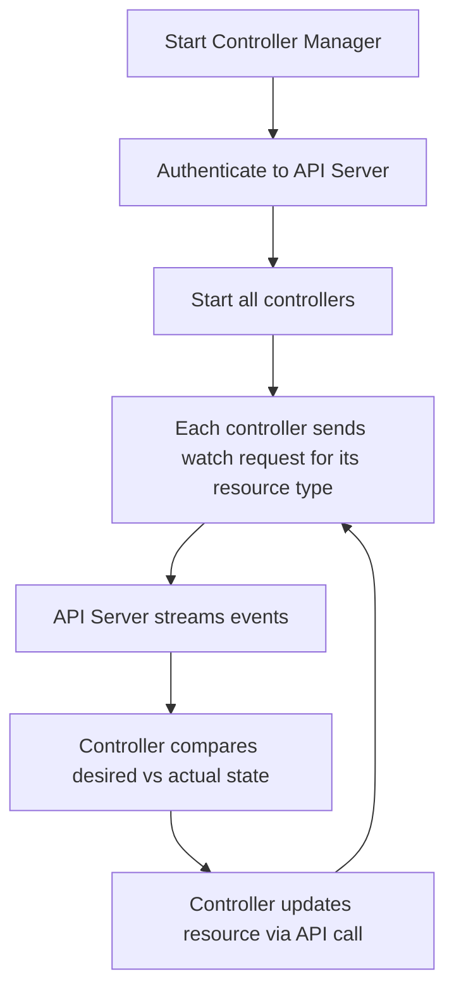

</div>

---

> ✅ **Each controller runs in its own Go routine (thread).**  
> ✅ **All communicate through the same API Server.**

---

## 💭 **Common Controllers** (and Their Behavior)

Now let’s visualize **how each common controller behaves internally** when it starts and operates.

---

### 📌 **1. Node Controller**

**Purpose:** Track Node heartbeats and mark them `NotReady` if unresponsive.

<div align="center" style="background-color: #255560ff; border-radius: 10px; border: 2px solid">

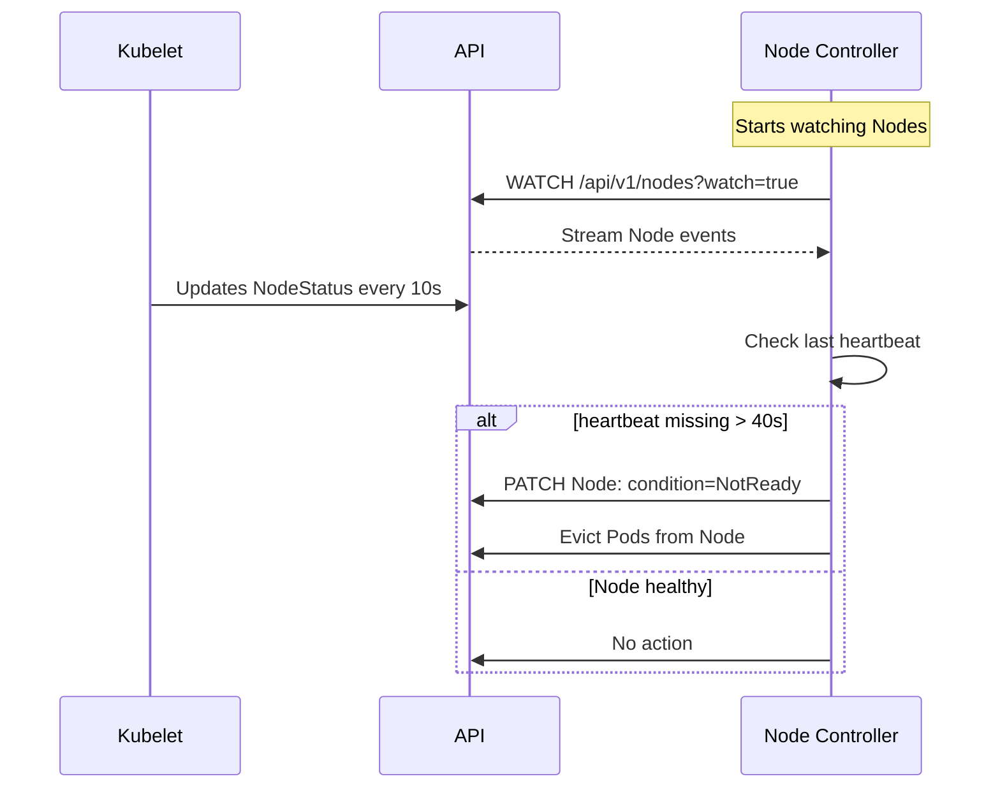

</div>

---

✅ Handles node lifecycle + pod eviction.

---

### 📌 **2. Deployment Controller**

**Purpose:** Manage ReplicaSets for versioned rollout.

<div align="center" style="background-color: #255560ff; border-radius: 10px; border: 2px solid">

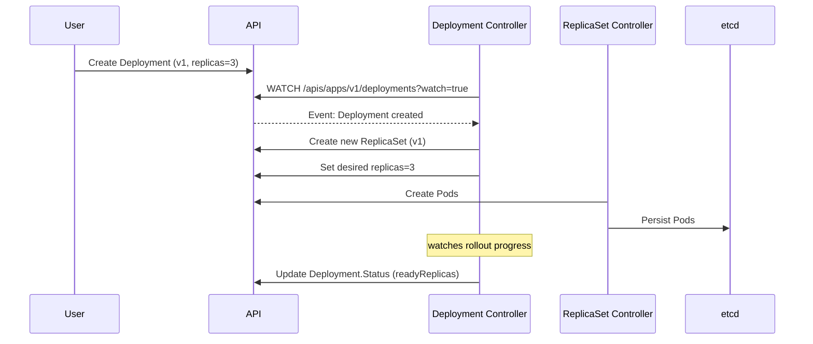

</div>

---

✅ Handles rolling updates and rollbacks.

---

### 📌 **3. Replication Controller**

**Purpose:** Ensure the number of Pods matches `spec.replicas`.

<div align="center" style="background-color: #255560ff; border-radius: 10px; border: 2px solid">

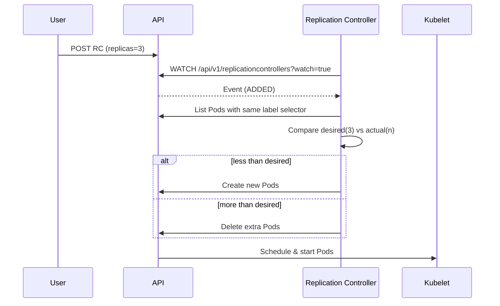

</div>

---

✅ Keeps replica count always accurate.

---

### 📌 **4. DaemonSet Controller**

**Purpose:** Run exactly one Pod per node.

<div align="center" style="background-color: #255560ff; border-radius: 10px; border: 2px solid">

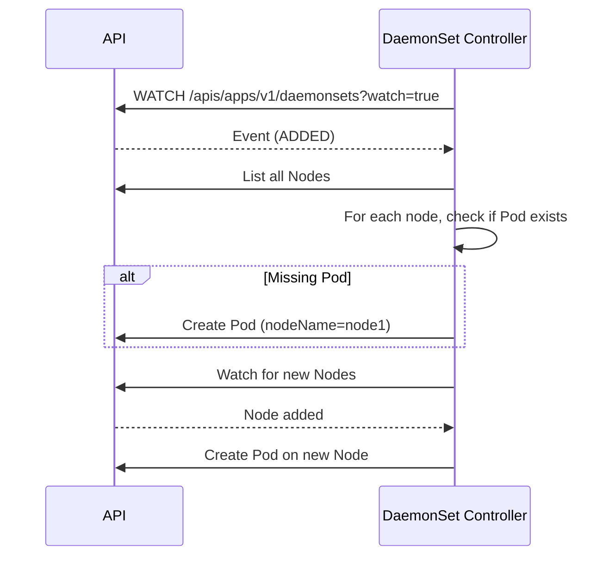

</div>

---

✅ Auto-schedules Pods to all (or selected) nodes.

---

### 📌 **5. Job Controller**

**Purpose:** Run Pods until completion.

<div align="center" style="background-color: #255560ff; border-radius: 10px; border: 2px solid">

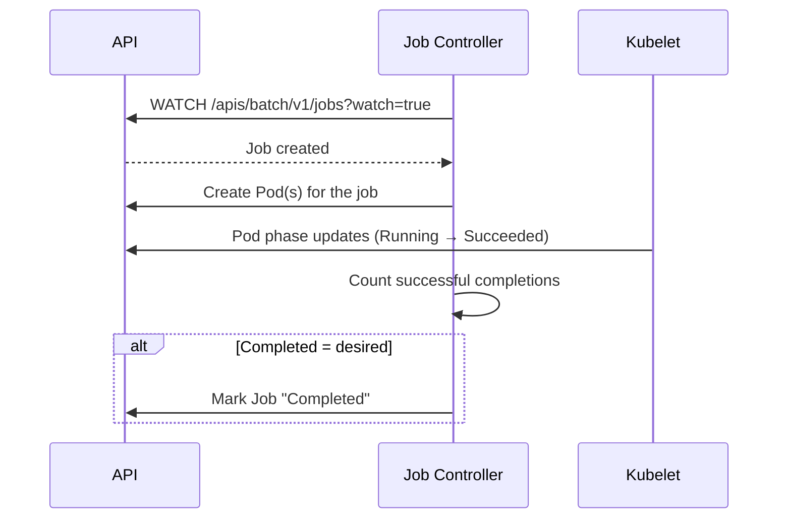

</div>

---

✅ Used for batch workloads.

---

### 📌 **6. Namespace Controller**

**Purpose:** Clean up resources when a namespace is deleted.

<div align="center" style="background-color: #255560ff; border-radius: 10px; border: 2px solid">

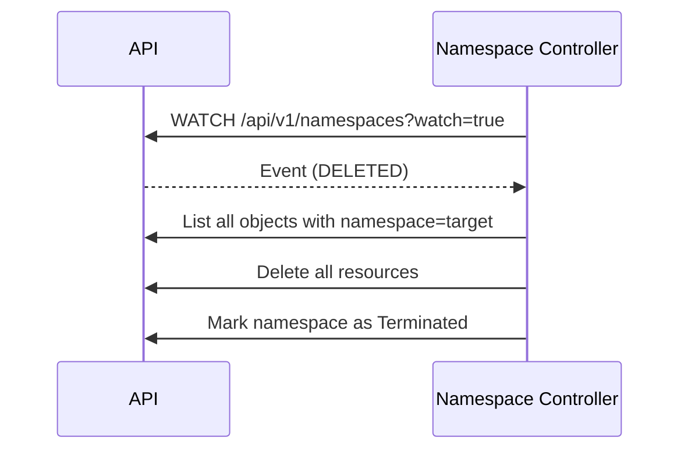

</div>

---

✅ Ensures no orphaned resources remain.

---

### 📌 **7. ServiceAccount Controller**

**Purpose:** Create default ServiceAccount in every namespace.

<div align="center" style="background-color: #255560ff; border-radius: 10px; border: 2px solid">

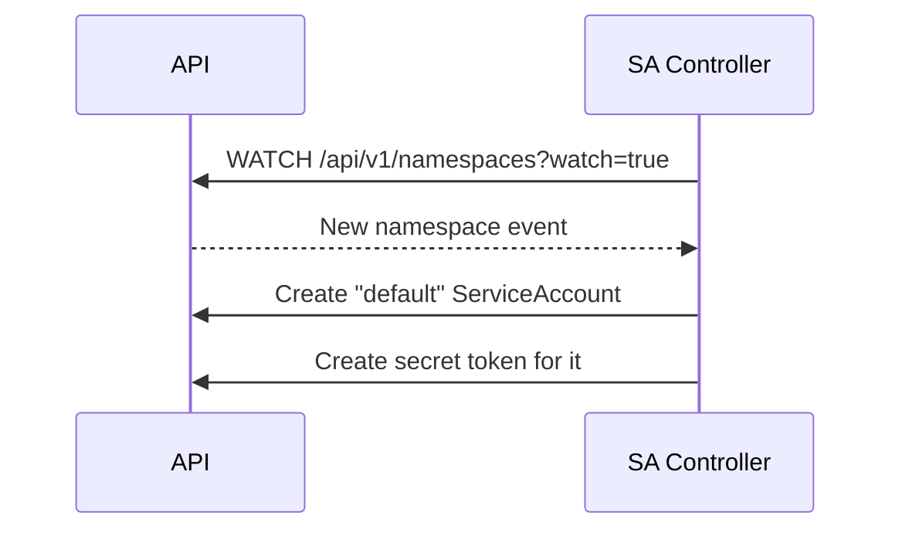

</div>

---

✅ Ensures workloads can authenticate to the API server.

---

### 📌 **8. ResourceQuota Controller**

**Purpose:** Prevent users from exceeding CPU, memory, or object limits.

<div align="center" style="background-color: #255560ff; border-radius: 10px; border: 2px solid">

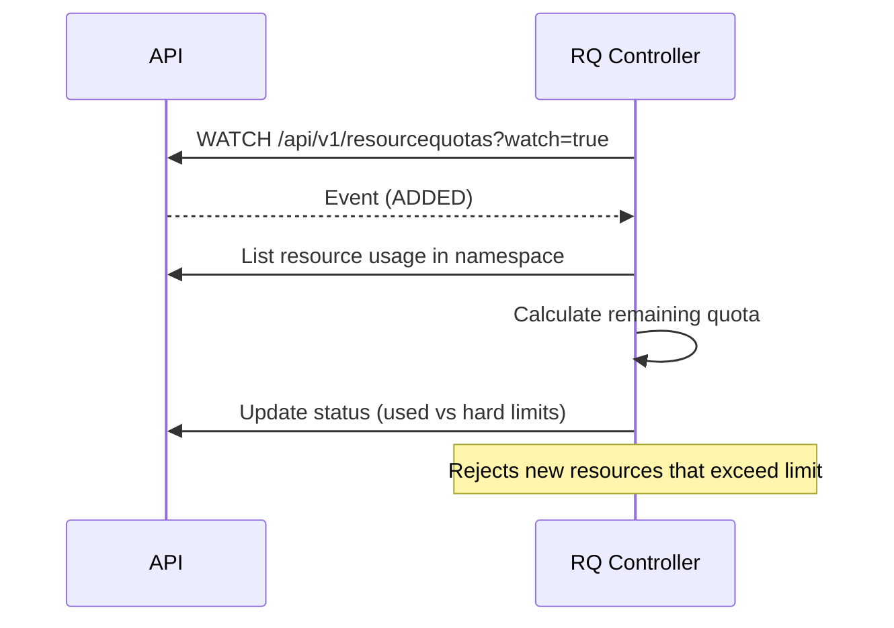

</div>

---

✅ Keeps per-namespace resource usage within limits.

---

## 🏁 **Summary** of Event Flow

All controllers share this **core flow**:

<div align="center" style="background-color: #255560ff; border-radius: 10px; border: 2px solid">

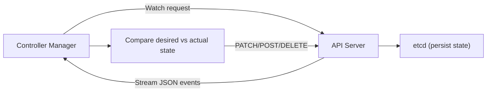

</div>

---

> ✅ Communication protocol: **HTTPS + JSON streaming**  
> ✅ Event-driven — **not polling**  
> ✅ Stateless — **safe to restart anytime**

---

## 🧠 **TL;DR**

<div align="center" style="background-color: #141a19ff;color: #a8a5a5ff; border-radius: 10px; border: 2px solid">

| Concept                     | Description                                                   |
| --------------------------- | ------------------------------------------------------------- |
| **Component Type**          | Separate process (not inside API Server)                      |
| **Connection**              | HTTPS REST + Watch stream to API Server                       |
| **Responsibilities**        | Run all built-in controllers                                  |
| **Core Loop**               | Watch → Compare → Update → Repeat                             |
| **Storage**                 | Uses API Server (which stores in etcd)                        |
| **Fault Tolerance**         | Stateless; safe to restart                                    |
| **Leader Election**         | Only one active in HA cluster                                 |
| **Communication Direction** | Always from controller → API Server (never direct to Kubelet) |

</div>

---

## 💎 **Visual Summary**

<div align="center" style="background-color: #255560ff; border-radius: 10px; border: 2px solid">

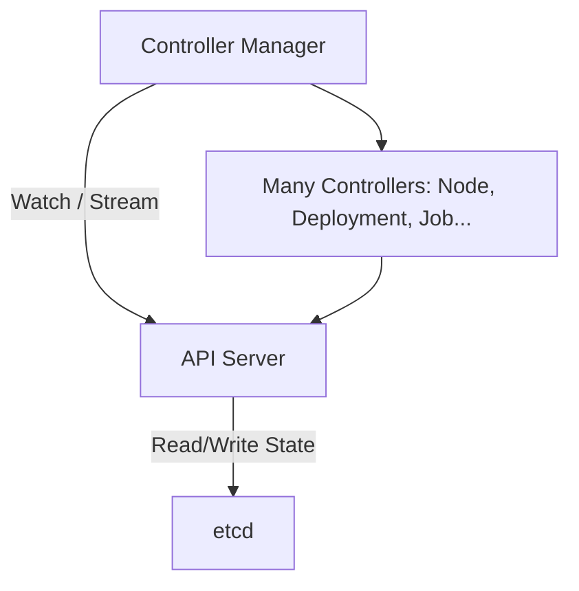

</div>

---

✅ **In plain English:**

> The Controller Manager is a standalone control-plane process that opens watch streams to the API Server for each resource it manages. Whenever something changes (like a Deployment, Node, or Job), it receives an event, checks what’s missing or wrong, and sends back API requests (create/update/delete) to make the cluster match the desired state.
