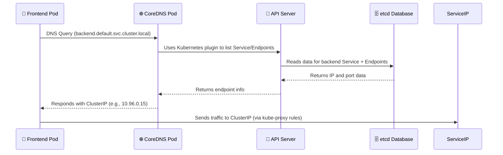

# 🌐 **Kubernetes DNS Server Internals**

DNS in Kubernetes isn’t just a utility — it’s **the heart of Pod-to-Pod communication**.  
Without it, services couldn’t find each other dynamically.

---

## 📖 **The Role of DNS in Kubernetes**

Every time one Pod wants to talk to another (like `frontend → backend`), it **doesn’t know IPs** (because Pods are ephemeral).  
Instead, it uses **DNS names** like:

```ini
backend.default.svc.cluster.local
```

That name is resolved by the **cluster DNS server** — which, in modern Kubernetes, is **CoreDNS** (formerly kube-dns).

---

## 🏗️ **`CoreDNS` Architecture**

CoreDNS is a **Pod** (actually a Deployment) that runs inside the `kube-system` namespace.

It’s not a single process — it’s a chain of plugins that process DNS queries.

### 🔧 CoreDNS Plugin Chain Example (`Corefile`)

```bash
.:53 {
    errors
    health
    ready
    kubernetes cluster.local in-addr.arpa ip6.arpa {
        pods insecure
        fallthrough in-addr.arpa ip6.arpa
    }
    prometheus :9153
    forward . /etc/resolv.conf
    cache 30
    loop
    reload
    loadbalance
}
```

### 📜 What This Means

<div align="center" style="background-color: #141a19ff;color: #a8a5a5ff; border-radius: 10px; border: 2px solid">

| Plugin        | Purpose                                                      |
| ------------- | ------------------------------------------------------------ |
| `errors`      | Logs query errors                                            |
| `health`      | Provides /health endpoint for readiness/liveness checks      |
| `ready`       | Exposes `/ready` endpoint for kubelet probes                 |
| `kubernetes`  | The magic plugin — answers DNS for Services and Pods         |
| `prometheus`  | Exposes metrics                                              |
| `forward`     | Forwards unknown queries (like `google.com`) to external DNS |
| `cache`       | Speeds up responses for repeated queries                     |
| `loop`        | Detects DNS loops                                            |
| `loadbalance` | Randomly rotates A/AAAA records for load balancing           |

</div>

---

## ⚙️ **How DNS Resolution Works** (Pod → CoreDNS → API Server → etcd)

Let’s follow the entire **DNS lookup lifecycle**:

### 🧭 Example Query

Pod `frontend` wants to reach Service `backend.default.svc.cluster.local`

---

### 🪄 Step-by-Step Flow

<div align="center" style="background-color: #255560ff; border-radius: 10px; border: 2px solid">



</div>

---

## 📜 **Service & Pod Naming Rules**

<div align="center" style="background-color: #141a19ff;color: #a8a5a5ff; border-radius: 10px; border: 2px solid">

| Object      | Example FQDN                            | Description                              |
| ----------- | --------------------------------------- | ---------------------------------------- |
| **Service** | `my-svc.my-namespace.svc.cluster.local` | Main service name                        |
| **Pod**     | `mypod.my-namespace.pod.cluster.local`  | Optional direct Pod lookup (rarely used) |

</div>

---

## 📦 **Components Involved**

<div align="center" style="background-color: #141a19ff;color: #a8a5a5ff; border-radius: 10px; border: 2px solid">

| Component                  | Role in DNS                                                |
| -------------------------- | ---------------------------------------------------------- |
| **CoreDNS Pod**            | Receives and answers DNS queries                           |
| **API Server**             | Data source for Services/Endpoints                         |
| **etcd**                   | Persistent storage for Service definitions                 |
| **Kubelet (on each node)** | Configures Pods to use cluster DNS IP (`/etc/resolv.conf`) |
| **CNI plugin**             | Ensures Pod can route packets to CoreDNS Pod’s IP          |

</div>

---

## 🧰 **What Happens Under the Hood**

### 1. When a Pod starts:

- Kubelet injects a **nameserver** into the Pod’s `/etc/resolv.conf`:

  ```ini
  nameserver 10.96.0.10
  search default.svc.cluster.local svc.cluster.local cluster.local
  ```

  `10.96.0.10` is the **ClusterIP of the CoreDNS Service** (`kube-dns`).

### 2. When Pod sends DNS query:

- The DNS request is routed (via CNI routes) to CoreDNS.
- CoreDNS:

  - Parses the domain.
  - Checks its **kubernetes plugin**.
  - Queries the API Server for that Service name.

- The API Server fetches from **etcd** the `ClusterIP` or Endpoint IPs.
- CoreDNS replies with the correct IP.

---

## ⚡ **Caching & Performance**

CoreDNS caches resolved entries (default: 30 seconds).  
This prevents overloading the API server with frequent queries.

For high-scale clusters, you can tune:

- TTL in `cache` plugin
- Use `autopath` to shorten search paths
- Add replica DNS pods for HA

---

## 🏁 **In One Line**

> **CoreDNS = Internal DNS + Smart Kubernetes-aware resolver**  
> It translates Service names → ClusterIPs dynamically by querying the API Server through the Kubernetes plugin.
