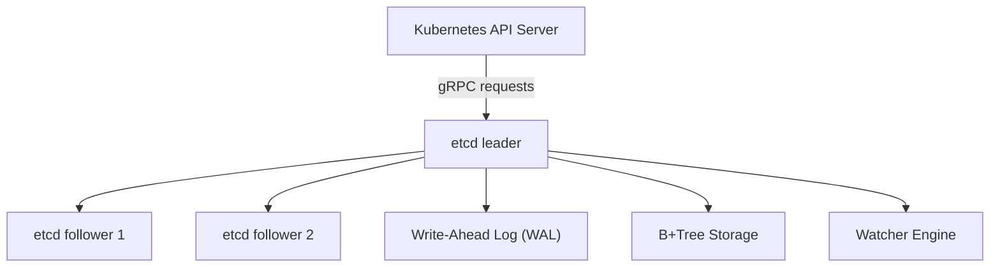
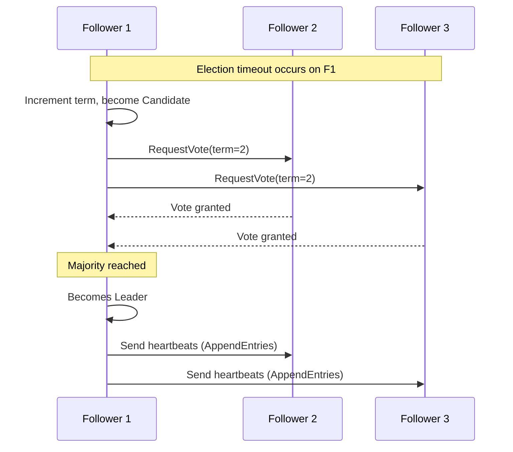
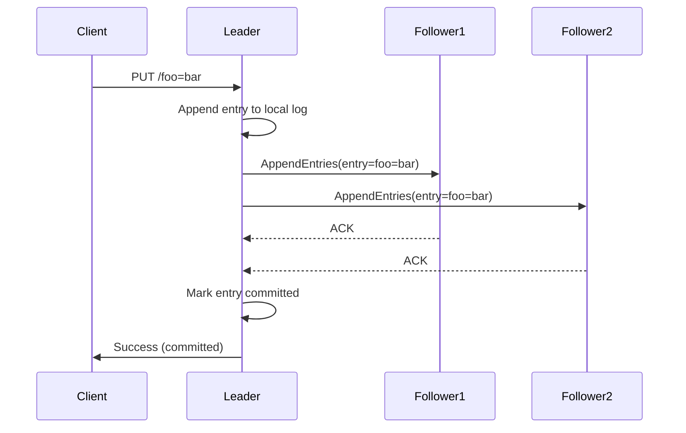
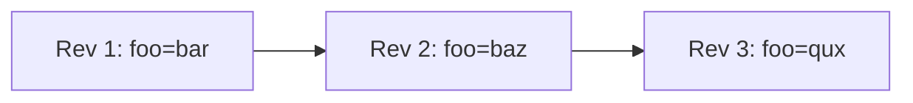
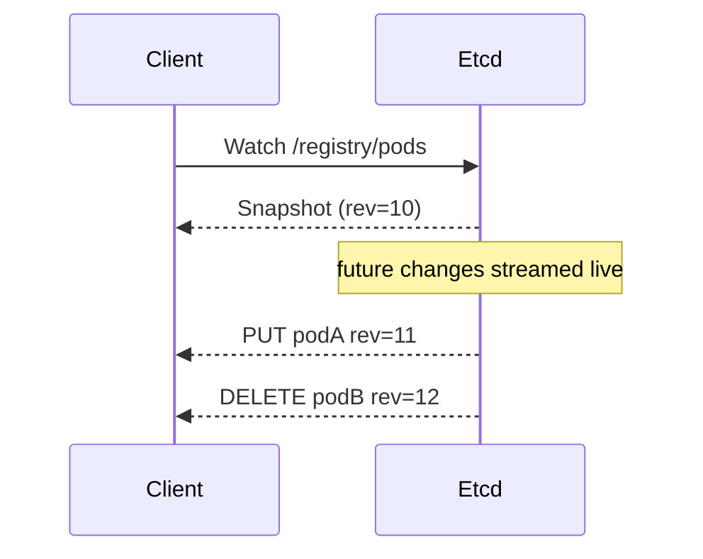
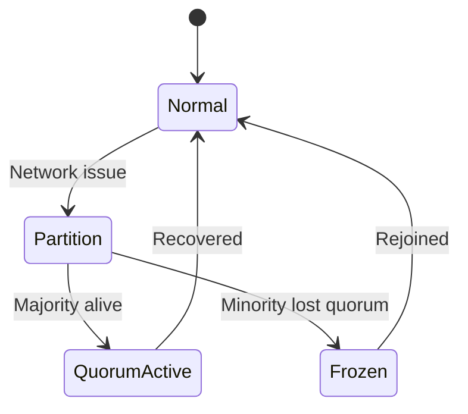
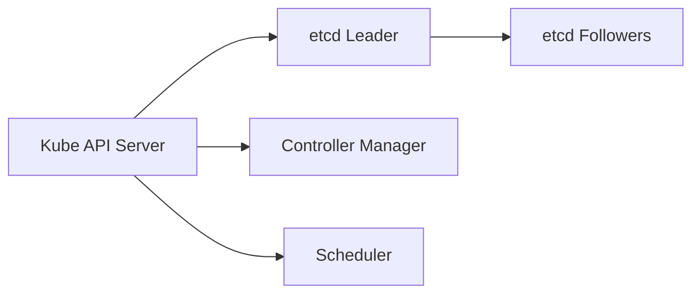
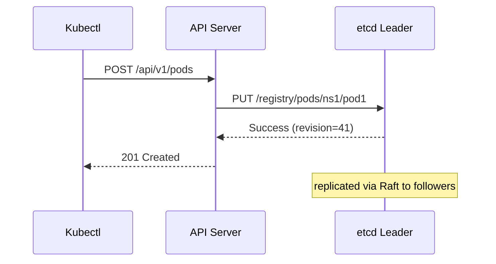
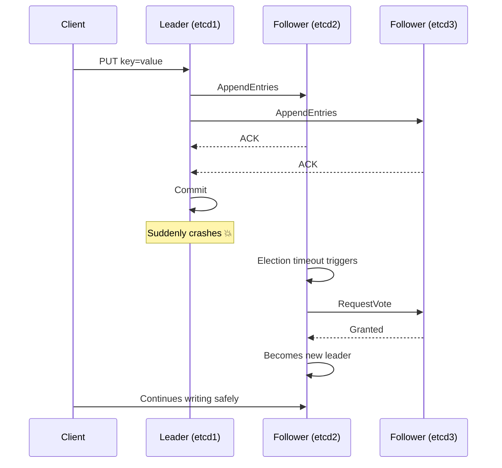
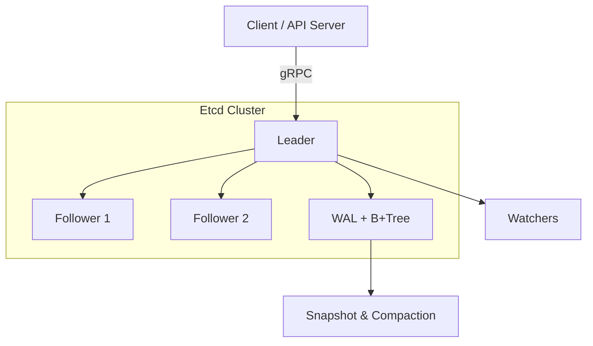

# 🫙 **ETCD Internals**

## 📖 **What is etcd?**

**etcd** is a **distributed, strongly consistent key-value store** written in Go, used by Kubernetes (and others) to store cluster state.

Think of it as:

> “A highly reliable, memory of truth for your cluster — powered by consensus and careful persistence.”

💡 In Kubernetes, _every Pod, Node, ConfigMap, Secret, or Deployment_ you create lives inside etcd.

---

## ⚙️ **High-Level Architecture**

<div align="center" style="background-color: #255560ff; border-radius: 10px; border: 2px solid">



</div>

<div align="center" style="background-color: #119684ff;color: #333236ff; border-radius: 10px; border: 2px solid">

| Component                    | Purpose                                               |
| ---------------------------- | ----------------------------------------------------- |
| **etcd cluster (3–5 nodes)** | Provides fault-tolerant replicated key-value store    |
| **Raft protocol**            | Ensures strong consistency via leader-based consensus |
| **WAL (Write-Ahead Log)**    | Guarantees durability                                 |
| **B+Tree Storage**           | Keeps actual key-value pairs on disk                  |
| **Watcher Engine**           | Streams real-time updates to clients                  |

</div>

---

## 🧩 **The Raft Consensus Core**

Etcd’s heart is the **Raft algorithm** — a simpler alternative to Paxos.
It ensures:

- ✅ A single authoritative leader
- ✅ Consistent replication
- ✅ Automatic failover
- ✅ Linearizable writes

---

### 🔁 1. The Three Roles

<div align="center" style="background-color: #119684ff;color:#000; border-radius: 10px; border: 2px solid">

| Role          | Description                                         |
| ------------- | --------------------------------------------------- |
| **Leader**    | Handles all writes; coordinates followers           |
| **Follower**  | Replicates entries, responds to leader’s heartbeats |
| **Candidate** | Temporary role during elections                     |

</div>

---

### 🧭 2. Leader Election — How a Cluster Bootstraps Itself

<div align="center" style="background-color: #255560ff; border-radius: 10px; border: 2px solid">



</div>

---

> 💡 Election timeouts are **randomized** (e.g., 150–300 ms) to avoid split votes.

---

### 🧮 3. Log Replication

<div align="center" style="background-color: #255560ff; border-radius: 10px; border: 2px solid">



</div>

---

> ✅ Only after a **majority of nodes (quorum)** acknowledge does the leader commit.  
> ✅ Each follower applies entries in identical order → consistent state.

---

### ⚡ 4. Read Paths: Linearizable vs Serializable

<div align="center" style="background-color: #119684ff;color:#000; border-radius: 10px; border: 2px solid">

| Read Type        | Behavior                                    | Latency |
| ---------------- | ------------------------------------------- | ------- |
| **Linearizable** | Contact the current leader → always fresh   | Higher  |
| **Serializable** | Serve from any node (may be slightly stale) | Lower   |

</div>

Example:

- Kubernetes API Server uses **linearizable reads** for writes/updates.
- Monitoring tools may use **serializable reads** for speed.

---

## 💾 **Storage Engine Internals**

Etcd uses a **multi-versioned key-value store (MVCC)**.
Every mutation creates a _new revision_ — older versions remain accessible until compacted.

---

### 📁 1. Data Directory Structure

```ini
/var/lib/etcd/
├── member/
│   ├── snap/               # Snapshots
│   ├── wal/                # Write-Ahead Logs
│   └── memberID.json
└── proxy/
```

Each node persists its state here.

---

### 📜 2. Write-Ahead Log (WAL)

- Append-only log of Raft entries
- Synced to disk before applying changes
- Used to recover from crashes

Flow:

```text
Client PUT -> Raft Entry -> WAL -> State Machine -> Snapshot
```

---

### 🌳 3. B+Tree & BoltDB

Etcd uses **BoltDB** (a Go embedded B+Tree database).
Each key is stored under a revision index.

Example internal structure:

| Key                     | Revision | Value            |
| ----------------------- | -------- | ---------------- |
| /registry/pods/ns1/pod1 | 5        | Pod spec JSON    |
| /registry/nodes/node1   | 7        | Node status JSON |

---

### 🧱 4. MVCC (Multi-Version Concurrency Control)

- Every transaction gets a **revision number**
- Reads at revision X see the state as of X
- Enables consistent snapshots and watches



Clients can query specific versions or watch from a revision.

---

## 👀 **Watch System** — Real-Time Change Streams

When something in etcd changes, watchers are triggered.
Perfect for systems like Kubernetes that react instantly to Pod/Config changes.

---

### 🔔 1. Watch Workflow

<div align="center" style="background-color: #255560ff; border-radius: 10px; border: 2px solid">



</div>

---

> ✅ Efficient push model — no polling  
> ✅ Ordered, reliable event stream  
> ✅ Can resume from `startRevision`

---

## 🧹 **Compaction and Snapshots**

Without cleanup, the MVCC store grows indefinitely.
That’s where **compaction** and **snapshotting** come in.

---

### 🧽 1. Compaction

- Removes revisions older than a specific number
- Frees disk and memory
- Prevents old watches from growing unbounded

```bash
etcdctl compact 1000
```

After compaction, you can’t watch from earlier revisions.

---

### 📸 2. Snapshotting

Snapshots capture the full state at a revision.

Used for:

- Fast follower catch-up
- Backup & restore
- Log truncation

```bash
etcdctl snapshot save /backup/etcd-snap.db
```

---

## 🔄 **Failure Recovery & Data Integrity**

### 💥 1. Node Crash

- On restart, etcd replays WAL entries not in snapshot
- Restores last committed state
- Rejoins cluster and syncs missing logs from leader

---

### 🔁 2. Network Partition

- Only majority (quorum) continues committing
- Minority partition stops accepting writes
- Once partition heals, minority syncs via AppendEntries or snapshot

<div align="center" style="background-color: #255560ff; border-radius: 10px; border: 2px solid">



</div>

---

## 🧮 **Internals of Raft Log Management**

<div align="center" style="background-color: #119684ff;color:#000; border-radius: 10px; border: 2px solid">

| Component           | Description                                                       |
| ------------------- | ----------------------------------------------------------------- |
| **unstable**        | Buffer of entries not persisted yet                               |
| **storage**         | Interface to persistent layer                                     |
| **committed index** | Highest index known to be safely replicated                       |
| **applied index**   | Highest entry applied to state machine                            |
| **Ready struct**    | Raft tells etcd: “Persist these entries and send these messages.” |

</div>

---

## 🧰 **Operational Mechanics**

### 🧩 1. Cluster Sizing

<div align="center" style="background-color: #119684ff;color:#000; border-radius: 10px; border: 2px solid">

| Cluster Size | Tolerates Failures | Majority (Quorum) |
| ------------ | ------------------ | ----------------- |
| 3            | 1                  | 2                 |
| 5            | 2                  | 3                 |
| 7            | 3                  | 4                 |

</div>

Always use an **odd number** to maintain quorum.

---

### ⚙️ 2. Backup and Restore

```bash
# Create snapshot
etcdctl snapshot save /tmp/etcd-backup.db

# Restore to new cluster
etcdctl snapshot restore /tmp/etcd-backup.db \
  --name new-member \
  --initial-cluster new-member=http://127.0.0.1:2380 \
  --initial-advertise-peer-urls http://127.0.0.1:2380 \
  --data-dir /var/lib/etcd-new
```

---

## 🧠 **etcd Inside Kubernetes**

### 🧬 1. Control Plane Relationship

<div align="center" style="background-color: #255560ff; border-radius: 10px; border: 2px solid">



</div>

---

<div align="center" style="background-color: #119684ff;color:#000; border-radius: 10px; border: 2px solid">

| Component              | Interaction                    |
| ---------------------- | ------------------------------ |
| **API Server**         | Direct gRPC connection to etcd |
| **Controller Manager** | Watches via API Server         |
| **Scheduler**          | Reads via API Server           |
| **kubectl**            | → API Server → etcd            |

</div>

The API server is the **only component** talking directly to etcd.

---

### 📡 2. API Server ↔ etcd Write Example

<div align="center" style="background-color: #255560ff; border-radius: 10px; border: 2px solid">



</div>

---

## 🔍 **Performance Optimization**

Tips from production clusters:

<div align="center" style="background-color: #119684ff;color:#000; border-radius: 10px; border: 2px solid">

| Area                              | Recommendation                                          |
| --------------------------------- | ------------------------------------------------------- |
| **Disk**                          | Use SSD/NVMe, disable write cache                       |
| **Network**                       | Low latency (<1 ms between peers)                       |
| **Snapshot frequency**            | Adjust via `--snapshot-count`                           |
| **Heartbeat & Election timeouts** | Tune for stability (default 100 ms / 1 s)               |
| **Monitor**                       | Use `etcdctl endpoint status` and metrics at `/metrics` |

</div>

---

## 🛡️ **Security (TLS Everywhere)**

Etcd uses **mutual TLS** between all peers and clients.

Example config snippet:

```bash
etcd \
  --cert-file=/etc/etcd/server.crt \
  --key-file=/etc/etcd/server.key \
  --client-cert-auth=true \
  --trusted-ca-file=/etc/etcd/ca.crt
```

✅ Encrypts both client and peer traffic  
✅ Ensures only authenticated nodes join cluster

---

## 🧮 **Metrics and Observability**

Expose Prometheus metrics:

```ini
GET http://localhost:2379/metrics
```

Key metrics:

- `etcd_server_leader_changes_seen_total`
- `etcd_disk_wal_fsync_duration_seconds`
- `etcd_network_peer_round_trip_time_seconds`
- `etcd_mvcc_db_total_size_in_bytes`

---

## 🧩 **Example Failure Scenario** — Leader Crash Recovery

<div align="center" style="background-color: #255560ff; border-radius: 10px; border: 2px solid">



</div>

> 👉🏻 Zero data loss thanks to majority replication.

---

## 🧠 **Summary** — Why etcd is a Jewel of Kubernetes

- ✅ **Strong Consistency** — every read/write is predictable
- ✅ **Raft-based reliability** — safe leader elections, no split-brain
- ✅ **Efficient Storage** — MVCC + compaction + snapshot
- ✅ **Reactive System** — watch API drives K8s controllers
- ✅ **Secure by design** — TLS, client authentication
- ✅ **Simple but robust** — one binary, well-defined gRPC API

---

## 📚 **Key Commands** Cheat Sheet

<div align="center" style="background-color: #119684ff;color:#000; border-radius: 10px; border: 2px solid">

| Purpose              | Command                         |
| -------------------- | ------------------------------- |
| List cluster members | `etcdctl member list`           |
| Health check         | `etcdctl endpoint health`       |
| Store key            | `etcdctl put foo bar`           |
| Get key              | `etcdctl get foo`               |
| Watch key            | `etcdctl watch foo`             |
| Snapshot backup      | `etcdctl snapshot save snap.db` |
| Compact              | `etcdctl compact 1000`          |

</div>

---

## 🧩 **Visual Summary**

<div align="center" style="background-color: #255560ff; border-radius: 10px; border: 2px solid">



</div>
