Perfect — here’s a **simple, visual, and real-world explanation** of how **Ingress** works both **practically** and **internally**, with an **example traffic flow**.

---

# 🌍 Kubernetes Ingress — Practical & Internal View

Ingress = **Smart traffic controller** for your cluster’s HTTP/HTTPS traffic.
It lets **external users** (Internet) reach your **internal services (Pods)** without exposing each service separately.

---

## 🧩 Why Ingress Exists

Without Ingress, you’d have to:

* Expose each Service using `LoadBalancer` or `NodePort`.
* Each one gets its own public IP (expensive and messy).

Ingress gives you **one unified entry point (one IP)**, and routes traffic **based on rules (paths, hosts, etc.)**.

---

## 🏗️ Main Components

| Component              | Role                                                                                                        |
| ---------------------- | ----------------------------------------------------------------------------------------------------------- |
| **Ingress Resource**   | A YAML object with routing rules (hostnames, paths, backends).                                              |
| **Ingress Controller** | The actual engine (e.g., Nginx, Traefik, HAProxy) that reads those rules and configures itself dynamically. |
| **Service**            | Represents your backend application (ClusterIP).                                                            |
| **Pods**               | Actual app containers receiving requests.                                                                   |

---

## ⚙️ Step-by-Step Traffic Flow Example

Let’s say you deployed:

* **Service A** = `frontend`
* **Service B** = `api`
* Both inside the cluster.
* You want external users to reach:

  * `myapp.com` → frontend
  * `myapp.com/api` → backend

---

### 🧭 Traffic Journey

```mermaid
sequenceDiagram
    participant User as 🌎 User (Browser)
    participant Ingress as 🚪 Ingress Controller (Nginx)
    participant SvcA as 🧱 Service: frontend
    participant PodA as 🧩 Pod: frontend-123
    participant SvcB as 🧱 Service: api
    participant PodB as ⚙️ Pod: api-xyz

    User->>Ingress: GET https://myapp.com/
    Ingress->>SvcA: Routes to Service "frontend"
    SvcA->>PodA: Forwards request via kube-proxy/CNI
    PodA-->>User: Sends HTML response

    User->>Ingress: GET https://myapp.com/api/
    Ingress->>SvcB: Routes to Service "api"
    SvcB->>PodB: Forwards request
    PodB-->>User: Sends JSON response
```



---

## 🧩 How Ingress Actually Works Internally

1. **Ingress Controller Pod (e.g., Nginx)** is deployed in the cluster.
2. It continuously **watches the API Server** for new or updated **Ingress resources**.
3. When it detects one, it **rebuilds its internal config** (like nginx.conf).
4. When traffic arrives at the external LoadBalancer IP:

   * The LoadBalancer (or NodePort) forwards packets to the Ingress Controller Pod.
   * The Ingress Controller checks routing rules (host/path).
   * Then it **proxies traffic** to the right Service → Pod.
5. **kube-proxy + CNI** handle the internal networking to reach the Pod.

---

## 🧱 Example Ingress YAML

```yaml
apiVersion: networking.k8s.io/v1
kind: Ingress
metadata:
  name: myapp-ingress
spec:
  ingressClassName: nginx
  rules:
  - host: myapp.com
    http:
      paths:
      - path: /
        pathType: Prefix
        backend:
          service:
            name: frontend
            port:
              number: 80
      - path: /api
        pathType: Prefix
        backend:
          service:
            name: api
            port:
              number: 8080
```

---

## ⚡ Internal Flow (Simplified Layers)

| Step | Layer           | Who Handles It      | Description                                                       |
| ---- | --------------- | ------------------- | ----------------------------------------------------------------- |
| 1    | Internet        | Cloud Load Balancer | Sends incoming requests to Ingress Controller Pod (via NodePort). |
| 2    | Cluster Edge    | Ingress Controller  | Reads Ingress rules → decides backend Service.                    |
| 3    | Cluster Network | kube-proxy + CNI    | Routes traffic to Pod’s IP inside cluster.                        |
| 4    | Pod             | App Container       | Processes and returns response.                                   |

---

## 🧠 In One Line

> **Ingress = Smart Router inside Kubernetes.**
> It listens for HTTP(S) traffic, reads routing rules from the API Server,
> and forwards requests to the correct internal Service (and thus, Pod).

---

Would you like me to add a **visual architecture diagram (Nginx Ingress Controller + Services + LoadBalancer)** showing all traffic hops (external → Ingress → Service → Pod)?
