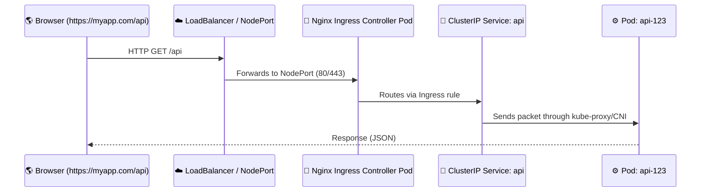

Exactly ✅ — you’ve got the **core idea perfectly right**, now let’s break it down step-by-step so it fully “clicks” in your mind with the complete flow 👇

---

# 🌐 Why Ingress Exists

Normally, if you had **3 microservices**:

```
frontend
api
auth
```

you’d need **3 different NodePorts / LoadBalancers** to expose them externally:

| Service  | Type         | External Port | Cost |
| -------- | ------------ | ------------- | ---- |
| frontend | LoadBalancer | :80           | 💸   |
| api      | LoadBalancer | :81           | 💸   |
| auth     | LoadBalancer | :82           | 💸   |

That’s **3 public IPs, 3 firewall rules, and 3 DNS entries.**

🚫 Messy. Expensive. Hard to maintain.

---

# ✅ What Ingress Does

Ingress **centralizes all external traffic** behind **a single public entry point**.

It gives you **1 LoadBalancer / 1 NodePort**,
and **routes traffic inside** the cluster based on **URL paths or hostnames**.

---

## 💡 Core Idea

> “Instead of giving every Service its own door to the Internet,
> Ingress puts one big main gate — and decides who goes where.”

---

## ⚙️ Step-by-Step Practical Flow

### 1️⃣ Deploy Your Services (internal only)

They stay as **ClusterIP** (private inside cluster).

```yaml
apiVersion: v1
kind: Service
metadata:
  name: frontend
spec:
  type: ClusterIP
  selector:
    app: frontend
  ports:
    - port: 80
```

Same for `api` and `auth`.

---

### 2️⃣ Deploy Ingress Controller

Example: **NGINX Ingress Controller**

When installed (via Helm or manifest), it automatically creates a **Service** called something like:

```bash
nginx-ingress-controller
```

Depending on your cluster setup:

| Cluster Type        | Service Type Created | Meaning                                                      |
| ------------------- | -------------------- | ------------------------------------------------------------ |
| Cloud (EKS/GKE/AKS) | `LoadBalancer`       | Automatically gets a **public IP** from your cloud provider. |
| On-Prem / Minikube  | `NodePort`           | You manually expose one node’s IP and port externally.       |

---

### 3️⃣ Expose That One Entry Point

Now you have **just one NodePort or LoadBalancer** (the Ingress Controller’s service):

- All HTTP/HTTPS traffic from the internet hits this IP:Port.
- From there, the **Ingress Controller Pod** decides which internal Service to send it to.

---

### 4️⃣ Create Ingress Rules (the “map”)

```yaml
apiVersion: networking.k8s.io/v1
kind: Ingress
metadata:
  name: myapp
spec:
  ingressClassName: nginx
  rules:
    - host: myapp.com
      http:
        paths:
          - path: /
            pathType: Prefix
            backend:
              service:
                name: frontend
                port:
                  number: 80
          - path: /api
            pathType: Prefix
            backend:
              service:
                name: api
                port:
                  number: 8080
```

---

### 5️⃣ Full Traffic Path Example

Let’s visualize the **end-to-end journey** 👇



---

## 🧱 What’s Actually Exposed to the Outside World?

| Component                                  | Type                    | Exposed? | Purpose                              |
| ------------------------------------------ | ----------------------- | -------- | ------------------------------------ |
| **Ingress Controller Service**             | NodePort / LoadBalancer | ✅ Yes   | The single public entry point        |
| **Backend Services (frontend, api, auth)** | ClusterIP               | ❌ No    | Internal-only, reachable via Ingress |

---

## 🧠 In Short

> **Ingress = One LoadBalancer → Many Services**

- You **only expose** the **Ingress Controller Service** (NodePort or LoadBalancer).
- It **internally routes** requests to the correct **ClusterIP Service** based on:

  - **Path** (`/`, `/api`, `/auth`)
  - or **Hostname** (`app.company.com`, `api.company.com`)

---

Would you like me to show you the **exact internal packet flow (kernel, kube-proxy, CNI)** for when a user hits the LoadBalancer IP → how it reaches the right Pod behind Ingress?
(That’s the “real networking magic” part — very fun to see 😎)
