# 🚦 **Ingress Controller**

## 📖 **What is an Ingress Controller?**

The **Ingress Controller** is a pod or service running inside the cluster that implements the Ingress rules. It's responsible for receiving external traffic, processing the rules defined in the Ingress resources, and forwarding the traffic to the appropriate Kubernetes services.

Common Ingress Controllers include:

- **NGINX Ingress Controller**
- **Traefik**
- **HAProxy**
- **Contour**

---

## 🔴 **Why Ingress Exists**

Normally, if you had **3 microservices**:

```ini
frontend
api
auth
```

you’d need **3 different NodePorts / LoadBalancers** to expose them externally:

| Service  | Type         | External Port | Cost |
| -------- | ------------ | ------------- | ---- |
| frontend | LoadBalancer | :80           | 💸   |
| api      | LoadBalancer | :81           | 💸   |
| auth     | LoadBalancer | :82           | 💸   |

That’s **3 public IPs, 3 firewall rules, and 3 DNS entries.**

🚫 Messy. Expensive. Hard to maintain.

---

## 🟢 **What Ingress Does**

Ingress **centralizes all external traffic** behind **a single public entry point**.

It gives you **1 LoadBalancer / 1 NodePort**,
and **routes traffic inside** the cluster based on **URL paths or hostnames**.

---

## 💡 **Core Idea**

> “Instead of giving every Service its own door to the Internet,
> Ingress puts one big main gate — and decides who goes where.”

---

## ⚙️ Step-by-Step Practical Flow

### 1️⃣ Deploy Your Services (internal only)

They stay as **ClusterIP** (private inside cluster).

```yaml
apiVersion: v1
kind: Service
metadata:
  name: frontend
spec:
  type: ClusterIP
  selector:
    app: frontend
  ports:
    - port: 80
```

Same for `api` and `auth`.

---

### 2️⃣ Deploy Ingress Controller

Example: **NGINX Ingress Controller**

When installed (via Helm or manifest), it automatically creates a **Service** called something like:

```bash
nginx-ingress-controller
```

Depending on your cluster setup:

| Cluster Type        | Service Type Created | Meaning                                                      |
| ------------------- | -------------------- | ------------------------------------------------------------ |
| Cloud (EKS/GKE/AKS) | `LoadBalancer`       | Automatically gets a **public IP** from your cloud provider. |
| On-Prem / Minikube  | `NodePort`           | You manually expose one node’s IP and port externally.       |

---

### 3️⃣ Expose That One Entry Point

Now you have **just one NodePort or LoadBalancer** (the Ingress Controller’s service):

- All HTTP/HTTPS traffic from the internet hits this IP:Port.
- From there, the **Ingress Controller Pod** decides which internal Service to send it to.

---

### 4️⃣ Create Ingress Rules (the “map”)

```yaml
apiVersion: networking.k8s.io/v1
kind: Ingress
metadata:
  name: myapp
spec:
  ingressClassName: nginx
  rules:
    - host: myapp.com
      http:
        paths:
          - path: /
            pathType: Prefix
            backend:
              service:
                name: frontend
                port:
                  number: 80
          - path: /api
            pathType: Prefix
            backend:
              service:
                name: api
                port:
                  number: 8080
```

---

### 5️⃣ Full Traffic Path Example

Let’s visualize the **end-to-end journey** 👇

```mermaid
sequenceDiagram
    participant User as 🌎 Browser (https://myapp.com/api)
    participant LB as ☁️ LoadBalancer / NodePort
    participant Ingress as 🚪 Nginx Ingress Controller Pod
    participant APIService as 🧱 ClusterIP Service: api
    participant Pod as ⚙️ Pod: api-123

    User->>LB: HTTP GET /api
    LB->>Ingress: Forwards to NodePort (80/443)
    Ingress->>APIService: Routes via Ingress rule
    APIService->>Pod: Sends packet through kube-proxy/CNI
    Pod-->>User: Response (JSON)
```

<div align="center" style="background-color: #232b2dff; border-radius: 10px; border: 2px solid">



</div>

---

## 🧱 What’s Actually Exposed to the Outside World?

| Component                                  | Type                    | Exposed? | Purpose                              |
| ------------------------------------------ | ----------------------- | -------- | ------------------------------------ |
| **Ingress Controller Service**             | NodePort / LoadBalancer | ✅ Yes   | The single public entry point        |
| **Backend Services (frontend, api, auth)** | ClusterIP               | ❌ No    | Internal-only, reachable via Ingress |

---

## 🧠 In Short

> **Ingress = One LoadBalancer → Many Services**

- You **only expose** the **Ingress Controller Service** (NodePort or LoadBalancer).
- It **internally routes** requests to the correct **ClusterIP Service** based on:

  - **Path** (`/`, `/api`, `/auth`)
  - or **Hostname** (`app.company.com`, `api.company.com`)
