# 🧩 **Ingress Controller Components**

## 📖 **What Actually Is “Ingress”?**

Let’s clarify this once and for all:

> ❗“Ingress” is not a single component — it’s an **architecture pattern** in Kubernetes
> made of multiple resources and processes working together.

The **Ingress system** =
🧩 **Ingress Resource (rules)**

- ⚙️ **Ingress Controller (engine)**
- 🚪 **Ingress Service (exposure layer)**
- 🌐 **Backend Services & Pods (targets)**

---

## 1️⃣ **Component #1** — **`Ingress Resource`**

### 💡 What It Is

A Kubernetes **API object** (Custom Resource Definition CRD) that defines:

- Hostname (e.g., `myapp.com`)
- Path rules (`/`, `/api`, `/auth`)
- Which backend Service each path should forward to
- Optional TLS secrets for HTTPS

### 🧾 Example

```yaml
apiVersion: networking.k8s.io/v1
kind: Ingress
metadata:
  name: myapp
spec:
  ingressClassName: nginx
  tls:
    - hosts:
        - myapp.com
      secretName: tls-secret
  rules:
    - host: myapp.com
      http:
        paths:
          - path: /
            pathType: Prefix
            backend:
              service:
                name: frontend
                port:
                  number: 80
          - path: /api
            pathType: Prefix
            backend:
              service:
                name: api
                port:
                  number: 8080
```

---

> 🚨 That’s just configuration; the logic is implemented by the Ingress Controller pods.

---

## 2️⃣ **Component #2** — **`IngressClass`**

### 💡 What It Is

A **metadata link** between the `Ingress` resources and the controller that should handle them.

If you have multiple Ingress Controllers (e.g., Nginx + Istio + AWS ALB), this defines which one processes your rules.

```yaml
apiVersion: networking.k8s.io/v1
kind: IngressClass
metadata:
  name: nginx
spec:
  controller: k8s.io/ingress-nginx
```

Then in your Ingress rule:

```yaml
spec:
  ingressClassName: nginx
```

---

> 🚨 It's tracked by ingress deployment and he use it fo filtering to Ensures the Nginx controller only processes its own Ingress objects.

---

## 3️⃣ **Component #3** — **`Ingress Controller`**

### 💡 What It Is

A **real running application** (usually Nginx, Traefik, HAProxy, or Envoy) that implements the logic for handling and routing HTTP/S traffic.

🚨 **Note:**

> The **Ingress Controller** is <u title="بالفعل">indeed</u> a **custom controller**,  
> but its **logic runs as a binary inside Pods managed by a Deployment** Not in the control plane as loop back processes.  
> This makes it portable, scalable, and namespace-isolated — unlike built-in control plane controllers.

### 🚀 Created As:

- A **Deployment** (for HA, runs multiple replicas)
- A **Service** (to expose it externally)
- Usually deployed in the **namespace:** `ingress-nginx` or `kube-system`

### 🧠 Responsibilities:

<div align="center" style="background-color: #141a19ff;color: #a8a5a5ff; border-radius: 10px; border: 2px solid">

| Task                   | Description                                                |
| ---------------------- | ---------------------------------------------------------- |
| 👂 Watch API Server    | Watches all `Ingress` resources in the cluster             |
| 🧾 Parse Rules         | Reads host/path mappings and backend services              |
| ⚙️ Generate Config     | Dynamically builds routing config (e.g., `nginx.conf`)     |
| 🔄 Reload On Change    | Reconfigures itself when rules change                      |
| 📡 Handle HTTP Traffic | Listens on 80/443 and proxies requests to backend services |
| 🔐 Manage TLS          | Terminates HTTPS if TLS secrets are attached               |

</div>

---

## 4️⃣ **Component #4** — **`Ingress Controller Service`**

This is the **entry point** to the cluster traffic.

### 💡 What It Is

A standard **Kubernetes Service** that exposes the controller pods.

### 🔢 Service Types

<div align="center" style="background-color: #141a19ff;color: #a8a5a5ff; border-radius: 10px; border: 2px solid">

| Environment            | Service Type                                 | Description                                 |
| ---------------------- | -------------------------------------------- | ------------------------------------------- |
| Local (Kind, Minikube) | `NodePort`                                   | Opens port on all nodes (e.g., 32080/32443) |
| Cloud (EKS, GKE, AKS)  | `LoadBalancer`                               | Allocates a public cloud load balancer      |
| On-Prem                | `NodePort` + External LB manually configured | You provide your own entry IP               |

</div>

### ⚙️ Function

- Receives all HTTP/HTTPS traffic first
- Forwards packets to one of the Ingress Controller pods
- Acts like a “gateway” service

---

## ⚙️ **How Ingress Controller Builds Its Routing Logic**

Let’s see what happens inside one of those Nginx controller pods.

1. **Starts Up**
   → Connects to the Kubernetes API
   → Subscribes to watch events for:

   - Ingress resources
   - Services
   - Endpoints
   - Secrets (for TLS)

2. **Watches for Changes**
   When a new Ingress is created or updated:

   - The controller detects it immediately (via informer).

3. **Regenerates Configuration**
   It rebuilds an internal config (e.g., Nginx’s `nginx.conf`).

4. **Hot Reloads**
   The controller triggers a smooth reload of its proxy process without downtime.

5. **Handles Requests**
   For every HTTP request:

   - Parses Host and Path
   - Finds matching backend
   - Sends traffic to the correct ClusterIP Service.

---

## 🖼️ **The Full Internal Chain**

Let’s follow one **live request** inside your Kind cluster:

```mermaid
sequenceDiagram
  participant Browser as 🌍 Browser
  participant NodePort as 🔌 NodePort:32080
  participant IngressPod as ⚙️ Ingress Controller Pod (Nginx)
  participant API as 📜 Ingress Resource (Rules)
  participant BackendSvc as 🚦 ClusterIP Service (api)
  participant Pod as 🌐 Backend Pod

  Browser->>NodePort: HTTP GET /api
  NodePort->>IngressPod: Forwards to controller
  IngressPod->>API: Matches rule /api → api:8080
  IngressPod->>BackendSvc: Forwards traffic
  BackendSvc->>Pod: Kube-proxy routes to endpoint
  Pod-->>Browser: JSON Response
```

<div align="center" style="background-color: #232b2dff; border-radius: 10px; border: 2px solid">



</div>

---

## ➕ **Supporting Components**

<div align="center" style="background-color: #141a19ff;color: #a8a5a5ff; border-radius: 10px; border: 2px solid">

| Component              | Type                  | Role                                                    |
| ---------------------- | --------------------- | ------------------------------------------------------- |
| **ConfigMap**          | Cluster-scoped config | Nginx tuning (timeouts, body size, etc.)                |
| **Secret**             | Namespaced            | Stores TLS certificates                                 |
| **ServiceAccount**     | Namespaced            | Used by controller pods to access API Server            |
| **Role & RoleBinding** | RBAC                  | Grants permission to watch Ingresses, Services, Secrets |

</div>

---

## 🏁 **Summary Table**

<div align="center" style="background-color: #141a19ff;color: #a8a5a5ff; border-radius: 10px; border: 2px solid">

| Layer | Component                  | Kind                  | Namespace     | Main Role                   |
| ----- | -------------------------- | --------------------- | ------------- | --------------------------- |
| 1️⃣    | Ingress Resource           | API Object            | app ns        | Defines routing rules       |
| 2️⃣    | IngressClass               | API Object            | cluster-wide  | Binds Ingress to controller |
| 3️⃣    | Ingress Controller         | Deployment + Pods     | ingress-nginx | Implements the logic        |
| 4️⃣    | Ingress Controller Service | Service (NodePort/LB) | ingress-nginx | Exposes controller pods     |
| 5️⃣    | ConfigMap                  | Config                | ingress-nginx | Controller config tuning    |
| 6️⃣    | Secrets                    | Object                | app ns        | TLS certificates            |
| 7️⃣    | Backend Services           | ClusterIP             | app ns        | Target destinations         |
| 8️⃣    | Pods                       | Runtime               | app ns        | Actual app containers       |

</div>

---

## 🧠 **TL;DR**

> 💡 **Ingress = Reverse Proxy as a Kubernetes Native Service.**
>
> - You define **Ingress Resources** → Rules (Hosts, Paths).
> - **Ingress Controller** watches them → Generates proxy config.
> - **Ingress Service** exposes it → One entry point for all.
> - **Requests** → Routed internally → Correct **ClusterIP Services** → **Pods**.
