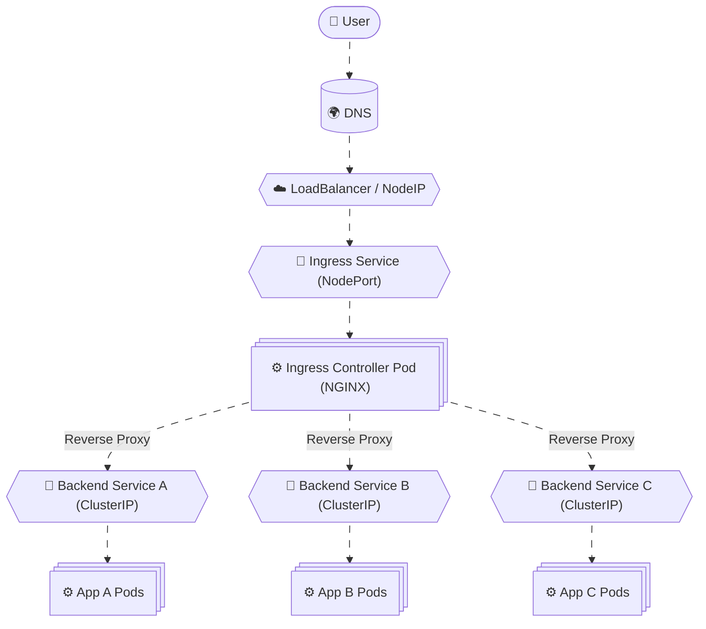
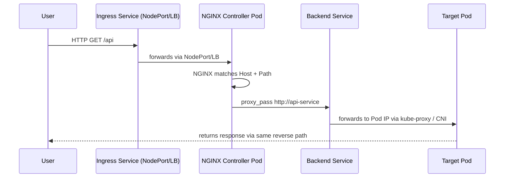

# 🌐 **Kubernetes Ingress Controller Internals**

_(from YAML → Pod → Routing → NGINX Config → Network Flow)!_

---

## 🔴 **The Problem Before Ingress**

Imagine you deployed 3 apps inside your cluster:

- `frontend-service` (port 80)
- `api-service` (port 8080)
- `admin-service` (port 9000)

Without Ingress, you had two bad choices:

- ❌ Expose each service with a **NodePort** (e.g. `:30001`, `:30002`, `:30003`)
- ❌ Or use a **LoadBalancer** per service (expensive in cloud environments)

That meant multiple public IPs or weird URLs like:

```ini
http://nodeip:30001/
http://nodeip:30002/
```

👎 Not scalable. Not pretty. Not cheap.

---

## 🟢 **Enter the Hero: Ingress**

**Ingress** solves this by being a single, smart entry point.
You define **routing rules** in one YAML file (Ingress Resource), and an **Ingress Controller** applies those rules dynamically.

**In short:**

> One IP → Many internal Services
> One Ingress Controller → Many routing rules

---

## 🏗️ **Ingress Architecture Overview**

<div align="center" style="background-color: #232b2dff; border-radius: 10px; border: 2px solid">



</div>

---

## 🧩 **Core Components Explained**

<div align="center" style="background-color: #141a19ff;color: #a8a5a5ff; border-radius: 10px; border: 2px solid">

| Component                 | Type                              | Role                                                                                |
| ------------------------- | --------------------------------- | ----------------------------------------------------------------------------------- |
| **Ingress Resource**      | Custom API Object                 | Declares desired routing (host/path → service:port).                                |
| **IngressClass Resource** | API Object                        | Declares _which controller_ will handle that Ingress.                               |
| **Ingress Controller**    | Deployment (Pods)                 | Runs the control loop that watches Ingresses and updates proxy config (like NGINX). |
| **Ingress Service**       | Service (NodePort / LoadBalancer) | Exposes the controller Pods to external world.                                      |
| **Reverse Proxy Process** | Inside Pod                        | Applies routing rules in real time (usually NGINX, HAProxy, or Envoy).              |

</div>

---

## 🪜 **How It Works – Step-by-Step**

Let’s break the full flow in _chronological order_, from YAML → Pod → Traffic.

---

### 🧾 Step 1: You Define the Ingress Resource

```yaml
apiVersion: networking.k8s.io/v1
kind: Ingress
metadata:
  name: myapp
spec:
  ingressClassName: nginx
  rules:
    - host: example.com
      http:
        paths:
          - path: /api
            pathType: Prefix
            backend:
              service:
                name: api-service
                port:
                  number: 8080
          - path: /admin
            pathType: Prefix
            backend:
              service:
                name: admin-service
                port:
                  number: 9000
```

You’re basically saying:

> “Hey Kubernetes, when traffic comes for `example.com/api` or `/admin`, send it to those internal services.”

This YAML only defines **desired state** — no routing happens yet.

---

### 🧾 Step 2: You Have an IngressClass

```yaml
apiVersion: networking.k8s.io/v1
kind: IngressClass
metadata:
  name: nginx
spec:
  controller: k8s.io/ingress-nginx
```

This defines _which controller implementation_ handles your Ingress.
If multiple controllers exist (say, NGINX and Traefik), the `controller:` string helps each one filter Ingresses it owns.

> Think of this as “the department responsible for your traffic rules”.

---

### 🚀 Step 3: The Ingress Controller Deployment (the brains)

```yaml
apiVersion: apps/v1
kind: Deployment
metadata:
  name: ingress-nginx-controller
  namespace: ingress-nginx
spec:
  replicas: 1
  selector:
    matchLabels:
      app.kubernetes.io/name: ingress-nginx
  template:
    metadata:
      labels:
        app.kubernetes.io/name: ingress-nginx
    spec:
      serviceAccountName: ingress-nginx
      containers:
        - name: controller
          image: registry.k8s.io/ingress-nginx/controller:v1.13.3
          args:
            - /nginx-ingress-controller
            - --controller-class=k8s.io/ingress-nginx
            - --ingress-class=nginx
            - --configmap=$(POD_NAMESPACE)/ingress-nginx-controller
```

This runs a **controller binary** (like `nginx-ingress-controller`) inside a Pod.

---

## ⚙️ **What Happens Internally Inside the Controller Pod**

Let’s peek inside the controller process.

### 🔁 a. Watch Loop (the “Controller” logic)

It continuously **watches**:

- Ingress Resources
- Services
- Endpoints
- Secrets (for TLS)

and keeps an internal cache.

When it sees a new Ingress or Service, it:

1. Parses routing rules (host/path/backend)
2. Resolves backend endpoints (Pod IPs)
3. Generates a fresh NGINX config file
4. Atomically replaces `/etc/nginx/nginx.conf`
5. Gracefully reloads NGINX process

All automated — no human touches it.

---

### 🧩 b. Informer Pattern (real magic)

The controller uses **Informers** from `client-go` to watch Kubernetes API events.

```go
ingressInformer.AddEventHandler(cache.ResourceEventHandlerFuncs{
  AddFunc:    handleIngress,
  UpdateFunc: handleIngressUpdate,
  DeleteFunc: handleIngressDelete,
})
```

Whenever you `kubectl apply -f ingress.yaml`, it triggers a reconcile loop.

---

### 🧠 c. Reconcile Loop (think “diff engine”)

The reconcile logic:

1. Compare desired state (from YAML) vs current state (NGINX config)
2. If differences → regenerate `nginx.conf`
3. Call `nginx -s reload`

---

### 🧰 d. Template Rendering

The controller uses a **Go template** to render backend routes:

Example:

```nginx
upstream api-service_8080 {
    server 10.244.0.10:8080;
    server 10.244.0.11:8080;
}
server {
    server_name example.com;
    location /api {
        proxy_pass http://api-service_8080;
    }
}
```

So, your YAML literally becomes part of NGINX configuration dynamically.

---

### ⚡ e. Graceful Reload

Instead of killing the process, it sends:

```bash
nginx -s reload
```

This reloads configuration **without dropping connections** — crucial for production.

---

## 🌍 **How External Traffic Actually Enters**

1. The controller is exposed by a **Service of type NodePort or LoadBalancer**:

   ```bash
   kubectl get svc -n ingress-nginx
   ```

   Output:

   ```ini
   NAME                       TYPE           CLUSTER-IP     EXTERNAL-IP    PORT(S)
   ingress-nginx-controller    LoadBalancer   10.0.0.12      35.201.22.5   80:30080/TCP,443:30443/TCP
   ```

2. External requests go to the **LoadBalancer IP** (or Node IP:NodePort in Kind).

3. The Service forwards traffic to the controller Pods.

4. NGINX inside those Pods proxies requests internally to your services.

---

## 🔍 **DNS and Domain Wiring**

- You map your domain (e.g. `example.com`) → to the Ingress LB IP:

  ```ini
  example.com → 35.201.22.5
  ```

- When you hit `https://example.com/api`, it reaches the NGINX pod.
- The pod matches your host/path and routes to the correct backend Service.

---

## 🔏 **TLS Termination**

When you add TLS:

```yaml
tls:
  - hosts:
      - example.com
    secretName: example-tls
```

The controller fetches `example-tls` secret, extracts cert/key, and configures NGINX `ssl_certificate` blocks automatically.

So HTTPS termination happens **inside the Ingress pod** — your services still receive plain HTTP traffic.

---

## 🖼️ **End-to-End Traffic Flow**

<div align="center" style="background-color: #232b2dff; border-radius: 10px; border: 2px solid">



</div>

---

## 🧪 **How to Inspect in Kind**

To _see it working_:

```bash
kubectl get ingress
kubectl get svc -n ingress-nginx
kubectl exec -it deploy/ingress-nginx-controller -n ingress-nginx -- cat /etc/nginx/nginx.conf
kubectl logs -n ingress-nginx deploy/ingress-nginx-controller -f
```

---

## 📋 **Summary Table**

<div align="center" style="background-color: #141a19ff;color: #a8a5a5ff; border-radius: 10px; border: 2px solid">

| Layer   | Component              | Type                  | Description                      |
| ------- | ---------------------- | --------------------- | -------------------------------- |
| User    | Browser / Client       | External              | Sends HTTP/HTTPS requests        |
| Node    | Ingress Service        | Service (LB/NodePort) | Exposes controller to outside    |
| Pod     | Ingress Controller Pod | Deployment Pod        | Runs NGINX + Controller logic    |
| Config  | Ingress Resource       | API Object            | Desired routing rules            |
| Config  | IngressClass           | API Object            | Controller ownership binding     |
| Runtime | NGINX Process          | Binary inside Pod     | Reverse proxy performing routing |
| Runtime | kube-proxy + CNI       | Kernel / Plugin       | Handles backend pod traffic      |
| Backend | ClusterIP Service      | Service               | Routes to app Pods               |
| Backend | Pod                    | Workload              | Responds to user requests        |

</div>

---

## 🤔 **Why It’s Not a Control Plane Controller?**

- It **uses** the Kubernetes API, but it’s **not** part of control plane.
- It’s an **add-on controller**, deployed as a regular Pod.
- The real Kubernetes control plane (kube-controller-manager) doesn’t manage HTTP routing.

So yes — it’s a **custom controller**, but **not** a “Control Plane” one.

---

## 🧠 **Memorization Trick**

> 🧩 **Ingress Resource** = “Traffic Rule Book”  
> 🧠 **Ingress Controller** = “Police that enforces rules”  
> 🏢 **IngressClass** = “Department that owns that rulebook”  
> 🚪 **Ingress Pod (NGINX)** = “Doorman applying those rules live”

💡 Say this aloud 3 times:

> “Ingress Resource defines it,  
> IngressClass assigns it,  
> Ingress Controller enforces it,  
> NGINX inside Pod executes it.”

Boom — that’s all Ingress internals, end-to-end.
