```mermaid
graph TD
    A([👤 User])
    B[(🌍 DNS)]
    C@{ shape: hex, label: "☁️ LoadBalancer / NodeIP" }
    D@{ shape: hex, label: "🚦 Ingress Service (NodePort)" }
    E@{ shape: processes, label: "⚙️ Ingress Controller Pod (NGINX)" }

    X{{"🚦 Backend Service A (ClusterIP)"}}
    Y{{"🚦 Backend Service B (ClusterIP)"}}
    Z{{"🚦 Backend Service C (ClusterIP)"}}
    X1@{ shape: processes, label: "⚙️ App A Pods" }
    Y1@{ shape: processes, label: "⚙️ App B Pods" }
    Z1@{ shape: processes, label: "⚙️ App C Pods" }

    A e1@--> B
    B e2@--> C
    C e3@--> D
    D e4@--> E
    E e5@-->|Reverse Proxy| X
    E e6@-->|Reverse Proxy| Y
    E e7@-->|Reverse Proxy| Z
    X e8@--> X1
    Y e9@--> Y1
    Z e10@--> Z1

    classDef animate stroke-dasharray: 9,5,stroke-dashoffset: 900,animation: dash 25s linear infinite;
    class e1,e2,e3,e4,e5,e6,e7,e8,e9,e10 animate
```

# 🧠 **Ingress Controller Internals** (_Summary_)

> The Ingress Controller is **not part of the control plane**. It’s a **user-deployed pod**, usually via a **Deployment**, and exposed via a **Service** (NodePort or LoadBalancer). It watches **Ingress resources** and dynamically configures itself (e.g., NGINX) to route traffic to internal services based on **host/path rules**. External users access it via **NodeIP:NodePort** or a **cloud LoadBalancer IP**. For production, we map a **custom domain** to that IP for clean access.

---

---

## 🔴 **Problem: How We Got to Ingress**

### 1️⃣ **Phase 1: Basic Access with NodePort**

- You deploy a web app (`my-app`) in Kubernetes.
- You expose it using a `Service` of type `NodePort`.
- You access it via `http://<NodeIP>:<NodePort>`.
- ❌ **Problems**:
  - Hard to remember ports.
  - No DNS or domain support.
  - No TLS termination.
  - No centralized routing.

---

### 2️⃣ **Phase 2: LoadBalancer Service**

- You switch to `Service` type `LoadBalancer` (e.g., in AWS).
- You get a public IP or DNS.
- Still 1:1 mapping: one LoadBalancer per service.
- ❌ **Problems**:
  - Expensive (each service = 1 ELB).
  - Still no URL-based routing.

---

## 🟢 **Ingress + Ingress Controller**

- You deploy an **Ingress Controller** (e.g., NGINX).
- You define **Ingress resources** with routing rules.
- You expose the controller via **NodePort** or **LoadBalancer**.
- Now you can route:
  - `/api` → `backend-service`
  - `/web` → `frontend-service`
- ✅ **Benefits**:
  - Centralized entry point.
  - URL/path-based routing.
  - TLS termination.
  - Custom domains.

---

## ⚙️ **Ingress Architecture & Components**

| Component              | Role                                                                   |
| ---------------------- | ---------------------------------------------------------------------- |
| **Ingress Resource**   | YAML object with routing rules (host/path → service)                   |
| **Ingress Controller** | Pod (e.g., NGINX) that watches Ingress resources and configures itself |
| **Ingress Service**    | Exposes the controller pod (NodePort or LoadBalancer)                  |
| **External IP / DNS**  | Optional: maps domain to NodeIP or LoadBalancer IP                     |

## 🌐 **Ingress Controller — Full Request Flow**

```mermaid
sequenceDiagram
    title Ingress Controller Request Flow 🌐

    participant User as 👤 User (Browser)
    participant DNS as 🌍 DNS (Domain)
    participant ExtLB as ☁️ External LoadBalancer
    participant Node as 🖥️ Worker Node (NodePort)
    participant IngressSvc as 🚪 Ingress Service (NodePort/LB)
    participant IngressCtrl as 🧭 Ingress Controller Pod (NGINX)
    participant K8sSvc as 🧩 K8s Service (ClusterIP)
    participant AppPod as 📦 App Pod

    Note over User,DNS: Step 1️⃣ User types <br/> https://myapp.example.com/web
    User->>DNS: 🔍 Resolve domain
    DNS->>ExtLB: 📡 Return LoadBalancer IP

    Note over ExtLB,Node: Step 2️⃣ LoadBalancer forwards to NodePort
    ExtLB->>Node: 🔁 Distribute to NodeIP:NodePort

    Note over Node,IngressCtrl: Step 3️⃣ NodePort forwards to Ingress Service
    Node->>IngressSvc: 🚪 NodePort → Ingress Service
    IngressSvc->>IngressCtrl: 📥 Forward to Ingress Controller Pod

    Note over IngressCtrl: Step 4️⃣ Ingress Controller matches path
    IngressCtrl->>IngressCtrl: 🧭 Match /web → frontend-svc

    Note over IngressCtrl,K8sSvc: Step 5️⃣ Route to internal service
    IngressCtrl->>K8sSvc: 🔀 Forward to frontend-svc

    Note over K8sSvc,AppPod: Step 6️⃣ Service load-balances to pod
    K8sSvc->>AppPod: 📦 Route to frontend pod

    Note over AppPod,User: Step 7️⃣ Response flows back
    AppPod-->>K8sSvc: 🔁 Response
    K8sSvc-->>IngressCtrl: 🔁
    IngressCtrl-->>IngressSvc: 🔁
    IngressSvc-->>Node: 🔁
    Node-->>ExtLB: 🔁
    ExtLB-->>User: 🏁 Final response
```

---

## 🧠 Memorization Tips

### 🔑 Mnemonic: **"DINE-KAR"**

| Letter | Meaning                        | What to Remember                   |
| ------ | ------------------------------ | ---------------------------------- |
| **D**  | **DNS**                        | Resolves domain to LoadBalancer IP |
| **I**  | **Ingress Service (NodePort)** | Exposes the controller             |
| **N**  | **NGINX Controller Pod**       | Parses Ingress rules               |
| **E**  | **Endpoint Service**           | ClusterIP service for your app     |
| **K**  | **Kube Proxy**                 | Handles NodePort routing           |
| **A**  | **App Pod**                    | Final destination                  |
| **R**  | **Response**                   | Flows back through the same path   |
