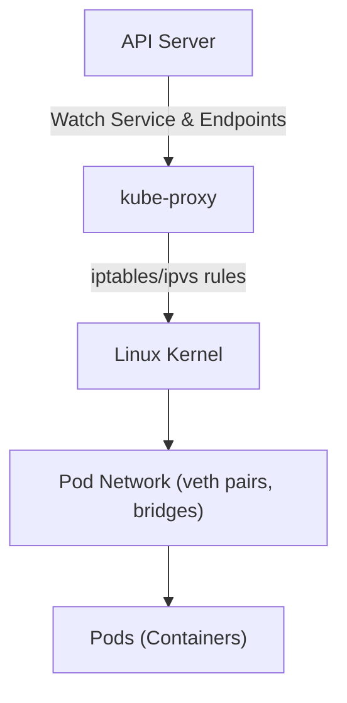
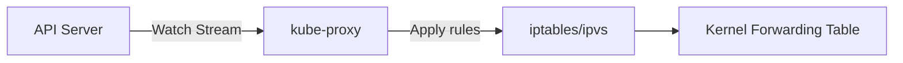

# 🌐 **Kube-Proxy Internals** - Kubernetes Networking

Kube-proxy is the **networking bridge** between the **Service abstraction (API)** and the **actual Pod network** inside each node.
It ensures **traffic routing, load balancing, and NAT** work transparently, whether the Pod lives on the same node or another.

---

## 📖 **Where kube-proxy Lives in the Big Picture**

Let’s visualize how it fits into the Kubernetes control plane and node components:

<div align="center" style="background-color: #255560ff; border-radius: 10px; border: 2px solid">



</div>

---

> ✅ kube-proxy runs on **each node**.  
> ✅ It **watches Services and Endpoints** from the API server.  
> ✅ It **programs rules** in the Linux kernel (via iptables or IPVS).  
> ✅ It routes traffic correctly to backend Pods, performing **load balancing**.

---

## 📜 **Kube-Proxy’s Main Role**

In one line:

> **Kube-proxy converts abstract Kubernetes Services into real OS-level networking rules** that forward traffic to the correct Pod IPs.

---

## 🧩 **Core Functions**

<div align="center" style="background-color: #141a19ff;color: #a8a5a5ff; border-radius: 10px; border: 2px solid">

| Function            | Description                                                 |
| ------------------- | ----------------------------------------------------------- |
| **Service watcher** | Watches for Service and Endpoint changes via the API server |
| **Rule manager**    | Installs / updates Linux NAT rules                          |
| **Load balancer**   | Distributes connections between backend Pods                |
| **Health monitor**  | Ensures rules reflect current healthy endpoints             |

</div>

---

## 🕸️ **Communication Model**

When a Service is created (e.g., `ClusterIP` type):

1. API Server stores it in **etcd**.
2. Kube-proxy watches for changes via **watch API (HTTP/2 streaming)**.
3. It builds routing tables and load-balancing rules.
4. Packets arriving to the Service IP are intercepted and redirected to one of the backend Pods.

---

## 🎭 **Modes of Operation** (Backends)

<div align="center" style="background-color: #141a19ff;color: #a8a5a5ff; border-radius: 10px; border: 2px solid">

| Mode          | Description                                            | Performance | Default            |
| ------------- | ------------------------------------------------------ | ----------- | ------------------ |
| **userspace** | Legacy mode; traffic passes through kube-proxy process | Slow        | ❌ Deprecated      |
| **iptables**  | Uses Linux kernel netfilter rules (DNAT/SNAT)          | Fast        | ✅ Common          |
| **IPVS**      | Uses Linux IP Virtual Server kernel module             | Very fast   | ✅ Modern clusters |

</div>

---

## 1️⃣ **IPTABLES Mode** (Most Common)

Let’s break down what happens when a Service is exposed as a `ClusterIP`.

### Example Service

```yaml
apiVersion: v1
kind: Service
metadata:
  name: my-svc
spec:
  type: ClusterIP
  selector:
    app: nginx
  ports:
    - port: 80
      targetPort: 8080
```

Suppose:

- Service ClusterIP = `10.96.0.10`
- Two Pods: `10.244.1.5:8080` and `10.244.2.6:8080`

---

### 🧠 What kube-proxy does internally

1. Watches for this Service and Endpoint objects.
2. Creates iptables chains under `nat` table:

   - `KUBE-SERVICES`
   - `KUBE-NODEPORTS`
   - `KUBE-POSTROUTING`
   - `KUBE-MARK-MASQ`

3. Adds rules for each Service IP.

---

### 🔧 IPTABLES Chain Example

```bash
# List NAT rules
iptables -t nat -L -n | grep KUBE

Chain KUBE-SERVICES (2 references)
target     prot opt source               destination
KUBE-SVC-XYZ  all  --  0.0.0.0/0         10.96.0.10  /* my-svc:80 cluster IP */
```

Inside `KUBE-SVC-XYZ`, we have DNAT rules:

```bash
Chain KUBE-SVC-XYZ (1 references)
target     prot opt source               destination
KUBE-SEP-A  all  --  0.0.0.0/0           0.0.0.0/0
KUBE-SEP-B  all  --  0.0.0.0/0           0.0.0.0/0
```

Each `KUBE-SEP-*` corresponds to a Pod IP (Endpoint):

```bash
Chain KUBE-SEP-A (1 references)
target     prot opt source destination
DNAT       tcp  --  0.0.0.0/0  0.0.0.0/0  to:10.244.1.5:8080
```

---

### ⚙️ How Traffic Flows (iptables mode)

```mermaid
sequenceDiagram
  participant C as Client Pod
  participant K as Kernel NAT Table
  participant P as Pod Backend

  C->>K: Send request to ClusterIP:80
  K->>K: Match rule in KUBE-SERVICES
  K->>K: DNAT → 10.244.1.5:8080 (Pod)
  K->>P: Forward packet to Pod
  P->>K: Response → SNAT → Client
```

<div align="center" style="background-color: #255560ff; border-radius: 10px; border: 2px solid">



</div>

---

> ✅ Result: Transparent load balancing at kernel level.

---

## 2️⃣ **IPVS Mode** (Modern High-Performance)

When kube-proxy runs with `--proxy-mode=ipvs`, it uses the **IPVS kernel module** for connection-level load balancing.

<div align="center" style="background-color: #141a19ff;color: #a8a5a5ff; border-radius: 10px; border: 2px solid">

| Feature           | Description                         |
| ----------------- | ----------------------------------- |
| Backend algorithm | RR, WRR, LC, SH, etc.               |
| Speed             | Kernel-level (faster than iptables) |
| Monitoring        | Uses `/proc/net/ip_vs`              |
| Persistence       | Supports connection affinity        |

</div>

---

### IPVS Example

```bash
ipvsadm -Ln
```

```ini
TCP  10.96.0.10:80 rr
  -> 10.244.1.5:8080  Masq  1  0  0
  -> 10.244.2.6:8080  Masq  1  0  0
```

---

> ✅ Requests to `10.96.0.10:80` are distributed **round-robin** between backend Pods.

---

### 🔧 How kube-proxy builds IPVS Rules

1. Watches Services/Endpoints via API.
2. Creates **virtual server** for ClusterIP:Port.
3. Adds **real servers** for each Pod endpoint.
4. Manages persistence and syncs every 30s.

---

## 🌐 **NodePort and ExternalTraffic**

When you use:

```yaml
type: NodePort
```

- kube-proxy adds rules in `KUBE-NODEPORTS` chain.
- Opens a port (e.g., `30080`) on **each node**.
- Routes traffic to any backend Pod — even across nodes.

```bash
iptables -t nat -L KUBE-NODEPORTS -n
```

✅ Any request to `NodeIP:30080` gets DNAT to a backend Pod.

---

## 🤺 **ClusterIP** vs **NodePort** vs **LoadBalancer**

<div align="center" style="background-color: #141a19ff;color: #a8a5a5ff; border-radius: 10px; border: 2px solid">

| Type         | Exposed On             | Example            |
| ------------ | ---------------------- | ------------------ |
| ClusterIP    | Internal cluster-only  | 10.96.x.x          |
| NodePort     | Node’s IP + port       | 192.168.1.10:30080 |
| LoadBalancer | External LB → NodePort | AWS ELB, GCP LB    |

</div>

---

## 🥸 **Watch Mechanism** (Control Plane Integration)

### How kube-proxy keeps updated:

- Uses **watch API** to subscribe to:

  - `Service` resources
  - `Endpoints` or `EndpointSlice`

- The API server streams changes (HTTP/2 watch)
- kube-proxy reconciles every few seconds

<div align="center" style="background-color: #255560ff; border-radius: 10px; border: 2px solid">



</div>

---

> ✅ So, when a Pod dies or starts, new rules are applied within milliseconds.

---

## ⚙️ **kube-proxy Config and Command Options**

### Example flags (in `/var/lib/kube-proxy/config.conf`):

```yaml
apiVersion: kubeproxy.config.k8s.io/v1alpha1
kind: KubeProxyConfiguration
mode: "ipvs"
clusterCIDR: "10.244.0.0/16"
ipvs:
  scheduler: "rr"
  minSyncPeriod: 5s
  syncPeriod: 30s
```

Start command:

```bash
kube-proxy --config=/var/lib/kube-proxy/config.conf
```

---

## 🔧 **Troubleshooting kube-proxy**

<div align="center" style="background-color: #141a19ff;color: #a8a5a5ff; border-radius: 10px; border: 2px solid">

| Command                                                         | Purpose                   |     |
| --------------------------------------------------------------- | ------------------------- | --- |
| `kubectl get pods -n kube-system -l k8s-app=kube-proxy -o wide` | Locate kube-proxy pods    |     |
| `iptables -t nat -L -n | grep KUBE`                             | Check iptables rules      |
| `ipvsadm -Ln`                                                   | View IPVS virtual servers |     |
| `kubectl describe svc <name>`                                   | Confirm endpoints         |     |
| `ss -lnpt`                                                      | Verify NodePort listeners |     |

</div>

---

## 📝 **Example Flow — Full Lifecycle**

```mermaid
sequenceDiagram
  participant U as User
  participant API as API Server
  participant K as kube-proxy
  participant L as Linux Kernel
  participant P as Pod

  U->>API: Create Service (ClusterIP)
  API->>K: Notify via watch (Service + Endpoints)
  K->>L: Add iptables/ipvs rules
  UserPod->>L: Request → ClusterIP:80
  L->>P: DNAT → PodIP:8080
  P->>L: Reply → SNAT → UserPod
```

<div align="center" style="background-color: #255560ff; border-radius: 10px; border: 2px solid">



</div>

---

> ✅ Transparent service-to-pod mapping handled purely in kernel after rules are created.

---

## 🎭 **kube-proxy Alternatives** (Service Meshes)

When you deploy **Service Mesh** (like Istio, Linkerd), kube-proxy is often **bypassed**:

- Mesh sidecars handle traffic redirection instead.
- kube-proxy rules may still exist but are unused.
- Example: Envoy intercepts all traffic via iptables rules in Pod namespace.

---

## 🏁 **Summary**

<div align="center" style="background-color: #141a19ff;color: #a8a5a5ff; border-radius: 10px; border: 2px solid">

| Layer         | Component     | Role                          |
| ------------- | ------------- | ----------------------------- |
| Control Plane | API Server    | Publishes Service & Endpoints |
| Node Agent    | kube-proxy    | Programs routing rules        |
| Kernel        | iptables/IPVS | Performs NAT & load balancing |
| Pod Network   | veth + bridge | Sends/receives packets        |

</div>

---

> ✅ kube-proxy is the **translator** from Kubernetes objects to Linux networking.

---

Would you like the **next topic** to be:

1. 🧠 Deep dive into **CNI plugins internals** (Flannel, Calico, bridge creation, veth pairs),
   or
2. ⚙️ “Pod-to-Pod” communication flow (DNS → kube-proxy → Pod → CNI → Kernel)?
