# 🏃🏻‍♂️‍➡️ **Kubelet Internals**

## 📖 **What Is Kubelet?**

**Kubelet** is the **primary node agent** in Kubernetes.
It runs on every node (worker and control-plane) and ensures that the **containers running on that node match the desired state** defined in the API Server.

✅ It does **not manage containers directly** — it uses the **Container Runtime Interface (CRI)** (like `containerd` or `dockerd`) to start, stop, and monitor containers.  
✅ It talks to the **API Server** using HTTPS REST API calls and **watches** for changes to Pods assigned to its node.

---

## ⚙️ **Kubelet’s Primary Responsibilities**

| Function                         | Description                                                    |
| -------------------------------- | -------------------------------------------------------------- |
| **Pod Management**               | Create, update, and delete Pods assigned to the node           |
| **Pod Monitoring**               | Continuously check Pod health and container status             |
| **Container Runtime Management** | Start/stop containers using CRI (containerd / dockerd)         |
| **Volume Management**            | Mount and unmount storage volumes                              |
| **Node Registration**            | Register node details (CPU, memory, capacity) to API Server    |
| **CNI Networking**               | Attach containers to the right network namespace               |
| **Status Reporting**             | Periodically update Pod and Node status back to the API Server |

---

## 🧭 **Kubelet Lifecycle** (Startup to Running)

---

> ✅ It’s completely **event-driven** and **stateless** — any crash restarts safely.

---

## 💭 **Kubelet–API Server Communication Flow**

**Protocol:** HTTPS REST + Watch
**Direction:** Always Kubelet → API Server (never direct control-plane push)

| API Call                                                | Purpose                                      |
| ------------------------------------------------------- | -------------------------------------------- |
| `POST /api/v1/nodes`                                    | Register node info                           |
| `WATCH /api/v1/pods?fieldSelector=spec.nodeName=<node>` | Receive Pods assigned to this node           |
| `PATCH /api/v1/pods/status`                             | Report Pod status (Running, CrashLoop, etc.) |
| `PATCH /api/v1/nodes/status`                            | Update node heartbeat, capacity, conditions  |

---

## 🖼️ **Internal Architecture Overview**

---

## ⚙️ **Pod Lifecycle Inside the Kubelet**

### Step-by-Step Reconciliation Loop

---

> ✅ This is called the **Pod Lifecycle State Machine** inside Kubelet.

---

### Example: When API Server sends a new Pod

1. **Watch Event:** Kubelet sees new Pod assigned to this node.
2. **SyncPod():** Kubelet compares actual running containers vs desired PodSpec.
3. **Container Sandbox:** Calls CNI to create network namespace & veth pairs.
4. **Start Containers:** Uses CRI to instruct container runtime to start containers.
5. **Health Monitoring:** Periodically runs liveness & readiness probes.
6. **Report Status:** Updates `Pod.status.phase` back to API Server.

---

## 🧩 **Kubelet with CRI (Container Runtime)**

Kubelet does **not** talk directly to Docker/Containerd binary.
Instead, it talks to a **gRPC-based daemon** (Container Runtime).

### 🔌 Container Runtime Interface (CRI)

- API: gRPC service defined by Kubernetes.
- Kubelet connects via a UNIX socket:
  `/var/run/containerd/containerd.sock` or `/var/run/dockershim.sock`

### Common CRI Operations:

| Operation         | Description                                |
| ----------------- | ------------------------------------------ |
| `RunPodSandbox`   | Create Pod-level sandbox network (via CNI) |
| `CreateContainer` | Create container inside sandbox            |
| `StartContainer`  | Start container process                    |
| `StopContainer`   | Stop container                             |
| `RemoveContainer` | Delete container data                      |
| `ListContainers`  | Report all containers for status updates   |

---

### 💡 Example CRI Call Flow

---

## 🌐 **Kubelet with CNI (Container Network Interface)**

When Kubelet creates a Pod sandbox, it calls the **CNI plugin** chain to set up networking.

1. CNI plugin creates **network namespace** for the Pod.
2. It sets up a **veth pair** connecting the Pod namespace to the bridge (`cni0`).
3. Assigns IP to the Pod (usually from `10.x.x.x` range).
4. Adds default routes.
5. Kubelet writes results in the Pod’s `PodStatus`.

✅ Plugins like `bridge`, `calico`, `flannel`, `cilium` can be used.

---

## 💾 **Kubelet and Volume Management**

Kubelet interacts with the **Container Storage Interface (CSI)** for persistent volumes.

Steps when Pod uses a volume:

1. Detects volume in Pod spec.
2. Calls `kubelet VolumeManager` to mount it.
3. Uses `csi` or `in-tree` driver to attach and mount.
4. Updates container spec to use mounted path.
5. Unmounts and detaches on Pod deletion.

---

## 💓 **Node and Pod Heartbeats**

Kubelet periodically sends **status updates** every ~10 seconds:

| Resource | Endpoint               | Frequency              |
| -------- | ---------------------- | ---------------------- |
| Node     | `/api/v1/nodes/status` | ~10s                   |
| Pod      | `/api/v1/pods/status`  | On change or every 10s |

Node conditions it reports:

- `Ready` (node can run Pods)
- `OutOfDisk`
- `MemoryPressure`
- `DiskPressure`
- `PIDPressure`
- `NetworkUnavailable`

If API Server doesn’t receive heartbeats within 40s → Node Controller marks node `NotReady`.

---

## 🔖 **Kubelet’s Local Checkpointing**

Even though it’s stateless, Kubelet caches some local info:

| Directory                      | Purpose                      |
| ------------------------------ | ---------------------------- |
| `/var/lib/kubelet/pods/`       | Pod manifests, volume mounts |
| `/var/lib/kubelet/plugins/`    | CSI plugin sockets           |
| `/var/lib/kubelet/config.yaml` | Kubelet config source        |

✅ Helps restart quickly after crashes.

---

## ➰ **Pod Status Sync Loop**

Kubelet runs a loop called **syncLoop()**, which does:

1. Listen to Pod updates (Watch channel).
2. Periodically check actual container states.
3. Reconcile any drift (e.g., restart failed container).
4. Report current Pod status.

```mermaid
graph TD
  A[Watch Pod events] --> B[Check containers running]
  B --> C[If drift → restart / create / delete]
  C --> D[Update API Server status]
  D --> A
```

---

## 💥 **When Pod Crashes (CrashLoopBackOff Example)**

1. Kubelet sees container exit → gets exit code.
2. Kubelet restarts container based on `restartPolicy`.
3. If it keeps failing → exponential backoff (`1s → 2s → 4s → 8s...`).
4. Reports status `CrashLoopBackOff` to API Server.

✅ The actual restart loop is **fully local** (no API Server interaction required).

---

## 🛡️ **Security and Authentication**

- Kubelet authenticates using its **client certificate** (`/var/lib/kubelet/pki/kubelet-client.crt`).
- It verifies API Server cert using CA bundle.
- Communication is fully **TLS-secured**.
- Uses **RBAC** rules with `system:node:<nodename>` identity.

---

## 🧑🏻‍💻 **Kubelet Command Flags** (Common)

| Flag                                  | Description                       |
| ------------------------------------- | --------------------------------- |
| `--kubeconfig`                        | API Server connection credentials |
| `--container-runtime-endpoint`        | CRI socket path                   |
| `--cni-bin-dir`                       | Path to CNI plugins               |
| `--cni-conf-dir`                      | Path to CNI config files          |
| `--pod-manifest-path`                 | Path for static Pods              |
| `--authentication-token-webhook=true` | Enable Token auth for API calls   |

---

## 📊 **Kubelet Metrics**

Exposed at `/metrics` (for Prometheus):

| Metric                                     | Description                          |
| ------------------------------------------ | ------------------------------------ |
| `kubelet_pod_start_duration_seconds`       | Pod startup latency                  |
| `kubelet_running_pod_count`                | Number of running Pods               |
| `kubelet_container_start_duration_seconds` | Container startup time               |
| `kubelet_runtime_operations_total`         | CRI operations (create, start, stop) |
| `kubelet_volume_stats_used_bytes`          | Volume usage                         |

---

## 🏁 **Summary**

| Concept                   | Description                        |
| ------------------------- | ---------------------------------- |
| **Component Type**        | Node agent, separate binary        |
| **Protocol**              | HTTPS REST + Watch + gRPC (CRI)    |
| **API Server Direction**  | Kubelet → API Server               |
| **Main Responsibilities** | Run assigned Pods, monitor, report |
| **Interacts With**        | CRI, CNI, CSI                      |
| **Stateless**             | Yes (mostly)                       |
| **Frequency**             | 10s sync loop                      |
| **Failure Handling**      | Local restart with backoff         |
| **Security**              | TLS + x509 + RBAC identity         |

---

## 🔚 **Complete Flow Diagram**

---

✅ **In plain English:**

> Kubelet is the node’s supervisor. It continuously watches the API Server for Pods assigned to it, ensures they’re actually running using containerd or dockerd, sets up their networking via CNI, attaches volumes via CSI, and reports their health and resource status back to the API Server.
