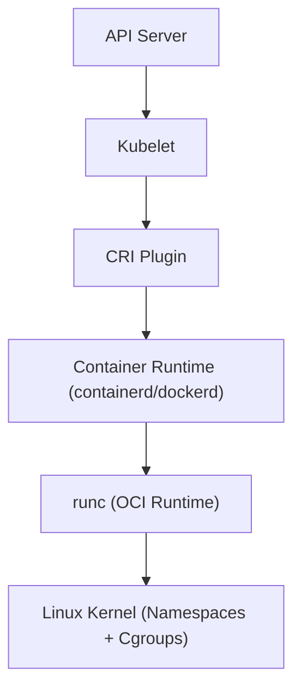
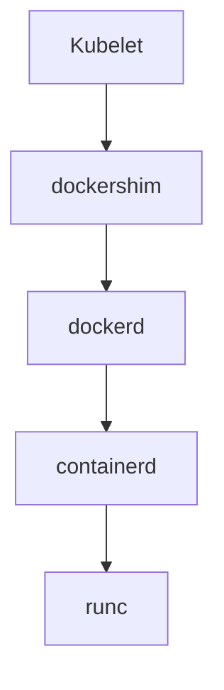
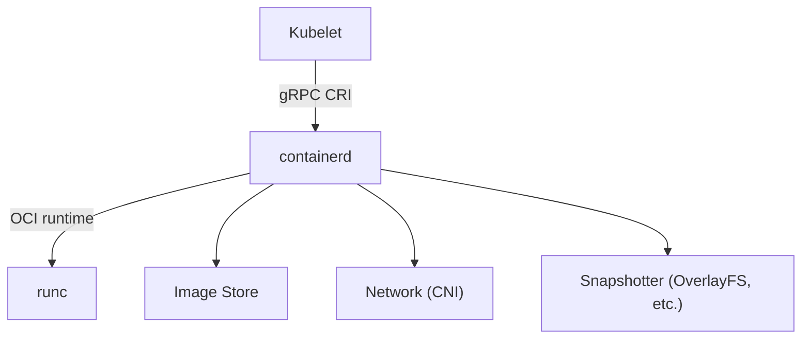
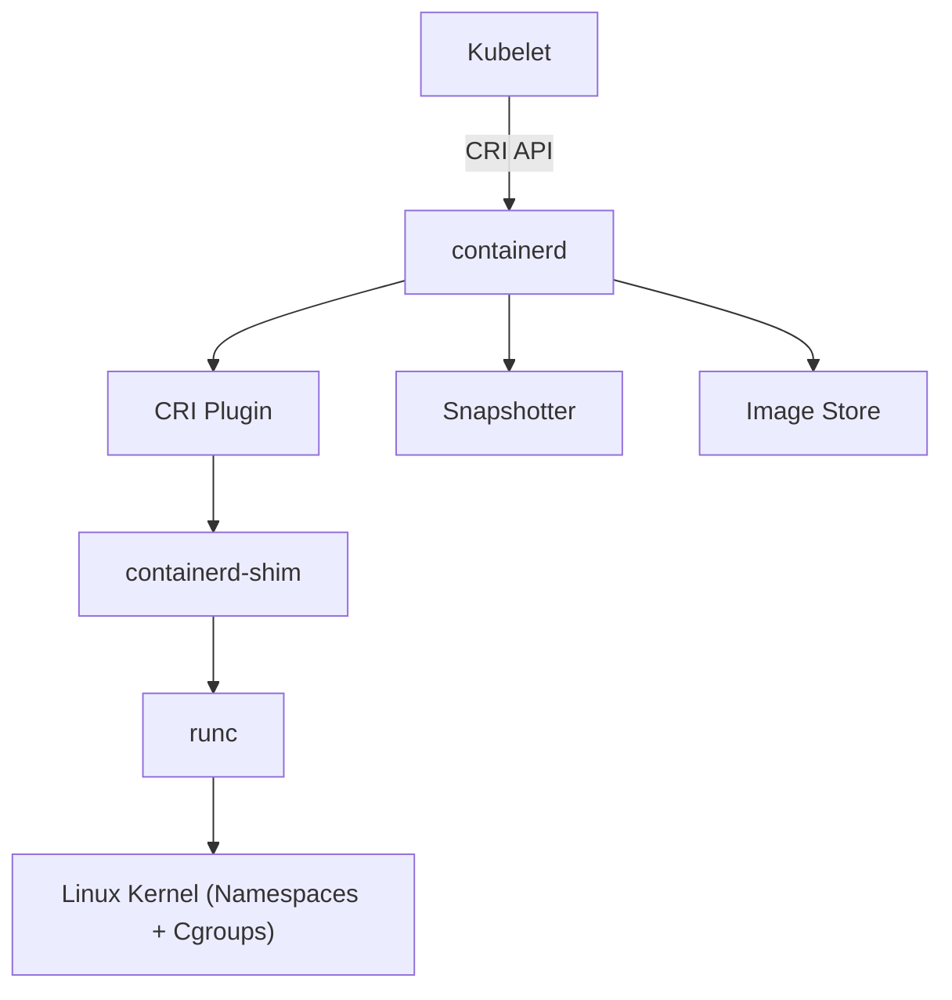
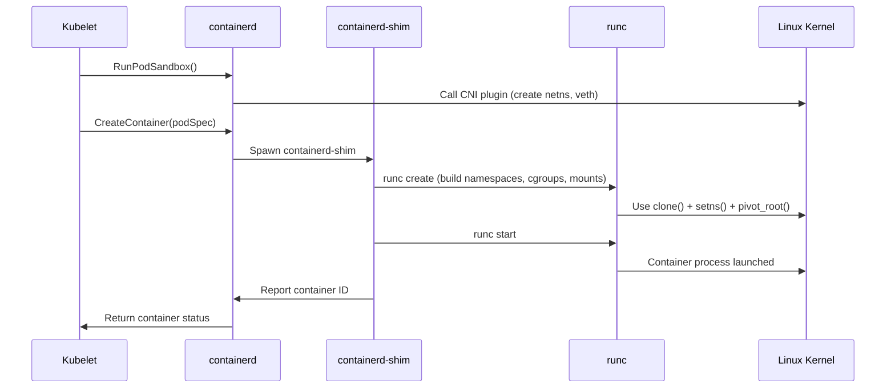
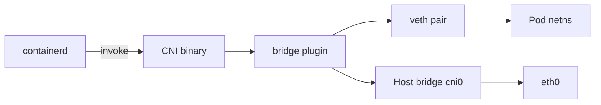
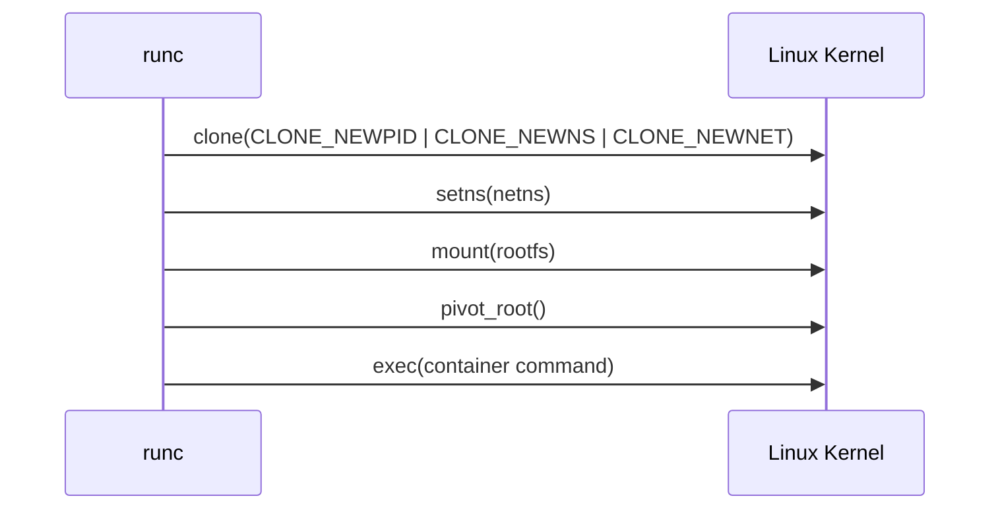
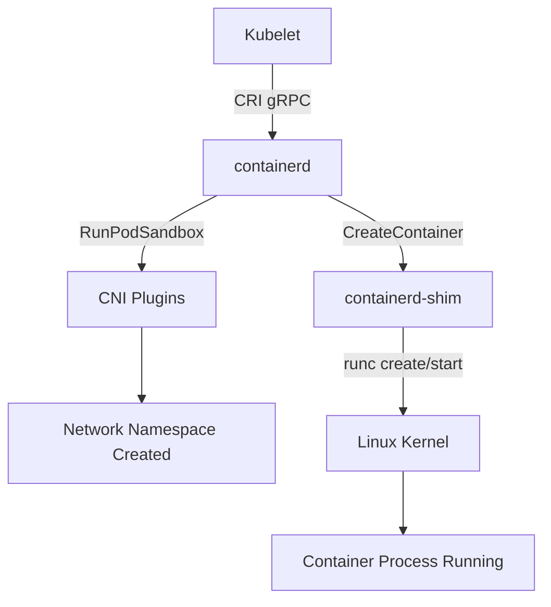
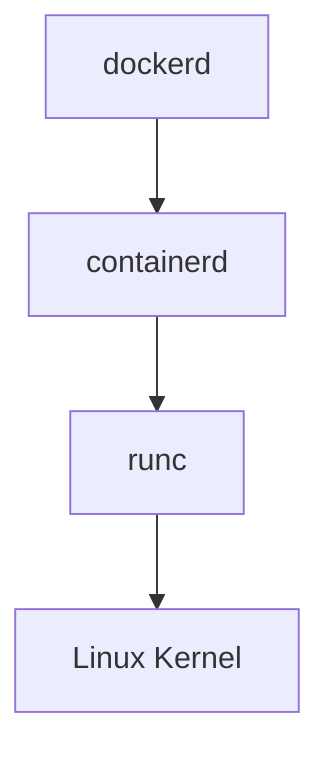
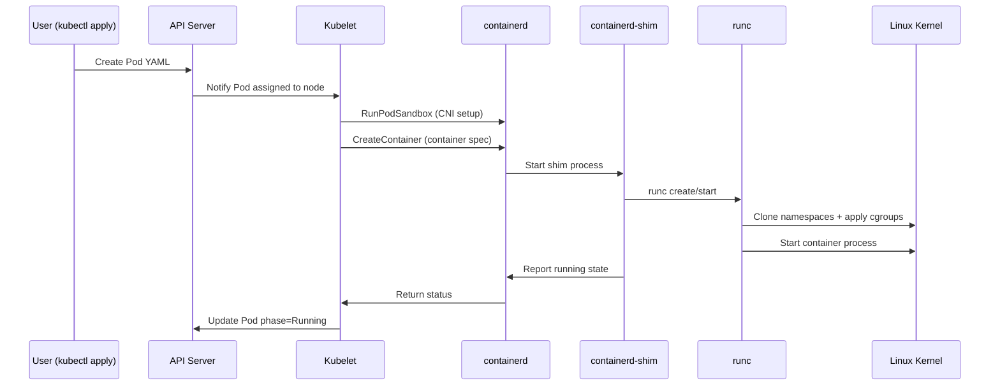

# ⚙️ **Container Runtime Internals**

_(dockerd / containerd / CRI / OCI Full Deep Dive)!_

---

## 📖 **Where It Fits in the Kubernetes Architecture**

At the bottom of the Kubernetes stack lives the **Container Runtime** — the component that physically starts, stops, and manages containers.

<div align="center" style="background-color: #255560ff; border-radius: 10px; border: 2px solid">



</div>

---

> ✅ **Kubelet** doesn’t create containers directly.  
> ✅ It communicates via **CRI (Container Runtime Interface)** using **gRPC**.  
> ✅ **containerd** (or **dockerd**) translates CRI calls into **OCI runtime** commands.  
> ✅ **runc** creates the container using Linux primitives (namespaces, cgroups, capabilities).

---

## 🤺 **Key Standards: CRI vs OCI**

<div align="center" style="background-color: #141a19ff;color: #a8a5a5ff; border-radius: 10px; border: 2px solid">

| Standard                              | Purpose                                                               | Used By                              |
| ------------------------------------- | --------------------------------------------------------------------- | ------------------------------------ |
| **CRI (Container Runtime Interface)** | Defines _how Kubelet talks to a runtime_ (via gRPC)                   | Between Kubelet ↔ containerd/dockerd |
| **OCI (Open Container Initiative)**   | Defines _how containers are built and run_ (runtime spec, image spec) | Between containerd ↔ runc            |

</div>

---

> ✅ CRI is **Kubernetes-defined**,  
> ✅ OCI is **industry-wide (Docker, Podman, CRI-O, etc.)**.

---

## 🧩 **Runtime Components Overview**

Let’s break down what happens when you’re using Docker or containerd underneath Kubernetes.

---

### 🔹 (A) Docker Stack (pre-1.24)

Before Kubernetes v1.24, Kubelet talked to **dockerd** through a shim called **dockershim**.

<div align="center" style="background-color: #255560ff; border-radius: 10px; border: 2px solid">



</div>

- **dockershim** implemented the CRI spec for Kubelet.
- **dockerd** managed images, networks, and volumes.
- **containerd** handled container lifecycle.
- **runc** executed containers using kernel features.

👉 This model was deprecated in 2022 (v1.24+) — **dockershim removed**.

---

### 🔹 (B) Modern containerd-based Architecture

Now Kubelet communicates **directly** with **containerd** via CRI (no dockershim).

<div align="center" style="background-color: #255560ff; border-radius: 10px; border: 2px solid">



</div>

---

> ✅ containerd is now the **default Kubernetes runtime** (fast, modular, lightweight).  
> ✅ It’s used by Docker too — Docker itself _depends_ on containerd internally.

---

## ⚙️ **`containerd` Architecture Internals**

containerd has a clean modular structure:

<div align="center" style="background-color: #141a19ff;color: #a8a5a5ff; border-radius: 10px; border: 2px solid">

| Component                            | Role                                               |
| ------------------------------------ | -------------------------------------------------- |
| **containerd daemon (`containerd`)** | Long-running service managing containers           |
| **shim process (`containerd-shim`)** | Manages each container lifecycle independently     |
| **runc**                             | Executes containers (create, start, stop)          |
| **snapshotter**                      | Manages filesystem layers (OverlayFS, btrfs, etc.) |
| **content store**                    | Stores image blobs                                 |
| **image service**                    | Pulls/unpacks OCI images                           |
| **CRI plugin**                       | Implements the gRPC interface for Kubelet          |

</div>

---

### 🔧 `containerd` Component Flow

<div align="center" style="background-color: #255560ff; border-radius: 10px; border: 2px solid">



</div>

---

> ✅ Each container gets its **own shim** process, which acts as a parent of `runc` and manages stdio and lifecycle even if containerd restarts.

---

## 🧭 **Container Creation Lifecycle** (Step-by-Step)

Let’s visualize how a Pod container is born when Kubelet calls containerd 👇

<div align="center" style="background-color: #255560ff; border-radius: 10px; border: 2px solid">



</div>

---

✅ **runc** uses kernel syscalls like:

- `clone()` — to fork a process in new namespaces.
- `setns()` — to enter namespaces.
- `pivot_root()` — to change filesystem root.

---

## 📌 **The Sandbox Concept**

Kubelet always creates a **Pod Sandbox** first.

- Represents the **network namespace** shared by all containers in the Pod.
- Only one sandbox per Pod; multiple containers share it.

**CRI Call:**

```bash
RunPodSandbox(podConfig)
```

containerd:

- Creates pause container (`k8s.gcr.io/pause:3.9`)
- Sets up network (via CNI)
- Returns sandbox ID

---

## 🛜 **Networking via CNI in Runtime**

During `RunPodSandbox`, containerd invokes the CNI chain:

<div align="center" style="background-color: #255560ff; border-radius: 10px; border: 2px solid">



</div>

---

> ✅ Assigns Pod IP from pool  
> ✅ Adds routing  
> ✅ Updates `/etc/cni/net.d/` config files

---

## 📦 **Storage via Snapshotters**

containerd uses **snapshotters** to manage image and container filesystems.

<div align="center" style="background-color: #141a19ff;color: #a8a5a5ff; border-radius: 10px; border: 2px solid">

| Snapshotter | Description                         |
| ----------- | ----------------------------------- |
| `overlayfs` | Default; fast, layered filesystem   |
| `btrfs`     | CoW filesystem for advanced storage |
| `zfs`       | Used on ZFS systems                 |
| `devmapper` | Thin provisioning backend           |

</div>

---

> ✅ Each container gets a **layered writable mount** derived from its image.

---

## 🧠 **OCI Runtime (runc) Internals**

`runc` is the low-level runtime that actually **executes** containers.

### It handles:

- Namespace creation (UTS, PID, NET, IPC, MNT, USER)
- CGroup enforcement (CPU, memory, blkio)
- Capabilities dropping
- Seccomp filters
- AppArmor / SELinux profiles
- Pivot root and chroot isolation

> ✅ runc executes based on **OCI Runtime Spec**, typically under `/run/containerd/io.containerd.runtime.v2.task/<namespace>/...`.

---

### 🧠 Example runc Process Flow

<div align="center" style="background-color: #255560ff; border-radius: 10px; border: 2px solid">



</div>

---

## 💡 **Example: Full Flow (Pod Creation to Running)**

<div align="center" style="background-color: #255560ff; border-radius: 10px; border: 2px solid">



</div>

---

> ✅ All status updates bubble back up via gRPC → Kubelet → API Server.

---

## 💡 **Example CLI Flow (Behind the Scenes)**

Let’s simulate this manually (simplified):

```bash
# 1. Pull image
ctr images pull docker.io/library/nginx:latest

# 2. Create container
ctr run --rm -t docker.io/library/nginx:latest webserver

# Behind the scenes:
# containerd -> runc -> namespaces + cgroups -> nginx process
```

---

## 🧬 **`containerd` and Dockerd Relationship**

Docker today is built **on top of** containerd:

<div align="center" style="background-color: #255560ff; border-radius: 10px; border: 2px solid">



</div>

So when you run:

```bash
docker run nginx
```

It actually translates to:

1. dockerd → API call to containerd
2. containerd → invokes runc
3. runc → creates container

✅ That’s why **Docker can also serve as a CRI runtime** (through cri-dockerd plugin for Kubernetes).

---

## 🏷️ **Common Container Runtime Implementations**

<div align="center" style="background-color: #141a19ff;color: #a8a5a5ff; border-radius: 10px; border: 2px solid">

| Runtime                         | Description                                          | Use Case               |
| ------------------------------- | ---------------------------------------------------- | ---------------------- |
| **containerd**                  | Default runtime for Kubernetes; lightweight, modular | Standard choice        |
| **CRI-O**                       | Red Hat’s runtime implementing CRI directly          | OpenShift              |
| **Docker Engine + cri-dockerd** | Legacy Docker compatibility                          | Migration phase        |
| **gVisor / Kata Containers**    | Secure, sandboxed runtimes                           | Multi-tenant workloads |
| **Mirantis Dockerd**            | Maintained version for enterprise                    | Backward compatibility |

</div>

---

## 🔐 **Security Model in Runtimes**

<div align="center" style="background-color: #141a19ff;color: #a8a5a5ff; border-radius: 10px; border: 2px solid">

| Mechanism              | Purpose                                      |
| ---------------------- | -------------------------------------------- |
| **Namespaces**         | Process isolation (PID, NET, IPC, MNT, etc.) |
| **Cgroups**            | Resource limits (CPU, memory, IO)            |
| **Capabilities**       | Drop root-level powers selectively           |
| **Seccomp**            | Restrict allowed syscalls                    |
| **AppArmor / SELinux** | Policy-based file access control             |
| **User namespaces**    | Map container root to unprivileged host UID  |

</div>

✅ Together they form the **core of container security sandboxing**.

---

## 📃 **containerd Configuration File** (Example)

Located at `/etc/containerd/config.toml`:

```toml
version = 2

[plugins."io.containerd.grpc.v1.cri"]
  sandbox_image = "registry.k8s.io/pause:3.9"
  [plugins."io.containerd.grpc.v1.cri".containerd.runtimes.runc]
    runtime_type = "io.containerd.runc.v2"
```

✅ You can modify the `sandbox_image`, change snapshotter, or enable seccomp profiles here.

---

## 🏁 **Summary**

<div align="center" style="background-color: #141a19ff;color: #a8a5a5ff; border-radius: 10px; border: 2px solid">

| Layer                 | Component                                         | Description                      |
| --------------------- | ------------------------------------------------- | -------------------------------- |
| **Kubelet → Runtime** | CRI (gRPC)                                        | Standard API for Kubelet–runtime |
| **Runtime → Kernel**  | OCI (Runtime Spec)                                | Standard interface for execution |
| **containerd-shim**   | Keeps container alive even if containerd restarts |                                  |
| **runc**              | Executes containers with namespaces & cgroups     |                                  |
| **CNI**               | Handles Pod networking                            |                                  |
| **Snapshotter**       | Manages filesystem layers                         |                                  |
| **CRI Plugin**        | Main entry point for Kubelet                      |                                  |
| **Pause Container**   | Defines Pod-level network namespace               |                                  |

</div>

---

## 🖼️ **Visual Summary: Full Container Lifecycle**

<div align="center" style="background-color: #255560ff; border-radius: 10px; border: 2px solid">



</div>

---

✅ **In plain English:**

> Kubelet asks containerd (via CRI) to run containers. containerd prepares the filesystem, sets up networking and storage, and calls `runc` to spawn an isolated process using Linux namespaces and cgroups. The shim keeps it alive and reports back up to Kubelet, which updates the Pod status in the API Server.
