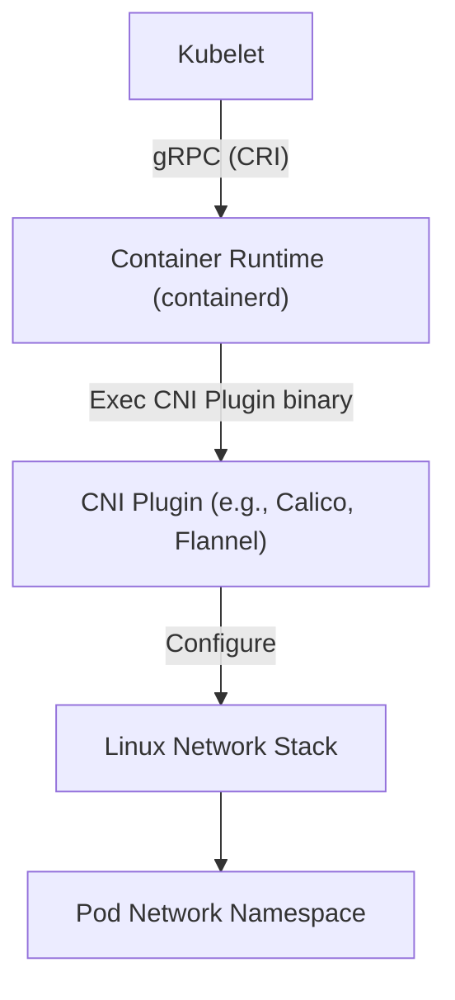
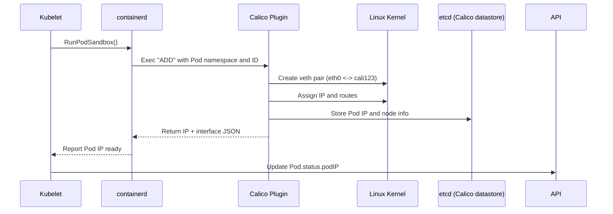
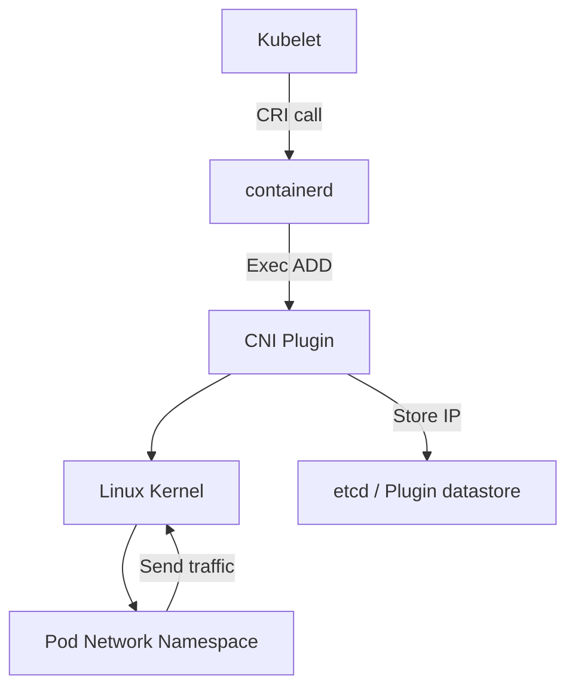

# ⚔️ **CNI vs CRI Simplified**

## 🚧 **Kubernetes Pod Creation**

When Kubernetes creates a **Pod**, it actually builds a **set of Linux namespaces** that together form the Pod’s isolated “mini-environment.”

Each namespace isolates a different part of the system (**network**, **processes**, **filesystem**, etc.).  
Different Kubernetes components are responsible for creating and configuring these namespaces.

---

## ⚙️ **Namespace Ownership**

<div align="center" style="background-color: #141a19ff;color: #a8a5a5ff; border-radius: 10px; border: 2px solid">

| Namespace Type          | Created / Managed By                  | Description                                                                                                                                                |
| ----------------------- | ------------------------------------- | ---------------------------------------------------------------------------------------------------------------------------------------------------------- |
| **Network Namespace**   | **CNI (Container Network Interface)** | Creates the Pod’s virtual network environment — veth pairs, IP address, routes, and DNS. All containers in the same Pod share this same network namespace. |
| **PID Namespace**       | **CRI (Container Runtime Interface)** | Creates the container’s process tree. Each container has its own PID namespace — isolates its running processes.                                           |
| **Mount Namespace**     | **CRI (via OCI runtime)**             | Manages the container’s filesystem — mounts, volumes, and rootfs.                                                                                          |
| **IPC / UTS Namespace** | **CRI (via OCI runtime)**             | Optional namespaces for hostname and inter-process communication isolation.                                                                                |

</div>

---

## 🪜 **End-to-End Flow**

1. **Kubelet** requests container creation from **CRI** (e.g., containerd or CRI-O).
2. **CRI** first creates the Pod “sandbox” → this defines the **network namespace**.
3. **CRI** then calls the **CNI plugin** to set up networking (IP, veth pair, routes).
4. After networking is ready, **CRI** launches the actual container process via **OCI runtime** (`runc`), which creates:

   - PID namespace
   - Mount namespace
   - UTS/IPC namespaces
   - Joins the existing network namespace (created by CNI)

5. The container starts running inside this fully isolated set of namespaces.

---

## 🧠 In One Line

> **CNI builds the Pod’s network home**,  
> **CRI builds the Pod’s processes and filesystem inside that home**,  
> and **Kubelet orchestrates both** to create a running containerized environment.

---

## 📖 **What’s the Real Job of CNI?**

The **Container Network Interface (CNI)** is **not just a plugin** — it’s the _protocol contract_ that glues **Kubernetes**, **container runtimes (like containerd or Docker)**, and **the Linux network stack** together.

🧩 Think of it this way:

> Kubelet says: “Hey runtime, I need a new Pod with its own network.”  
> Runtime says: “Sure, but I don’t know how to give it an IP.”  
> CNI steps in: “Relax, I’ll create the network namespace, attach a veth, assign an IP, add routes, apply network policies — all cleanly defined in JSON.”

---

## 🔴 **The Problem Before CNI**

Before CNI, every runtime did **its own network magic**.

**Example: Using Docker (pre-CNI):**

When Kubernetes originally used **Docker directly**:

1. Docker created containers with its own network driver (`bridge`, `overlay`, etc.).
2. Each Pod was really a **group of Docker containers** sharing one network namespace.
3. Docker decided how to create the **veth pairs**, **bridges**, **iptables**, and **routing**.

The result?

⚠️ **Chaos**:

- kubelet couldn’t predict how IPs were managed.
- Each runtime (Docker, rkt, cri-o) had different network handling.
- You couldn’t apply cluster-wide network policies.
- Troubleshooting was a nightmare.

So Kubernetes said:  
👉 “Let’s standardize this. I’ll ask the runtime to just _call an external plugin_ via a well-defined interface.”

That’s CNI.

---

## 🎨 **CNI Architecture**

 <div align="center" style="background-color: #255560ff; border-radius: 10px; border: 2px solid">



</div>

### Components:

<div align="center" style="background-color: #141a19ff;color: #a8a5a5ff; border-radius: 10px; border: 2px solid">

| Component                                   | Role                                                                 |
| ------------------------------------------- | -------------------------------------------------------------------- |
| **Kubelet**                                 | Asks runtime to create Pod network                                   |
| **CRI (Container Runtime Interface)**       | Abstraction layer between kubelet and runtime                        |
| **Container Runtime (containerd, dockerd)** | Executes `CNI ADD/DEL` commands                                      |
| **CNI Plugin**                              | Implements actual networking (creates interfaces, assigns IPs, etc.) |
| **Linux Kernel**                            | The real engine — handles namespaces, routes, veth pairs             |

</div>

---

## ⚙️ **Step-by-Step**: **What Happens When a Pod Is Created** `(With CNI)`

Let’s walk through a **real flow** from YAML → Running Pod.

### 🔹 1. Pod Spec submitted

```bash
kubectl apply -f nginx-pod.yaml
```

The Pod spec reaches the **API Server**, which schedules it to a node.

---

### 🔹 2. Kubelet → Container Runtime

Kubelet on that node calls the **CRI**:

```bash
RunPodSandboxRequest
```

This tells the runtime (e.g., `containerd`) to set up the Pod _sandbox_ — including networking.

---

### 🔹 3. Runtime calls CNI Plugin

`containerd` looks at its config:

```ini
/etc/cni/net.d/10-calico.conflist
```

Example content:

```json
{
  "cniVersion": "0.4.0",
  "name": "k8s-pod-network",
  "plugins": [
    {
      "type": "calico",
      "ipam": {
        "type": "calico-ipam"
      }
    }
  ]
}
```

Runtime executes:

```bash
/opt/cni/bin/calico add <containerID> <netns> <ifName>
```

---

### 🔹 4. Plugin Creates the Network

The plugin (`calico`, `flannel`, `weave`, etc.):

1. Creates a **veth pair**

   - one end in Pod’s network namespace (`eth0`)
   - other in the node’s namespace (e.g., `cali12345`)

2. Assigns an **IP address** (via IPAM plugin)

3. Adds **routes** inside and outside the namespace

4. Updates **iptables** or **eBPF** rules

5. Registers the IP in its **datastore (etcd or CRD)** for cross-node routing

---

### 🔹 5. CNI Returns JSON to Runtime

Plugin responds like this:

```json
{
  "cniVersion": "0.4.0",
  "interfaces": [{ "name": "eth0", "sandbox": "/var/run/netns/1234" }],
  "ips": [{ "address": "10.244.1.5/24", "gateway": "10.244.1.1" }]
}
```

Runtime passes this info to kubelet → kubelet updates Pod status:

```yaml
status:
  podIP: 10.244.1.5
```

✅ Pod now has network access!

---

## 🔍 **What About Without CNI** (Old Docker Way)?

Let’s see what happens if CNI didn’t exist.

### 🔧 Old Way (Docker Bridge)

Docker creates a default `docker0` bridge:

```bash
docker network inspect bridge
```

Every container gets:

- An IP from the bridge subnet (e.g., `172.17.0.0/16`)
- Routes to talk only within that host
- NAT rules for outbound Internet

⚠️ Problems:

- No cross-node connectivity
- Each node reused same IP range → collisions
- No control over Pod-to-Pod or Pod-to-Service routing

---

### ⚡ New Way (CNI)

Now, CNI plugins ensure:

- Each Pod has a **unique routable IP cluster-wide**
- Routes between nodes are automatically managed (via overlay, BGP, VXLAN, etc.)
- Policies (deny/allow traffic) are declarative

---

## 🔬 Example Comparison

<div align="center" style="background-color: #141a19ff;color: #a8a5a5ff; border-radius: 10px; border: 2px solid">

| Feature                | Docker Networking (No CNI) | Kubernetes + CNI              |
| ---------------------- | -------------------------- | ----------------------------- |
| **Pod IP Scope**       | Node-local only            | Cluster-wide unique           |
| **Cross-node traffic** | ❌ NAT-based               | ✅ Overlay or routed          |
| **Network policy**     | ❌ Impossible              | ✅ Supported (Calico, Cilium) |
| **IP management**      | Random, per node           | Centralized via IPAM          |
| **Extensibility**      | Hard-coded drivers         | Modular CNI plugin chain      |

</div>

---

## 🧰 Real Example (Containerd + Calico Flow)

<div align="center" style="background-color: #255560ff; border-radius: 10px; border: 2px solid">



</div>

---

## 🧩 Common CNI Plugins and How They Work

<div align="center" style="background-color: #141a19ff;color: #a8a5a5ff; border-radius: 10px; border: 2px solid">

| Plugin                      | Mode            | Description                                 |
| --------------------------- | --------------- | ------------------------------------------- |
| **Flannel**                 | Overlay (VXLAN) | Simple Layer 3 overlay network              |
| **Calico**                  | BGP / eBPF      | High performance; supports network policies |
| **Weave**                   | Overlay         | Auto-meshes nodes, easy to deploy           |
| **Cilium**                  | eBPF-based      | Fast, modern, security-aware                |
| **Azure CNI / AWS VPC CNI** | Native          | Integrates Pods into cloud VPC directly     |

</div>

---

## 🧠 Key Takeaways

<div align="center" style="background-color: #141a19ff;color: #a8a5a5ff; border-radius: 10px; border: 2px solid">

| Concept                                    | Description                                  |
| ------------------------------------------ | -------------------------------------------- |
| **CNI is a contract**, not a single plugin | Defines JSON-based ADD/DEL lifecycle         |
| **Runtime executes plugin binaries**       | containerd, cri-o, etc. just follow CNI spec |
| **Plugins implement real network logic**   | Create veths, bridges, routing, IPAM, etc.   |
| **Every Pod = isolated namespace + veth**  | Each has its own IP                          |
| **Before CNI, Docker owned networking**    | Now it’s standardized and modular            |

</div>

---

## 💎 Visual Recap

<div align="center" style="background-color: #255560ff; border-radius: 10px; border: 2px solid">



</div>

---

✅ **In plain English:**

> CNI is the invisible bridge between Kubernetes’ brain (Kubelet + API) and Linux’s networking muscles.
> Without it, Pods could never talk across nodes, obey policies, or have predictable IPs.
> It turned Kubernetes networking from chaos into a modular, pluggable, and policy-driven system.
