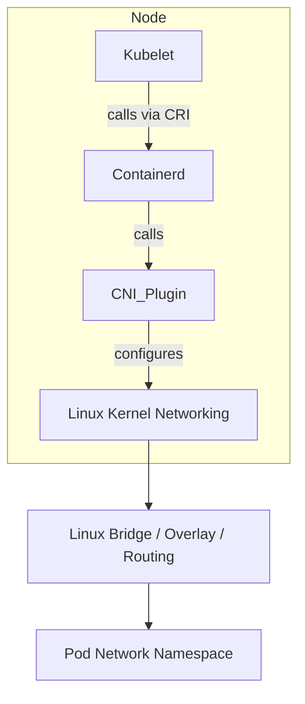
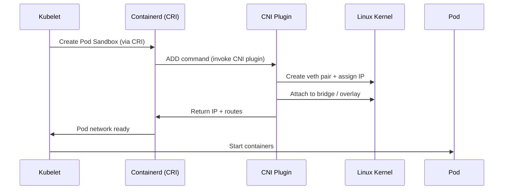

🔥 Perfect timing — this is one of the most **misunderstood yet critical** layers in Kubernetes networking.
Let’s go full deep dive — in **your enhanced structured style**, covering **why we need CNI**, **how it fits under kubelet and kube-proxy**, and **what happens under the hood** when a Pod gets a network.

---

# 🧩 Kubernetes CNI Internals — The Real Network Magic Behind Pods

---

## 🌍 1. Why Do We Even Need CNI?

Let’s start simple.
When Kubernetes wants to **create a Pod**, the **kubelet** (on each node) must ensure:

✅ The Pod has a network interface (`eth0`).
✅ The Pod gets a valid IP address.
✅ The Pod can reach other Pods (same or different nodes).
✅ The Pod’s traffic can reach the outside world (and vice versa).

Now the question:

> “Can kubelet do all this on its own?”

**No.** Kubelet **does not configure networking directly** — it just **delegates** to a **Container Network Interface (CNI) plugin** to handle this.

---

### ⚙️ Analogy

Think of kubelet as the **hotel receptionist**:

* It doesn’t *build* your room; it just calls the right *service* (CNI plugin) to prepare it.
* The CNI plugin handles the **plumbing** — connecting pipes (interfaces), assigning IPs, and ensuring water (packets) flow properly.

---

## 🧠 2. The Role of CNI in Kubernetes Networking

CNI = **Container Network Interface**, a **Linux networking specification** maintained by the Cloud Native Computing Foundation (CNCF).

CNI defines **how container runtimes (like containerd or CRI-O)** talk to **network plugins (like Flannel, Calico, Cilium)** to create, connect, and delete container network interfaces.

---

### 🧩 CNI Responsibilities

| Task                          | Description                                                 |
| ----------------------------- | ----------------------------------------------------------- |
| 🏗️ Create network interfaces | Connect Pod’s namespace to node’s network (via `veth` pair) |
| 🌐 Assign IP addresses        | Each Pod gets a unique IP inside the cluster CIDR           |
| 🧭 Configure routes           | Ensure packets reach other Pods across nodes                |
| 🛠️ Apply network policies    | Control traffic rules between Pods                          |
| 🔄 Clean up                   | Delete interfaces and release IPs when Pods die             |

---

## ⚙️ 3. CNI Architecture: How It Fits in the Stack



* **Kubelet** asks **container runtime** (e.g., `containerd`) to create a Pod sandbox.
* **containerd** triggers **CNI plugin scripts** (`/opt/cni/bin/`).
* The **CNI plugin** does the actual work:

  1. Creates `veth` pair
  2. Attaches one end to Pod’s namespace
  3. Connects other end to node’s bridge or overlay
  4. Assigns an IP
  5. Updates routes and ARP tables

---

## 🧱 4. CNI Plugin Types

CNI is a **standard**, not a product.
Different implementations provide different network behaviors.

| Plugin      | Type         | Description                                                |
| ----------- | ------------ | ---------------------------------------------------------- |
| **bridge**  | Basic        | Connects Pods on same node via a Linux bridge (`cni0`)     |
| **Flannel** | Overlay      | Creates VXLAN/UDP tunnels for cross-node Pod communication |
| **Calico**  | Routed / BGP | Uses BGP routing, no encapsulation                         |
| **Cilium**  | eBPF         | Uses eBPF programs for high-performance dataplane          |
| **Weave**   | Overlay      | Uses fast UDP tunnels between nodes                        |

---

## 📦 5. CNI Lifecycle — When a Pod is Created

When you run `kubectl run nginx --image=nginx`, here’s the *exact event sequence* 👇



---

## 🧩 6. Inside `/etc/cni/net.d/` — The Network Config

Each node has config files that define how the CNI should behave.

Example: `10-flannel.conf`

```json
{
  "cniVersion": "0.3.1",
  "name": "podnet",
  "type": "flannel",
  "delegate": {
    "type": "bridge",
    "bridge": "cni0",
    "isGateway": true,
    "ipMasq": true,
    "ipam": {
      "type": "host-local",
      "subnet": "10.244.1.0/24"
    }
  }
}
```

So when containerd calls CNI:

```
/opt/cni/bin/flannel ADD <network-config>
```

The CNI plugin reads this file and does its job.

---

## 🔌 7. CNI Plugin Commands (The Four Core Operations)

| Command     | Triggered When | Purpose                                        |
| ----------- | -------------- | ---------------------------------------------- |
| **ADD**     | Pod created    | Create veth pair, assign IP, connect to bridge |
| **DEL**     | Pod deleted    | Remove interfaces and release IP               |
| **CHECK**   | Health check   | Ensure networking still valid                  |
| **VERSION** | CLI query      | Report CNI version supported                   |

---

## 🧠 8. Example — CNI in Action (bridge + veth)

Imagine:

* Pod IP: `10.244.1.5`
* Node bridge: `cni0 (10.244.1.1)`

```bash
ip netns add pod1
ip link add veth0 type veth peer name veth1
ip link set veth0 netns pod1
ip addr add 10.244.1.5/24 dev veth0
ip link set veth0 up
brctl addif cni0 veth1
ip link set veth1 up
```

CNI plugins basically automate this for every Pod!

---

## 🧩 9. Why Kubelet and Kube-proxy Alone Are Not Enough

| Component                          | Purpose                                      | Does It Configure Linux Networking?     |
| ---------------------------------- | -------------------------------------------- | --------------------------------------- |
| **Kubelet**                        | Pod lifecycle management                     | ❌ No (delegates to runtime)             |
| **Container Runtime (containerd)** | Run containers                               | ⚠️ Partial (calls CNI)                  |
| **kube-proxy**                     | Service → Pod load balancing (iptables/IPVS) | ❌ Only programs kernel rules            |
| **CNI Plugin**                     | Setup Pod networks and routes                | ✅ Yes (creates interfaces, IPs, routes) |

So:

* Kubelet = “Hey runtime, make me a Pod.”
* containerd = “Okay, I’ll call CNI to wire it.”
* CNI = “I’ll plug the cables and give you an IP.”
* kube-proxy = “I’ll handle Service routing to that IP.”

---

## 🧠 10. CNI Data Flow Summary

```mermaid
flowchart LR
  subgraph Node
  A[Kubelet] --> B[Container Runtime (containerd)]
  B --> C[CNI Plugin]
  C --> D[Linux Kernel]
  D --> E[Pod Network Namespace]
  end

  D -.->|Kernel Routes| F[Other Nodes / CNI Overlay]
```

Every network packet a Pod sends passes through:

```
Pod eth0 → veth → bridge → overlay → target node → veth → target Pod
```

---

## 🚀 11. Summary Table — Kubernetes Networking Layers

| Layer | Component    | What It Does                           |
| ----- | ------------ | -------------------------------------- |
| L7    | kube-proxy   | ClusterIP → Pod IP load balancing      |
| L4    | kubelet      | Delegates Pod networking setup         |
| L3    | CNI plugin   | Configures Pod IPs, veth pairs, routes |
| L2    | Linux kernel | Handles packet forwarding              |
| L1    | Physical NIC | Sends packets to the wire              |

---

## 🧩 12. Example: Full CNI Flow During Pod Creation

1. **Scheduler** assigns Pod to Node.
2. **Kubelet** tells **containerd** to start Pod sandbox.
3. **containerd** executes `/opt/cni/bin/<plugin> ADD`.
4. **CNI plugin**:

   * Creates Pod network namespace.
   * Creates veth pair.
   * Assigns IP.
   * Connects to node bridge or overlay.
5. **containerd** runs container with configured namespace.
6. **kube-proxy** ensures Service → Pod IP mapping exists.

✅ The Pod now has full network connectivity!

---

## 🧠 13. Key Takeaways

| Concept                           | Meaning                                        |
| --------------------------------- | ---------------------------------------------- |
| **CNI = Network Plumber**         | It wires up Pods and gives them IPs            |
| **Kubelet = Manager**             | It tells container runtime when to call CNI    |
| **Container Runtime = Middleman** | It executes CNI binaries with configs          |
| **kube-proxy = Traffic Director** | It ensures traffic reaches correct Pods        |
| **Kernel = Engine**               | It forwards packets through bridges and routes |

---

Would you like me to now continue with the **Flannel CNI Deep Dive** (overlay networking, VXLAN, host-gw modes, and packet path)?
That will directly build on this CNI foundation 🔥
