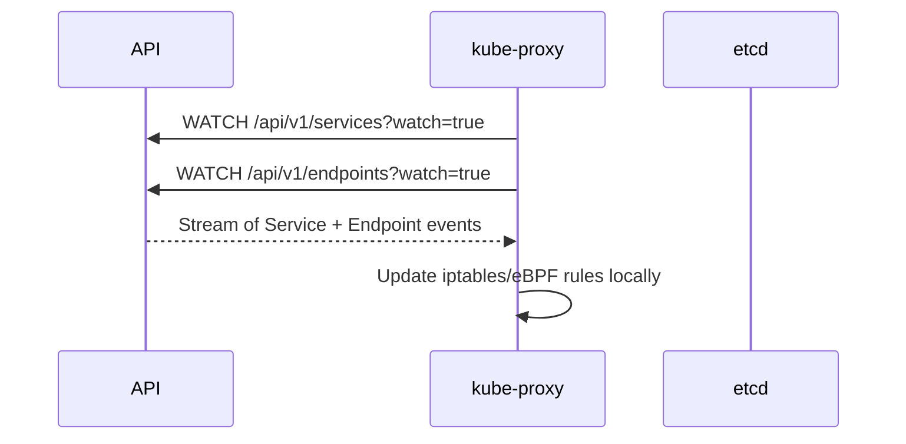
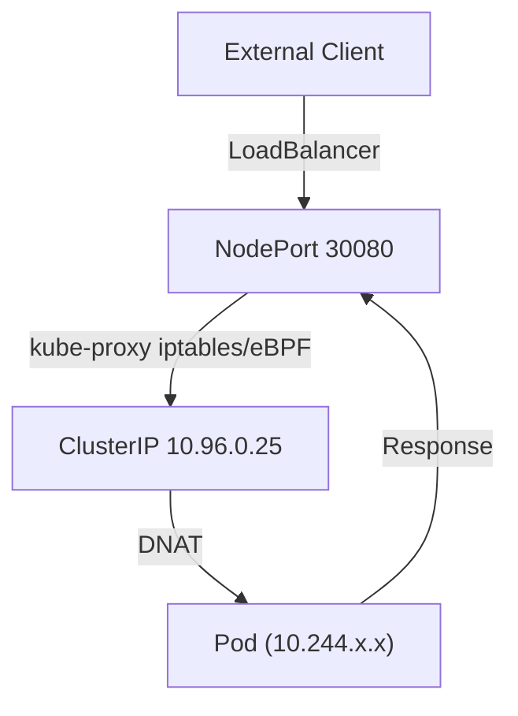

# ⚡ Service-to-Pod Communication

_(ClusterIP / NodePort / LoadBalancer — Deep Internals with kube-proxy, NAT, and Linux Flow)!_

This one completes the picture after Pod-to-Pod and CNI.
Ready for your favorite format — structured, visual, detailed, and human.

---

## 🎯 Goal

Understand **how a Service object** (ClusterIP, NodePort, or LoadBalancer) actually **routes traffic to backend Pods**, what **kube-proxy** does under the hood, and how the **Linux kernel and iptables** or **eBPF** enforce this redirection.

---

## 🧩 The Core Concept

> A Kubernetes **Service** is not a real “thing” — it’s a **virtual abstraction** implemented entirely via **iptables/eBPF rules** on each node, created and managed by **kube-proxy**.

So when you access `10.96.0.25:80` (ClusterIP), there’s no container listening on that IP — it’s **virtual**, handled by kernel-level NAT.

---

## 🧱 The 3 Major Service Types

<div align="center" style="background-color: #141a19ff;color: #a8a5a5ff; border-radius: 10px; border: 2px solid">

| Type             | Access Scope                    | Example                              |
| ---------------- | ------------------------------- | ------------------------------------ |
| **ClusterIP**    | Inside cluster only             | `10.96.0.25`                         |
| **NodePort**     | External (via node’s IP + port) | `192.168.1.5:30080`                  |
| **LoadBalancer** | Externally via cloud LB         | `lb.example.com:80 → NodePort → Pod` |

</div>

---

## 🧠 kube-proxy’s Role in All This

kube-proxy runs on **every node** and **watches the API Server** for Service and Endpoint changes.

It builds translation tables so that:

```ini
Service IP → Endpoint Pods
```

### Example

Let’s say you have this Service:

```yaml
apiVersion: v1
kind: Service
metadata:
  name: web
spec:
  selector:
    app: nginx
  ports:
    - port: 80
      targetPort: 8080
```

And you have these Pods:

| Pod   | Node  | Pod IP      | Port |
| ----- | ----- | ----------- | ---- |
| web-1 | node1 | 10.244.1.10 | 8080 |
| web-2 | node2 | 10.244.2.15 | 8080 |

---

## 🧩 Step 1 — kube-proxy Watches API Server

<div align="center" style="background-color: #255560ff; border-radius: 10px; border: 2px solid">



</div>

✅ Each kube-proxy maintains a local copy of all service/endpoint mappings.

---

## 🧩 Step 2 — iptables Rule Creation (ClusterIP)

Let’s inspect real rules on a node:

```bash
iptables-save | grep KUBE-
```

Example snippet:

```bash
-A KUBE-SERVICES -d 10.96.0.25/32 -p tcp --dport 80 -j KUBE-SVC-ABCD123
-A KUBE-SVC-ABCD123 -m statistic --mode random --probability 0.5 -j KUBE-SEP-1
-A KUBE-SVC-ABCD123 -j KUBE-SEP-2
-A KUBE-SEP-1 -s 10.244.1.10/32 -j DNAT --to-destination 10.244.1.10:8080
-A KUBE-SEP-2 -s 10.244.2.15/32 -j DNAT --to-destination 10.244.2.15:8080
```

So when a packet arrives for 10.96.0.25:80 → it gets **DNATed** to one of the backend Pods.

---

## ⚙️ Step 3 — Packet Flow (ClusterIP → Pod)

```mermaid
sequenceDiagram
  participant A as Pod (client)
  participant N as Node kernel
  participant K as kube-proxy (iptables)
  participant B as Pod (backend)
  participant CNI as CNI Plugin

  A->>N: TCP SYN to 10.96.0.25:80
  N->>K: Match iptables rule (KUBE-SERVICES)
  K->>N: DNAT → 10.244.2.15:8080
  N->>CNI: Route packet to Pod-B (via overlay or local veth)
  CNI->>B: Deliver packet to container
```

<div align="center" style="background-color: #255560ff; border-radius: 10px; border: 2px solid">



</div>

✅ **ClusterIP → Pod** redirection done purely by Linux iptables.

---

## 🌐 Step 4 — NodePort Mode

Now, if you change the Service type:

```yaml
type: NodePort
ports:
  - port: 80
    targetPort: 8080
    nodePort: 30080
```

Then kube-proxy adds **more iptables rules**:

```bash
-A KUBE-NODEPORTS -p tcp --dport 30080 -j KUBE-SVC-ABCD123
```

So if someone outside hits:

```ini
http://<NodeIP>:30080
```

→ it’s redirected to a backend Pod.

Even if the Pod is on another node, kube-proxy does **cross-node NAT** to route it.

✅ This allows external access without a cloud load balancer.

---

## ☁️ Step 5 — LoadBalancer Type (Cloud Integration)

For **type: LoadBalancer**, kube-proxy itself does nothing new.
Instead, the **cloud controller manager (CCM)** provisions a **cloud-native LB** (like AWS ELB, Azure LB, GCP LB) that forwards traffic to each node’s **NodePort**.

Flow:

```ini
Client → Cloud LoadBalancer → NodePort (on any node) → kube-proxy DNAT → Pod
```

✅ All kube-proxies handle packets identically; no need to know which node hosts which Pod.

---

## 🧠 Step 6 — eBPF Mode (Modern Alternative)

Some CNIs (like Cilium) replace iptables completely using **eBPF**.

🧩 Difference:

<div align="center" style="background-color: #141a19ff;color: #a8a5a5ff; border-radius: 10px; border: 2px solid">

| Feature       | iptables      | eBPF                        |
| ------------- | ------------- | --------------------------- |
| Rule format   | Static tables | Compiled in-kernel programs |
| Speed         | Moderate      | Very fast                   |
| Observability | Hard          | Excellent                   |
| Update model  | Full reload   | Live patch                  |

</div>

---

> ✅ eBPF mode bypasses NAT chains and handles load-balancing directly inside the kernel.

---

## 🧩 Real Flow Example

Assume:

| Object    | IP / Port        |
| --------- | ---------------- |
| ClusterIP | 10.96.0.25:80    |
| NodePort  | 30080            |
| Pod-1     | 10.244.1.10:8080 |
| Pod-2     | 10.244.2.15:8080 |

Then:

| Access Path              | Flow                               |
| ------------------------ | ---------------------------------- |
| `curl 10.96.0.25:80`     | ClusterIP → iptables DNAT → Pod IP |
| `curl Node1IP:30080`     | NodePort → iptables DNAT → Pod IP  |
| `curl LoadBalancerIP:80` | Cloud LB → NodePort → Pod IP       |

---

## 🔍 Inspect with Commands

<div align="center" style="background-color: #141a19ff;color: #a8a5a5ff; border-radius: 10px; border: 2px solid">

| Check           | Command                                                        |     |
| --------------- | -------------------------------------------------------------- | --- |
| View rules      | `iptables-save | grep KUBE-`                                   |
| Show proxy mode | `kubectl -n kube-system get ds kube-proxy -o yaml | grep mode` |
| See endpoints   | `kubectl get endpoints web -o yaml`                            |     |
| Trace flow      | `conntrack -L | grep 10.96.0.25`                               |

</div>

---

## 💎 Visual Summary

<div align="center" style="background-color: #255560ff; border-radius: 10px; border: 2px solid">



</div>

---

## 🧠 TL;DR Recap

<div align="center" style="background-color: #141a19ff;color: #a8a5a5ff; border-radius: 10px; border: 2px solid">

| Concept          | Description                                         |
| ---------------- | --------------------------------------------------- |
| **Service**      | Virtual IP + ruleset (no real pod)                  |
| **kube-proxy**   | Translates Service IP → Pod IP using iptables/eBPF  |
| **ClusterIP**    | Internal-only access                                |
| **NodePort**     | Expose via node’s IP + port                         |
| **LoadBalancer** | Cloud-managed LB → NodePort                         |
| **eBPF Mode**    | High-performance in-kernel replacement for iptables |

</div>

---

✅ **In plain English:**

> Services in Kubernetes aren’t servers — they’re clever _illusions_.
> kube-proxy, iptables, and the kernel cooperate to make one Pod reachable via a single virtual IP.
> Whether you connect from inside or outside, the system quietly rewrites and routes packets to the right backend.

---

Would you like me to continue next with **Ingress Internals** — i.e., how HTTP/HTTPS traffic enters the cluster and flows through ingress controllers (Nginx / Traefik / Envoy) down to Services and Pods, with real diagrams?
