Excellent 😎

So next, we’ll deep-dive into the **Ingress Controller Internals**, specifically **how it actually works inside** (Nginx-based), how it watches Kubernetes API, dynamically rebuilds routes, and proxies HTTP(S) traffic to your Pods.

This is the final layer before you reach the **Service Mesh** world (Istio/Envoy).

Ready? Let’s go 🚀

---

# ⚙️ Ingress Controller Internals

### (How Nginx Ingress Controller really operates inside Kubernetes)

---

## 🧩 Quick Recap

Before diving into internals — remember:

> The **Ingress Controller** is a normal Kubernetes Pod that watches `Ingress`, `Service`, and `Endpoint` objects from the API Server — then dynamically configures itself (e.g., Nginx config, HAProxy config, Envoy routes) to route traffic properly.

---

## 🧠 Internal Architecture Overview

<div align="center">


</div>

| Component                      | Role                                                           |
| ------------------------------ | -------------------------------------------------------------- |
| **Ingress Controller Process** | Main Go binary (e.g., `nginx-ingress-controller`)              |
| **Nginx Worker Processes**     | Actual reverse proxy that handles HTTP traffic                 |
| **API Watcher**                | Watches for changes in Ingress, Service, Secret, and ConfigMap |
| **Config Generator**           | Converts Kubernetes objects → Nginx config (`nginx.conf`)      |
| **Hot Reload Mechanism**       | Reloads Nginx gracefully on config changes                     |
| **Pod Network**                | Actual data path to backends (via Services/Endpoints)          |

---

## 🧩 Step 1 — Watch Phase (Control Plane Sync)

The controller starts by watching resources via the API server:

```go
clientset, _ := kubernetes.NewForConfig(config)
ingressInformer := cache.NewSharedInformer(
    clientset.NetworkingV1().Ingresses(""),
    &networkingv1.Ingress{},
    0,
)
serviceInformer := ...
secretInformer := ...
```

It sets up **informers** to subscribe to:

* Ingress objects (rules)
* Services (backends)
* Endpoints (Pod IPs)
* ConfigMaps (global settings)
* Secrets (TLS certificates)

✅ Every update event triggers a re-synchronization.

---

## 🧩 Step 2 — Config Build Phase

Whenever a change occurs, the controller:

1. **Collects all Ingress objects**
2. **Groups them by host/path**
3. **Finds backend Service + Pod endpoints**
4. **Generates a new Nginx config**

Example generated `/etc/nginx/nginx.conf` section:

```nginx
upstream default-cart-svc-8080 {
  server 10.244.1.5:8080;
  server 10.244.2.8:8080;
}

server {
  listen 80;
  server_name shop.example.com;

  location /cart {
    proxy_pass http://default-cart-svc-8080;
  }
}
```

✅ Each backend Service → an Nginx `upstream` block
✅ Each Ingress rule → a `server` block

---

## 🧩 Step 3 — Apply Phase (Hot Reload)

When the config changes, the controller:

1. Validates new config syntax.
2. Uses **graceful reload** (not restart) — sends signal `SIGHUP` to master process:

   ```bash
   nginx -s reload
   ```
3. Nginx spawns new workers with the updated config, while old workers finish serving current requests.

✅ No downtime, no broken connections.

---

## ⚙️ Step 4 — Data Plane (Traffic Path)

Once the new configuration is active, traffic flows like this:

```mermaid
sequenceDiagram
  participant U as User (Browser)
  participant LB as LoadBalancer
  participant IC as Ingress Controller Pod (Nginx)
  participant S as ClusterIP Service
  participant P as Pod

  U->>LB: HTTP GET /cart
  LB->>IC: Forward to NodePort
  IC->>IC: Nginx matches Host & Path
  IC->>S: Proxy to Service ClusterIP
  S->>P: DNAT → Pod (10.244.x.x)
  P-->>U: Response (200 OK)
```

<div align="center">



</div>

✅ Nginx acts as an **L7 reverse proxy**, forwarding based on HTTP headers, path, and host.
✅ The **real routing** (Pod IP selection) happens through **kube-proxy**.

---

## 🧩 Step 5 — TLS & Secret Management

Ingress Controller also watches **Secrets** in Kubernetes.

When you define:

```yaml
tls:
- hosts:
    - shop.example.com
  secretName: shop-tls
```

Nginx Ingress:

* Mounts the secret as a file (cert + key)
* Configures TLS in Nginx:

  ```nginx
  ssl_certificate /etc/ingress-controller/ssl/shop-tls.crt;
  ssl_certificate_key /etc/ingress-controller/ssl/shop-tls.key;
  ```
* Automatically reloads when the Secret changes.

✅ Supports auto-renew from cert-manager (via secret update watch).

---

## 🧠 Step 6 — ConfigMap for Global Settings

You can control global Nginx behavior through a ConfigMap:

```yaml
apiVersion: v1
kind: ConfigMap
metadata:
  name: nginx-configuration
data:
  proxy-body-size: "10m"
  use-forwarded-headers: "true"
```

The controller watches this ConfigMap — regenerating Nginx configuration on updates.

---

## 🔍 Step 7 — Metrics and Health

Ingress Controller exposes:

* `/metrics` (Prometheus)
* `/healthz` (readiness probe)
* `/nginx_status` (active connections, latency)

Check using:

```bash
kubectl -n ingress-nginx port-forward svc/ingress-nginx-controller 10254:10254
curl http://localhost:10254/metrics
```

---

## 💡 Step 8 — Modern Alternative: eBPF + Envoy Gateway

Newer Ingress controllers (like **Envoy Gateway** or **Cilium Gateway API**) skip iptables and Nginx entirely:

* eBPF intercepts TCP packets directly in the kernel.
* Envoy handles routing logic dynamically via xDS APIs.
* Uses the **Gateway API** instead of Ingress for more granular control.

✅ More dynamic, more observability, and no downtime reloads.

---

## 💎 Visual Summary

<div align="center">

```mermaid
graph TD
  A[API Server] -->|Watch| B[Ingress Controller (Pod)]
  B -->|Generate| C[nginx.conf]
  C -->|Hot Reload| D[Nginx Workers]
  D -->|Proxy Traffic| E[Service → Pod]
  B --> F[Secrets + ConfigMap Watchers]
```

</div>

---

## 🧠 TL;DR Recap

| Phase        | Description                                  |
| ------------ | -------------------------------------------- |
| **Watch**    | Monitor Ingress, Service, Secret, ConfigMap  |
| **Generate** | Build new Nginx config                       |
| **Reload**   | Graceful reload without downtime             |
| **Proxy**    | Forward HTTP(S) traffic to Services/Pods     |
| **Monitor**  | Expose metrics, status, and health endpoints |

✅ **Ingress Controller = Brain**
✅ **Nginx = Muscles**
✅ **Kube-proxy + CNI = Circulatory system**

---

## 🧠 In Plain English

> The Ingress Controller is your cluster’s “HTTP traffic control tower.”
> It listens to Kubernetes API, learns which URLs map to which Services, dynamically rewires Nginx (or Envoy), and hot-reloads configs — all while live traffic flows safely through it.

---

Would you like to move next to:
👉 **Service Mesh Internals (Istio/Envoy sidecar communication, mTLS, telemetry, control plane)** —
to see how it extends the same concepts of Ingress across **all Pod-to-Pod traffic** inside the cluster?
