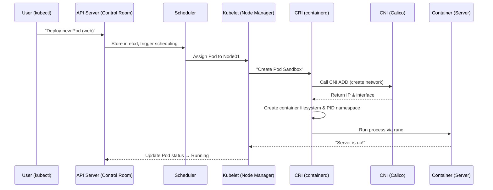
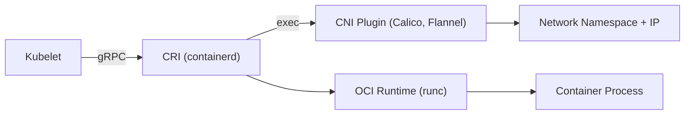

# 🏢 Kubernetes Internals as a Data Center

## 🚀 Big Picture: Kubernetes Is a Smart Automated Data Center

Think of **Kubernetes** as a **fully automated, AI-managed data center** — where every micro-component (Pod, Container, CNI, CRI, OCI…) maps to a real-world physical role.

You can literally imagine a physical building filled with racks, servers, cables, routers, and engineers — each doing what its Kubernetes equivalent does.

---

## 🧩 Analogy Table — Kubernetes as a Real Data Center

| Kubernetes Component                | Data Center Equivalent              | Description                                                                                                |
| ----------------------------------- | ----------------------------------- | ---------------------------------------------------------------------------------------------------------- |
| **API Server**                      | 🏢 Data Center Control Room         | The single command center — receives all instructions from you (`kubectl apply`, etc.)                     |
| **Scheduler**                       | ⚖️ Load Balancer & Resource Planner | Decides _where_ each new server (Pod) should live — which rack (node) has space and power                  |
| **Kubelet**                         | 👷 Data Center Floor Manager        | The hands-on engineer inside each rack — ensures servers are installed, wired, and running                 |
| **Pod**                             | 🗄️ Rack or Cabinet                  | A physical enclosure that can contain multiple servers (containers) sharing one network                    |
| **Container**                       | 💻 Server inside the Rack           | Runs one application — isolated, lightweight, but still inside a larger rack (Pod)                         |
| **CRI (containerd / CRI-O)**        | 👷🏻‍♂️ Server Technician                | Installs servers, plugs them into power, boots their OS, mounts disks, enforces CPU/RAM limits             |
| **CNI (Calico / Cilium / Flannel)** | 🧑‍🔧 Network Technician            | Connects racks and servers to the network — cables, IPs, routes, firewalls                                 |
| **OCI**                             | 📜 Hardware Specification Manual    | The blueprint defining what a “server” should look like and how it must behave (image & runtime standards) |

---

## 🧭 The Flow of Creation — From “Request” to “Running App”

<div align="center">



</div>

---

## 🧠 Step-by-Step: What Happens When a Pod Is Born

---

### 🧩 Step 1 — API Server: The Control Room

You (`kubectl apply`) send a YAML manifest to the **API Server**.
It stores it in **etcd** (the central database) and informs the **Scheduler**.

> "A new app needs to go live — please allocate it a place in the data center."

---

### ⚖️ Step 2 — Scheduler: The Planner

Scheduler evaluates all nodes:

- Available CPU/RAM
- Node taints and affinities
- Current load

Then it decides:

> “This new Rack (Pod) should live in Node03.”

---

### 👷 Step 3 — Kubelet: The On-Site Manager

Once assigned, **Kubelet** (running on Node03) gets the new Pod spec and starts executing.

But Kubelet doesn’t create containers itself — it delegates the actual construction to **CRI**.

---

## ⚙️ Step 4 — CRI (Container Runtime Interface) — 🧑‍🔧 _The Server Technician_

This is where the magic starts.

> CRI is the **worker** that actually builds and powers on your server (container).

Kubelet asks CRI (e.g., **containerd**):

> “Please create a sandbox for this Pod.”

containerd does:

1. Creates a **new network namespace** (the Pod’s private space).
2. Prepares storage directories and mount points.
3. Creates a **pause container** (the "empty rack" process that holds the Pod’s network namespace open).
4. Calls **CNI** to set up the network (wiring, IPs).

So CRI → manages:

- Container creation
- Filesystems
- PID namespaces
- Lifecycle (start, stop, restart)
- Image pulls

---

## 🌐 Step 5 — CNI (Container Network Interface) — 🌍 _The Network Engineer_

> “You built the rack, now let’s wire it into the data center network.”

The **CNI plugin** is not a daemon; it’s just a small binary (like `/opt/cni/bin/calico` or `/opt/cni/bin/flannel`) that runs when CRI asks for network setup.

### CNI’s Job (in human terms):

| Task                        | Description                                                                      |
| --------------------------- | -------------------------------------------------------------------------------- |
| 🧱 Create network interface | Create a virtual Ethernet cable (veth pair): one end in the Pod, one in the Node |
| 🌐 Assign IP address        | Allocate a unique IP for the Pod from the cluster CIDR                           |
| 🧭 Configure routing        | Make sure packets can travel between nodes                                       |
| 🚧 Apply policies           | Enforce NetworkPolicies (firewall rules)                                         |
| 🧹 Cleanup                  | Remove interfaces and release IP when Pod is deleted                             |

**Before CNI:**
Each runtime (Docker, CRI-O, etc.) had its _own custom networking logic_.
This caused chaos — every plugin worked differently, with no consistent standard.

**CNI solved this by**:
Creating a universal plugin model — any runtime can use any network provider as long as it implements the **CNI spec**.

---

### 💡 Example of CNI in Action (inside containerd logs)

When a Pod is created:

```ini
CNI_COMMAND=ADD
CNI_CONTAINERID=pod-12345
CNI_NETNS=/var/run/netns/cni-12345
CNI_IFNAME=eth0
CNI_ARGS=K8S_POD_NAME=nginx;K8S_POD_NAMESPACE=default
```

Result:

- veth pair created
- IP assigned (`10.244.1.12`)
- Route configured (`default via 10.244.1.1`)
- DNS set (`/etc/resolv.conf`)

Now the Pod is online and can ping other Pods in the cluster.

---

## 🧩 Step 6 — CRI Calls OCI Runtime (runc) — 🧍‍♂️ _Spinning Up the Actual Server_

CRI now executes **runc** (the OCI-compliant runtime) to actually spawn the container process:

```bash
runc run nginx-container
```

That’s the equivalent of **turning on the server’s power switch** inside the rack.

- **PID namespace** is created (the process space).
- **Filesystem** is mounted.
- **Network namespace** is joined (created earlier by CNI).
- **Command runs** (e.g., `nginx -g 'daemon off;'`).

✅ Container is now alive, running in its Pod’s network environment.

---

## 🧩 Step 7 — Kubelet Monitors, Reports, and Heals

Kubelet now monitors the container via the CRI:

- Health checks
- Logs
- Restarts (if failed)
- Reports status back to API Server

---

## 🧠 Comparison Summary — CRI vs CNI

| Feature             | CRI (Container Runtime Interface)                      | CNI (Container Network Interface)          |
| ------------------- | ------------------------------------------------------ | ------------------------------------------ |
| **Role**            | Manages lifecycle of containers                        | Manages network setup for Pods             |
| **Trigger**         | Called by kubelet                                      | Called by CRI                              |
| **Scope**           | Per-container & Pod                                    | Per-Pod                                    |
| **Responsible for** | PID, Mount, IPC, UTS namespaces; images; process start | Network namespace, interfaces, IPs, routes |
| **Interface type**  | gRPC API (daemon-based)                                | Executable binary (stateless)              |
| **Examples**        | containerd, CRI-O, Docker (deprecated)                 | Calico, Flannel, Cilium, WeaveNet          |
| **Output**          | Running container process                              | Pod connected to cluster network           |

---

## 🔩 Visual Architecture

<div align="center">



</div>

🧩 Flow:

- **Kubelet → CRI:** “Create sandbox”
- **CRI → CNI:** “Setup network”
- **CNI:** creates veth pair + assigns IP
- **CRI → runc:** “Run process”
- **runc:** spawns actual container in PID namespace
- **Pod:** now alive, with its own IP, CPU, and file system.

---

## 🧠 Real-Life Analogy Recap

| Real Data Center Component | What It Does                      | Kubernetes Equivalent |
| -------------------------- | --------------------------------- | --------------------- |
| Network Engineer           | Installs cables, assigns IPs      | **CNI**               |
| Server Technician          | Installs OS, powers on servers    | **CRI**               |
| Facility Manager           | Ensures everything is running     | **Kubelet**           |
| Control Room               | Receives requests, monitors state | **API Server**        |

> 🗣️ “CNI wires the network. CRI boots the server.
> Kubelet supervises them both. And OCI defines the rules of how each must behave.”

---

## 💎 In Plain English

> Kubernetes behaves like a self-driving data center.
> When you deploy a Pod, kubelet calls CRI to **build** the machine,
> CRI calls CNI to **connect** it to the network,
> and OCI defines **how** it must be built.
> Once done, kubelet keeps watch — healing, restarting, and scaling — just like a real DC ops manager.

---

## 🧠 TL;DR Summary Table

| Concept     | Summary                                                                     |
| ----------- | --------------------------------------------------------------------------- |
| **CRI**     | Creates and manages containers (process, filesystem, PID)                   |
| **CNI**     | Creates and manages Pod networking (veth, IP, routes)                       |
| **OCI**     | Defines container standards and runtime spec                                |
| **Kubelet** | Coordinates everything                                                      |
| **Analogy** | CRI = server builder, CNI = network engineer, Kubelet = data center manager |

---
