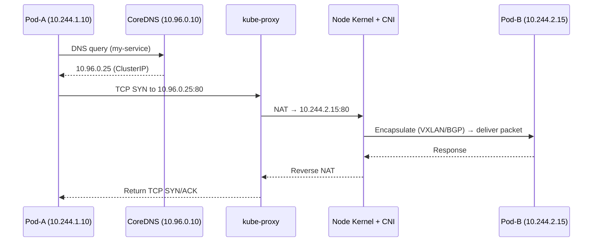

Perfect.
Let’s now go **deep into “Pod-to-Pod Communication Flow”** — with your preferred style: full architecture, diagrams, human storytelling, and real Linux-level explanations.

---

# 🌐 Pod-to-Pod Communication Flow

### 🧭 “From DNS lookup → kube-proxy → Pod → CNI → Kernel (Full Journey)”

---

## 🎯 Why This Matters

Every `curl http://service-name` you run inside a Pod **triggers a beautiful orchestra** of internal Kubernetes and Linux components — DNS, kube-proxy, CNI, kernel routing, NAT, and namespaces all cooperate to make it “just work.”

Let’s break that magic step-by-step.

---

## ⚙️ The Layers in the Path

Here’s the **logical path** when Pod-A connects to Pod-B:

```
Pod-A → CoreDNS → kube-proxy (Service) → Pod-B (via CNI + Kernel)
```

or more precisely:

```
App → DNS query → Service IP (ClusterIP) → iptables/eBPF → Node routing → veth → Pod-B
```

---

## 🧠 Big Picture Architecture

<div align="center">

```mermaid
graph TD
  A[Pod-A] --> B[CoreDNS]
  B --> C[Service ClusterIP]
  C --> D[kube-proxy Rules (iptables/eBPF)]
  D --> E[CNI Networking (veth, bridge, routes)]
  E --> F[Linux Kernel Routing]
  F --> G[Pod-B]
```

</div>

---

## 🧩 Step 1 — DNS Resolution (CoreDNS Magic)

1. When you connect to `my-service.default.svc.cluster.local`, your Pod:

   ```bash
   curl http://my-service
   ```
2. The app calls `getaddrinfo()` → the **Pod’s /etc/resolv.conf** points to CoreDNS:

   ```bash
   nameserver 10.96.0.10  # CoreDNS ClusterIP
   search default.svc.cluster.local svc.cluster.local cluster.local
   ```
3. CoreDNS receives the query (`A my-service.default.svc.cluster.local`),
   looks up **Service objects** in the API Server,
   and replies with the **Service ClusterIP** (e.g. `10.96.0.25`).

✅ So now Pod-A knows that “my-service = 10.96.0.25”.

---

## ⚙️ Step 2 — kube-proxy Translates ClusterIP → Pod Endpoint

kube-proxy runs **on every node**, watching the API Server for Service and Endpoint changes.

It creates **iptables** (or **eBPF**) rules like:

```bash
-A KUBE-SERVICES -d 10.96.0.25/32 -p tcp --dport 80 -j KUBE-SVC-XYZ
-A KUBE-SVC-XYZ -j KUBE-SEP-1 (10.244.1.10:8080)
-A KUBE-SVC-XYZ -j KUBE-SEP-2 (10.244.2.15:8080)
```

So when Pod-A sends a TCP packet to `10.96.0.25:80`:

➡️ The packet hits iptables → gets **NATed** (DNAT) → redirected to one of the backend Pod IPs.

If multiple backends exist, kube-proxy uses **round-robin randomization**.

✅ Result: ClusterIP behaves like a load balancer inside the cluster.

---

## 🧠 Step 3 — Linux Kernel Routes the Packet

After NAT translation, the destination IP becomes something like:

```
10.244.2.15:8080
```

Now the **Linux kernel** checks its routing table:

```bash
ip route show
```

Example:

```
10.244.0.0/16 via 192.168.1.12 dev eth0
```

This tells the node:

* “If the destination IP is in 10.244.x.x (Pod CIDR), route it via another node (CNI managed).”

---

## 🔗 Step 4 — CNI Plugin Handles Cross-Node Routing

Here’s where **CNI** magic happens.
Your plugin (Flannel, Calico, Cilium…) knows **how to reach other Pods**:

| CNI Type    | Cross-Node Mechanism                        |
| ----------- | ------------------------------------------- |
| **Flannel** | Overlay VXLAN (encapsulates packets in UDP) |
| **Calico**  | BGP routing between nodes                   |
| **Weave**   | Peer-to-peer mesh network                   |
| **Cilium**  | eBPF-based routing and load balancing       |

🧩 Example (Flannel VXLAN):

1. The packet from Pod-A → Node1 kernel → VXLAN device (`flannel.1`)
2. Encapsulated in UDP and sent to Node2’s IP
3. Node2’s kernel decapsulates it → injects into Pod-B’s veth

✅ Now it’s inside Pod-B’s namespace.

---

## 🧱 Step 5 — Pod Network Namespace and veth

Each Pod has:

* Its own **network namespace**
* A virtual interface (`eth0`)
* Connected to node via **veth pair**

Example:

```bash
# Inside Pod
ip addr show eth0
# 10.244.1.10/24

# On Node
ip addr show cali1234
# veth connected to Pod
```

Traffic entering Pod-B’s veth → goes straight to the Pod process.

---

## 💬 Step 6 — Response Path (Reverse Flow)

The return packet from Pod-B travels the exact reverse path:

```
Pod-B eth0 → veth pair → node → CNI route → kernel → NAT reverse → Pod-A
```

All routing + NAT entries are **stateful** — so replies are matched correctly.

---

## 🧪 Real Example Walkthrough

Assume:

| Pod   | Node  | IP          |
| ----- | ----- | ----------- |
| pod-a | node1 | 10.244.1.10 |
| pod-b | node2 | 10.244.2.15 |

1. pod-a runs:

   ```bash
   curl http://nginx-service
   ```
2. DNS → CoreDNS → returns `10.96.0.25`
3. kube-proxy NATs 10.96.0.25 → 10.244.2.15
4. kernel routes it via node2
5. CNI (Flannel) encapsulates into VXLAN packet
6. node2 decapsulates → Pod-B gets TCP SYN
7. Pod-B replies → packet returns along reverse route

✅ Communication complete.

---

## 🧠 Visualized End-to-End Flow

<div align="center">



</div>

---

## ⚙️ Command-Level Proof (Debug It Yourself)

### Show Pod’s IP and routes:

```bash
kubectl exec pod-a -- ip route
```

### Show kube-proxy rules:

```bash
iptables-save | grep KUBE-SVC
```

### Show Pod veth pair:

```bash
ip link | grep veth
```

### Show VXLAN interface (Flannel):

```bash
ip link show flannel.1
```

---

## 💡 Key Insights

| Component                | Role                           |
| ------------------------ | ------------------------------ |
| **CoreDNS**              | Resolves Service → ClusterIP   |
| **kube-proxy**           | NAT from ClusterIP → Pod IP    |
| **CNI Plugin**           | Connects Pods across nodes     |
| **Kernel Routing**       | Decides physical path          |
| **veth Pair**            | Connects Pod namespace to node |
| **Namespaces & cgroups** | Ensure Pod isolation           |

---

## 🧩 TL;DR Summary

| Step | Description                               |
| ---- | ----------------------------------------- |
| 1️⃣  | App resolves service name via CoreDNS     |
| 2️⃣  | Gets ClusterIP from DNS                   |
| 3️⃣  | kube-proxy NATs ClusterIP to Pod endpoint |
| 4️⃣  | Linux kernel routes via CNI               |
| 5️⃣  | CNI tunnels across nodes if needed        |
| 6️⃣  | Pod receives packet via veth              |
| 7️⃣  | Response follows reverse NAT path         |

---

## 💎 Final Visual Recap

<div align="center">

```mermaid
graph TD
  A[Pod-A] --> B[CoreDNS]
  B --> C[Service ClusterIP (via kube-proxy)]
  C --> D[Node Kernel Routing]
  D --> E[CNI Plugin (overlay / BGP / eBPF)]
  E --> F[Pod-B eth0]
```

</div>

---

✅ **In plain English:**

> When one Pod talks to another, Kubernetes does not “magically” connect them — it’s an elegant choreography between DNS for naming, kube-proxy for translating, the CNI plugin for routing, and the Linux kernel for moving the bytes.
> The beauty? It works seamlessly whether your Pods are on the same node or across the planet.

---

Would you like me to now continue with the **“Service-to-Pod Communication (ClusterIP / NodePort / LoadBalancer)”** — including kube-proxy’s NAT tables and real iptables rules explained with diagrams?
