# 🧩 Deep Dive: Keepalives, Bookmarks & Reconnection Logic in Kubernetes Watch Connections

👉 _“How the kubelet and controller-manager maintain heartbeats and keep their watch connections alive using keepalive probes, Bookmarks, and retry logic (including timeouts and reconnection behavior)”_?

---

## 🧠 1️⃣ The Problem — Watch Streams Are Long-Lived

Each component (like `kubelet`, `kube-proxy`, or `controller-manager`) opens **one persistent HTTPS connection** to the API server:

```bash
GET /api/v1/pods?watch=true
```

That connection can stay open for **hours or days**, streaming events in real time.
But… networks drop, NATs time out, proxies reset, and TCP connections die silently 🫠

So, Kubernetes needed a way to:

1. Detect stale connections
2. Resume efficiently without losing events
3. Avoid hammering etcd or the API server

---

## ⚙️ 2️⃣ The Core Reliability Tools

| Mechanism                          | Purpose                     | Works Between       |
| ---------------------------------- | --------------------------- | ------------------- |
| **HTTP Keep-Alive**                | Keeps the TCP socket open   | Client ↔ API Server |
| **Heartbeat / Bookmarks**          | Confirms “I’m still alive”  | API Server → Client |
| **Reconnect with resourceVersion** | Resume from last event      | Client → API Server |
| **etcd Watch Lease**               | Prevent stale etcd watchers | API Server ↔ etcd   |
| **Retry-After & Backoff**          | Avoid overload on reconnect | Client              |

---

## 📡 3️⃣ HTTP Keep-Alive — The Foundation

Each Watch uses **HTTP/1.1 persistent connections** or **HTTP/2 streams**.

- The TCP socket is reused.
- Periodic TCP keepalives prevent idle disconnection.
- API server sends data with **Transfer-Encoding: chunked**, so the connection never “completes”.

You can check it in flight:

```bash
curl -v -k https://<apiserver>:6443/api/v1/pods?watch=true
```

Look for:

```
Connection: keep-alive
Transfer-Encoding: chunked
```

✅ If nothing changes for a while, the socket still stays alive thanks to TCP keepalive probes.

---

## 🧩 4️⃣ The Watch Bookmark Mechanism

Kubernetes added **Bookmark events** in v1.15 to solve the “silent timeout” issue.

**Without Bookmarks:**
If no Pods change for 5 minutes, the client might think the connection is dead.

**With Bookmarks:**
The API server periodically sends:

```json
{
  "type": "BOOKMARK",
  "object": {
    "metadata": {
      "resourceVersion": "453982"
    }
  }
}
```

➡️ This acts as a _lightweight heartbeat_ — confirming both sides are still connected.

No object data = no load on API server or etcd.

### Enable in your Watch:

```bash
GET /api/v1/pods?watch=true&allowWatchBookmarks=true
```

---

## 🧩 5️⃣ Client-Side Reconnection Logic

Every Kubernetes component implements a “watch loop” roughly like this:

```go
for {
    rv := getLastResourceVersion()
    watch, err := apiserver.Watch(resource, rv)
    if err != nil {
        sleep(backoff)
        continue
    }

    for event := range watch.ResultChan() {
        if event.Type == ERROR && event.Code == 410 {
            // Resource version too old, do a full list again
            fullList()
        }
        process(event)
    }
}
```

So if the network drops or the Watch ends, it **re-establishes** automatically.

✅ The client uses the latest `resourceVersion` from the last event or bookmark
✅ This prevents full re-lists (saves etcd load)

---

## 🧠 6️⃣ When Watch Connections Close

| Cause                   | API Server Response | Client Action                       |
| ----------------------- | ------------------- | ----------------------------------- |
| Timeout / Idle          | EOF / socket close  | Reconnect with last resourceVersion |
| API server restart      | Connection reset    | Reconnect automatically             |
| ResourceVersion too old | HTTP 410 Gone       | Full re-list                        |
| RBAC or cert change     | HTTP 403 Forbidden  | Retry after token refresh           |
| Network partition       | TCP timeout         | Retry after exponential backoff     |

Example 410 response:

```json
{ "type": "ERROR", "object": { "kind": "Status", "code": 410, "reason": "Gone" } }
```

Meaning: “Your bookmark is too old — start over.”

---

## 🔁 7️⃣ Exponential Backoff (Client Side)

To avoid overloading the API server when many watchers reconnect:

| Attempt | Wait Time  |
| ------- | ---------- |
| 1       | 200 ms     |
| 2       | 400 ms     |
| 3       | 800 ms     |
| 4       | 1.6 s      |
| …       | up to 30 s |

Implemented in client-go’s `RetryWatcher` and `Reflector`.

So after a cluster restart, thousands of kubelets reconnect gracefully — not all at once 🚦

---

## 🧩 8️⃣ Reflectors & Informers — The Smart Cache Layer

All high-level controllers use the **Informer framework**, which wraps the Watch logic.

Components:

- **Reflector** → maintains local cache from Watch
- **Informer** → provides event handlers (`onAdd`, `onUpdate`, `onDelete`)
- **Indexer** → stores objects in memory for quick lookups

```mermaid
graph TD
  A[API Server]
  B[Reflector (Watch Loop)]
  C[Informer (Handlers)]
  D[Indexer (Local Store)]
  A-->|Watch Events|B-->C-->D
```

✅ Bookmarks update the resourceVersion in the Reflector
✅ If Watch breaks, it relists starting from that version

---

## ⚙️ 9️⃣ Heartbeats at the Node Level

Separate from Watch events, kubelet also maintains **node heartbeats**:

- Every 10 s: sends a `PATCH /api/v1/nodes/<name>/status`
- Updates `status.lastHeartbeatTime`
- If missed for > 40 s, NodeController marks node as `NotReady`

This is **not a Watch**, but an API heartbeat that works _alongside_ the Watch mechanism.

---

## 📊 10️⃣ Monitoring Watch Health

You can check Watch metrics from the API server:

```bash
curl -k https://<apiserver>:6443/metrics | grep watch
```

Key metrics:

| Metric                               | Meaning                     |
| ------------------------------------ | --------------------------- |
| `apiserver_watch_events_total`       | Number of events sent       |
| `apiserver_watch_duration_seconds`   | Duration of Watch sessions  |
| `apiserver_watch_bookmarks_total`    | Count of bookmark events    |
| `apiserver_watch_terminations_total` | Number of Watch disconnects |

---

## 🧩 11️⃣ Visual: Watch Reconnection Lifecycle

```mermaid
sequenceDiagram
    participant Kubelet
    participant API as API Server
    participant ETCD

    Note over Kubelet,API: 🔐 TLS Keep-Alive active
    Kubelet->>API: GET /api/v1/pods?watch=true&allowWatchBookmarks=true
    API-->>Kubelet: {"type":"ADDED","object":{...}}
    API-->>Kubelet: {"type":"BOOKMARK","object":{"resourceVersion":"105"}}
    Note right of Kubelet: Connection lost (timeout)
    Kubelet->>API: Reconnect with resourceVersion=105
    API-->>Kubelet: Resume stream from 105 ✅
```



✅ Zero event loss
✅ Zero full reload
✅ Zero manual intervention

---

## 🧠 12️⃣ ResourceVersion Lifecycle Recap

| Phase            | Example      | Description                  |
| ---------------- | ------------ | ---------------------------- |
| **Initial list** | `rv=100`     | Snapshot of current state    |
| **Streaming**    | `rv=101–150` | Continuous updates           |
| **Bookmark**     | `rv=150`     | Keepalive marker             |
| **Reconnect**    | `rv=150`     | Resumes from last seen event |
| **410 Gone**     | `rv=expired` | Full list again              |

---

## ⚡ 13️⃣ Watch vs Heartbeat Summary

| Aspect      | Watch (API Stream)          | Heartbeat (Node Status) |
| ----------- | --------------------------- | ----------------------- |
| Protocol    | HTTPS (chunked/stream)      | HTTPS (PATCH request)   |
| Direction   | Server → Client             | Client → Server         |
| Trigger     | Object change               | Time-based              |
| Example     | Pod ADDED                   | Node heartbeat          |
| Reliability | Bookmarks + resourceVersion | Periodic resync         |

---

## 🔍 14️⃣ Debugging Tips

### List active watchers

```bash
kubectl get --raw /metrics | grep watch
```

### Check API server logs for disconnects

```bash
journalctl -u kube-apiserver | grep watch
```

### See Reflector state

If you’re writing a controller:

```go
reflector.LastSyncResourceVersion()
```

---

## 📚 15️⃣ Key Takeaways

- Every Watch connection stays alive through:

  - **TCP keepalive**
  - **Periodic Bookmarks**
  - **Automatic reconnects using resourceVersion**

- Kubernetes avoids event loss by replaying from cache.
- Exponential backoff protects the API server during reconnect storms.
- Informers wrap all of this into an elegant, self-healing layer.
- Bookmarks are **lightweight heartbeats** — no data, just sync.

---

✅ **Result:**
Even if your cluster restarts, API servers reboot, or networks flap — all controllers, schedulers, kubelets, and proxies stay consistent **without polling or downtime**.
