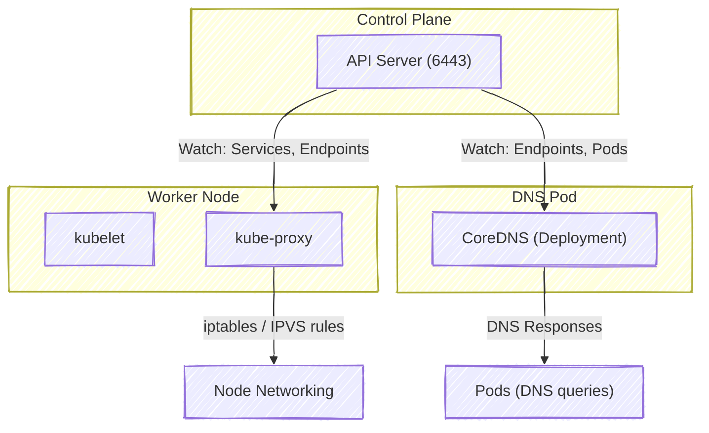
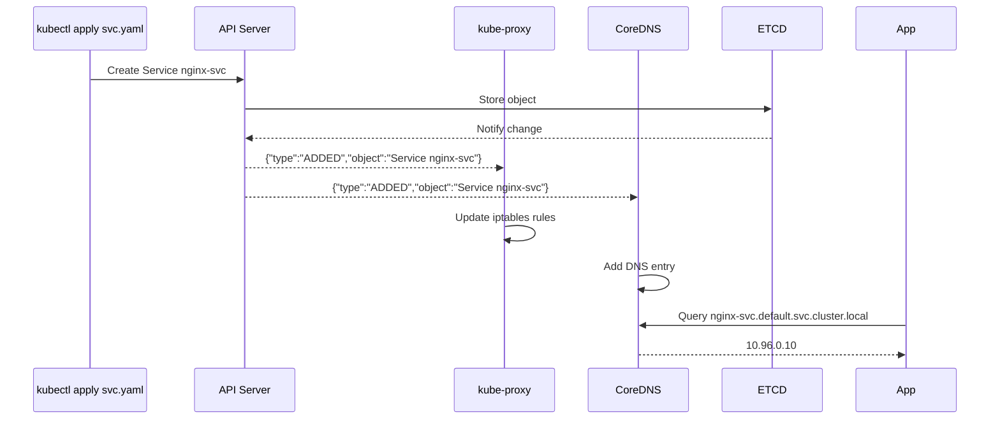

# 🌐 Deep Dive: Real-Time Network Updates via Watch Events

👉 _“How kube-proxy, CoreDNS, and the API server coordinate through Watch events to dynamically update cluster DNS and networking routes”_ —
so you can see how service discovery works in real time using the same Watch mechanism?

---

## 🧠 1️⃣ The Big Picture — Event-Driven Networking

Whenever a **Service**, **Pod**, or **EndpointSlice** changes in the cluster:

- The **API Server** detects the update.
- It pushes **Watch events** over HTTPS to both:

  - `kube-proxy` (for routing and iptables rules)
  - `CoreDNS` (for DNS records)

All communication happens through **mTLS**-secured Watch streams — no polling, no static configs.

Let’s start with the full picture 👇



---

## ⚙️ 2️⃣ What Each Component Watches

| Component              | Watches                             | Why                              |
| ---------------------- | ----------------------------------- | -------------------------------- |
| **kube-proxy**         | Services, Endpoints, EndpointSlices | To maintain routing rules        |
| **CoreDNS**            | Services, Pods, Endpoints           | To serve DNS records dynamically |
| **kubelet**            | Pods (assigned to its node)         | To manage container lifecycles   |
| **Controller Manager** | Nodes, Deployments, ReplicaSets     | To orchestrate scheduling        |
| **API Server**         | etcd                                | To stream updates to all above   |

All of them use the same **Watch API** pattern.

---

## 🧩 3️⃣ Example Scenario

Let’s imagine you create a new Service and a Pod:

```bash
kubectl apply -f service.yaml
kubectl apply -f pod.yaml
```

Now watch what happens under the hood 👇

### 🪄 Step 1 — API Server stores objects

- Service and Pod definitions go into **etcd**.
- API server updates its **Watch Cache**.

### 🪄 Step 2 — API server emits Watch events

Two Watch events are generated:

```json
{"type": "ADDED", "object": {"kind": "Service", "metadata": {"name": "nginx-svc"}}}
{"type": "ADDED", "object": {"kind": "Pod", "metadata": {"name": "nginx"}}}
```

### 🪄 Step 3 — kube-proxy and CoreDNS receive them

- **kube-proxy** adds new iptables/IPVS rules
- **CoreDNS** adds a DNS entry for `nginx-svc.default.svc.cluster.local`

✅ Instant network update
✅ No manual reload
✅ No downtime

---

## 🔁 4️⃣ kube-proxy Watch Logic

Let’s look at `kube-proxy` first — it’s basically a _network controller_ driven by Watch events.

### kube-proxy watches:

- `/api/v1/services`
- `/api/v1/endpoints` or `/apis/discovery.k8s.io/v1/endpointslices`

When an endpoint (Pod IP) is added/removed →
kube-proxy modifies **iptables**, **ipvs**, or **userspace rules**.

---

### 🧠 Example Flow



```mermaid
sequenceDiagram
    participant User as kubectl
    participant API as API Server
    participant Proxy as kube-proxy
    participant Net as Node Networking

    User->>API: Create Service (nginx-svc)
    API->>Proxy: {"type":"ADDED","object":{"kind":"Service"}}
    Proxy->>Net: Add iptables rule for ClusterIP
    User->>API: Pod nginx Ready
    API->>Proxy: {"type":"MODIFIED","object":{"Endpoints":["10.244.1.10"]}}
    Proxy->>Net: Update iptables DNAT → PodIP
```

Now any Pod can reach `nginx-svc` via:

```bash
curl http://nginx-svc
```

and traffic will flow automatically.

---

## 🧩 5️⃣ How kube-proxy Updates iptables

When a new endpoint appears:

1. kube-proxy gets event via Watch stream
2. It maps:

   - ClusterIP → Pod IP(s)
   - Port → TargetPort

3. It creates iptables rules:

   ```bash
   -A KUBE-SERVICES -d 10.96.0.10/32 -p tcp --dport 80 -j KUBE-SVC-ABCDE
   -A KUBE-SVC-ABCDE -m statistic --mode random --probability 0.5 -j KUBE-SEP-1234
   -A KUBE-SEP-1234 -p tcp -d 10.244.1.10 --dport 8080 -j DNAT --to-destination 10.244.1.10:8080
   ```

4. When a Pod dies, it receives a `DELETED` event and removes the corresponding rules.

---

## ⚙️ 6️⃣ IPVS Mode

If `kube-proxy` is running in **IPVS mode**, it uses the Linux IP Virtual Server kernel module instead of iptables:

```bash
ipvsadm -L -n
```

Output:

```
TCP  10.96.0.10:80 rr
  -> 10.244.1.10:8080   Masq  1
  -> 10.244.2.15:8080   Masq  1
```

Same logic — but faster and more scalable 🚀
Still driven by the **same Watch events**.

---

## 🧩 7️⃣ CoreDNS Watch Logic

Now let’s move to **CoreDNS** — the DNS brain of the cluster 🧠

CoreDNS also doesn’t poll the API — it subscribes to Watch streams via the **Kubernetes plugin**.

### It watches:

- `/api/v1/services`
- `/api/v1/endpoints`
- `/api/v1/pods`

Each update immediately adjusts the DNS zone file held in memory.

---

### 🧠 Example Flow



```mermaid
sequenceDiagram
    participant API as API Server
    participant DNS as CoreDNS
    participant App as Pod (DNS Query)

    API->>DNS: {"type":"ADDED","object":{"kind":"Service","metadata":{"name":"nginx-svc"}}}
    DNS->>DNS: Add record nginx-svc.default.svc.cluster.local → 10.96.0.10
    App->>DNS: DNS Query A nginx-svc.default.svc.cluster.local
    DNS-->>App: 10.96.0.10
```

✅ The DNS entry appears instantly when the service is created.

---

## 🧩 8️⃣ CoreDNS Configuration (Behind the Scenes)

In `/etc/coredns/Corefile` inside the Pod:

```bash
.:53 {
    errors
    health
    kubernetes cluster.local in-addr.arpa ip6.arpa {
        pods insecure
        fallthrough in-addr.arpa ip6.arpa
    }
    prometheus :9153
    forward . /etc/resolv.conf
    cache 30
}
```

The `kubernetes` plugin establishes Watch connections to:

- Services
- Endpoints
- Pods

All via the **API Server’s 6443 HTTPS endpoint**.

---

## 📡 9️⃣ CoreDNS Watch Caching

CoreDNS maintains a **local cache** of:

- Service names → ClusterIPs
- Pod names → IPs

When the Watch stream sends a `MODIFIED` event (Pod replaced),
CoreDNS immediately updates its in-memory zone map — no restart.

It’s the same Watch+Bookmark+Reconnect logic as controllers.

---

## 🧩 🔁 10️⃣ Real-Time Sync Diagram



✅ 100% dynamic
✅ Fully event-driven
✅ Self-healing if API server restarts

---

## 🧩 11️⃣ Troubleshooting Real-Time Networking

### 🔍 See kube-proxy’s active Watches:

```bash
ps aux | grep kube-proxy
cat /var/log/kube-proxy.log | grep watch
```

### 🔍 Debug DNS watches:

```bash
kubectl exec -n kube-system -it coredns-xxxx -- sh
cat /etc/coredns/Corefile
```

### 🔍 Monitor network tables:

```bash
sudo iptables -t nat -L -n | grep KUBE-
```

---

## 🧩 12️⃣ Optimization Techniques

| Feature               | Description                                               |
| --------------------- | --------------------------------------------------------- |
| **EndpointSlice API** | Reduces watch payload size (grouped endpoints)            |
| **Bookmark events**   | Keeps DNS and proxy watches alive                         |
| **Informer cache**    | Prevents redundant API calls                              |
| **Compression**       | Gzip used on large watch streams                          |
| **LabelSelectors**    | CoreDNS watches only `kube-system` namespace for services |

---

## 🧠 13️⃣ Summary Table

| Component              | Watches             | Reaction             | Effect          |
| ---------------------- | ------------------- | -------------------- | --------------- |
| **kube-proxy**         | Services, Endpoints | Update iptables/IPVS | Pod routing     |
| **CoreDNS**            | Services, Endpoints | Update DNS zone      | Name resolution |
| **Kubelet**            | Pods (node-scoped)  | Manage containers    | Lifecycle sync  |
| **Controller Manager** | Deployments, Nodes  | Scale, heal          | Orchestration   |

---

## ⚡ 14️⃣ Key Takeaways

- The entire Kubernetes networking layer is **event-driven**, not polling.
- Both **CoreDNS** and **kube-proxy** rely on **Watch connections** to stay current.
- Changes in Services or Endpoints trigger **instant updates**.
- **No downtime**, **no reloads**, **no manual intervention**.
- This is how Kubernetes keeps **millions of packets per second** correctly routed and resolvable — _in real time_.

---

Would you like the next continuation to explain
👉 _“How kubelet, CNI plugins (like bridge, flannel, calico), and Linux network namespaces integrate together to attach Pods to the cluster network — including how API Server events trigger CNI calls under the hood”?_
