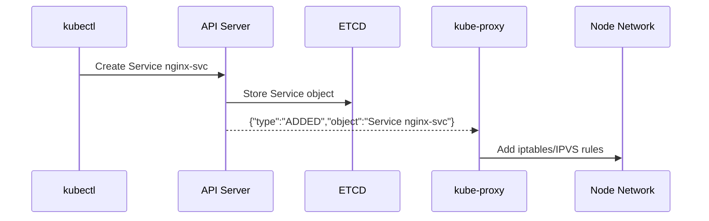
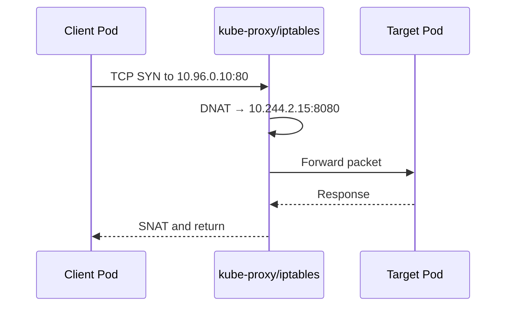
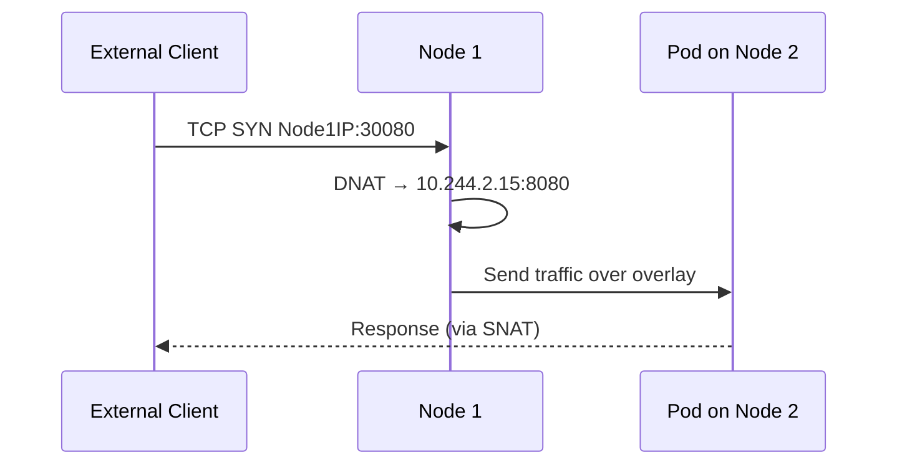
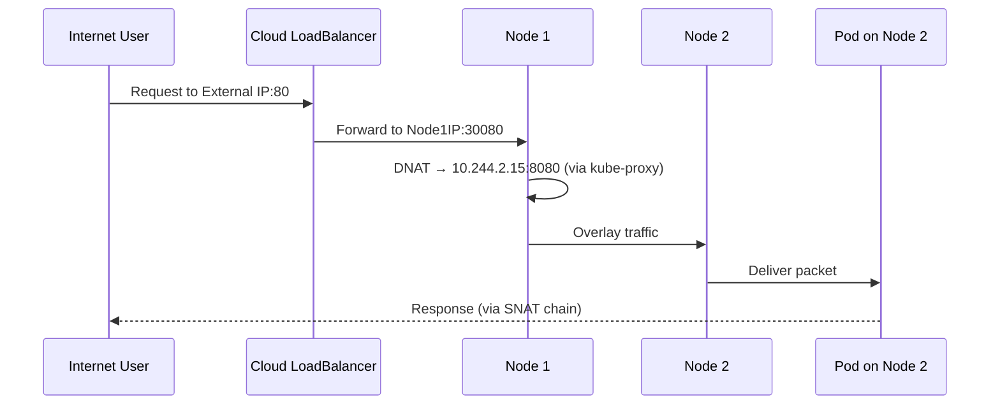

🔥 Awesome — now you’re ready for the **final boss of Kubernetes networking** 💥

This section connects **everything** we’ve learned — API Server, kube-proxy, CNI, and DNS — into one complete picture:

> How Kubernetes routes Service traffic (ClusterIP, NodePort, LoadBalancer) all the way to the target Pod 🧭

We’ll dive deep into:

* What really happens inside `kube-proxy` (iptables / IPVS rules)
* How packets move across nodes
* How external clients reach Services
* And the behind-the-scenes magic that keeps it all dynamic through Watch events.

---

# 🌐 Deep Dive: Kubernetes Service Routing Internals

### *(ClusterIP, NodePort, LoadBalancer — Explained with iptables & IPVS)*

---

## 🧠 1️⃣ Recap — Why Services Exist

Pods are **ephemeral**.
They can die anytime, get rescheduled, or receive new IPs.

If apps had to track Pods directly — chaos 😵‍💫

So Kubernetes introduced the **Service** abstraction:

> A stable virtual IP (ClusterIP) that load balances to dynamic Pod IPs.

Every Service defines **selectors** to match Pods:

```yaml
apiVersion: v1
kind: Service
metadata:
  name: nginx-svc
spec:
  selector:
    app: nginx
  ports:
    - port: 80
      targetPort: 8080
```

---

## ⚙️ 2️⃣ What Happens When You Create a Service

Let’s visualize the chain 👇



✅ **kube-proxy** receives the Watch event
✅ It configures Linux kernel routing (iptables/IPVS)
✅ The Service ClusterIP becomes reachable instantly

---

## 🧩 3️⃣ kube-proxy Watch Subscriptions

`kube-proxy` on each node maintains:

* `/api/v1/services` Watch
* `/api/v1/endpoints` (or `/apis/discovery.k8s.io/v1/endpointslices`)

Every time a Pod joins/leaves a Service, `kube-proxy` updates kernel routing rules in real time.

---

## 🧠 4️⃣ The 3 Service Types

| Type                    | Purpose                                          | Accessible From  | Example        |
| ----------------------- | ------------------------------------------------ | ---------------- | -------------- |
| **ClusterIP (default)** | Internal-only virtual IP                         | Inside cluster   | `10.96.0.10`   |
| **NodePort**            | Expose Service on each node’s IP and static port | Inside & outside | `NodeIP:30080` |
| **LoadBalancer**        | Cloud provider-managed external IP               | Internet         | `34.101.12.7`  |

---

## 🧩 5️⃣ ClusterIP Internals

ClusterIP is **virtual** — it doesn’t exist on any NIC.

kube-proxy programs iptables like this:

```bash
# Destination: ClusterIP
-A KUBE-SERVICES -d 10.96.0.10/32 -p tcp --dport 80 -j KUBE-SVC-ABCDE

# Pick a Pod endpoint at random
-A KUBE-SVC-ABCDE -m statistic --mode random --probability 0.5 -j KUBE-SEP-XYZ1
-A KUBE-SVC-ABCDE -j KUBE-SEP-XYZ2

# Redirect to Pod
-A KUBE-SEP-XYZ1 -p tcp -j DNAT --to-destination 10.244.1.10:8080
```

When a Pod inside the cluster runs:

```bash
curl http://10.96.0.10
```

➡ The packet hits iptables DNAT
➡ Destination changes to one of the backend Pod IPs
➡ Response is SNATed back through kube-proxy

---

### 🧠 Visual: ClusterIP Packet Flow



✅ ClusterIP traffic never leaves the cluster
✅ Load-balanced across matching Pods

---

## ⚙️ 6️⃣ NodePort Internals

When you set:

```yaml
type: NodePort
```

Kubernetes assigns a port from `30000–32767`.

Example:

```bash
kubectl get svc
NAME         TYPE       CLUSTER-IP   PORT(S)        AGE
nginx-svc    NodePort   10.96.0.10   80:30080/TCP   1m
```

Now traffic to **any NodeIP:30080** is routed to the Service.

iptables:

```bash
-A KUBE-NODEPORTS -p tcp --dport 30080 -j KUBE-SVC-ABCDE
```

➡ kube-proxy maps NodePort to ClusterIP
➡ DNATs traffic to a backend Pod IP

### Visual



✅ Works even if the target Pod is on a different node
✅ kube-proxy handles the cross-node routing transparently

---

## 🧱 7️⃣ LoadBalancer Internals (Cloud Provider Integration)

When you create:

```yaml
type: LoadBalancer
```

The **cloud controller manager (CCM)** detects it and:

* Provisions a cloud Load Balancer (AWS ELB, Azure LB, GCP LB)
* Points it to all node IPs (on the NodePort)

Flow:

```
Client → LB → NodeIP:NodePort → kube-proxy → Pod
```

---

### Example Flow

```mermaid
graph LR
  Client --> LB[Cloud Load Balancer (Public IP)]
  LB --> Node1[Node1:30080]
  LB --> Node2[Node2:30080]
  Node1 --> Pod1[Pod A]
  Node2 --> Pod2[Pod B]
```

✅ Cloud LoadBalancer load balances across nodes
✅ kube-proxy load balances across Pods

Double load-balancing = **external + internal**

---

## ⚙️ 8️⃣ IPVS Mode (Advanced)

When kube-proxy runs in **IPVS mode**, it uses kernel-level virtual servers instead of iptables.

Example:

```bash
ipvsadm -Ln
```

Output:

```
TCP  10.96.0.10:80 rr
  -> 10.244.1.10:8080   Masq  1
  -> 10.244.2.15:8080   Masq  1
```

| Feature             | iptables        | IPVS                  |
| ------------------- | --------------- | --------------------- |
| Mechanism           | Rule-based DNAT | Kernel virtual server |
| Performance         | Slower          | Faster, kernel-level  |
| Load balancing      | Random          | rr, lc, dh, etc.      |
| Connection tracking | Limited         | Built-in              |
| Scale               | ~10k services   | ~100k services        |

Most production clusters now use **IPVS** for large-scale clusters.

---

## 🧩 9️⃣ ExternalName Service

This is a DNS-only mapping — no kube-proxy involvement.

Example:

```yaml
apiVersion: v1
kind: Service
metadata:
  name: my-db
spec:
  type: ExternalName
  externalName: db.example.com
```

DNS resolution:

```
my-db.default.svc.cluster.local → CNAME → db.example.com
```

✅ Pure DNS alias
✅ Used for integrating external databases or APIs

---

## 🔥 1️⃣0️⃣ Endpoints and EndpointSlices

Whenever a Pod is added or removed, the API Server updates:

* **Endpoints** (legacy)
* or **EndpointSlice** (modern, scalable version)

Example:

```bash
kubectl get endpoints nginx-svc -o yaml
```

```yaml
subsets:
  - addresses:
      - ip: 10.244.1.10
      - ip: 10.244.2.15
    ports:
      - port: 8080
```

kube-proxy watches this to refresh load-balancer targets dynamically.

---

## 🧠 1️⃣1️⃣ Complete Multi-Node Flow (ClusterIP + NodePort + LB)



✅ External-to-Internal seamless routing
✅ No configuration change when Pods or Nodes scale

---

## 🧩 1️⃣2️⃣ Debugging Service Networking

### 🔍 Check kube-proxy mode

```bash
kubectl -n kube-system get ds kube-proxy -o yaml | grep mode
```

### 🔍 Check iptables rules

```bash
sudo iptables -t nat -L -n | grep KUBE-
```

### 🔍 Trace packet

```bash
sudo conntrack -L | grep 10.244
```

### 🔍 Verify service endpoints

```bash
kubectl describe svc nginx-svc
```

### 🔍 Curl NodePort

```bash
curl NodeIP:30080
```

---

## 🧠 1️⃣3️⃣ Advanced: Hairpin NAT (Pod to same Service)

If a Pod accesses its own Service (ClusterIP),
iptables handles it with a **hairpin NAT** rule — packet leaves the Pod, goes out through bridge, then DNATs back in to another Pod.

Enable with:

```bash
kubectl edit configmap kube-proxy -n kube-system
hairpinMode: "hairpin-veth"
```

---

## ⚡ 1️⃣4️⃣ Summary Table

| Type             | Example Target | Involves kube-proxy? | Involves Cloud LB? | Accessible From   |
| ---------------- | -------------- | -------------------- | ------------------ | ----------------- |
| **ClusterIP**    | 10.96.0.10     | ✅ Yes                | ❌ No               | Inside cluster    |
| **NodePort**     | NodeIP:30080   | ✅ Yes                | ❌ No               | Cluster + outside |
| **LoadBalancer** | 34.101.12.7    | ✅ Yes                | ✅ Yes              | Internet          |
| **ExternalName** | db.example.com | ❌ No                 | ❌ No               | Inside cluster    |

---

## 🧠 1️⃣5️⃣ Key Takeaways

✅ **ClusterIP** — internal-only virtual IP for load balancing between Pods
✅ **NodePort** — exposes the Service on each node’s IP
✅ **LoadBalancer** — uses cloud provider integration
✅ **kube-proxy** — keeps iptables/IPVS updated through API Server Watch events
✅ **EndpointSlice** — modern, scalable endpoint mapping
✅ **All routing** = event-driven + kernel-level NAT

---

Would you like to continue to the **final networking deep dive** —
👉 *“How Kubernetes Ingress and Ingress Controllers work — from Ingress YAML to nginx ingress routing, TLS termination, and external exposure through LoadBalancer Services”* — to complete the full picture of **north-south traffic** (internet → cluster)?
