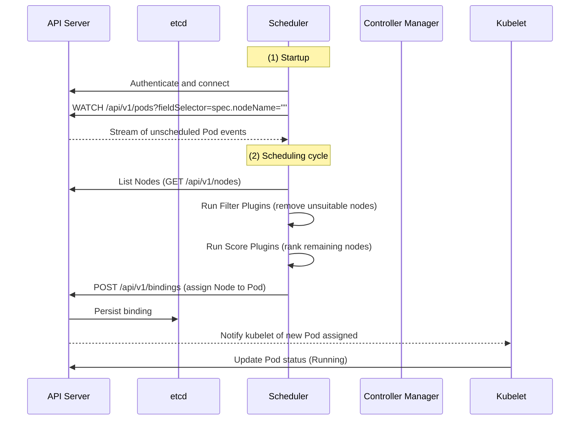
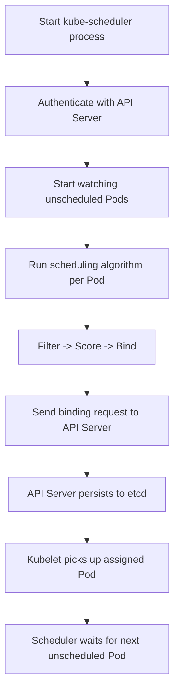
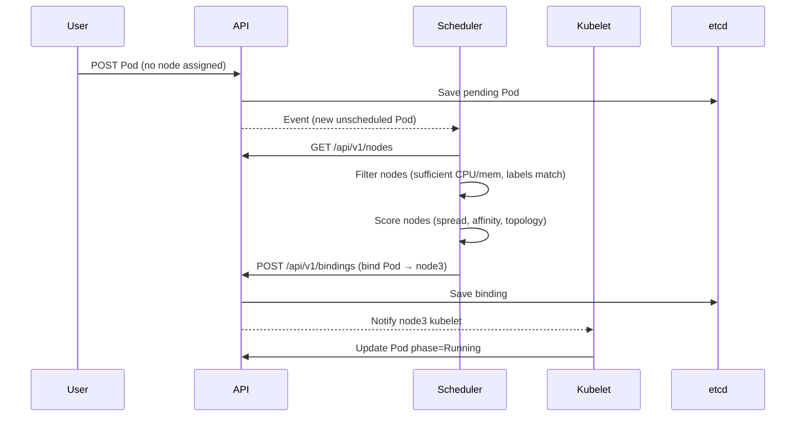
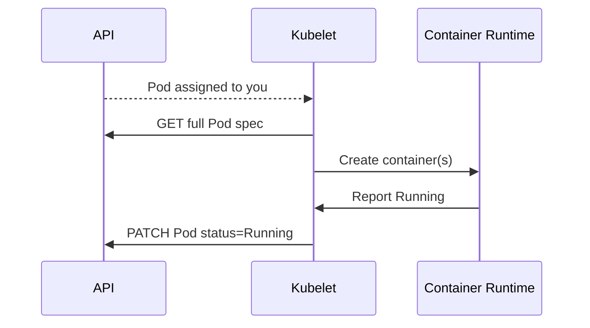
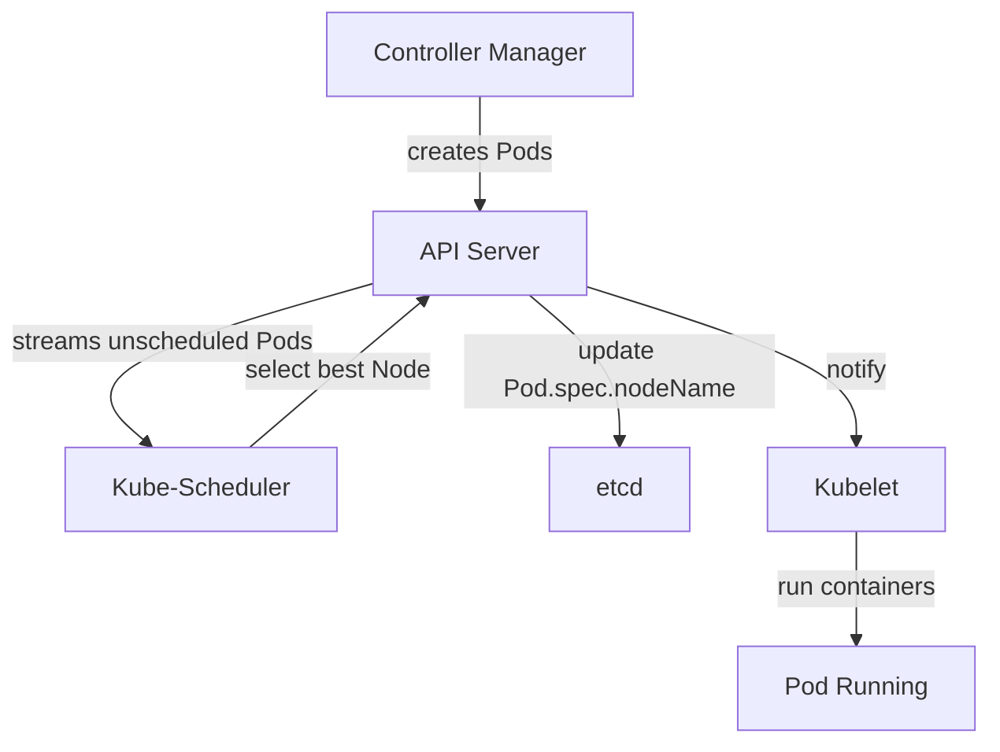

# 🧭 **Kube Scheduler Internals**

## 📖 **What Is It?**

The **Kube-Scheduler** is a **separate control-plane component** (like API Server and Controller Manager).

- Binary: `kube-scheduler`
- Location: `/etc/kubernetes/manifests/kube-scheduler.yaml`
- It connects to the **API Server** over **HTTPS (REST + Watch)**.
- It watches for **Pods without a Node assigned** (`.spec.nodeName == ""`).
- Its main job: **find the best node for each pending Pod**.

✅ **It doesn’t run Pods** — it only _decides placement_.
Kubelet (on each node) later executes that decision.

---

## ⚙️ **High-Level Lifecycle**

Let’s visualize exactly how the scheduler works end-to-end 👇

<div align="center" style="background-color: #255560ff; border-radius: 10px; border: 2px solid">



</div>

---

> ✅ Scheduler **only talks to API Server** (no direct node communication).  
> ✅ API Server streams unscheduled Pods via **Watch API**.  
> ✅ Scheduler replies with **Binding API requests**.

---

## 🧠 **Core Scheduling Loop** (Internal Stages)

Every Pod scheduling cycle follows **3 main phases**:

<div align="center" style="background-color: #141a19ff;color: #a8a5a5ff; border-radius: 10px; border: 2px solid">

| Stage            | Description                                                                        | Example                                                |
| ---------------- | ---------------------------------------------------------------------------------- | ------------------------------------------------------ |
| **1. Filtering** | Remove nodes that can’t host the Pod (e.g., no resources, taints, wrong selector). | Filter out nodes with low CPU or missing labels.       |
| **2. Scoring**   | Assign scores to remaining nodes to find the best fit.                             | Rank nodes by available CPU, affinity, spreading, etc. |
| **3. Binding**   | Tell the API Server which node to assign.                                          | Send POST `/api/v1/bindings`.                          |

</div>

---

## 💭 **Internal Communication with API Server**

**Protocol:** HTTPS REST + Watch
**Port:** 6443

Scheduler sends:

- `WATCH /api/v1/pods` (to find pending pods)
- `GET /api/v1/nodes` (to list nodes and their capacity)
- `POST /api/v1/bindings` (to assign pods to nodes)

**API Server streams back events continuously**, so scheduler doesn’t poll.

---

## 🪜 **Step-by-Step Scheduler Lifecycle**

<div align="center" style="background-color: #255560ff; border-radius: 10px; border: 2px solid">



</div>

> ✅ Stateless and event-driven  
> ✅ Can run multiple schedulers (with leader election)

---

## 📝 **Example: Pod Scheduling Lifecycle**

Let’s go through a **real example** 👇

<div align="center" style="background-color: #255560ff; border-radius: 10px; border: 2px solid">



</div>

---

> ✅ This entire process takes milliseconds.

---

## 🧮 **The Scheduling Algorithm** (Simplified)

The scheduler runs **plugin-based logic** internally.  
Here’s the default workflow (in order):

<div align="center" style="background-color: #141a19ff;color: #a8a5a5ff; border-radius: 10px; border: 2px solid">

| Stage         | Plugin Examples                                                        | Purpose                    |
| ------------- | ---------------------------------------------------------------------- | -------------------------- |
| **PreFilter** | `PodTopologySpread`, `NodeResourcesFit`                                | Pre-check Pod requirements |
| **Filter**    | `NodeUnschedulable`, `NodeName`, `TaintToleration`, `NodeResourcesFit` | Remove invalid nodes       |
| **Score**     | `NodeResourcesLeastAllocated`, `ImageLocality`, `InterPodAffinity`     | Rank nodes                 |
| **Reserve**   | Temporary mark to avoid double-scheduling                              |                            |
| **Permit**    | Optional delay (used by gang scheduling)                               |                            |
| **PreBind**   | Attach volume or claim resources                                       |                            |
| **Bind**      | Final binding sent to API server                                       |                            |

</div>

---

## 📝 **Example of Filtering and Scoring**

Assume 3 nodes:

| Node  | Free CPU | Memory | Labels |
| ----- | -------- | ------ | ------ |
| node1 | 200m     | 512Mi  | zone=a |
| node2 | 300m     | 1Gi    | zone=b |
| node3 | 100m     | 256Mi  | zone=a |

**Pod requires:** 250m CPU, 500Mi memory, label: `zone=b`

- **Filter Stage:**

  - node1 ❌ (label mismatch)
  - node2 ✅ (matches all)
  - node3 ❌ (not enough CPU)

- **Score Stage:**

  - node2 gets score = 100 (best node)

- **Bind Stage:**

  - Pod assigned to node2 via Binding API.

---

## 🌐 **Binding API Example**

Actual scheduler API request sent to API Server looks like this:

```yaml
POST /api/v1/namespaces/default/pods/nginx/binding
Content-Type: application/json
{
  "apiVersion": "v1",
  "kind": "Binding",
  "metadata": { "name": "nginx" },
  "target": {
    "apiVersion": "v1",
    "kind": "Node",
    "name": "node2"
  }
}
```

API Server writes this into etcd, marking `spec.nodeName = "node2"`.

✅ At that point, the **Kubelet on node2** takes over.

---

## ⚙️ **Kubelet Takes Over**

<div align="center" style="background-color: #255560ff; border-radius: 10px; border: 2px solid">



</div>

---

> ✅ Scheduler’s job ends here.  
> ✅ Kubelet ensures the Pod runs and reports health.

---

## 🔁 **Scheduler High Availability**

- You can run multiple schedulers with `--leader-elect=true`.
- Only one scheduler actively assigns Pods (leader).
- The others stay idle until leader fails.
- Uses same `Lease` API in `kube-system` namespace.

---

## 🧩 **Scheduler and Multiple Profiles**

You can run multiple scheduling **profiles** for different Pod types.

Example YAML (scheduler config):

```yaml
profiles:
  - schedulerName: default-scheduler
    plugins:
      score:
        enabled:
          - name: NodeResourcesFit
          - name: PodTopologySpread
  - schedulerName: gpu-scheduler
    plugins:
      filter:
        enabled:
          - name: NodeLabel
```

Pods can then choose their scheduler:

```yaml
spec:
  schedulerName: gpu-scheduler
```

---

## 📊 **Metrics & Monitoring**

Scheduler exposes metrics at `/metrics` endpoint (Prometheus):

<div align="center" style="background-color: #141a19ff;color: #a8a5a5ff; border-radius: 10px; border: 2px solid">

| Metric                                      | Description                   |
| ------------------------------------------- | ----------------------------- |
| `scheduler_schedule_attempts_total`         | Number of scheduling attempts |
| `scheduler_e2e_scheduling_duration_seconds` | Total time taken per cycle    |
| `scheduler_binding_duration_seconds`        | Binding latency               |
| `scheduler_pod_scheduling_duration_seconds` | End-to-end scheduling time    |

</div>

---

## ⚠️ **Fault Tolerance**

<div align="center" style="background-color: #141a19ff;color: #a8a5a5ff; border-radius: 10px; border: 2px solid">

| Failure              | Behavior                                                                    |
| -------------------- | --------------------------------------------------------------------------- |
| Scheduler crash      | API keeps Pods pending; new scheduler resumes work                          |
| API downtime         | Scheduler retries connections with backoff                                  |
| Node capacity change | Scheduler receives updated Node events and reschedules new Pods accordingly |

</div>

---

> ✅ Scheduler is **stateless**, so recovery is instant.

---

## 🖼️ **Visual Summary**

<div align="center" style="background-color: #255560ff; border-radius: 10px; border: 2px solid">



</div>

---

## 🏁 **Summary**

<div align="center" style="background-color: #141a19ff;color: #a8a5a5ff; border-radius: 10px; border: 2px solid">

| Component            | Role                                    |
| -------------------- | --------------------------------------- |
| **Scheduler**        | Separate binary (not inside API Server) |
| **Protocol**         | HTTPS REST + Watch                      |
| **Watched Resource** | Unscheduled Pods                        |
| **Phases**           | Filter → Score → Bind                   |
| **Writes To**        | API Server (`/bindings`)                |
| **Leader Election**  | Yes                                     |
| **Stateless**        | Yes                                     |
| **End State**        | Pod gets assigned to Node               |

</div>

---

✅ **In plain English:**

> The Kube-Scheduler is an independent control-plane process that continuously watches for new Pods without assigned nodes. For each one, it runs filtering and scoring logic to find the best node, sends a binding request to the API Server, and moves on. The Kubelet then actually runs the Pod.
