# 📋 Mock Exam 1

## 🟢 Q1

<div align="center" style="background-color:#fff; border-radius: 10px; border: 2px solid">
  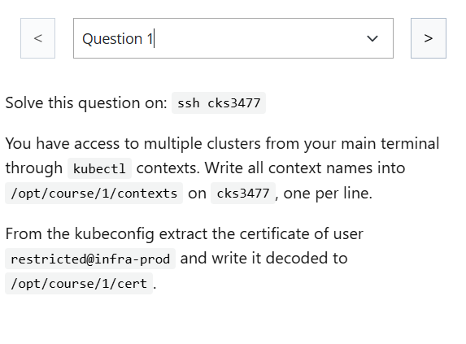
</div>

---

### Answer:

```bash

```

---

## 🟢 Q2

<div align="center" style="background-color:#fff; border-radius: 10px; border:4 2px solid">
  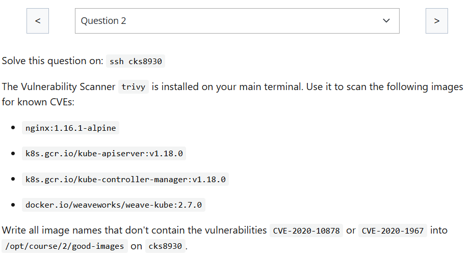
</div>

```bash
egrep "CVE-2020-10878|CVE-2020-1967" ./result-1.json
```

---

### Answer:

## 🟢 Q3

<div align="center" style="background-color:#fff; border-radius: 10px; border:4 2px solid">
  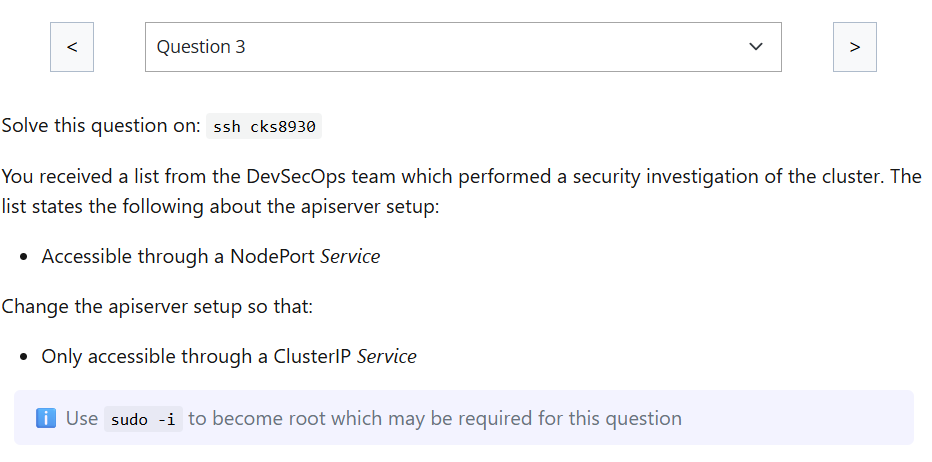
</div>

---

## 🟢 Q4

<div align="center" style="background-color:#fff; border-radius: 10px; border: 2px solid">
  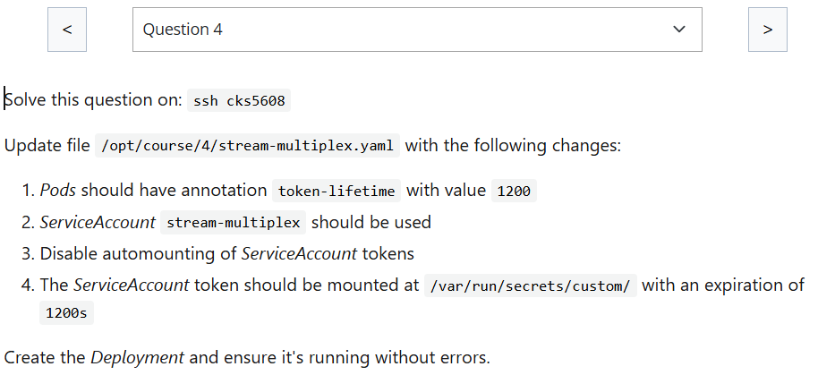
</div>

---

## 🟢 Q5

<div align="center" style="background-color:#fff; border-radius: 10px; border: 2px solid">
  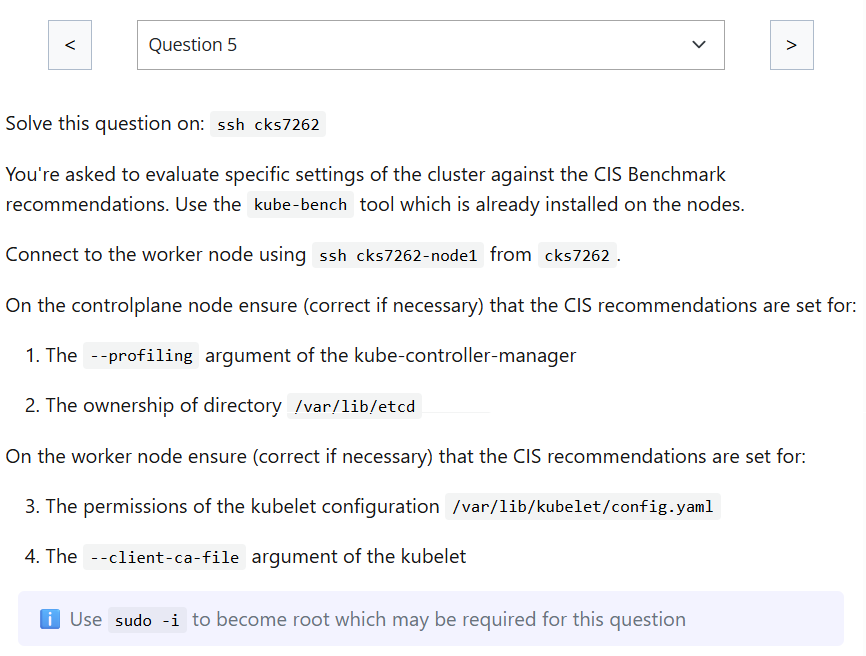
</div>

### Answer:

<div align="center" style="background-color:#141414; border-radius: 10px; border: 2px solid">
  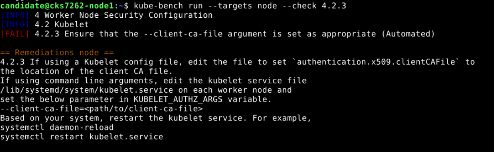
</div>

---

## 🟢 Q6

<div align="center" style="background-color:#fff; border-radius: 10px; border: 2px solid">
  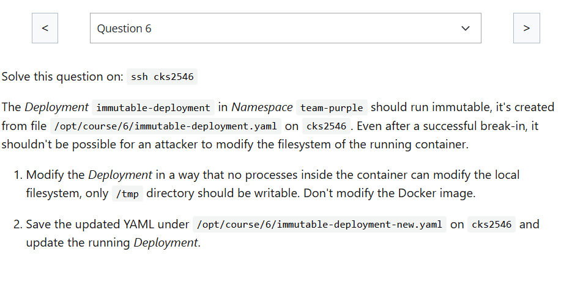
</div>

---

## 🟢 Q7

<div align="center" style="background-color:#fff; border-radius: 10px; border: 2px solid">
  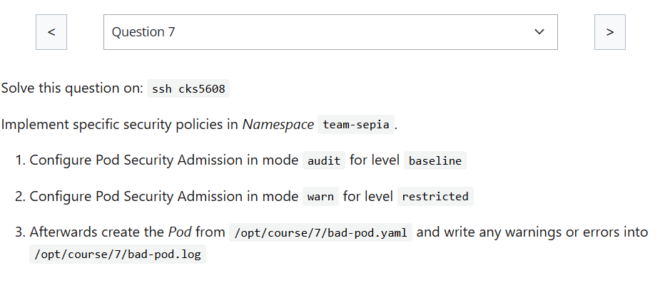
</div>

---

## 🔴 Q8

<div align="center" style="background-color:#fff; border-radius: 10px; border: 2px solid">
  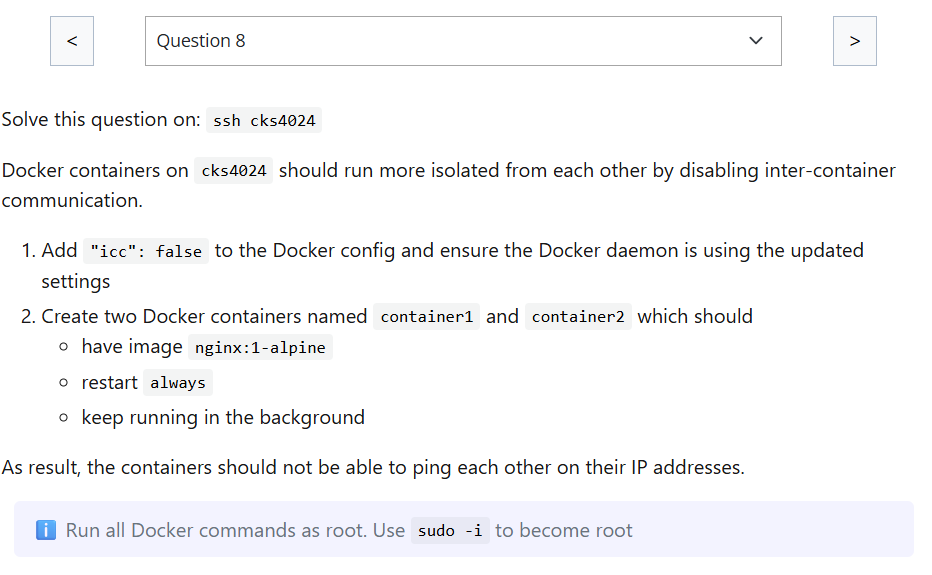
</div>

---

## 🟢 Q9

<div align="center" style="background-color:#fff; border-radius: 10px; border: 2px solid">
  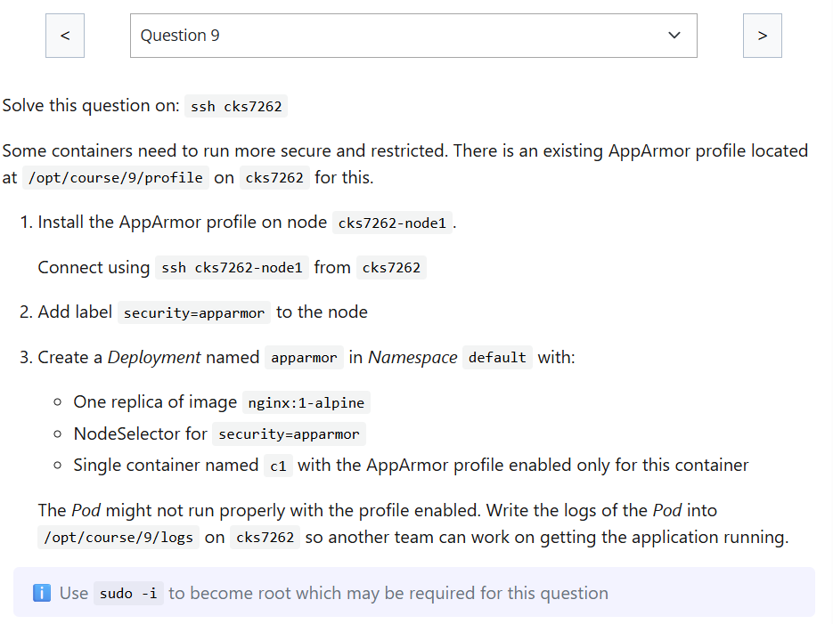
</div>

### Answer:

```ini
# /opt/course/9/profile

profile very-secure flags=(attach_disconnected) {
    file,
    deny /** w,
}
```

```bash
scp /opt/course/9/profile candidate@cks7262-node1:/home/candidate
```

```bash
ssh candidate@cks7262-node1
apparmor_parser -r /home/candidate/profile
```

```bash
ssh candidate@cks7262

kubectl label node cks7262-node1 security=apparmor
```

```yaml
apiVersion: apps/v1
kind: Deployment
metadata:
  name: apparmor
spec:
  selector:
    matchLabels:
      app: apparmor
  template:
    metadata:
      labels:
        app: apparmor
    spec:
      nodeSelector:
        security: apparmor
      containers:
        - name: c1
          image: nginx:1-alpine
          securityContext:
            seccompProfile:
              type: Localhost
              localhostProfile: very-secure
```

---

## 🟢 Q10

<div align="center" style="background-color:#fff; border-radius: 10px; border: 2px solid">
  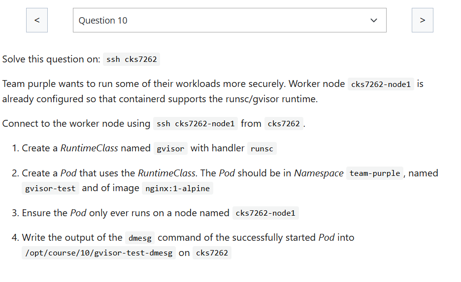
</div>

---

## 🟢 Q11

<div align="center" style="background-color:#fff; border-radius: 10px; border: 2px solid">
  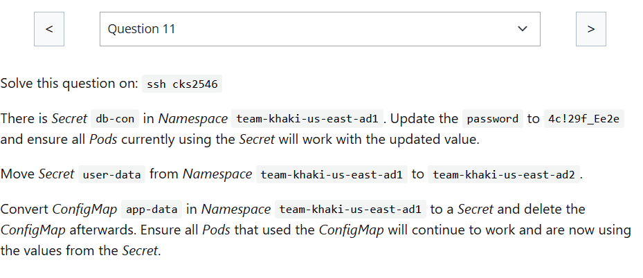
</div>

---

### ⚠️ Things to Remember

- **Secrets are immutable in place**: technically you can overwrite them, but Kubernetes doesn’t track versions. Once updated, the old value is gone unless you backed it up.
- **Pods using the Secret won’t auto-reload**:
  - If the Secret is mounted as a volume, the updated value will eventually sync (within minutes).
  - If the Secret is used as an environment variable, you must restart the Pod for the new value to take effect.
- **Best practice**: use `kubectl apply` with YAML manifests so your changes are declarative and reproducible.

---

## 🟢 Q12

<div align="center" style="background-color:#fff; border-radius: 10px; border: 2px solid">
  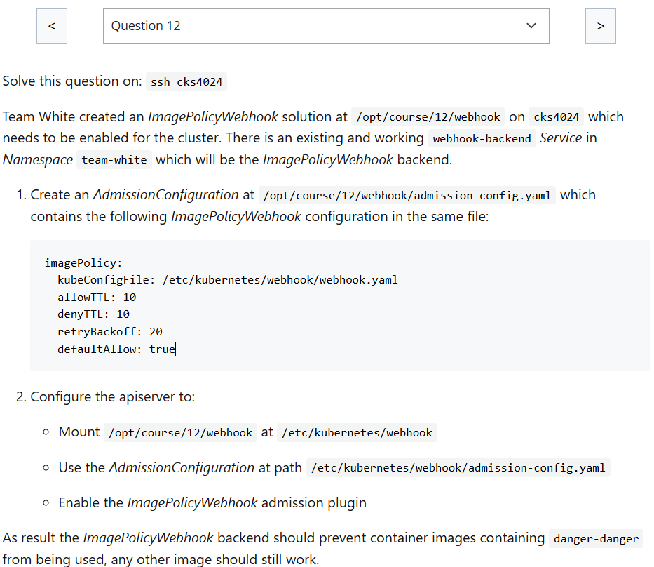
</div>

---

## 🟢 Q13

<div align="center" style="background-color:#fff; border-radius: 10px; border: 2px solid">
  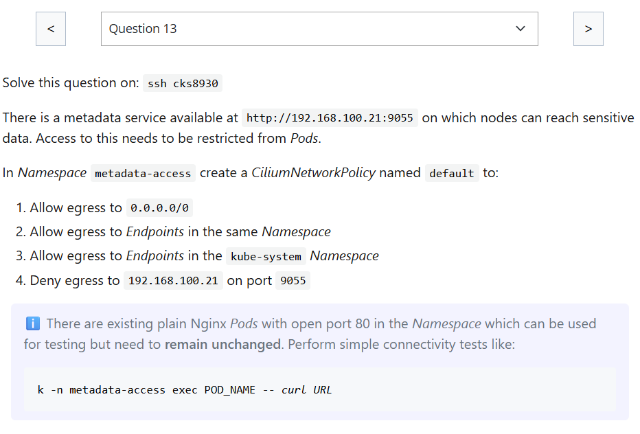
</div>

---

In **Cilium policies**, when you use `toCIDR`, the field expects a **CIDR notation**.  
That means you can’t just write a bare IP like `203.0.113.10` — you need to specify the subnet mask.

- ✅ Correct way for a single IP

  - Use `/32` for IPv4 (single host).

  ```yaml
  toCIDR:
    - "203.0.113.10/32"
  ```

- ✅ Correct way for a single IPv6

  - Use `/128` for IPv6 (single host).

  ```yaml
  toCIDR:
    - "2001:db8::1/128"
  ```

- ⚠️ If you omit `/32`
  - `203.0.113.10` **without a mask** is invalid — Cilium will reject the policy because it doesn’t conform to CIDR format.
  - If you want a **range of IPs**, you can use something like `/24` (e.g., `203.0.113.0/24`) to cover multiple addresses.

---

## ⚪ Q14

<div align="center" style="background-color:#fff; border-radius: 10px; border: 2px solid">
  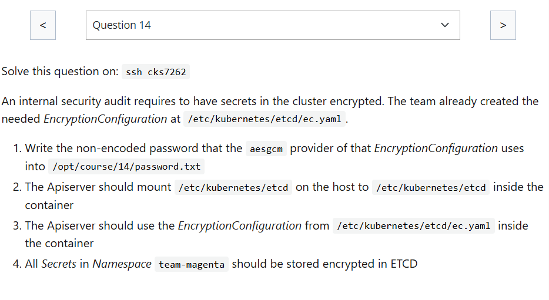
</div>

after apply encryption, how to apply all secret again ? to be secure ?

```bash
k get secrets -n team-magenta -o yaml | k apply -f -
```

---

## 🟢 Q15

<div align="center" style="background-color:#fff; border-radius: 10px; border: 2px solid">
  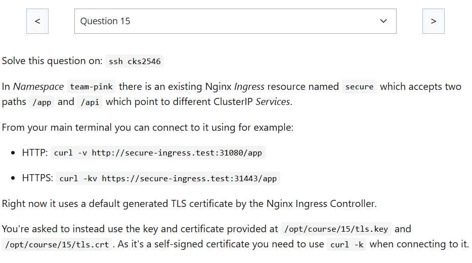
</div>

---

## ⚪ Q16

<div align="center" style="background-color:#fff; border-radius: 10px; border: 2px solid">
  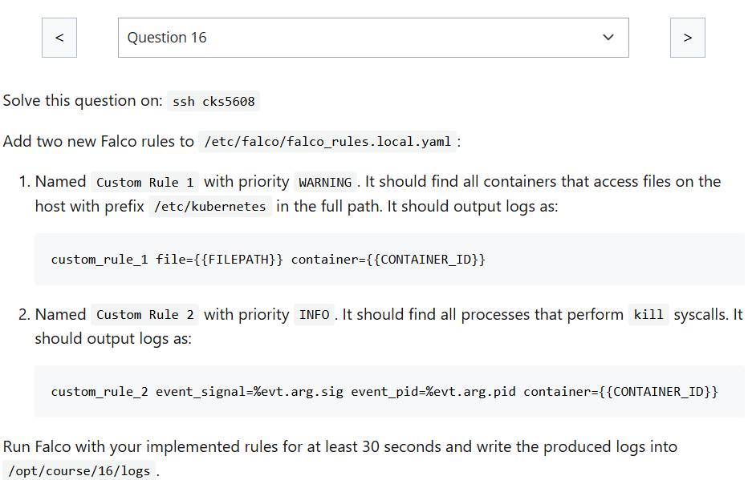
</div>

---

```yaml
# Your custom rules!
- rule: Custom Rule 1
  desc:
  condition: >
    evt.type = open and fd.directory = /etc/kubernetes
  output: >
    custom_rule 1
    priority: WARNING
- rule: Custom Rule 2
  desc:
  condition: >
    syscall.type = kill
  output: >
    custom_rule_2 event_pid=%evt.arg.pid
  priority: INFO
```

Run Falco with your implemented rules for at least 30 seconds and write the produced logs into /opt/course/16/logs. ?

```bash
# Run Falco with your implemented rules for at least 30 seconds and write the produced logs into /opt/course/16/logs
sudo falco -o /opt/course/16/logs -f /opt/course/16/falco.yaml -t 30
```

## 🟢 Q17

<div align="center" style="background-color:#fff; border-radius: 10px; border: 2px solid">
  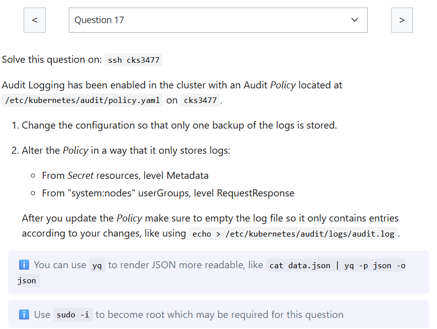
</div>

---

## 🔴 Q-preview-3

```bash
sudo netstat -tulpn | grep 6666
```

```bash
which system-
sudo kill -9 9271
```

```bash
sudo netstat -tulpn | grep 6666
```
