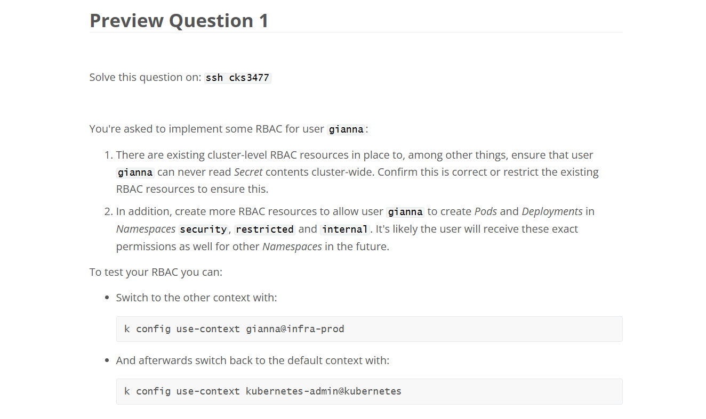
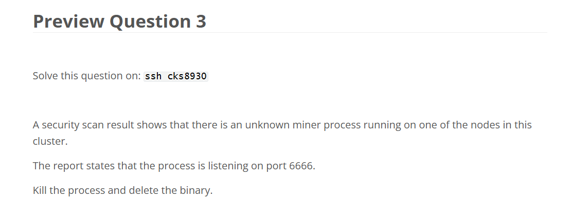

# 📋 Mock Exam 1

## 🟢 Q1

<div align="center" style="background-color:#fff; border-radius: 10px; border: 2px solid">
  
</div>

---

### Answer:

```bash
k config get-contexts -o name > /opt/course/1/contexts
```

```bash
k config view --raw \
-ojsonpath="{@.users[2].user.client-certificate-data}" | base64 -d > /opt/course/1/cert
# or with filtration
k config view --raw \
-ojsonpath="{@.users[?(.name == 'restricted@infra-prod')].user.client-certificate-data}" | base64 -d > /opt/course/1/cert
```

---

## 🟢 Q2

<div align="center" style="background-color:#fff; border-radius: 10px; border:4 2px solid">
  
</div>

---

### Answer:

```bash
trivy image nginx:1.16.1-alpine -f json -output result-1.json
trivy image k8s.gcr.io/kube-apiserver:v1.18.0 -f json -output result-2.json
trivy image k8s.gcr.io/kube-controller-manager:v1.18.0 -f json -output result-3.json
trivy image docker.io/weaveworks/weave-kube:2.7.0 -f json -output result-3.json
```

```bash
egrep "CVE-2020-10878|CVE-2020-1967" ./result-1.json
egrep "CVE-2020-10878|CVE-2020-1967" ./result-2.json
egrep "CVE-2020-10878|CVE-2020-1967" ./result-3.json
egrep "CVE-2020-10878|CVE-2020-1967" ./result-4.json
```

---

## 🟢 Q3

<div align="center" style="background-color:#fff; border-radius: 10px; border:4 2px solid">
  
</div>

### Answer:

```bash
#We need to delete the Service for the changes to take effect:
kubectl delete svc kubernetes
```

---

## 🟢 Q4

<div align="center" style="background-color:#fff; border-radius: 10px; border: 2px solid">
  
</div>

---

## 🟢 Q5

<div align="center" style="background-color:#fff; border-radius: 10px; border: 2px solid">
  
</div>

### ✅ Answer:

```bash
ssh cks7262
kube-bench run --targets=master

kube-bench run --targets=master --check='1.3.2'
kube-bench run --targets=master --check='1.1.12'
```

```bash
ssh cks7262-node1
kube-bench run --targets=node

kube-bench run --targets=node --check='4.1.9'
```

---

## 🟡 Q6

<div align="center" style="background-color:#fff; border-radius: 10px; border: 2px solid">
  
</div>

---

### ❌ Deployment filesystem at /tmp is writable as exception

```yaml
# cks2546:/opt/course/6/immutable-deployment-new.yaml
apiVersion: apps/v1
kind: Deployment
metadata:
  namespace: team-purple
  name: immutable-deployment
  labels:
    app: immutable-deployment
spec:
  replicas: 1
  selector:
    matchLabels:
      app: immutable-deployment
  template:
    metadata:
      labels:
        app: immutable-deployment
    spec:
      containers:
        - image: busybox:1
          command: ["sh", "-c", "tail -f /dev/null"]
          imagePullPolicy: IfNotPresent
          name: busybox
          securityContext: # add
            readOnlyRootFilesystem: true # add
          volumeMounts: # add
            - mountPath: /tmp # add
              name: temp-vol # add
      volumes: # add
        - name: temp-vol # add
          emptyDir: {} # add
      restartPolicy: Always
```

---

## 🟢 Q7

<div align="center" style="background-color:#fff; border-radius: 10px; border: 2px solid">
  
</div>

---

### ✅ Answer:

```bash
kubectl label ns team-sepia pod-security.kubernetes.io/audit=baseline
kubectl label ns team-sepia pod-security.kubernetes.io/warn=restricted
```

```bash
kubectl apply -f /opt/course/7/bad-pod.yaml 2> /opt/course/7/bad-pod.log
```

## 🔴 Q8

<div align="center" style="background-color:#fff; border-radius: 10px; border: 2px solid">
  
</div>

---

## 🟢 Q9

<div align="center" style="background-color:#fff; border-radius: 10px; border: 2px solid">
  
</div>

### Answer:

```ini
# /opt/course/9/profile

profile very-secure flags=(attach_disconnected) {
    file,
    deny /** w,
}
```

```bash
scp /opt/course/9/profile candidate@cks7262-node1:/home/candidate
```

```bash
ssh candidate@cks7262-node1
apparmor_parser -r /home/candidate/profile
```

```bash
ssh candidate@cks7262

kubectl label node cks7262-node1 security=apparmor
```

```yaml
apiVersion: apps/v1
kind: Deployment
metadata:
  name: apparmor
spec:
  selector:
    matchLabels:
      app: apparmor
  template:
    metadata:
      labels:
        app: apparmor
    spec:
      nodeSelector:
        security: apparmor
      containers:
        - name: c1
          image: nginx:1-alpine
          securityContext:
            seccompProfile:
              type: Localhost
              localhostProfile: very-secure
```

---

## 🟢 Q10

<div align="center" style="background-color:#fff; border-radius: 10px; border: 2px solid">
  
</div>

```yaml
# 10_rtc.yaml
apiVersion: node.k8s.io/v1
kind: RuntimeClass
metadata:
  name: gvisor
handler: runsc
```

```yaml
# 10_pod.yaml
apiVersion: v1
kind: Pod
metadata:
  creationTimestamp: null
  labels:
    run: gvisor-test
  name: gvisor-test
  namespace: team-purple
spec:
  nodeName: cks7262-node1 # add
  runtimeClassName: gvisor # add
  containers:
    - image: nginx:1-alpine
      name: gvisor-test
      resources: {}
  dnsPolicy: ClusterFirst
  restartPolicy: Always
status: {}
```

---

## 🟡 Q11

<div align="center" style="background-color:#fff; border-radius: 10px; border: 2px solid">
  
</div>

---

### ⚠️ Things to Remember

- **Secrets are immutable in place**: technically you can overwrite them, but Kubernetes doesn’t track versions. Once updated, the old value is gone unless you backed it up.
- **Pods using the Secret won’t auto-reload**:
  - If the Secret is mounted as a volume, the updated value will eventually sync (within minutes).
  - If the Secret is used as an environment variable, you must restart the Pod for the new value to take effect.
- **Best practice**: use `kubectl apply` with YAML manifests so your changes are declarative and reproducible.

### ✅ Answer:

```bash
kubectl -n team-khaki-us-east-ad1 exec app-green-sky-6d67d89688-4x7rw -- env
# ...
# DB_HOST=4dd0-89ef-936823251813.db.us-east.app
# DB_USER=system
# DB_PASSWORD=4c!29f_Ee2e
# ...

```

---

## 🟢 Q12

<div align="center" style="background-color:#fff; border-radius: 10px; border: 2px solid">
  
</div>

---

### ✅ Answer:

```yaml
# cks4024:/opt/course/12/webhook/admission-config.yaml
apiVersion: apiserver.config.k8s.io/v1
kind: AdmissionConfiguration
plugins:
  - name: ImagePolicyWebhook
    configuration:
      imagePolicy:
        kubeConfigFile: /etc/kubernetes/webhook/webhook.yaml
        allowTTL: 10
        denyTTL: 10
        retryBackoff: 20
        defaultAllow: true
```

This should already be the solution for that step.  
Note that it's also possible to specify a path inside the **AdmissionConfiguration** pointing to a different file containing the **ImagePolicyWebhook**:

```yaml
apiVersion: apiserver.config.k8s.io/v1
kind: AdmissionConfiguration
plugins:
  - name: ImagePolicyWebhook
    path: imagepolicyconfig.yaml
```

## 🟢 Q13

<div align="center" style="background-color:#fff; border-radius: 10px; border: 2px solid">
  
</div>

---

### ✅ Answer:

```yaml
# cks8930:/home/candidate/13_cnp.yaml
apiVersion: "cilium.io/v2"
kind: CiliumNetworkPolicy
metadata:
  name: default
  namespace: metadata-access
spec:
  endpointSelector:
    matchLabels: {}

  egress:
    # 1. Allow egress to 0.0.0.0/0
    - toCIDR:
        - 0.0.0.0/0

    # 2. Allow egress to Endpoints in the same Namespace
    - toEndpoints:
        - {}

    # 3. Allow egress to Endpoints in the kube-system Namespace
    - toEndpoints:
        - matchLabels:
            io.kubernetes.pod.namespace: kube-system

  egressDeny:
    # 4. Deny egress to 192.168.100.21 on port 9055
    - toCIDR:
        - 192.168.100.21/32
      toPorts:
        - ports:
            - port: "9055"
              protocol: TCP
```

In **Cilium policies**, when you use `toCIDR`, the field expects a **CIDR notation**.  
That means you can’t just write a bare IP like `203.0.113.10` — you need to specify the subnet mask.

- ✅ Correct way for a single IP

  - Use `/32` for IPv4 (single host).

  ```yaml
  toCIDR:
    - "203.0.113.10/32"
  ```

- ✅ Correct way for a single IPv6

  - Use `/128` for IPv6 (single host).

  ```yaml
  toCIDR:
    - "2001:db8::1/128"
  ```

- ⚠️ If you omit `/32`
  - `203.0.113.10` **without a mask** is invalid — Cilium will reject the policy because it doesn’t conform to CIDR format.
  - If you want a **range of IPs**, you can use something like `/24` (e.g., `203.0.113.0/24`) to cover multiple addresses.

---

## 🟢 Q14

<div align="center" style="background-color:#fff; border-radius: 10px; border: 2px solid">
  
</div>

---

### ✅ Answer:

```bash
ETCDCTL_API=3 etcdctl \
--cert /etc/kubernetes/pki/apiserver-etcd-client.crt \
--key /etc/kubernetes/pki/apiserver-etcd-client.key \
--cacert /etc/kubernetes/pki/etcd/ca.crt \
get /registry/secrets/team-magenta/proxy-01
```

after apply encryption, how to apply all secret again ? to be secure ?

```bash
k get secrets -n team-magenta -o yaml | k apply -f -
```

> We can see the Secret is now encrypted at rest but can still be accessed normally through Kubernetes.

---

## 🟢 Q15

<div align="center" style="background-color:#fff; border-radius: 10px; border: 2px solid">
  
</div>

---

### ✅ Answer:

```yaml
...
spec:
  tls:                            # add
    - hosts:                      # add
      - secure-ingress.test       # add
      secretName: tls-secret      # add
  rules:
  ...
```

## 🟡 Q16

<div align="center" style="background-color:#fff; border-radius: 10px; border: 2px solid">
  
</div>

---

```yaml
# Your custom rules!
- rule: Custom Rule 1
  desc: Custom Rule 1
  condition: >
    container and fd.name startswith /etc/kubernetes
  output: >
    custom_rule_1 file=%fd.name container=%container.id
  priority: WARNING

- rule: Custom Rule 2
  desc: Custom Rule 2
  condition: >
    syscall.type = kill
  output: >
    custom_rule_2 event_signal=%evt.arg.sig event_pid=%evt.arg.pid container=%container.id
  priority: INFO
```

Run Falco with your implemented rules for at least 30 seconds and write the produced logs into /opt/course/16/logs. ?

```bash
# Run Falco with your implemented rules for at least 30 seconds and write the produced logs into /opt/course/16/logs
sudo falco -o /opt/course/16/logs -f /opt/course/16/falco.yaml -t 30
```

## 🟢 Q17

<div align="center" style="background-color:#fff; border-radius: 10px; border: 2px solid">
  
</div>

---

### ✅ Answer:

```yaml
apiVersion: audit.k8s.io/v1
kind: Policy
rules:
  # log Secret resources audits, level Metadata
  - level: Metadata
    resources:
      - group: ""
        resources: ["secrets"]

  # log node related audits, level RequestResponse
  - level: RequestResponse
    userGroups: ["system:nodes"] # userGroups: [] not users: []

  # for everything else don't log anything
  - level: None
```

---

## 🟢 Q-preview-1

<div align="center" style="background-color:#fff; border-radius: 10px; border: 2px solid">
  
</div>

---

---

## 🟢 Q-preview-2

<div align="center" style="background-color:#fff; border-radius: 10px; border: 2px solid">
  
</div>

---

### ✅ Answer:

```ini
Audit Logs can be huge and it's common to limit the amount by creating an Audit Policy and to transfer the data in systems like Elasticsearch. In this case we have a simple JSON export, but it already contains 4448 lines.
```

```bash
cat audit.log | grep "p.auster" | grep Secret | grep password
```

---

## 🟢 Q-preview-3

<div align="center" style="background-color:#fff; border-radius: 10px; border: 2px solid">
  
</div>

---

```bash
sudo netstat -tlpn | grep 6666
```

```bash
which system-
sudo kill -9 9271
```

```bash
sudo netstat -tlpn | grep 6666
```
