# 📋 Mock Exam 1

## 🟡 Q1

<div align="center" style="background-color:#fff; border-radius: 10px; border: 2px solid">
  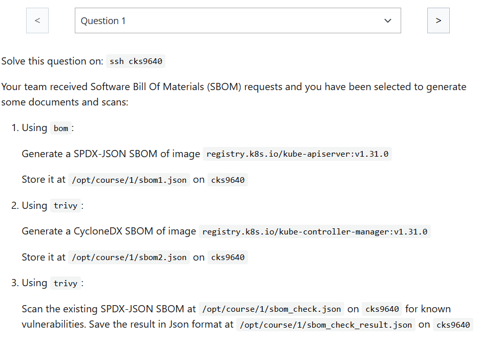
</div>

---

### Answer:

---

```bash
bom generate --image registry.k8s.io/kube-apiserver:v1.31.0 --format json --output /opt/course/1/sbom1.json
```

```bash
trivy image  registry.k8s.io/kube-controller-manager:v1.31.0 --format cyclonedx --output /opt/course/1/sbom2.json
```

```bash
trivy sbom /opt/course/1/sbom_check.json --format json --output /opt/course/1/sbom_check_result.json
```

---

## 🟡 Q2

<div align="center" style="background-color:#fff; border-radius: 10px; border: 2px solid">
  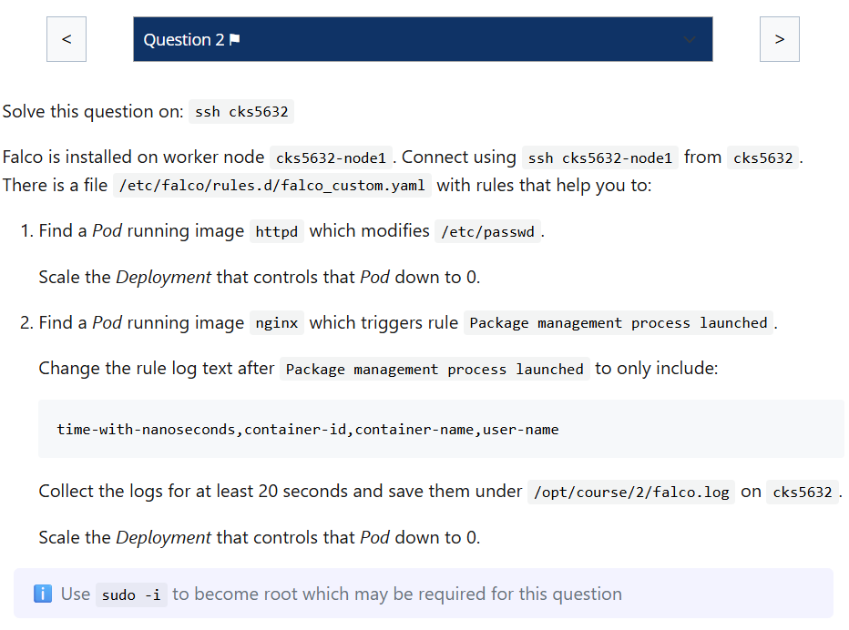
</div>

---

### Answer:

```bash
falco -U | grep httpd

crictl ps -id f86cd629e71c
crictl pods -id cab6dafd045d5
k -n team-violet scale deploy rating-service --replicas 0
```

```bash
falco -U | grep 'Package management process launched'

crictl ps -id 65338e61dc48
crictl pods -id 1e3d3ea3e06ee
```

```yaml
- rule: Launch Package Management Process in Container
  desc: Package management process ran inside container
  condition: >
    spawned_process
    and container
    and user.name != "_apt"
    and package_mgmt_procs
    and not package_mgmt_ancestor_procs
  output: >
    Package management process launched %evt.time,%container.id,%container.name,%user.name
  priority: ERROR
  tags: [process, mitre_persistence]
```

---

## 🟢 Q3

<div align="center" style="background-color:#fff; border-radius: 10px; border: 2px solid">
  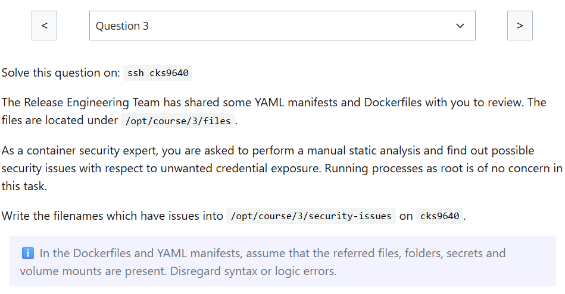
</div>

---

## 🟢 Q4

<div align="center" style="background-color:#fff; border-radius: 10px; border: 2px solid">
  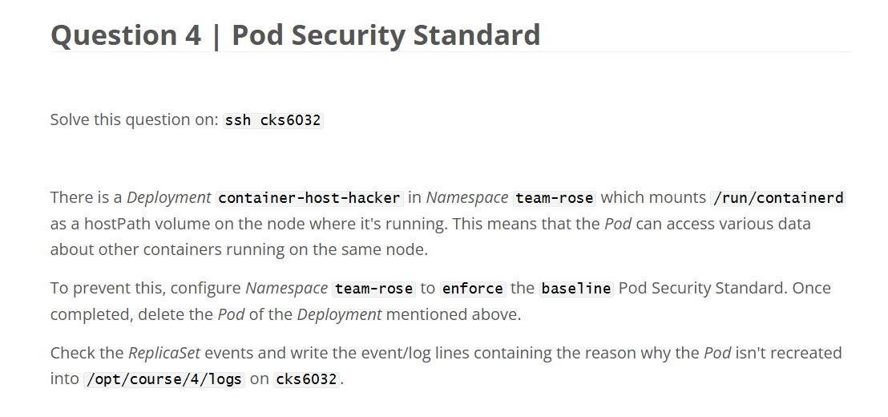
</div>

---

## 🔴 Q5

<div align="center" style="background-color:#fff; border-radius: 10px; border: 2px solid">
  
</div>

---

### Answer:

---

```ini
# step 1
edit existing policy
# step 2
create new policy
```

```yaml
# cks4933:/home/candidate/5_np.yaml
apiVersion: networking.k8s.io/v1
kind: NetworkPolicy
metadata:
  name: gateway
  namespace: team-ivy-gateway
spec:
  podSelector:
    matchExpressions:
      - key: id
        operator: In
        values:
          - gateway-v1
          - gateway-v2
  policyTypes:
    - Egress
  egress:
    - to:
        - namespaceSelector:
            matchLabels:
              kubernetes.io/metadata.name: team-ivy-private
```

---

## 🟢 Q6

<div align="center" style="background-color:#fff; border-radius: 10px; border: 2px solid">
  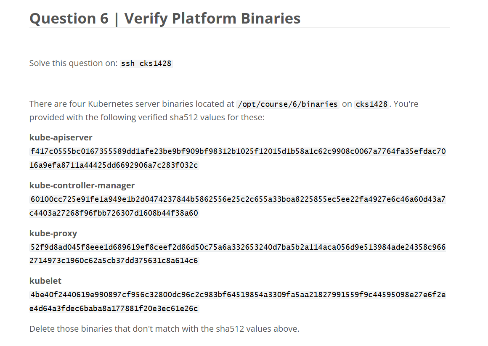
</div>

---

### Answer:

```bash
# step 1
sha512sum kube-controller-manager > compare1
vim compare1 # REMOVE filename

# step 2
echo 60100c... > compare2

# step 3
diff compare1 compare2
```

---

## 🟢 Q7

<div align="center" style="background-color:#fff; border-radius: 10px; border: 2px solid">
  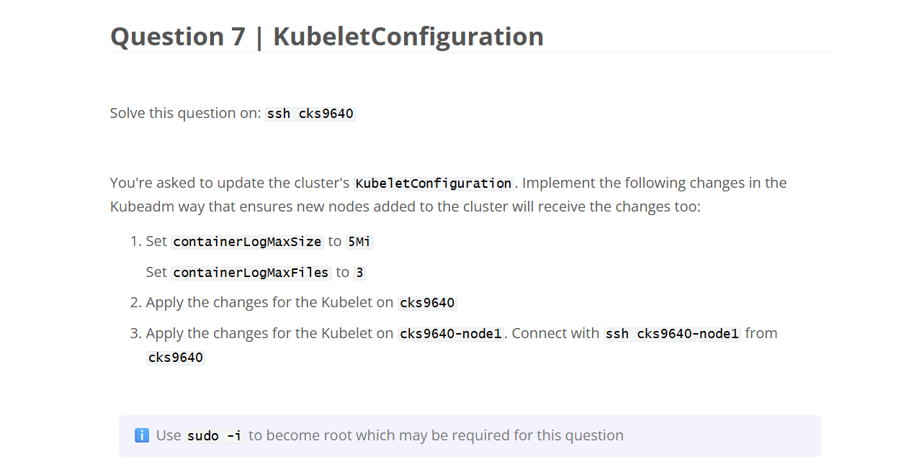
</div>

---

### Answer:

```bash
kubectl -n kube-system edit cm kubelet-config
```

```yaml
# kubectl -n kube-system edit cm kubelet-config
apiVersion: v1
data:
  kubelet: |
    apiVersion: kubelet.config.k8s.io/v1beta1
    kind: KubeletConfiguration
    ...
    volumeStatsAggPeriod: 0s
    containerLogMaxSize: 5Mi
    containerLogMaxFiles: 3
kind: ConfigMap
metadata:
  name: kubelet-config
  namespace: kube-system
```

```bash
kubeadm upgrade node phase kubelet-config
service kubelet restart
```

---

## 🟡 Q8

<div align="center" style="background-color:#fff; border-radius: 10px; border: 2px solid">
  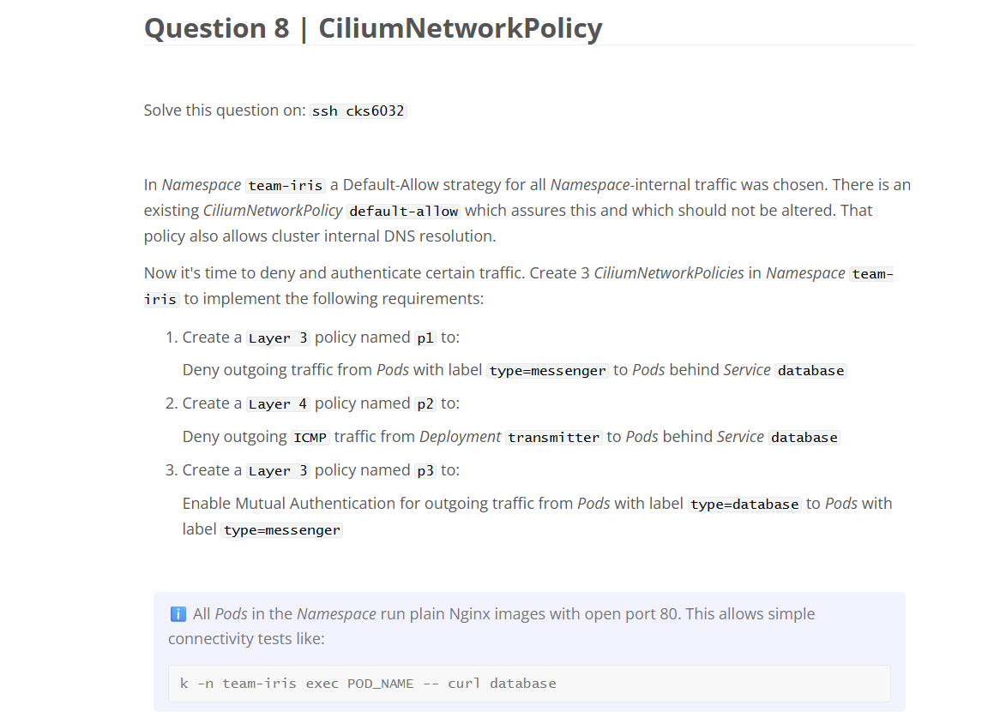
</div>

---

### ✅ Answer:

```yaml
# cks6032:~/8_p1.yaml
apiVersion: "cilium.io/v2"
kind: CiliumNetworkPolicy
metadata:
  name: p1
  namespace: team-iris
spec:
  endpointSelector:
    matchLabels:
      type: messenger
  egressDeny:
    - toEndpoints:
        - matchLabels:
            type: database
```

```yaml
# cks6032:~/8_p2.yaml
apiVersion: "cilium.io/v2"
kind: CiliumNetworkPolicy
metadata:
  name: p2
  namespace: team-iris
spec:
  endpointSelector:
    matchLabels:
      type: transmitter # we use the label of the Pods behind Deployment "transmitter"
  egressDeny:
    - toEndpoints:
        - matchLabels:
            type: database # we use the label of the Pods behind the Service "database"
      icmps:
        - fields:
            - type: 8
              family: IPv4
            - type: EchoRequest
              family: IPv6
```

```yaml
# cks6032:~/8_p3.yaml
apiVersion: "cilium.io/v2"
kind: CiliumNetworkPolicy
metadata:
  name: p3
  namespace: team-iris
spec:
  endpointSelector:
    matchLabels:
      type: database
  egress:
    - toEndpoints:
        - matchLabels:
            type: messenger
      authentication:
        mode: "required" # Enable Mutual Authentication
```

---

## 🟢 Q9

<div align="center" style="background-color:#fff; border-radius: 10px; border: 2px solid">
  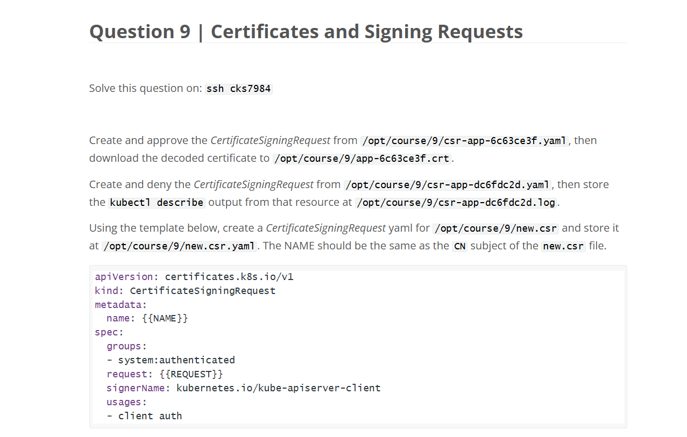
</div>

---

### ✅ Answer:

```bash
openssl req -in /opt/course/9/new.csr -noout -text
```

TO GET {{NAME}}:

```ini
# openssl req -in /opt/course/9/new.csr -noout -text
Certificate Request:
    Data:
        Version: 1 (0x0)
        Subject: CN = app-c5a95f65@users-company   # WE NEED THIS
```

TO GET {{REQUEST}}

```bash
cat /opt/course/9/new.csr | base64 | tr -d "\n"
```

## 🟢 Q10

<div align="center" style="background-color:#fff; border-radius: 10px; border: 2px solid">
  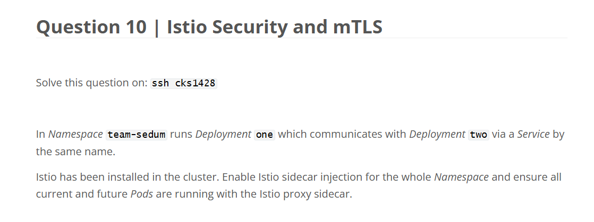
</div>

---

## 🟢 Q11

<div align="center" style="background-color:#fff; border-radius: 10px; border: 2px solid">
  
</div>

---

### ✅ Answer:

```bash
ETCDCTL_API=3 etcdctl \
--cert /etc/kubernetes/pki/apiserver-etcd-client.crt \
--key /etc/kubernetes/pki/apiserver-etcd-client.key \
--cacert /etc/kubernetes/pki/etcd/ca.crt get /registry/secrets/team-daisy/database-access
```

---

## 🔴 Q12

<div align="center" style="background-color:#fff; border-radius: 10px; border: 2px solid">
  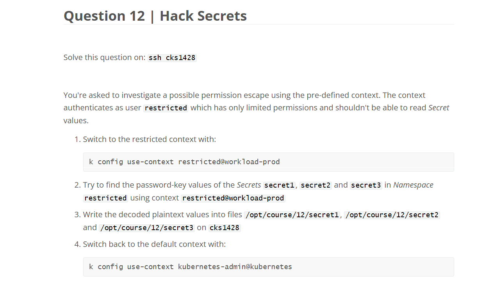
</div>

---

### ✅ Answer:

```bash
k -n restricted exec pod1-fd5d64b9c-pcx6q -- cat /etc/secret-volume/password
```

---

## 🔴 Q13

<div align="center" style="background-color:#fff; border-radius: 10px; border: 2px solid">
  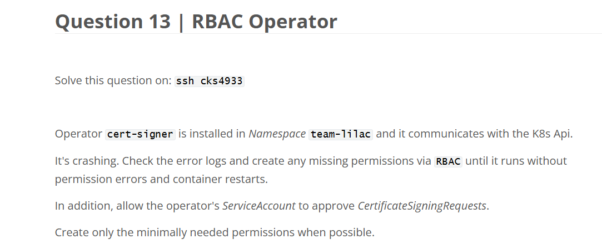
</div>

---

```yaml
# kubectl edit clusterrole cert-signer
apiVersion: rbac.authorization.k8s.io/v1
kind: ClusterRole
metadata:
  name: cert-signer
rules:
  - apiGroups:
      - certificates.k8s.io
    resources:
      - certificatesigningrequests
    verbs:
      - list
  - apiGroups: # ADD
      - certificates.k8s.io # ADD
    resources: # ADD
      - certificatesigningrequests/approval # ADD
    verbs: # ADD
      - update # ADD
```

```yaml
# This is all that's checked by the scoring of this question. In reality we would also need the permission for a specific domain:
- apiGroups:
    - certificates.k8s.io
  resources:
    - signers
  resourceNames:
    - kubernetes.io/kube-apiserver-client
  verbs:
    - approve
```

---

## 🔴 Q14

<div align="center" style="background-color:#fff; border-radius: 10px; border: 2px solid">
  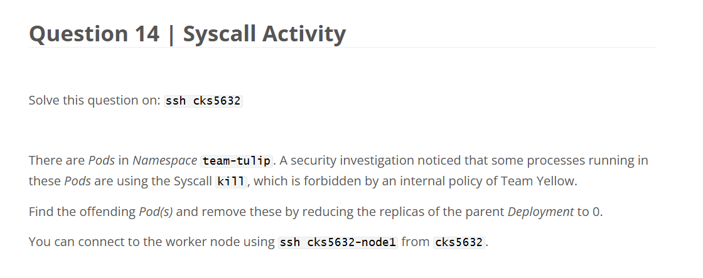
</div>

---

## 🔴 Q15

<div align="center" style="background-color:#fff; border-radius: 10px; border: 2px solid">
  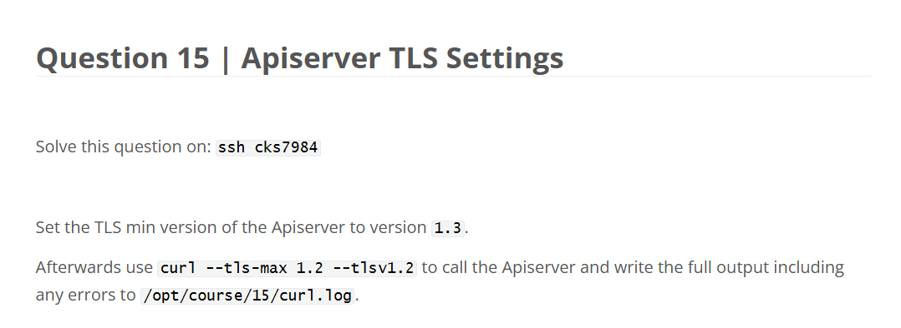
</div>

---

## 🔴 Q16

<div align="center" style="background-color:#fff; border-radius: 10px; border: 2px solid">
  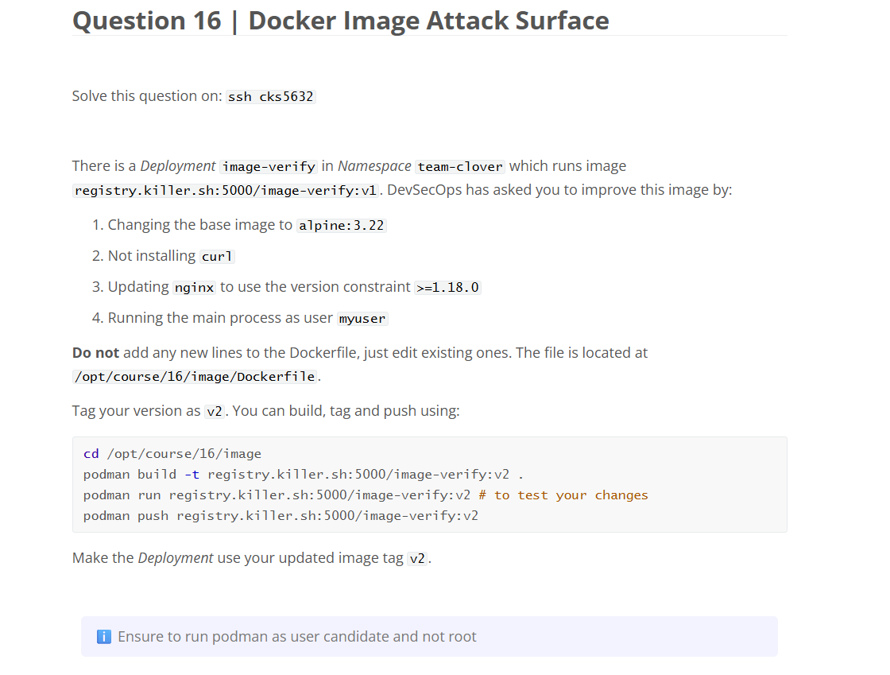
</div>

---

## 🔴 Q17

<div align="center" style="background-color:#fff; border-radius: 10px; border: 2px solid">
  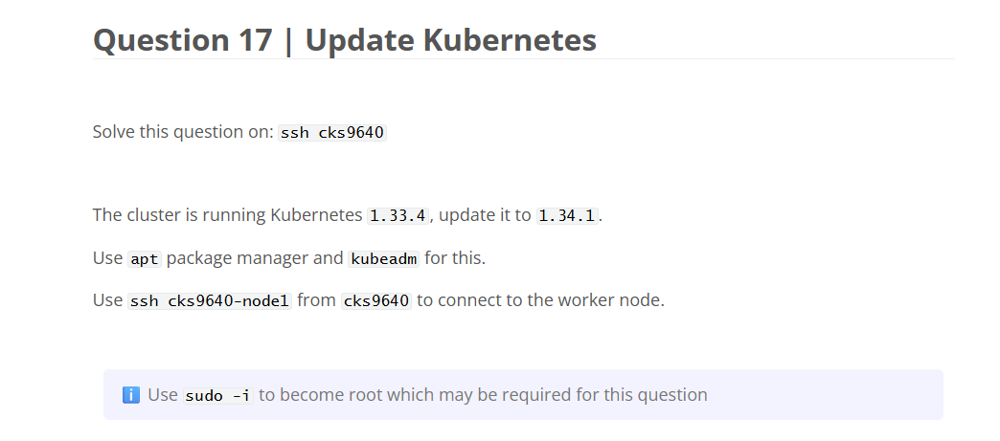
</div>
