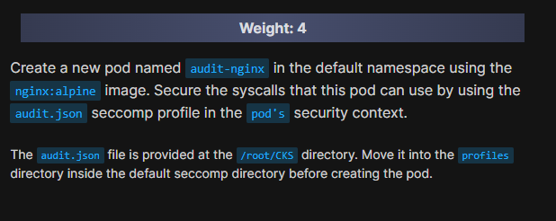
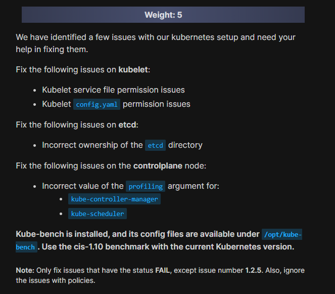
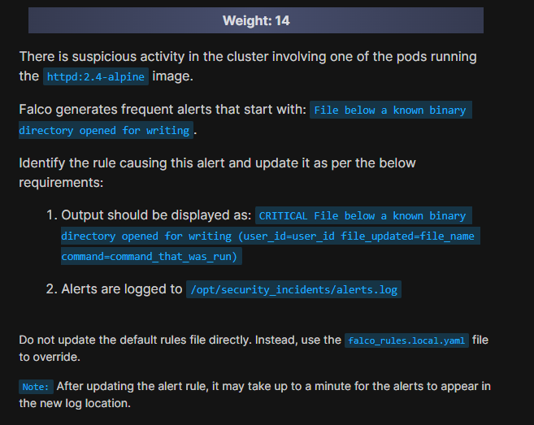
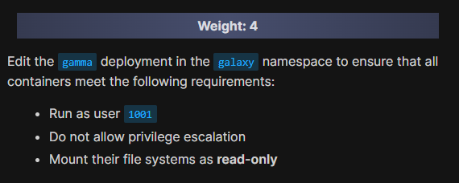
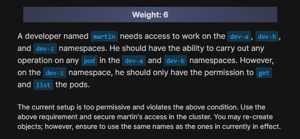

# Mock Exam 1

## 🟡 Q1

<div align="center" style="background-color:#141414; border-radius: 10px; border: 2px solid">
  
</div>

---

## 🟢 Q2

<div align="center" style="background-color:#141414; border-radius: 10px; border: 2px solid">
  
</div>

---

## 🟡 Q3

<div align="center" style="background-color:#141414; border-radius: 10px; border: 2px solid">
  
</div>

### ✍🏻 Answer

1. File **q3_file1.Dockerfile**

   - copies a file secret-token over (COPY secret-token .), uses it (RUN /etc/register.sh ./secret-token) and deletes it afterwards (RUN rm ./secret-token). But because of
     the way Docker works, every RUN, COPY and ADD command creates a new layer and every layer is persistet in the image.
   - This means that even if the file secret-token get's deleted, it's still included with the image.

2. File **q3_file2.yaml**

- contains plain text password under env section value: P@sSw0rd.
- Its secure practice to utilize k8s's secrets to store passwords.

echo -e "q3_file1.Dockerfile\nq3_file2.yaml" > /opt/course/security-issues.txt

---

## 🟢 Q4

<div align="center" style="background-color:#141414; border-radius: 10px; border: 2px solid">
  
</div>

---

## ❓ `Q5`

<div align="center" style="background-color:#141414; border-radius: 10px; border: 2px solid">
  
</div>

### ✍🏻 Answer

For kubelet issues, run:

````bash
kube-bench --benchmark cis-1.10 --config-dir /opt/kube-bench/cfg run --targets node```
````

```bash
sudo groupadd --system etcd
sudo useradd -s /sbin/nologin --system -g etcd etcd

sudo chown -R etcd:etcd /var/lib/etcd
```

For controlplane and etcd issues, run:

```bash
kube-bench --benchmark cis-1.10 --config-dir /opt/kube-bench/cfg run --targets master
```

---

## 🟡 Q6

<div align="center" style="background-color:#141414; border-radius: 10px; border: 2px solid">
  
</div>

---

## 🟡 Q7

<div align="center" style="background-color:#141414; border-radius: 10px; border: 2px solid">
  
</div>

---

## ❓ `Q8`

<div align="center" style="background-color:#141414; border-radius: 10px; border: 2px solid">
  
</div>

---

## ❓ `Q9`

<div align="center" style="background-color:#141414; border-radius: 10px; border: 2px solid">
  
</div>

---

## 🟢 Q10

<div align="center" style="background-color:#141414; border-radius: 10px; border: 2px solid">
  
</div>

---

## 🟢 Q11

<div align="center" style="background-color:#141414; border-radius: 10px; border: 2px solid">
  
</div>

---

## 🟢 Q12

<div align="center" style="background-color:#141414; border-radius: 10px; border: 2px solid">
  
</div>

> `securityContext:` on container level.

---

## 🟢 Q13

<div align="center" style="background-color:#141414; border-radius: 10px; border: 2px solid">
  
</div>

---

## 🟢 Q14

<div align="center" style="background-color:#141414; border-radius: 10px; border: 2px solid">
  
</div>

---

## 🟢 Q15

<div align="center" style="background-color:#141414; border-radius: 10px; border: 2px solid">
  
</div>
